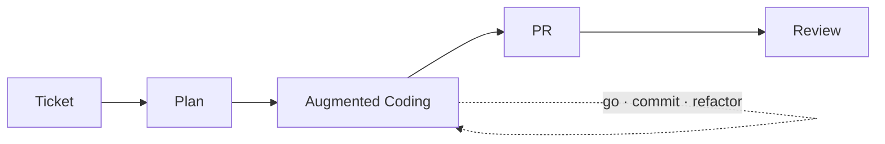

* TOC
{:toc}

# 증강 코딩 운영 기록

이 문서는 증강 코딩을 개인 실험에서 팀 운영으로 확장한 과정과, 현재 판단 기준을 정리한 기록이다.
핵심은 전면 위임이 아니라 **사람이 방향을 설계하고 AI가 작업을 수행하는 방식**이다.

---

## 1) 시작점

처음에는 바이브 코딩과 AI 전면 위임 방식에 회의적이었다.
명령을 바꿔도 결과물이 반복해서 마음에 들지 않았고, 코드 품질도 들쭉날쭉했다.
무엇보다 결과가 실제 업무 맥락에 맞게 만들어졌는지 확신하기 어려웠다.

돌아보면 당시에는 기대를 과하게 두고, AI에게 한 번에 너무 많은 걸 요구한 면도 있었다.

생각이 바뀐 계기는 Kent Beck의 증강 코딩 글이었다.
품질을 중요하게 보던 사람이 AI를 적극적으로 쓰되, 자기 기준으로 운영 방식을 번역해 적용하는 점이 크게 와닿았다.

그때부터 기준을 이렇게 잡았다.

- 방향은 사람이 정한다.
- AI는 그 방향 안에서 작업한다.
- 사람은 설계와 판정 기준을 책임진다.

그래서 팀 적용 전에 개인 프로젝트에서 약 2주 먼저 검증했다.

- <https://github.com/currenjin/alexandria-playground/tree/main/playground-augmented-coding>

검증에서 확인한 내용은 다음과 같다.

- 티켓 기반 구조를 쓰면 재현성이 올라간다.
- 테스트 루프를 강제하면 속도와 안정성을 같이 가져갈 수 있다.
- 프롬프트 감각보다 작업 순서와 검증 구조가 결과에 더 큰 영향을 준다.

---

## 2) 팀 적용 방식

현재 팀에서 쓰는 기본 흐름은 다음과 같다.

1. Jira 티켓을 읽고 `plan.md`를 만든다.
2. `plan.md` 기준으로 구현한다.
3. 테스트 통과를 기준으로 수정 루프를 반복한다.
4. PR 생성 후 리뷰 단계로 이동한다.

### 운영 흐름 다이어그램

초기에는 개인 사용 중심이었지만, 효과가 확인되면서 팀원 사용이 늘었다.
운영 원칙은 바이브 코딩이 아니라 테스트 기반 실행이다.

관측된 변화:

- 작업 안정성 향상
- 구현/검증 속도 개선
- 리뷰 이전 단계 품질 편차 감소

---

## 3) 운영 방식이 바뀐 지점

처음부터 “하네스”라는 표현을 쓰고 시작한 건 아니었다.
다만 운영을 쌓으면서 결과적으로 하네스 구조에 가까워졌다.

현재 사용 중인 스킬:

- `jira-to-plan`
- `augmented-coding`
- `push-pr`
- `review`
- `work` (통합 실행)

운영 역할은 아래처럼 나눈다.

- 사람: 목표/제약/완료 기준 정의
- AI: 구현/수정/반복 실행
- 리뷰: 자동 리뷰 + 사람 판단 결합

팀에서 실제로 바뀐 행동은 명확하다.
AI를 단순 도구가 아니라 작업자로 두고, 보고/수정/반복 같은 의무를 수행하도록 의도해 운영한다.

결국 포인트는 개인 요령이 아니라 팀 기준으로 운영 규칙을 잡아가는 데 있었다.

---

## 4) 사람이 판단하는 영역과 자동화 경계

전면 자동화는 목표가 아니다.
사람이 직접 봐야 하는 판단은 유지한다.

- 도메인 정책 적합성
- 업무 요구사항 충족 여부
- 장기 유지보수 관점의 구조/가독성
- 코드리뷰 최종 판단

현재 기준에서 자동화 우선순위는 다음과 같다.

- Jira 티켓 읽기 및 작업 시작
- Planning 기준의 PRD 초안/Story/Task 분해
- 반복 구현/테스트 루프 실행

운영 원칙은 단순하다.
자동화는 실행량을 늘리는 데 쓰고, 사람은 판단이 필요한 지점에 집중한다.

---

## 5) kancli 개발 배경

병렬 작업이 늘어나면서 운영 UI가 병목이 됐다.
여러 터미널을 분산해서 관리하면 집중이 깨지고, 관리 비용이 커진다.

이 문제를 줄이기 위해 단일 터미널에서 칸반 방식으로 상태를 관리하는 CLI를 개발 중이다.

- <https://github.com/currenjin/kancli>

목표는 다음 세 가지다.

- 작업 상태를 한 화면에서 관리
- 컨텍스트 스위칭 비용 감소
- 병렬 작업 운영 가시성 개선

---

## 6) 현재 팀 이슈

최근 기준으로 팀 병목은 리뷰 속도보다 리뷰 품질에 가깝다.

현재 자동 리뷰(CodeRabbit + /review)를 적용해도 남는 이슈:

- 도메인 적합성 판단
- 요구사항 누락/해석 오류 검증

이 문제의 상당수는 Jira 티켓 자체가 부정확하거나 누락된 상태에서 시작될 때 발생한다.

질문 escalation 포맷은 아직 팀 표준이 없다.
이 부분은 운영하면서 별도 규격화가 필요하다.

---

## 7) 현재 결론

현재까지 운영해본 결론은 다음과 같다.

- 증강 코딩 성과는 모델 선택보다 운영 설계에서 갈린다.
- 개인 프롬프트 실력보다 팀 하네스가 결과를 안정화한다.
- “많이 생성”보다 “의도-검증 루프” 품질이 중요하다.

아직 완성형은 아니다.
다만 여기까지 실험한 결과, 도구 자체보다 팀 운영 방식이 결과를 더 크게 좌우한다는 점은 확인했다.
