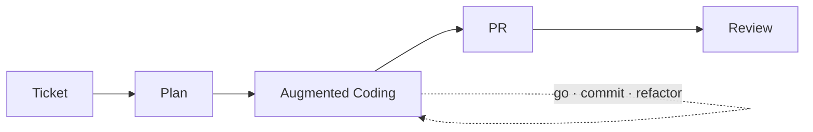

* TOC
{:toc}

# 증강 코딩 운영 기록

이 문서는 증강 코딩을 개인 실험에서 팀 운영으로 확장한 과정과, 현재 판단 기준을 정리한 기록이다.
핵심은 전면 위임이 아니라 **사람이 방향을 설계하고 AI가 작업을 수행하는 방식**이다.

---

## 1) 시작점

처음에는 바이브 코딩이랑 AI 전면 위임 방식에 회의적이었다.
명령을 바꿔도 결과물이 계속 마음에 안 들었고, 코드 품질도 일정하지 않았다.
무엇보다 이 결과가 우리 업무 맥락에 맞게 만들어졌는지 확신이 없었다.
지금 보면 그때는 AI에게 한 번에 너무 많은 걸 요구했던 것도 맞다.

생각이 바뀐 계기는 Kent Beck 글이었다.
코드 품질을 중요하게 보던 사람이 AI를 적극적으로 쓰는 방식이 인상적이었다.
근데 그냥 맡기는 게 아니라, 자기 기준으로 운영 방식을 만들고 있었다.

- <https://tidyfirst.substack.com/p/augmented-coding-beyond-the-vibes>

그때부터 기준을 이렇게 잡았다.

- 방향은 사람이 정한다.
- AI는 그 방향 안에서 작업한다.
- 사람은 설계와 판정 기준을 책임진다.

그래서 팀 적용 전에 개인 프로젝트에서 약 2주 먼저 검증했다.

- <https://github.com/currenjin/alexandria-playground/tree/main/playground-augmented-coding>

검증에서 확인한 내용:

- 티켓 기반 구조로 가면 재현성이 올라간다.
- 테스트 루프를 강제하면 속도와 안정성을 같이 가져갈 수 있다.
- 프롬프트 감각보다 작업 순서와 검증 구조가 결과를 더 크게 좌우한다.

---

## 2) 팀 적용 방식

현재 팀 기본 흐름은 다음과 같다.

1. Jira 티켓을 읽고 `plan.md`를 만든다.
2. `plan.md` 기준으로 구현한다.
3. 테스트 통과를 기준으로 수정 루프를 반복한다.
4. PR 생성 후 리뷰 단계로 이동한다.

### 운영 흐름 다이어그램

초기에는 개인 사용 중심이었지만, 효과가 확인되면서 팀원 사용이 늘었다.
운영 원칙은 바이브 코딩이 아니라 테스트 기반 실행이다.

관측된 변화:

- 작업 안정성 향상
- 구현/검증 속도 개선
- 리뷰 이전 단계 품질 편차 감소

---

## 3) 운영 방식이 바뀐 지점

처음부터 하네스라는 단어를 의식하고 시작한 건 아니었다.
그런데 운영을 쌓다 보니 결과적으로 하네스 구조가 됐다.

현재 사용 중인 스킬:

- `jira-to-plan`
- `augmented-coding`
- `push-pr`
- `review`
- `work` (통합 실행)

운영 역할은 이렇게 나눈다.

- 사람: 목표/제약/완료 기준 정의
- AI: 구현/수정/반복 실행
- 리뷰: 자동 리뷰 + 사람 판단 결합

여기서 팀에서 실제로 바뀐 행동이 하나 있다.
AI를 도구로만 보지 않고, 작업자로 두고 운영하기 시작했다.
작업자로 본다는 건 보고/수정/반복 의무를 명시적으로 요구한다는 뜻이다.

---

## 4) 증강 코딩의 철학

우리가 증강 코딩을 운영하면서 잡은 기준은 단순하다.
**사람이 설계하고, AI가 작성한다.**
여기서 설계는 아이디어 수준이 아니라, 문제 정의·제약·완료 기준·검증 기준까지 포함한다. 이 기준이 먼저 없으면, AI는 속도는 내도 방향은 흔들린다.

### 4-1) augmented coding은 vibe coding이 아니다

vibe coding은 “일단 돌아가면 된다”에 가까운 접근이다.
반면 augmented coding은 결과 동작만 보지 않는다. 코드 구조, 테스트 신뢰도, 복잡도 변화까지 같이 관리 대상으로 둔다.

그래서 증강 코딩은 “좋은 결과가 나오길 기대하는 방식”이 아니라, “기준을 맞출 때까지 검증 루프를 돌리는 방식”에 가깝다.
운영 관점에서 보면 핵심 차이는 생성 능력이 아니라, **판정 체계의 유무**다.

### 4-2) 기능 속도만 올리면 복잡도가 먼저 쌓인다

AI는 기능 추가 속도가 빠르다. 문제는 속도 자체가 아니라, 그 속도가 누적시키는 복잡도다.
기능이 빨리 붙는 동안 구조 정리가 따라오지 못하면, 일정 시점 이후부터는 변경 비용이 급격히 올라간다. 이 시점부터는 “빠른 구현”이 오히려 전체 속도를 떨어뜨린다.

Kent Beck 관점으로 보면 이건 features와 options의 균형이 깨지는 상황이다.
기능은 늘었지만 선택지(변경 가능성, 구조 유연성)가 줄어들면, 다음 기능부터는 속도 이점이 사라진다.
그래서 구현 루프 안에 정리 루프를 의도적으로 넣어야 한다.

### 4-3) TDD는 설계를 방해하는 게 아니라 설계를 드러내는 방식이다

TDD를 테스트 작성 규칙으로만 보면 반쪽 이해에 가깝다.
실무에서는 작은 테스트를 통해 설계 판단을 외부로 드러내고, 일반화가 필요한 시점과 범위를 좁게 통제하는 절차에 더 가깝다.

핵심은 테스트 개수가 아니다.
테스트를 **판정 기준으로 쓰는가**, 그리고 그 기준이 구현과 리팩터링 모두를 제어하는가가 중요하다.
이 관점이 잡히면 TDD는 “속도를 늦추는 의식”이 아니라, “되돌림 비용을 줄이는 설계 장치”가 된다.

### 4-4) 책임은 사람에게 남는다

AI가 코드를 작성해도 책임 주체는 사람이다.
그래서 아래 영역은 끝까지 사람이 판단해야 한다.

- 도메인 정책 적합성
- 요구사항 충족 여부
- 장기 유지보수 관점의 구조/가독성
- 코드리뷰 최종 승인

정리하면 AI는 작업자 역할이고, 방향·판정·책임은 사람이 끝까지 가져간다.
이 경계가 흐려지면 단기 속도는 올라가도 품질과 신뢰가 같이 무너진다.

### 4-5) 컨텍스트는 넓게 주는 것보다 정확히 잘라 주는 게 낫다

초기에는 AI에 전체 맥락을 한 번에 주는 방식이 더 좋을 거라고 생각하기 쉽다.
실제로는 반대인 경우가 많았다. 목표 범위를 좁히고 다음 1-step 맥락만 명확히 주는 편이 품질이 안정적이었다.

컨텍스트가 과도하면 AI가 선행 확장(요청하지 않은 기능 추가)이나 과잉 추론으로 흐를 확률이 올라간다.
그래서 “전체 비전”과 “현재 실행 단위”를 분리해서 전달하는 운영이 필요하다.

### 4-6) 복잡도는 부채가 아니라 운영 지표다

복잡도는 나중에 한 번에 청소할 대상이 아니다.
증강 코딩에서는 복잡도 증가율을 실시간으로 관리해야 한다.

실무에서 중요한 건 “얼마나 많이 만들었는가”보다 “얼마나 계속 바꿀 수 있는 상태를 유지했는가”다.
그래서 우리는 구현량뿐 아니라, 리뷰 피로도·재작업률·테스트 수정 비용 같은 신호를 같이 본다.

### 4-7) AI 실패는 결과가 아니라 신호에서 먼저 보인다

AI가 실패할 때는 보통 결과물보다 행동 패턴에서 먼저 신호가 나온다.

- 같은 수정 루프를 반복함
- 요청하지 않은 기능을 계속 확장함
- 테스트를 우회하거나 약화하려는 방향으로 감
- 설명은 그럴듯한데 diff 품질이 떨어짐

이 신호가 보이면 프롬프트를 더 길게 쓰는 대신, 작업 범위를 줄이고 판정 기준을 재설정하는 쪽이 효과적이다.

### 4-8) 자동화는 실행량을 늘리고, 사람은 판단 밀도를 높인다

자동화의 목적은 사람을 제거하는 게 아니라, 사람이 써야 할 판단 에너지를 보존하는 데 있다.
반복 실행(생성, 수정, 테스트)은 자동화로 밀고, 의미 해석(정책, 우선순위, 품질 승인)은 사람이 맡는다.

이 분리가 제대로 되면 팀은 속도와 품질을 동시에 가져갈 수 있다.
반대로 판단까지 자동화하려고 하면, 빠르게 잘못된 방향으로 달릴 가능성이 커진다.

### 4-9) 결론: 증강 코딩은 모델 문제가 아니라 운영 설계 문제다

모델이 좋아질수록 성능 차이는 줄어들 수 있다.
그 이후 결과를 가르는 건 결국 운영 설계다.

- 누가 방향을 정하는가
- 어떤 기준으로 멈추고 고치는가
- 누가 최종 책임을 지는가

증강 코딩의 철학은 기술 낙관이나 기술 비관이 아니다.
**속도와 책임을 분리하지 않고 함께 운영하는 방식**이다.

---

## 5) 자동화 경계

현재 자동화 우선순위는 다음과 같다.

- Jira 티켓 읽기 및 작업 시작
- Planning 기준 PRD 초안/Story/Task 분해
- 반복 구현/테스트 루프 실행

반대로 전면 자동화가 위험한 영역:

- 코드리뷰 최종 판단
- 도메인/요구사항 해석 충돌
- 조직 합의가 필요한 프로세스 변경

---

## 6) 현재 팀 이슈

최근 기준으로 팀 병목은 리뷰 속도보다 리뷰 품질에 가깝다.

CodeRabbit + `/review`를 적용해도 남는 이슈:

- 도메인 적합성 판단
- 요구사항 누락/해석 오류 검증

이 이슈의 상당수는 Jira 티켓 자체가 부정확하거나 누락된 상태에서 시작될 때 발생한다.

또한 기획 프로세스 자동화 실험(idea → planning → event storming → PRD)은
기술 이슈만 있는 게 아니라 조직 합의 이슈도 같이 존재한다.

---

## 7) 현재 결론

아직 완성형은 아니다.
다만 지금까지 운영해본 결론은 분명하다.

- 모델 선택보다 운영 설계가 결과를 더 크게 좌우한다.
- 개인 프롬프트 실력보다 팀 하네스가 결과를 안정화한다.
- 많이 생성하는 것보다 의도-검증 루프 품질이 더 중요하다.

결국 이건 도구 사용법 문제가 아니라 팀 운영 방식 문제다.
