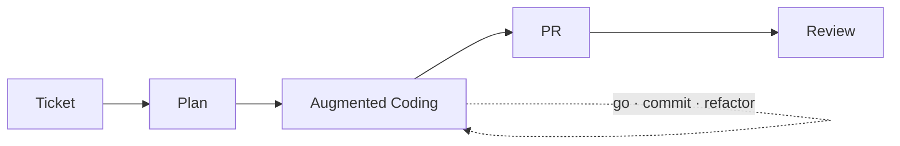

* TOC
{:toc}

# 증강 코딩 운영 기록

이 문서는 증강 코딩을 개인 실험에서 팀 운영으로 확장한 과정과, 현재 판단 기준을 정리한 기록이다.
핵심은 전면 위임이 아니라 **사람이 방향을 설계하고 AI가 작업을 수행하는 방식**이다.

---

## 1) 시작점

처음에는 바이브 코딩이랑 AI 전면 위임 방식에 회의적이었다.
명령을 바꿔도 결과물이 계속 마음에 안 들었고, 코드 품질도 일정하지 않았다.
무엇보다 이 결과가 우리 업무 맥락에 맞게 만들어졌는지 확신이 없었다.
지금 보면 그때는 AI에게 한 번에 너무 많은 걸 요구했던 것도 맞다.

생각이 바뀐 계기는 Kent Beck 글이었다.
코드 품질을 중요하게 보던 사람이 AI를 적극적으로 쓰는 방식이 인상적이었다.
근데 그냥 맡기는 게 아니라, 자기 기준으로 운영 방식을 만들고 있었다.

그때부터 기준을 이렇게 잡았다.

- 방향은 사람이 정한다.
- AI는 그 방향 안에서 작업한다.
- 사람은 설계와 판정 기준을 책임진다.

그래서 팀 적용 전에 개인 프로젝트에서 약 2주 먼저 검증했다.

- <https://github.com/currenjin/alexandria-playground/tree/main/playground-augmented-coding>

검증에서 확인한 내용:

- 티켓 기반 구조로 가면 재현성이 올라간다.
- 테스트 루프를 강제하면 속도와 안정성을 같이 가져갈 수 있다.
- 프롬프트 감각보다 작업 순서와 검증 구조가 결과를 더 크게 좌우한다.

---

## 2) 팀 적용 방식

현재 팀 기본 흐름은 다음과 같다.

1. Jira 티켓을 읽고 `plan.md`를 만든다.
2. `plan.md` 기준으로 구현한다.
3. 테스트 통과를 기준으로 수정 루프를 반복한다.
4. PR 생성 후 리뷰 단계로 이동한다.

### 운영 흐름 다이어그램

초기에는 개인 사용 중심이었지만, 효과가 확인되면서 팀원 사용이 늘었다.
운영 원칙은 바이브 코딩이 아니라 테스트 기반 실행이다.

관측된 변화:

- 작업 안정성 향상
- 구현/검증 속도 개선
- 리뷰 이전 단계 품질 편차 감소

---

## 3) 운영 방식이 바뀐 지점

처음부터 하네스라는 단어를 의식하고 시작한 건 아니었다.
그런데 운영을 쌓다 보니 결과적으로 하네스 구조가 됐다.

현재 사용 중인 스킬:

- `jira-to-plan`
- `augmented-coding`
- `push-pr`
- `review`
- `work` (통합 실행)

운영 역할은 이렇게 나눈다.

- 사람: 목표/제약/완료 기준 정의
- AI: 구현/수정/반복 실행
- 리뷰: 자동 리뷰 + 사람 판단 결합

여기서 팀에서 실제로 바뀐 행동이 하나 있다.
AI를 도구로만 보지 않고, 작업자로 두고 운영하기 시작했다.
작업자로 본다는 건 보고/수정/반복 의무를 명시적으로 요구한다는 뜻이다.

---

## 4) 증강 코딩 원칙

### 4-1) augmented coding은 vibe coding이 아니다

vibe coding은 결과 동작 중심이다.
augmented coding은 결과뿐 아니라 코드, 테스트, 복잡도까지 관리 대상으로 둔다.

### 4-2) 기능 속도만 올리면 복잡도가 먼저 쌓인다

AI는 기능 추가 속도는 빠르다.
하지만 복잡도를 자동으로 줄여주지는 않는다.
그래서 구현-검증-정리 루프를 의도적으로 운영해야 한다.

이걸 안 하면 단기 속도는 오르지만, 리뷰와 유지보수 비용이 뒤에서 터진다.

### 4-3) TDD는 설계를 방해하는 게 아니라 설계를 드러내는 방식이다

작은 테스트와 일반화 단계를 반복하면 설계 결정이 더 명확해진다.
핵심은 테스트 개수가 아니라 테스트를 판정 기준으로 쓰는 데 있다.

### 4-4) 책임은 사람에게 남는다

AI가 작성해도 책임 주체는 사람이다.
그래서 아래 영역은 사람이 직접 본다.

- 도메인 정책 적합성
- 요구사항 충족 여부
- 장기 유지보수 관점의 구조/가독성
- 코드리뷰 최종 판단

---

## 5) 자동화 경계

현재 자동화 우선순위는 다음과 같다.

- Jira 티켓 읽기 및 작업 시작
- Planning 기준 PRD 초안/Story/Task 분해
- 반복 구현/테스트 루프 실행

반대로 전면 자동화가 위험한 영역:

- 코드리뷰 최종 판단
- 도메인/요구사항 해석 충돌
- 조직 합의가 필요한 프로세스 변경

---

## 6) 현재 팀 이슈

최근 기준으로 팀 병목은 리뷰 속도보다 리뷰 품질에 가깝다.

CodeRabbit + `/review`를 적용해도 남는 이슈:

- 도메인 적합성 판단
- 요구사항 누락/해석 오류 검증

이 이슈의 상당수는 Jira 티켓 자체가 부정확하거나 누락된 상태에서 시작될 때 발생한다.

또한 기획 프로세스 자동화 실험(idea → planning → event storming → PRD)은
기술 이슈만 있는 게 아니라 조직 합의 이슈도 같이 존재한다.

---

## 7) 현재 결론

아직 완성형은 아니다.
다만 지금까지 운영해본 결론은 분명하다.

- 모델 선택보다 운영 설계가 결과를 더 크게 좌우한다.
- 개인 프롬프트 실력보다 팀 하네스가 결과를 안정화한다.
- 많이 생성하는 것보다 의도-검증 루프 품질이 더 중요하다.

결국 이건 도구 사용법 문제가 아니라 팀 운영 방식 문제다.
