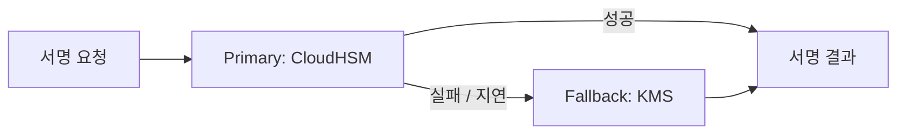
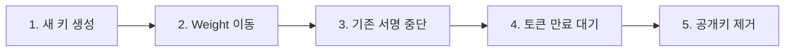

* TOC
{:toc}

# AWS Summit Seoul 2026

- 기간: 2026-05-20 (수) ~ 2026-05-21 (목)
- 장소: COEX Convention Center, Seoul
- 구성: Industry Day (5/20) + AI Day (5/21)
- 공식: [aws.amazon.com/ko/events/summits/seoul](https://aws.amazon.com/ko/events/summits/seoul/ )

올해 AWS Summit Seoul은 COEX에서 이틀에 걸쳐 열렸다. 첫째 날은 산업별로 묶인 Industry Day, 둘째 날은 AI에 초점을 맞춘 AI Day로 구성됐다. 100개 이상의 세션, 70여 개의 고객 사례, 워크숍, 라이트닝 토크가 한꺼번에 돌아가서 동선을 짜는 것부터 작은 미션이었다.

> 스크린샷: 행사장 전경 / 입장 게이트

## 현장 이야기

### 스탬프 미션과 가챠
행사장 곳곳의 부스에서 스탬프를 받을 수 있었다. 총 16개를 모두 모으면 가챠 머신을 한 번 돌릴 수 있는 이벤트였고, 자연스럽게 부스를 골고루 돌아보게 만드는 장치였다.

> 스크린샷: 스탬프 카드 (16칸)

> 스크린샷: 가챠 머신과 결과물

### 설문 참여 굿즈
세션이나 부스에서 설문에 응하면 티셔츠를 받을 수 있었다. 사이즈가 금방 빠지니 일찍 들르는 편이 유리하다.

> 스크린샷: 굿즈 티셔츠

## 부스 탐방

파트너 기업 부스에서는 자체 솔루션 데모와 굿즈 이벤트가 함께 진행됐다. 둘러본 부스는 다음과 같다.

| 부스 | 메모 |
|------|------|
| 메가존 클라우드 | (정리 예정) |
| 스마일샤크 | (정리 예정) |
| Kiro | (정리 예정) |
| Google Developers | (정리 예정) |
| Datadog | (정리 예정) |
| Red Hat | (정리 예정) |

> 스크린샷: 인상 깊었던 부스

여기서부터는 직접 들은 세션을 정리한다.

## AWS 피지컬 AI로 실현하는 기업의 차세대 혁신 전략

- Publisher: TBD

(정리 예정)

## 당근의 CloudHSM/KMS 기반 대규모 서명키 관리 시스템 구축기

- Publisher: 최용환 (Yany, SRE), 조승환 (Josh.cho, Identity Service Engineer)

### 한 줄 요약
- KMS vs CloudHSM
- 대부분의 워크로드는 KMS, 규제가 있고 직접 구축할 수 있다면 CloudHSM

> 스크린샷: KMS vs CloudHSM 비교 장표

---

### 당근 서비스와 서명키 과제 (최용환, SRE)

#### 기존 아키텍처의 한계

> 스크린샷: 기존 서명 아키텍처

- 촘촘한 접근 제어 기법이 필요했다
- 의도치 않은 토큰 서명이 발생할 수 있는 구조였다

#### 새 시스템에서 고려한 부분
- Private 키 유출이 없어야 한다
- 서명 트래픽을 감당해야 한다
- SPOF 없이 대안이 존재해야 한다
- 서명 트래픽에 촘촘한 접근 제어가 가능해야 한다
- 담당자 없이도 임의로 안전하게 서명할 수 있어야 한다

#### KMS vs CloudHSM 비교

| 기준 | KMS | CloudHSM |
|------|-----|----------|
| 처리량 | 1,000 RPS Soft Limit (증설 요청 가능) | 4 HSM 기준 7,000 RPS |
| 과금 | 요청당 과금 (요청 적으면 유리) | 인스턴스당 과금 (요청 많으면 유리) |
| 위치 | AWS Managed VPC 내 | 고객 VPC 내 물리적 격리 |
| 레이턴시 | 비교적 높음 | 같은 VPC 내라 낮음 |
| 접근 제어 | API | PKCS#11 |

---

### CloudHSM 선택과 도입기

> 스크린샷: 전체 아키텍처

#### 접근 제어 흐름
- HSM 담당자: HSM 관리 인스턴스에서 CLI로 HSM 접근
- 개발자: 접근 불가
- Token Issuer: Secrets Manager의 정보로 HSM 접근

#### HSM 사용자 역할

| 역할 | 권한 |
|------|------|
| Admin | User 관리 |
| Crypto | 키 생성과 설정 관리 |
| Crypto Read-only | 서명 수행 |

#### Access Controller

> 스크린샷: Access Controller 구성도

- Kyverno로 정책 적용
- CloudTrail로 감사

---

### Lessons Learned: Forward Proxy
- PKCS#11 Client 초기화 시 커넥션 에러 발생
- Istio에서 CloudHSM IP 식별을 위해 도메인을 병행 사용해야 함
- 처음에는 Service Discovery로 관리하려 했지만 세션이 불안정해 도메인 접근 포기
- 지금은 `configure-pkcs11` 방식으로 운영

---

### 서명 시스템 구현과 Failover 설계 (조승환, Identity Service Engineer)

PKCS#11은 C 기반으로 Shared Object 바이너리를 호출하는 구조라 FFI가 필요하다.

#### 서명 Failover
- Active / Standby 구조로 설계
- 서명 실패 시 Fallback signer 사용
- 실제 사례: HSM 통신에 Latency Spike 발생 시 Failover로 Secondary(KMS) 서명 전환

#### 서명 알고리즘 전환
- 기존: RS256 (소인수분해 기반)
- 신규: ES256 (타원곡선 이산대수)

---

### 트러블슈팅

#### Scale-out 시 세션 고정 문제
- HSM을 추가하면 애플리케이션에서 세션 재연결이 필요
- 현재는 애플리케이션 재시작으로 대응

#### Scale-in 중 요청 실패
- HSM 인스턴스 종료 시점에 처리 중이던 요청 실패
- Fallback으로 사용자 관점의 에러는 없도록 처리

#### MaxSessions 튜닝
- 실패보다 대기가 낫다
- MaxSessions를 너무 높게 잡으면 Flow control이 없어 Latency 급등
- MaxSessions를 낮게 잡고 `poolWaitTimeout`을 함께 설정해서 Latency 소폭 증가만으로 안정화

#### 로깅 체계
- PKCS#11은 자체 로그 트래킹이 불가
- `.so` 파일이 남기는 바이너리 로그 파일을 실시간 tail하는 LogTail 구현
- Error Level은 Sentry, Metric은 Datadog로 송출

---

### 서명키 안전하게 전환하기 (Key Rotation)

1. 새 키 생성
2. 트래픽 Weight 이동
3. 기존 키로의 서명 중단
4. 기존 키로 서명된 토큰 만료 대기
5. 공개키 제거

## 새벽 3시, 18만 개의 모델이 대신 판단한다 : 넥슨의 에이전틱 Ops

- Publisher: TBD

(정리 예정)

## 요기요의 AIOps: SRE 운영의 콘솔 탈출기

- Publisher: TBD

(정리 예정)

## 참고
- [AWS Summit Seoul 2026 공식](https://aws.amazon.com/ko/events/summits/seoul/ )
