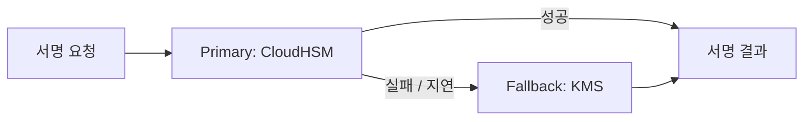
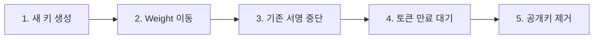
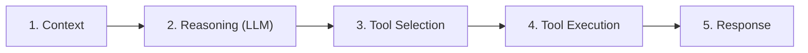
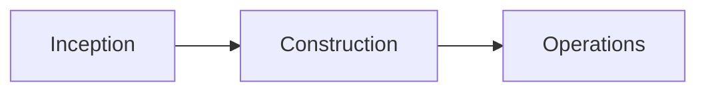
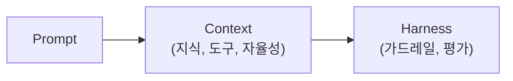
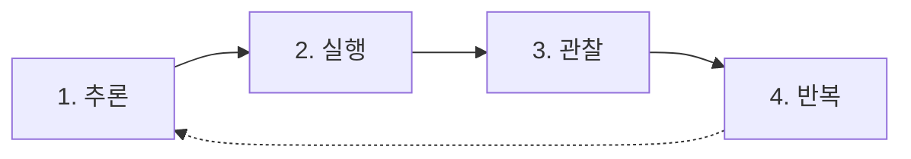

* TOC
{:toc}

# AWS Summit Seoul 2026

- 기간: 2026-05-20 (수) ~ 2026-05-21 (목)
- 장소: COEX Convention Center, Seoul
- 구성: Industry Day (5/20) + AI Day (5/21)
- 공식: [aws.amazon.com/ko/events/summits/seoul](https://aws.amazon.com/ko/events/summits/seoul/ )

올해 AWS Summit Seoul은 COEX에서 이틀에 걸쳐 열렸다. 첫째 날은 산업별로 묶인 Industry Day, 둘째 날은 AI에 초점을 맞춘 AI Day로 구성됐다. 100개 이상의 세션, 70여 개의 고객 사례, 워크숍, 라이트닝 토크가 한꺼번에 돌아가서 동선을 짜는 것부터 작은 미션이었다.

## 현장 이야기

### 스탬프 미션과 가챠
행사장 곳곳의 부스에서 스탬프를 받을 수 있었다. 총 16개를 모두 모으면 가챠 머신을 한 번 돌릴 수 있는 이벤트였고, 자연스럽게 부스를 골고루 돌아보게 만드는 장치였다.

### 설문 참여 굿즈
세션이나 부스에서 설문에 응하면 굿즈를 받을 수 있었다.

## 부스 탐방

파트너 기업 부스는 거의 다 둘러봤다. 자체 솔루션 데모와 굿즈 이벤트가 함께 진행되어서 동선을 짜는 재미가 있었다.

여기서부터는 직접 들은 세션을 정리한다.

## AWS 피지컬 AI로 실현하는 기업의 차세대 혁신 전략

- Publisher: TBD

(정리 예정)

## 당근의 CloudHSM/KMS 기반 대규모 서명키 관리 시스템 구축기

- Publisher: 최용환 (Yany, SRE), 조승환 (Josh.cho, Identity Service Engineer)

### 한 줄 요약
- KMS vs CloudHSM
- 대부분의 워크로드는 KMS, 규제가 있고 직접 구축할 수 있다면 CloudHSM

---

### 당근 서비스와 서명키 과제 (최용환, SRE)

#### 기존 아키텍처의 한계

- 촘촘한 접근 제어 기법이 필요했다
- 의도치 않은 토큰 서명이 발생할 수 있는 구조였다

#### 새 시스템에서 고려한 부분
- Private 키 유출이 없어야 한다
- 서명 트래픽을 감당해야 한다
- SPOF 없이 대안이 존재해야 한다
- 서명 트래픽에 촘촘한 접근 제어가 가능해야 한다
- 담당자 없이도 임의로 안전하게 서명할 수 있어야 한다

#### KMS vs CloudHSM 비교

| 기준 | KMS | CloudHSM |
|------|-----|----------|
| 처리량 | 1,000 RPS Soft Limit (증설 요청 가능) | 4 HSM 기준 7,000 RPS |
| 과금 | 요청당 과금 (요청 적으면 유리) | 인스턴스당 과금 (요청 많으면 유리) |
| 위치 | AWS Managed VPC 내 | 고객 VPC 내 물리적 격리 |
| 레이턴시 | 비교적 높음 | 같은 VPC 내라 낮음 |
| 접근 제어 | API | PKCS#11 |

---

### CloudHSM 선택과 도입기

#### 접근 제어 흐름
- HSM 담당자: HSM 관리 인스턴스에서 CLI로 HSM 접근
- 개발자: 접근 불가
- Token Issuer: Secrets Manager의 정보로 HSM 접근

#### HSM 사용자 역할

| 역할 | 권한 |
|------|------|
| Admin | User 관리 |
| Crypto | 키 생성과 설정 관리 |
| Crypto Read-only | 서명 수행 |

#### Access Controller

- Kyverno로 정책 적용
- CloudTrail로 감사

---

### Lessons Learned: Forward Proxy
- PKCS#11 Client 초기화 시 커넥션 에러 발생
- Istio에서 CloudHSM IP 식별을 위해 도메인을 병행 사용해야 함
- 처음에는 Service Discovery로 관리하려 했지만 세션이 불안정해 도메인 접근 포기
- 지금은 `configure-pkcs11` 방식으로 운영

---

### 서명 시스템 구현과 Failover 설계 (조승환, Identity Service Engineer)

PKCS#11은 C 기반으로 Shared Object 바이너리를 호출하는 구조라 FFI가 필요하다.

#### 서명 Failover
- Active / Standby 구조로 설계
- 서명 실패 시 Fallback signer 사용
- 실제 사례: HSM 통신에 Latency Spike 발생 시 Failover로 Secondary(KMS) 서명 전환

#### 서명 알고리즘 전환
- 기존: RS256 (소인수분해 기반)
- 신규: ES256 (타원곡선 이산대수)

---

### 트러블슈팅

#### Scale-out 시 세션 고정 문제
- HSM을 추가하면 애플리케이션에서 세션 재연결이 필요
- 현재는 애플리케이션 재시작으로 대응

#### Scale-in 중 요청 실패
- HSM 인스턴스 종료 시점에 처리 중이던 요청 실패
- Fallback으로 사용자 관점의 에러는 없도록 처리

#### MaxSessions 튜닝
- 실패보다 대기가 낫다
- MaxSessions를 너무 높게 잡으면 Flow control이 없어 Latency 급등
- MaxSessions를 낮게 잡고 `poolWaitTimeout`을 함께 설정해서 Latency 소폭 증가만으로 안정화

#### 로깅 체계
- PKCS#11은 자체 로그 트래킹이 불가
- `.so` 파일이 남기는 바이너리 로그 파일을 실시간 tail하는 LogTail 구현
- Error Level은 Sentry, Metric은 Datadog로 송출

---

### 서명키 안전하게 전환하기 (Key Rotation)

1. 새 키 생성
2. 트래픽 Weight 이동
3. 기존 키로의 서명 중단
4. 기존 키로 서명된 토큰 만료 대기
5. 공개키 제거

---

### Wrap-Up: 하이브리드 전략

저트래픽 환경은 KMS를 Primary로, 고트래픽 환경은 CloudHSM을 Primary로 두는 Active-StandBy 조합으로 보안, 성능, 안정성을 모두 달성한다.

### Key Takeaways

- Private Key의 안전한 격리: HSM/KMS 안에서만 서명, 키는 절대 밖으로 나오지 않는 구조
- 장애에 대비한 안정성 확보: Failover 구조 설계를 통한 단일 벤더 SPOF 제거
- 더욱 안전하게 당근 서비스를 제공: 하루 수천만 건의 인증 토큰을 더 안전한 기반 위에서 발급

## 새벽 3시, 18만 개의 모델이 대신 판단한다 : 넥슨의 에이전틱 Ops

24시간 가동되는 게임 운영에서 새벽 3시에 누가 깨어 이상을 감지할 것인가에 대한 넥슨의 답.
사람 대신 18만 개의 모델이 시계열 신호를 동시에 살피고, 의미를 모아 결국 사람에게 "기사" 형태로 전달하는 에이전틱 Ops 시스템이다.

### Statistical Backbone

통계적 모델링이 의미 있는 결과로 이어지려면, 먼저 기존 장애 이력으로부터 시스템 지표가 어떻게 반응했는지를 살펴야 한다. 이 작업이 빠지면 정교한 모델을 얹어도 표면만 긁는다.

### 시계열 자체의 급격한 변화 탐지

동시 접속자 같은 핵심 지표에서는 절대 임계치보다 **시계열 자체의 급격한 변화**가 더 결정적이다. 그리고 서버/서비스 사이의 이질성을 함께 본다.

### 전방위적 상황 분석을 위한 대규모 이상 탐지 백본

지금까지의 모든 얘기를 한 마디로 응축하면, "전방위적 상황 분석을 위한 대규모 이상 탐지 백본"이다. 18만 개 모델은 이 백본 위에서 동시에 돌아간다.

### ContextLake Flow

숫자가 그저 한글로 번역되는 수준이 아니라, **의미론적으로 묶이고 분류되는** 흐름이 필요했다. ContextLake는 Backend Layer → ContextLake → Harvesting 의 3단으로 실시간 의미를 흘려보낸다.

### Agents' Context Flow

화성 탐사대의 식물학자 마크 와트니가 화성에서 조난당하는 상황에 비유하며, 에이전트들이 부분 정보로부터 어떻게 종합적 결론에 도달하는지를 설명했다. 각 에이전트의 추론 결과가 다층 의미(인수 / 서비스 / 비즈니스 등)로 합쳐진다.

### THE ANOMALY TIMES

이상 탐지 결과는 단순한 경보가 아니라 신문(THE ANOMALY TIMES) 형식의 기사로 전달된다. 99% 이상의 동시 접속자가 감소한 큰 사건부터, 다양한 상황에서 놀라움을 주는 작은 케이스까지 같은 톤으로 정리된다.

### 성과 지표

발표 슬라이드에 표시된 수치는 다음과 같다 (자세한 정의는 공식 자료 공개 시 갱신).

- 탐지율 100%
- 운영자가 모르던 이상 추가 발견 +34%
- 오탐률 2.8%
- 1분 이내 탐지
- 평균 대응 시간 30분 단축
- 인시던트 채널 노이즈 1/3 감소

### Our History

발표 후반의 로드맵 슬라이드를 그대로 옮긴 흐름이다.

- 2024 Q3: 주요 지표 기반 이상 감지 시작
- 2024 Q4: 복합 지표 고려
- 2025 Q1: 실시간 분석 서비스
- 2025 Q2: AIOPS v1 Launch
- 2026 Q2: AIOPS v2 Launch

## 요기요의 AIOps: SRE 운영의 콘솔 탈출기

- Publisher: 김예준 (외식한상상)

흩어진 콘솔과 대시보드 사이를 오가던 운영을 어떻게 에이전트 기반으로 정리했는지에 대한 사례.

### 회사 소개

- 서비스 라인업: 요기요 / 요기배달 / 요기패스 / 요미트 / 요편의점 / 무한적팁
- 배달앱 최초 멤버십 할인 구독 서비스
- 최대 40배 피크 트래픽을 감당하는 운영 환경
- 30+ 개 계정, 60+ 개 마이크로서비스

### 기존 운영의 현실

- 통합 모니터링 솔루션에서 관리되는 지표: APM, Infra, K8s, Log, Redis/RDS
- 그 바깥에서 추가로 봐야 하는 지표: ArgoCD, Grafana, Elasticsearch, CDN
- 30+ 개 계정마다 따로 콘솔에 들어가야 하는 정보
- 결과적으로 담당자의 경험에 크게 의존하게 되는 운영

### 우리가 원했던 것

또 하나의 대시보드가 아니라, **질문에 답이 바로 나오는 통합 모니터링 경험**이 필요했다.

- 서비스 영향도 분석: 한 번의 요청으로 연관 서비스의 영향 순위 분석
- 리소스 최적화: Idle-Peak 격차를 분석해 절감 가능한 옵션 추천과 추적
- 이벤트 리포트 자동화: Datadog, Kubernetes, Amazon CloudWatch 등 여러 출처를 모아 정리

### AIOps 아키텍처

- 사용자 요청은 ALB를 거쳐 Frontend/Backend (ECS)로 들어간다
- 핵심은 Amazon Bedrock 위에 올린 **AgentCore**. Network / Compute / Storage / Auditing / Security / Memory 자원을 다루는 MCP Tool Functions를 호출한다
- External Data Sources로 Datadog, Grafana, CloudWatch, K8s 등이 연결되고, AWS Services는 Compute / Networking / Storage / Security / Monitoring 카테고리로 묶여 있다

운영자가 자연어로 질문을 던지면 AgentCore가 외부 데이터를 직접 조회해 응답한다.

### 시나리오 1: AI Assistant (대화형 인프라 진단)

콘솔을 직접 열지 않고, 자연어 질의로 시스템 상태를 진단한다. SRE의 콘솔 탈출 시작점.

### 시나리오 2: Resource Optimizing

피크 대비 오버프로비저닝을 식별한다.

- **멀티 리소스 분석**: EC2, RDS, ElastiCache 등 다양한 리소스 분석
- **액션 중심 추천**: 유휴 자원 식별, Down-sizing, 패밀리 변경, 세대 교체, Graviton 전환 등
- **병목 시뮬레이션**: 추천 적용 후의 변경을 사전 검증

### 시나리오 3: Intelligence Report

프로모션과 같은 이벤트 전 구간을 AI가 기록한다.

- Cluster Overview: 이벤트 전 준비가 충분했는지 (Prewarming, Pod, Node, RPS)
- 마이크로서비스 Overview: 피크 구간의 서비스별 영향 (RPS, Latency, Error Rate, 리소스 사용률)
- 영향도 큰 서비스 순으로 정렬: 지금 가장 먼저 봐야 할 서비스부터 우선순위로 노출

### AIOps 도입 후 효과

- Right-Sizing 47%, 리소스 제거 23%, Valkey 전환 19%, 세대교체 11%
- **Amazon ElastiCache 비용 55% 절감**
- **작업 효율 10배 증대**

### 도입하며 배운 것

- 통합은 에이전트를 나누는 것만으로는 해결되지 않는다
- AIOps의 가치는 자동 판단이 아니라 **탐색 시간 단축**에 있다
- 무작정 전체를 보게 만드는 것이 아니라, AI가 변화 큰 대상을 좁혀 주는 것이 핵심

### 앞으로의 계획

운영 → AI 분석 → 조치 제안 → 승인 → 운영의 사이클을 다음 단계로 본다. 즉, **승인 기반의 자동화**(AWS가 조치를 제안하고 운영자가 승인하면 적용)가 그 시작점이다.

## 21억 사용자 스케일의 삼성 어카운트의 Agentic AIOps 사례

Amazon Bedrock AgentCore 위에서 21억 사용자 스케일의 운영을 어떻게 에이전트가 받쳐주는지에 대한 사례.
앞부분은 AgentCore 관점의 4가지 축, 뒷부분은 삼성 계정 사례라는 2단 구성으로 진행됐다.

### 1. 운영 우수성

> 필요한 규모로 프로덕션에서 이를 운영할 수 있는가?

- 관찰 가능성
- 비용
- 규모 및 지연 시간

OTEL 추적을 활용해 Trace / Span / Sub-Span 단위로 관찰한다.

또 다른 가시성, 재사용성, 거버넌스를 단순화하기 위한 도구로 **AWS Agent Registry**가 소개됐다.

### 2. 데이터 및 컨텍스트

> 에이전트가 올바른 정보를 가지고 있는가?

- **데이터 품질**: 잘못된 입력은 잘못된 출력으로 이어진다
- **검색 및 RAG**: 적절한 맥락을 적절한 시점에
- **메모리**: 중요한 것만 기억
- **그라운딩**: 환각 방지

대부분의 실패는 결국 데이터 실패다. 잘못된 문서, 오래된 컨텍스트, 인덱싱 불가한 정보 등이 그 사례다.

#### 메모리는 필수

꼭 필요한 정보만 저장하고 다시 활용한다. 모든 걸 다 때려박는다고 좋은 게 아니다. (참고: *Context Rot: How Increasing Input Tokens Impacts LLM Performance*)

| 종류 | 예시 |
|------|------|
| 단기 메모리 | 대화 기록, 현재 세션 컨텍스트, 작업 메모리 |
| 장기 메모리 | 사용자 선호도, 과거 상호작용, 사실 및 지식 |

이를 받쳐주는 **AgentCore Memory**는 완전 관리형, 사용자 네임스페이스, 영구 저장을 제공한다.

### 3. 신뢰

> 사용자들이 자신의 데이터가 보호되고 에이전트가 경계 내에서 작동한다고 신뢰할 수 있는가?

- AgentCore Identity
- AgentCore Policy
- AgentCore Runtime

### 4. 안정성

> 에이전트가 일관되게 동작하며, 이를 증명할 수 있는가?

- 일관성
- 평가: **AgentCore Evaluations** (데이터 기반 모델 전환, 품질/비용/지연 시간 균형 조정, 데이터로 평가)
- 테스팅
- 복구

### 프론티어 랩

- 앤트로픽 (Claude 사용 가능)
- 오픈AI (곧 출시)

### Key Take-home Messages

### 삼성 계정 규모

- 사용자 21억 명
- 280만 RPS
- 4개 리전 운영
- 핵심 지표로 MTTD, MTTR, MTBF 추적

### 대규모 서비스 운영의 어려움

- 끝없는 대시보드 탐색
- 개인 역량에 종속된 분석 시간
- 글로벌 서비스 On Call 대응

→ 이 부담을 AI Agent에 위임한 것이 AIOps Agent의 출발점.

### AIOps Agent

POC 결과:

- 20분 이상 걸리던 분석이 5분 이하로 단축
- 특정 시간대 한정이던 분석이 365일 24시간 가능
- 다만 정확도는 사람(90%) > Agent(50%) 로 사람이 더 높았다

#### 프로덕션화의 벽

- 가시성의 부재
- 파편화된 표준
- 스케일의 딜레마

#### 해결 접근

- 로그 수집 인프라를 새로 구성
- 태그 정규화 및 불필요 태그 수집 제외
- 멀티 Agent 구성 + 표준 운영 절차(SOP)에 따른 프롬프트 엔지니어링

### 사례

#### 사례 1: 자연 회복

| 시각 | 이벤트 |
|------|--------|
| 10.20 20:45 | 최초 알람 발생 |
| 10.20 20:48 | AIOps Agent 분석 완료 |
| 10.20 20:50 | 자연 회복 |
| 10.21 | AWS Case 답변 완료 |

#### 사례 2: us-east-1 장애 → AP Failover

| 시각 | 이벤트 |
|------|--------|
| 10.20 15:59 | us-east-1 최초 알람 발생 |
| 10.20 16:05 | AIOps Agent 분석 완료 후 강제 종료 |
| 10.20 16:30 | US → AP Region Failover 진행 |
| 10.20 18:00 | AWS 공식 발표 |

AWS 공식 발표보다 빠르게 자체 판단으로 Failover를 결정한 케이스.

### Agentic AI Platform

## Strands Agent + AWS Lambda + Bedrock

서버리스 환경에서 Agentic 시스템을 어떻게 만들고 운영했는지에 대한 사례.

### 당면 과제

- 예측 불가능한 수요
- 빠른 변화
- 비용 효율성

### Strands Agent

- Multi-Agent 시스템 구축을 위한 오픈소스 SDK
- AWS와의 자연스러운 연동
- Model Driven 방식

#### Agent Loop

### Strands Agent + AWS Lambda

- 가볍고 비용 효율적
- 기존 아키텍처 호환
- 다양한 요소도 구현 가능

#### Lambda Web Adapter

프레임워크들을 Lambda 위에서 그대로 돌릴 수 있게 해주는 어댑터.

### 당면 문제

- **리소스 제한**: 람다 시간 제한 15분, 전체 코드 용량 제한
- **세션 영속성**: 세션 히스토리 관리의 비효율성, Stateless라 임시 스토리지 활용 어려움
- 다양한 실험 및 구현의 어려움

### with Bedrock AgentCore

이러한 한계를 보완하는 옵션으로 AgentCore가 등장.

- **서버리스**: 사용한 만큼 비용 지불
- **세션 관리** 내장
- **보안**: Cognito 연동 기반
- **확장성**
- **배포**: zip 기반 배포
- **모니터링** 제공

#### AgentCore 구성

| 구성요소 | 역할 |
|----------|------|
| Runtime | 에이전트 실행 환경 |
| Identity | 인증/권한 |
| Gateway | 진입점 |
| Memory | 메모리 관리 |

#### Runtime 호출 방식

- **API Gateway + Lambda**
  - 기본 29초 제한
  - API Gateway 인증 가능
  - Lambda ColdStart + AgentCore ColdStart 가 합쳐짐
- **Lambda URL**
  - 15분 제한
  - Lambda ColdStart + AgentCore ColdStart
- **AgentCore Native**
  - SigV4 API Call
  - AWS Cognito 연동
  - AWS Credential 필요

#### TIP: AgentCore CLI

CLI로 빠르게 배포/관리 가능.

### 주의

- 토큰 사용량 관리
- Cold Start 주의
- Throttling 주의

### 결론

## 라포랩스의 AX 전환 플랫폼 사례

### 제공하는 기능들

- **Custom Figma Plugin**
- **라포도알**: 회의 녹음 시 자동 회의록 생성
- **CX-Seller Agent**

### AX 전환 플랫폼

#### Raploy: 배포를 몰라도 배포할 수 있게 하자

배포 지식이 없는 구성원도 배포할 수 있게 하는 것을 목표로 한 플랫폼.

**AI-DLC (AI-Driven Development Lifecycle)** 3단계로 동작한다.

#### Raku: Enterprise-ready OpenClaw

엔터프라이즈 환경에 맞게 다듬은 OpenClaw 기반의 에이전트 플랫폼.

**Case 1: Service Alert**

- Slack 스레드에서 호출하면 알러트 정보 보여줌
- 이슈 / 로그 / 최근 변경 맥락 자동 수집

**Case 2: Operations**

- PLP 성과 리포트 자동 작성
- 저성과 배너 자동 식별
- 교체 대상 ID 전달
- 배너 카피, 이미지 후보 생성

**Case 3: Daily Reporting**

- 매일 오전 최신 정보 파악
- 로그 검색으로 오류 이슈 자동 제기
- 후속 조치 필요 여부 판단

#### 핵심 구성

- Agent Harness
- Live Artifacts
- Custom Agents

## 누구나 손쉽게 개발 효율 200% 향상시키는 Kiro 활용법

### AI Coding의 진화

### 컨텍스트가 전부다

> 컨텍스트가 메시지 배열의 전부다. 자율 실행이 길어질수록 많은 메시지가 축적된다.
>
> 컨텍스트 엔지니어링은 다음 단계에 필요한 정확한 정보로 컨텍스트 윈도우를 채우는 섬세한 기술이자 과학이다.
> - 안드레 카파시

#### 컨텍스트 유형

| 유형 | 설명 |
|------|------|
| 시스템 컨텍스트 | 시스템 프롬프트, 정책 |
| 검색 컨텍스트 | RAG로 가져온 외부 지식 |
| 대화 컨텍스트 | 사용자와 주고받은 메시지 |
| 도구 컨텍스트 | 도구 호출 결과 |

### SweetSpot을 위한 도구

#### MCP (Model Context Protocol)

- 표준화
- 외부 데이터 소스와의 통합
- 향상된 기능성
- 유연성 및 확장성

**모범 사례**

- 전송 방식 선택 (stdio / http 등)
- 레벨 분리
- 사전 구축된 것을 우선
- 권한 최소화

Kiro에서 MCP를 native로 사용 가능하다.

#### Steering

> 컨텍스트가 없다면, LLM은 가정을 한다.

Steering은 프로젝트에 대한 추가 컨텍스트를 제공한다.

> 스크린샷: Steering 예시 (컨텍스트 없음 vs 있음)

- **Foundational Steering**: 자동 생성
- **Custom Steering**: 사용자가 직접 정의

**모범 사례**

- 워크스페이스 단위로
- 글로벌은 글로벌답게
- 양보다 질
- Kiro가 모르는 것만 정의

#### Kiro Powers

핵심 키워드:

- Powers
- Just In Time
- 협업

**구성요소**

- POWER.md
- MCP Server
- Steering

#### 에이전트가 스스로 검증하는 구조

## 참고
- [AWS Summit Seoul 2026 공식](https://aws.amazon.com/ko/events/summits/seoul/ )
