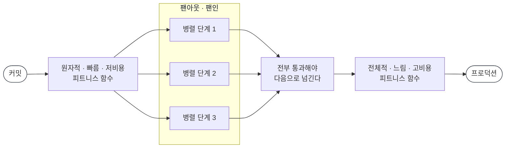
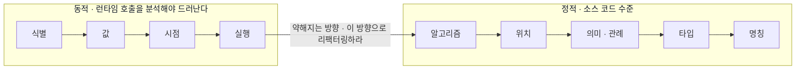
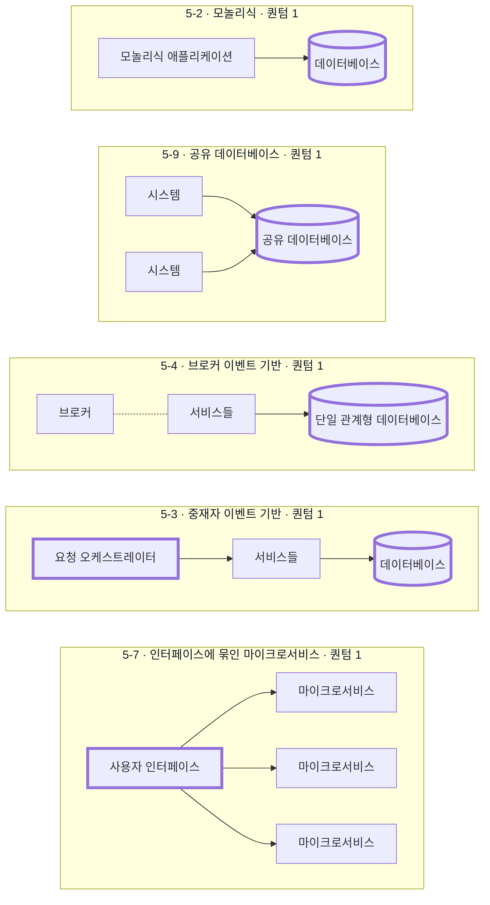
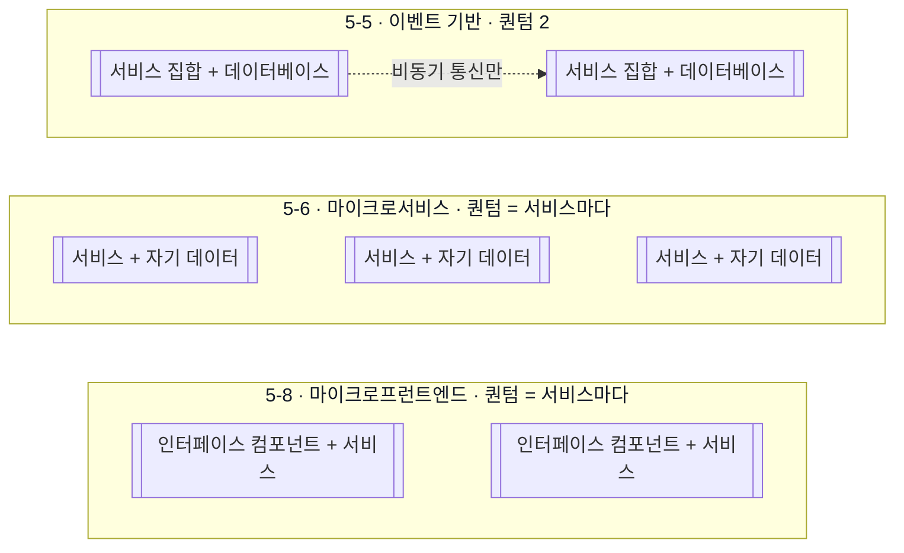

* TOC
{:toc}

# Building Evolutionary Architectures(진화적 아키텍처)

> 진화적 소프트웨어 아키텍처는 여러 차원에 걸쳐 유도된 변화guided change와 점진적 변화incremental change를 지원한다.
>
> 1장, [한빛미디어 공식 미리보기](https://fliphtml5.com/hkuy/ktoy/) p.29

한 번 잘 그린 아키텍처가 시간이 지나면서 왜 무너지는지, 무너지지 않게 하려면 무엇을 기계로 붙잡아야 하는지를 다루는 책이다. 저자들이 내놓은 답이 피트니스 함수다. 지키고 싶은 아키텍처 특성을 사람이 문서로 적어 두는 대신 실행 가능한 검사로 적어 두고, 배포 파이프라인이 매번 돌린다.

이 페이지는 한빛미디어 번역본의 장 구성을 따라 정리했다. 용어는 번역본 표기를 쓴다. connascence를 이 번역본은 동조성이라 옮겼고, expand/contract는 확장/수축 패턴이다.

장·절·소절 제목은 한빛 공식 미리보기의 3단계 목차와 원서 목차를 대조해 확인한 것이고, 절 안의 내용은 공개 자료로 확인되는 범위까지만 적었다. 확인 범위는 [아래](#이-페이지의-확인-범위)에 장별로 남겨 뒀다.

## 서지

| 항목 | 내용 |
| --- | --- |
| 제목 | 진화적 아키텍처: 피트니스 함수, 거버넌스 자동화를 활용해 생산성 높은 소프트웨어 구축하기 |
| 원서 | Building Evolutionary Architectures: Automated Software Governance (O'Reilly, 2판, 2022) |
| 저자 | 닐 포드(Neal Ford), 레베카 파슨스(Rebecca Parsons), 패트릭 쿠아(Patrick Kua), 프라모드 사달게이(Pramod Sadalage) |
| 역자 | 정병열 |
| 출판사 | 한빛미디어 |
| 출간 | 2023년 8월 31일 |
| 분량 | 304쪽 |
| ISBN | 9791169211345 |

저자 넷은 모두 쏘우트웍스(Thoughtworks) 소속이거나 출신이다. 레베카 파슨스는 CTO이고 유전 알고리즘을 비롯한 진화적 컴퓨팅을 오래 연구했다. 프라모드 사달게이는 데이터 및 데브옵스 책임자로, 2000년대 초반에 버전 관리되는 스키마 마이그레이션을 기반으로 관계형 데이터베이스를 진화적으로 설계하는 방식을 만든 사람이고 2판에서 정식 공저자로 합류했다.

## 1판과 2판의 차이

원서 1판은 2017년에 나왔고 부제가 *Support Constant Change*였다. 2판은 부제가 *Automated Software Governance*로 바뀌었다. 제목이 아니라 부제가 바뀐 자리에 이 개정의 요지가 있다.

저자들이 「이 책에 대하여」에서 밝힌 개정 이유는 이렇다.

> 개정판은 초판의 구조를 일부 변경했다. 진화적 소프트웨어 시스템의 엔지니어링 관행, 구축 편의성을 높이는 구조적 접근이라는 두 가지 주제를 이전보다 명확하게 설명하기 위해서다.
>
> [한빛미디어 공식 미리보기](https://fliphtml5.com/hkuy/ktoy/)

팟캐스트에서는 더 구체적으로 말한다.

- 아키텍처 특성을 지키는 일과 보안·지표·코드 품질 같은 전통적 거버넌스가 사실상 같은 일이라는 것을 알게 됐다. 그래서 거버넌스를 자동화하는 4장을 새로 넣었다. 목표는 사람의 판단을 없애는 데 있지 않다. 객관적으로 잴 수 있는 것은 기계에 넘기고, 사람은 진짜 트레이드오프에만 붙는다. 저자들은 기존의 거버넌스를 "체크박스 채우는 활동"이라 부른다.
- 1판은 아키텍처 스타일들을 점수표로 비교했는데, 2판에서는 진화 가능성을 결국 커플링이 좌우한다고 보고 구조를 다루는 2부를 따로 두었다. 5장이 여기서 신설됐다.
- 프라모드 사달게이가 합류하면서 데이터 장을 넓혔다. 데이터가 지금 소프트웨어 아키텍처에서 훨씬 더 광범위해졌기 때문이라고 밝히고 있다.

## 책의 구성

| 부 | 장 | 무엇을 다루나 |
| --- | --- | --- |
| 1부 역학 | 1~4장 | 진화의 목표를 구현할 메커니즘과 엔지니어링 관행. 기술, 도구, 범주 |
| 2부 구조 | 5~6장 | 진화와 거버넌스의 효과를 높이는 설계 결정. 커플링, 재사용, 아키텍처 스타일, 데이터 |
| 3부 영향력 | 7~9장 | 실제로 세우고 옮기는 방법, 빠지기 쉬운 함정, 조직과 프로세스에 들이는 방법 |

## 이 페이지의 확인 범위

| 장 | 절·소절 제목 | 절 안의 내용 |
| --- | --- | --- |
| 1장 | 3단계 전부 확인 | 번역본 본문 일부를 미리보기로 직접 확인. 이 페이지에서 근거가 가장 두꺼운 장 |
| 2장 | 3단계 전부 확인 | 분류축 여섯의 이름과 값은 목차로 확실. 각 축의 서술은 공개 스터디 정리로 보완 |
| 3장 | 3단계 전부 확인 | 절이 하나뿐인 짧은 장. 공개 스터디 정리의 인용으로 보완 |
| 4장 | 3단계 전부 확인 | 2판 신설. 항목과 도구 이름은 확실. 각 항목의 서술 내용은 확인 못 한 부분이 있다 |
| 5장 | 3단계 전부 확인 | 2판 신설. 유일하게 원서 본문 스니펫까지 확인한 장. 그림 캡션·정의문·인용은 구글 북스 본문 검색으로, 절 안의 서술은 공개 스터디 정리로 채웠다 |
| 6장 | 3단계 전부 확인 | 확장/수축 패턴은 인용으로 확인. 절차의 구체 서술은 확인 못 함 |
| 7장 | 3단계 전부 확인. 원서 1·2판 여는 대목 대조 | 장 도입부와 7.1.1의 여는 대목은 원서 2판 미리보기로 직접 확인. 원리 다섯, 마이그레이션 분할 기준 셋, COTS 문제 셋, 가이드라인 여덟의 서술은 원서 본문 검색으로 확인. 그림 7-1부터 7-9까지 캡션과 그림이 놓인 자리는 확인했고 그림 안의 내용은 확인 못 함. 하위 항목 제목과 사례연구 서술은 공개 스터디 정리로 보완했다 |
| 8장 | 3단계 전부 확인. 원서 1·2판 목차와 대조 | 함정·안티패턴의 정의와 이 장의 여는 대목은 원서 2판 미리보기로 직접 확인. 각 항목의 서술은 원서 본문 검색과 공개 스터디 정리 둘을 대조해 채웠다. 그림 8-1은 일부만 확인했고 이후 그림은 확인 못 함 |
| 9장 | 3단계 전부 확인. 원서 1·2판 목차와 대조 | 장 도입부, 9.1 도입부, 9.1.1의 여는 대목과 콘웨이 법칙 인용문은 원서 2판 미리보기로 직접 확인. 절·소절의 영문 제목과 1판 8장에서 바뀐 자리 열은 두 판의 오라일리 목차를 대조해 찾았다. 구글 북스 본문 검색은 이 장에 쓸 수 없었다(아래 참고 자료). 그래서 절 안의 서술, 9.1.1 하위 여섯의 이름, 사례연구의 수치는 공개 스터디 정리 둘을 대조해 채웠고 그림은 하나도 확인 못 했다 |

한빛 공식 미리보기에 3단계 목차 전체가 실려 있어서 9장 전부의 소절 제목까지 확보했다. 그래서 본문 서술을 두 등급으로 적었다. 인용블록으로 낸 문장과 그 아래 출처가 붙은 것은 원문이나 목차로 확인한 것이고, 산문 안에서 「확인하지 못했다」·「~로 보인다」로 여는 것은 확인하지 못한 채 남겨 둔 추정이다.

---

## CHAPTER 1 진화적 소프트웨어 아키텍처

### 다루는 것

소프트웨어는 배포된 순간부터 주변이 변한다. 프레임워크가 올라가고, 운영 환경이 바뀌고, 규제가 생기고, 트래픽 모양이 달라진다. 처음 설계가 지키려던 성질은 아무도 건드리지 않아도 시간이 지나면 조용히 무너진다. 이 현상을 부르는 이름이 비트 부패이고 소프트웨어 엔트로피다.

저자들은 소프트웨어 품질을 유지하기 어려운 이유를 둘로 본다. 하나는 복잡하게 얽힌 작동부 전체를 사람이 관리할 수 없다는 것이고, 다른 하나는 개발 생태계가 동적 균형 상태라는 점이다. 외발자전거를 탄 사람에 비유한다. 가만히 서 있는 것처럼 보여도 실제로는 계속 움직이고 있다.

진화 가능한 소프트웨어의 근본 원리는 둘로 정리된다.

> 하나는 애자일 소프트웨어 운동에서 확립된 효과적인 엔지니어링 관행이며 다른 하나는 변화와 거버넌스를 촉진하는 아키텍처 구조다.
>
> [한빛미디어 공식 미리보기](https://fliphtml5.com/hkuy/ktoy/)

이 둘이 그대로 2판의 1부와 2부다. 1.1절은 진화적 소프트웨어의 과제를 세우고, 1.2절이 정의를 내린다. 정의는 세 조각으로 쪼개져 각각 소절이 된다.

- **유도된 변화(1.2.1)**: 아무 방향으로나 변하지 않는다. 무엇을 지킬지 먼저 정하고 그 기준이 변화를 유도한다. 그 기준이 피트니스 함수다.
- **점진적 변화(1.2.2)**: 작은 단위로 바꾸고 작은 단위로 배포한다. 한 번에 크게 바꾸는 방식은 되돌리기 어렵고 무엇이 깨졌는지도 알기 어렵다.
- **다중 아키텍처 차원(1.2.3)**: 여기서 진화하는 대상은 기술 구조만이 아니다. 기술, 데이터, 보안, 운영 네 차원을 든다. 하나만 붙잡으면 나머지가 그 뒤에서 무너진다.

1.3절과 1.4절은 질문 두 개를 받아 답한다. 모든 것이 늘 변하는데 장기 계획이 어떻게 가능한가, 아키텍처를 한 번 세운 다음 시간에 따른 성능 저하를 어떻게 막는가. 원서에서는 절 제목 자체가 이 두 문장의 물음표 형태였고, 번역본은 「상시 변화하는 환경의 장기 계획 수립 가능성」·「시간에 따른 아키텍처의 성능 저하 방지」라는 명사구로 옮겼다.

1.5절 「왜 진화인가?」는 하필 진화라는 단어를 고른 이유를 설명하는 자리다. 여러 공개 정리에서 이 절이 적응과 진화를 갈라 놓는다고 전하는데, 적응이 우아함이나 수명과 무관하게 그저 돌아가게 만드는 쪽이라면 진화는 변하는 환경에서 목적에 부합한 채로 살아남는 쪽이라는 구분이다. 다만 이 서술은 미리보기 본문에서 직접 확인하지 못했다.

피트니스 함수도 1장에서 먼저 언급된다.

> 피트니스 함수란 예상 설계 솔루션의 설정 목표 달성도를 간단하게 확인할 수 있는 목적 함수다.
>
> [한빛미디어 공식 미리보기](https://fliphtml5.com/hkuy/ktoy/) p.30

### 새로 나오는 이름

- 비트 부패, 소프트웨어 엔트로피
- 유도된 변화, 점진적 변화, 다중 아키텍처 차원
- 아키텍처 차원 넷: 기술, 데이터, 보안, 운영
- 아키텍처 특성. 비기능적 요구사항, 시스템 품질 속성 같은 이름으로도 불린다
- 진화성. 시스템이 진화하면서 나머지 특성을 보호한다는 뜻으로 쓴다
- PenultimateWidgets. 책 전체의 사례연구를 맡는 가상 기업이다

본문 옆 박스로 「2000년에 마이크로서비스가 없었던 이유」와 「애자일 프로젝트에 아키텍처가 필요한가?」가 붙는다.

---

## CHAPTER 2 피트니스 함수

### 다루는 것

이 책의 중심 장치다. 단위 테스트가 도메인 로직을 지키듯, 피트니스 함수는 아키텍처 특성을 지킨다. 이 대비가 장 전체를 관통한다. 이름은 유전 알고리즘에서 왔다. 해가 목표에 얼마나 가까운지 재는 함수를, 아키텍처가 목표에 얼마나 가까운지 재는 데 그대로 가져온 것이다.

피트니스 함수는 객관적으로 잴 수 있어야 한다. 유지보수성이 좋아야 한다는 문장은 검사할 수 없고, 순환 복잡도가 5 이하여야 한다는 문장은 검사할 수 있다.

저자들은 결과로 적고 방법은 팀에 맡기라고 말한다. 무엇이 중요한지는 알려 주되 어떻게 달성할지는 각 팀의 맥락에 맡긴다는 뜻이다. 마지막 절 「결과 vs 구현」이 이 이야기다.

구현 수단은 하나가 아니다. 모니터, 코드 메트릭, 카오스 엔지니어링, 아키텍처 테스트 프레임워크, 보안 스캐닝이 전부 피트니스 함수가 될 수 있다.

### 분류축 여섯

2.2절은 분류를 축 이름과 함께 정리한다. 소절 제목이 그대로 축이다.

| 소절 | 축 | 값 | 무엇을 가르나 |
| --- | --- | --- | --- |
| 2.2.1 | 스코프 | 원자 vs 전체 | 단일 콘텍스트에서 한 측면만 보는가, 공유 콘텍스트에서 여러 측면을 조합해 보는가 |
| 2.2.2 | 케이던스 | 트리거 vs 지속 vs 시간 | 커밋·배포 같은 사건에 반응해 도는가, 계속 도는가, 정해진 시점마다 도는가 |
| 2.2.4 | 결과 | 정적 vs 동적 | 통과 기준이 고정인가, 상황에 따라 허용 범위가 움직이는가 |
| 2.2.5 | 호출 | 자동 vs 수동 | 파이프라인이 돌리는가, 사람이 돌리는가 |
| 2.2.6 | 선제적 | 의도 vs 긴급 | 미리 정해 둔 것인가, 문제가 터진 뒤에 붙인 것인가 |
| 2.2.7 | 커버리지 | 도메인별 | 특정 도메인에만 해당하는 검사를 따로 둘 것인가 |

2.2.3은 트리거와 지속 중 무엇을 고를지를 다루는 사례연구다. 축을 나누는 이유는 분류 자체가 목적이어서가 아니다. 어떤 검사를 언제 어디서 돌릴지를 정하려면 이 축들이 필요하다.

### 시스템 피트니스 함수

개별 피트니스 함수들을 한데 모은 개념이다. 특성끼리 충돌할 때 쓰는 언어가 된다. 캐시를 넣으면 확장성은 오르지만 데이터 신선도가 떨어지는 식으로 두 특성이 부딪칠 때, 어느 쪽을 얼마나 내줄지 이야기할 자리를 만들어 준다.

### 그 밖의 절

- **2.3 누가 작성하는가**: 아키텍트 혼자 쓰는 것이 아니다.
- **2.4 테스트 프레임워크 선택**: 피트니스 함수 전용 프레임워크가 따로 있는 것이 아니라, 이미 쓰는 테스트·지표 도구를 그 용도로 쓴다.

피트니스 함수도 코드베이스의 일부다. 아키텍처 요구사항이 바뀌면 피트니스 함수도 따라 바뀌어야 한다.

### 새로 나오는 이름

- 피트니스 함수, 시스템 피트니스 함수
- 스코프·케이던스·결과·호출·선제적·커버리지 여섯 축
- 원자 vs 전체, 트리거 vs 지속 vs 시간, 정적 vs 동적, 자동 vs 수동, 의도 vs 긴급

---

## CHAPTER 3 점진적 변화 엔지니어링

### 다루는 것

절이 하나뿐인 짧은 장이다. 피트니스 함수를 정의했으니 이제 그것을 계속 돌리는 장치를 세운다. 점진적 변화를 개발자 관점과 운영자 관점 두 갈래로 나눠 논의하고, 배포 파이프라인을 피트니스 함수가 실행되는 자리로 놓는다. 절 아래 소절이 배포 파이프라인 하나와 사례연구 둘뿐이라는 구성 자체가 그 배치를 보여 준다.

저자들은 지속적 통합 서버와 배포 파이프라인을 구분하는데, 통합 서버는 빌드와 테스트가 끝나는 곳이고, 파이프라인은 커밋에서 프로덕션까지 이어지는 여러 단계다. 피트니스 함수는 이 단계들에 배치되고, 배치 순서는 비용과 범위를 따른다.

이 장에는 전제가 하나 깔려 있다. 점진적 변화는 개발팀의 엔지니어링 성숙도를 요구한다는 것이다. 파이프라인이 없으면 피트니스 함수를 자주 돌릴 수 없고, 자주 돌지 않는 피트니스 함수는 늦게 알려 준다.

사례연구가 둘 붙는다. PenultimateWidgets에 피트니스 함수를 추가하는 사례(3.1.2)와, 자동화 빌드에서 API 일관성을 검증하는 사례(3.1.3)다. 뒤쪽은 openapi.yaml을 기준으로 검증 체인을 거는 방식이다.

### 새로 나오는 이름

- 배포 파이프라인. 지속적 통합 서버와 구분된다
- 팬아웃·팬인
- 기능 토글

---

## CHAPTER 4 아키텍처 거버넌스 자동화

2판에서 새로 들어간 장이고, 부제가 바뀐 이유가 여기 있다.

### 다루는 것

거버넌스라는 말은 보통 문서와 회의를 떠올리게 한다. 저자들의 진단은 이렇다. 아키텍트가 위키에 원칙을 적어 두지만 제대로 읽는 사람은 거의 없고, 실행이 뒤따르지 않는 원칙은 일정 압박과 제약 앞에서 유명무실해진다. 그래서 원칙을 피트니스 함수로 바꾸면 생략하거나 건너뛰지 못하게 절차가 보장한다.

장의 서술은 고도를 계단식으로 올려, 코드 수준에서 시작해 통합 아키텍처, 데브옵스, 엔터프라이즈 아키텍처로 올라간다.

### 코드 기반 피트니스 함수 (4.2)

코드에서 잴 수 있는 것들이다.

| 소절 | 항목 | 무엇을 재나 |
| --- | --- | --- |
| 4.2.1 | 구심 및 원심 커플링 | 구심은 이 모듈로 들어오는 연결 수, 원심은 나가는 연결 수 |
| 4.2.2 | 추상도, 불안정도, 메인 시퀀스와의 거리 | 불안정도는 구심과 원심의 합에 대한 원심의 비율이다. 추상도와 불안정도가 균형을 이루는 선이 메인 시퀀스이고, 거기서 얼마나 떨어졌는지를 잰다 |
| 4.2.3 | 임포트 방향성 | 어느 패키지가 어느 패키지를 가져다 쓰는가. 계층 규칙 위반이 여기서 드러난다 |
| 4.2.4 | 순환 복잡도와 '군집' 거버넌스 | 분기 복잡도를 잰다 |

### 턴키 도구 (4.3)

이미 나와 있어서 가져다 쓰면 되는 것들이다.

- **오픈 소스 라이브러리의 적법성(4.3.1)**: 라이선스 검사를 파이프라인에 건다
- **접근성 및 기타 아키텍처 특성(4.3.2)**: 도구가 이미 지원하는 특성들
- **ArchUnit(4.3.3)**: 별도 소절로 다뤄진다. 패키지 종속성, 클래스 의존성, 상속, 애너테이션, 계층 다섯 종류의 검사가 붙는다. 아키텍처 규칙을 테스트 코드로 적어 두고 빌드에서 깨뜨리는 방식이다
- **코드 거버넌스와 린터(4.3.4)**
- **이미 사용 중인 피트니스 함수(4.3.8)**: 새로 도입할 필요 없이, 지금 쓰는 도구 중 상당수가 이미 피트니스 함수라는 이야기다

사례연구 셋이 붙는다. 가용성 피트니스 함수, 카나리아 릴리스와 부하 테스트, 이식 원칙이다.

### 위로 올라가면

- **통합 아키텍처(4.4)**: 마이크로서비스의 통신 거버넌스를 다룬다. 서비스 사이의 호출을 어떻게 통제할 것인가. 피트니스 함수 구현 방법을 고르는 사례연구가 붙는다
- **데브옵스(4.5)**: 배포·운영 쪽에서 거는 검사
- **엔터프라이즈 아키텍처(4.6)**: 조직 전체에 걸치는 검사. 하루 60회 배포하면서 아키텍처를 재구성한 사례연구가 실리고, 정확성 피트니스 함수라는 개념이 나온다

### 저자가 제시하는 기준

마지막 두 절이 이 장의 태도를 정한다.

- **피트니스 함수는 무기가 아닌 체크리스트다(4.7).** 자동화된 거버넌스를 팀을 때리는 도구로 쓰면 안 된다. 피트니스 함수가 붙는 이유는 통제가 아니라, 사람이 매번 확인해야 하는 짐을 덜기 위해서다.
- **피트니스 함수 문서화(4.8).** 왜 이 검사가 있는지 남기지 않으면, 나중에 아무도 이유를 모른 채 통과시키려고만 하게 된다.

### 새로 나오는 이름

- 구심 커플링, 원심 커플링, 추상도, 불안정도, 메인 시퀀스와의 거리
- 임포트 방향성, 순환 복잡도와 '군집' 거버넌스
- ArchUnit, 린터, 정확성 피트니스 함수
- 피트니스 함수 로드맵

---

## CHAPTER 5 진화하는 아키텍처 토폴로지

2판에서 새로 들어간 장이다. 진화 가능성을 커플링이 좌우한다는 판단이 여기 담긴다.

> 진화적 아키텍처는 커플링의 적정 수준에 주목한다. 커플링을 맺을 아키텍처를 식별하고 최소한의 오버헤드와 비용을 들여 최대한의 이득을 볼 수 있어야 한다.
>
> [prostars.net 서평](https://prostars.net/353)에 인용된 본문

1판 4장에 있던 아키텍처 스타일 점수표는 이 장에 없다. 스타일을 점수로 줄 세우는 대신 커플링을 말하는 어휘를 먼저 세우고, 그 어휘로 토폴로지를 하나씩 읽는 쪽을 골랐다. 읽기의 단위가 아키텍처 퀀텀이다.

### 동조성 (5.1.1)

5.1의 제목이 「진화 가능한 아키텍처 구조」이고 그 아래 첫 소절이 동조성이다. 무엇이 아키텍처를 못 바꾸게 만드는가를 묻고, 답이 커플링이니 커플링을 말하는 어휘부터 세운다.

> 한 컴포넌트를 변경했을 때 시스템의 전반적인 정확성을 유지하기 위해 다른 컴포넌트를 수정해야 한다면 두 컴포넌트는 동조적이다.
>
> 공개 스터디 정리에 인용된 본문 ([junho3](https://github.com/junho3/study-book/blob/main/document/%ED%8C%80%ED%95%99%EC%8A%B5/%EC%A7%84%ED%99%94%EC%A0%81_%EC%95%84%ED%82%A4%ED%85%8D%EC%B2%98/5.0.md))

멜리어 페이지존스가 1996년 『What Every Programmer Should Know About Object-Oriented Design』에서 내놓은 용어다. 저자들의 표현으로는 커플링을 세련되게 묘사한 언어일 뿐이지만, 개발자에게 커플링 개념을 설명하기에는 더 좋다. 있다·없다가 아니라 등급으로 말하게 해 주기 때문이다.

**정적 동조성**은 소스 코드 수준의 커플링이고, 4.2.1에서 숫자로 재던 구심·원심 커플링을 결합 정도에 따라 종류로 쪼갠 것이다.

| 유형 | 무엇에 동의하는가 | 책이 든 예 |
| --- | --- | --- |
| 명칭 | 특정 엔티티명 | |
| 타입 | 특정 엔티티 타입 | |
| 의미, 관례 | 특정 값의 의미 | `int TRUE = 1, FALSE = 0` |
| 위치 | 특정 값의 순서 | 메소드·함수를 호출하는 파라미터 값 |
| 알고리즘 | 특정 알고리즘 | 서버와 클라이언트 양쪽에서 돌아야 하는 보안 해싱 알고리즘 |

**동적 동조성**은 런타임 호출을 분석해야 드러난다.

| 유형 | 무엇이 얽히는가 | 책이 든 예 |
| --- | --- | --- |
| 실행 | 실행 순서가 여러 컴포넌트에 영향을 미친다 | |
| 시점 | 실행 시점이 여러 컴포넌트에 영향을 미친다 | 동시에 실행되는 두 스레드가 유발하는 경합 조건 |
| 값 | 서로 관련된 여러 값이 함께 변경되어야 한다 | 데이터베이스가 분리된 상황에서 모든 곳에 같은 값을 유지 |
| 식별 | 여러 컴포넌트가 동일한 엔티티를 참조한다 | 공용으로 쓰이는 분산 대기열 |

### 동조성의 세 속성

여기서 「무엇부터 끊을지」의 방향이 나온다. 그림 5-1의 캡션이 그 방향을 제목으로 달고 있다. 「동조성의 강도는 좋은 리팩터링 지침이 된다」이다.

**강도.** 정적을 동적보다 선호하는 이유는 런타임 호출을 분석할 도구가 호출 그래프를 분석할 도구만큼 좋지 않아서다. 책이 든 개선 사례는 이름 없이 의미만 있는 마법의 값을 명명된 상수로 바꾸는 것이고, 의미 동조성을 명칭 동조성으로 내리는 일이 된다.

**지역성.** 코드베이스 안에서 모듈끼리 얼마나 가까운지를 잰다. 같은 모듈 안의 인접한 코드는 대개 더 많고 더 강한 동조성을 갖는데, 그것이 문제가 아니라는 것이 요지다. 강도가 같다면 한 모듈 안에 있는 편이 여러 모듈에 흩어진 것보다 낫다.

**정도.** 파급력이다. 몇 개 클래스에 영향을 미치는지 아니면 많은 클래스에 미치는지를 본다. 정도가 낮을수록 손상도 낮고, 처음에는 사소했던 문제가 코드베이스가 커지면서 심각해진다.

책은 두 사람의 지침을 함께 싣는다. 페이지존스의 세 지침은 이렇다.

- 시스템을 캡슐화된 요소로 쪼개 전체 동조성을 최소화한다
- 캡슐화 경계를 넘는 나머지 동조성을 최소화한다
- 캡슐화 경계 안에서는 동조성을 최대화한다

짐 웨이리치의 두 조언은 이렇다.

- 정도의 원칙: 강한 형태의 동조성을 약한 형태로 바꿔라
- 지역성의 원칙: 소프트웨어 요소 사이의 거리가 멀수록 약한 형태의 동조성을 써라

셋째 지침만 방향이 반대인 것이 이 목록의 요지다. 응집도와 커플링을 한 어휘로 말한 셈이다.

### 경계 콘텍스트와 동조성 교차 (5.1.2)

DDD의 경계 콘텍스트는 도메인 내부의 모든 요소에 투명하게 열려 있고 다른 경계 콘텍스트에는 불투명하게 닫혀 있다. 그래서 Customer 클래스 하나를 공용으로 만들어 전체 조직이 동시에 쓰는 방식은 DDD에 맞지 않는다. 연약한 아키텍처는 한 지점의 사소한 변화가 국지적인 경계를 넘어 예측할 수 없는 파손을 일으킨다. 세부 구현 정보를 다른 애플리케이션에 노출한다는 것은, 한 애플리케이션의 데이터베이스 변경이 의도치 않게 다른 애플리케이션을 중단시킬지도 모른다는 뜻이다.

### 아키텍처 퀀텀 (5.2)

> 아키텍처 퀀텀이란 높은 기능 응집도를 갖추었으며 독립적으로 배포 가능한 컴포넌트를 가리킨다. 시스템이 제대로 작동하기 위해 필요한 모든 구조적 요소가 아키텍처 퀀텀에 속한다.
>
> [prostars.net 서평](https://prostars.net/353)에 인용된 본문

원서 2판의 정의문은 조건을 넷으로 적는다. 독립적으로 배포 가능한 아티팩트이고, 기능 응집도가 높고, 정적 커플링이 강하고, 동적 커플링이 동기적이라는 것이다. 워크플로 안에 잘 배치된 마이크로서비스가 흔한 예로 붙는다.

정적 커플링과 동적 커플링을 가르는 자리도 여기다. 정적 커플링은 서비스가 서로 배선되는 방식이고, 동적 커플링은 런타임에 서로를 호출하는 방식이다. 정적 쪽에는 운영체제, 전이 의존성으로 딸려 오는 프레임워크와 라이브러리, 데이터 저장소, 메시지 브로커, 컨테이너 오케스트레이션처럼 시스템이 돌아가는 데 필요한 운영 의존성이 전부 들어간다.

세 조건이 소절 제목으로 그대로 나온다.

- **독립 배포(5.2.1)**: 다른 것을 함께 배포하지 않고 이것만 올릴 수 있는가. 배포 자산을 퀀텀으로 표현하면 아키텍트는 커플링 특성을, 개발자는 작동의 영역을, 운영은 배포 특성을 같은 언어로 말하게 된다. 분산 아키텍처에서 서비스 세분성을 정할 때 고려할 힘이 드러나는 것도 여기서다
- **고기능 응집도(5.2.2)**: 클래스·컴포넌트·서비스의 구조적 근접도다. 모놀리식은 전체 기능을 담고 있을 뿐 응집도가 높지는 않고, 이상적인 마이크로서비스는 단일 도메인이나 워크플로를 모델링하므로 높다
- **강한 정적 커플링(5.2.3)**: 퀀텀 내부 요소가 서로 긴밀하게 엮여 있다는 뜻이다. 서비스 사이의 계약이 이 커플링을 만들고, IP 주소와 URL이 그 예다

### 퀀텀을 세는 법 (5.2.3)

139~144쪽으로 5.2에서 가장 긴 소절이다. 토폴로지를 그림으로 하나씩 놓고 퀀텀이 몇 개인지 세어 보인다.

기준 문장은 둘이다. 단일 단위로 배포하고 단일 데이터베이스를 쓰는 아키텍처는 언제나 퀀텀이 하나인데, 퀀텀의 정적 커플링 측정에 데이터베이스가 들어가기 때문이다. 그리고 분산 아키텍처는 퀀텀이 여럿일 가능성을 만들 뿐 보장하지는 않는다.

아래 두 그림이 원서 그림 5-2부터 5-9까지 여덟 토폴로지이고, 상자 제목의 번호가 원서 그림 번호다. 굵은 테두리가 결합점이다.

결합점이 하나라도 남아 있으면 그 둘레가 통째로 퀀텀 하나가 된다. 배포를 아무리 갈라 놓아도 그렇다.

결합점이 없으면 겹테두리 묶음마다 퀀텀이 하나씩 생긴다. 묶음을 세면 그것이 퀀텀 수다.

| 그림 | 왜 그 수인가 |
| --- | --- |
| 5-2 모놀리식 | 대부분의 도메인 아키텍처가 결합점을 하나 갖고 있고 그것이 대개 데이터베이스다 |
| 5-3 중재자 이벤트 기반 | 분산인데도 결합점이 둘이다. 데이터베이스와 요청 오케스트레이터다. 아키텍처가 작동하는 데 필요한 전역 결합점은 그 둘레에 퀀텀을 만든다 |
| 5-4 브로커 이벤트 기반 | 중재자를 없애 덜 묶였는데도 모든 서비스가 단일 관계형 데이터베이스를 써서 그것이 공통 결합점이 된다 |
| 5-5 이벤트 기반 | 데이터 저장소를 둘로 두고 서비스 집합 사이의 정적 의존을 없앴다. 퀀텀 사이 통신은 비동기뿐이다 |
| 5-6 마이크로서비스 | 데이터 의존까지 포함해 고도로 분리하고 서비스 사이에 결합점을 만들지 않는다. 그래서 서비스마다 확장성이나 보안 수준을 달리 가져갈 수 있다 |
| 5-7 사용자 인터페이스에 강하게 묶인 마이크로서비스 | 인터페이스가 프런트엔드와 백엔드 사이에 결합점을 만든다. 백엔드 일부가 죽으면 인터페이스가 안 돌고, 서비스마다 다른 운영 특성을 주기도 어렵다 |
| 5-8 마이크로프런트엔드 | 서비스가 자기 인터페이스 요소를 스스로 내보내고, 서비스와 그 인터페이스 컴포넌트가 함께 하나의 퀀텀을 이룬다 |
| 5-9 공유 데이터베이스 | 두 시스템 사이의 결합점이 되어 둘을 하나로 묶는다 |

그림 번호와 캡션은 [구글 북스의 원서 본문 검색](https://books.google.com/books?id=CGudEAAAQBAJ)으로 확인했다. 번역본 캡션 중 「퀀텀 두 개를 보유한 이벤트 기반 아키텍처」가 5-5, 「퀀텀화된 개별 마이크로서비스」가 5-6, 「마이크로프런트엔드」가 5-8에 해당한다. 번역본의 「이벤트 기반 아키텍처」가 5-3인지 5-4인지는 대조하지 못했다.

프런트엔드는 퀀텀 밖이 아니라 안이다. 그림 5-8의 캡션 자체가 서비스와 사용자 인터페이스 컴포넌트가 함께 하나의 아키텍처 퀀텀을 이룬다고 적는다.

### 동적 퀀텀 커플링 (5.2.4)

런타임에 퀀텀끼리 얽히는 방식을 세 축으로 본다. 서비스가 서로를 호출하는 방식이 다양할수록 트레이드오프 판단이 어려워지므로 축을 갈라 놓는다.

| 축 | 값 | 무엇이 딸려 오나 |
| --- | --- | --- |
| 통신 | 동기 · 비동기 | 동기는 HTTP·gRPC, 비동기는 카프카·메시지 큐다. 동기 호출은 수신자의 응답을 기다리며 블로킹된다. 통신 방식이 동기화·에러 처리·트랜잭션·확장성·성능에 영향을 미친다 |
| 일관성 | 원자 트랜잭션 · 최종 일관성 | 호출을 주고받으며 지켜야 할 트랜잭션 무결성의 엄격함이다. 요청 전체가 전부 되거나 전부 안 되는 쪽이 한 끝이고, 여러 단계의 최종 일관성이 반대쪽 끝이다 |
| 조정 | 오케스트레이션 · 코레오그래피 | 워크플로에 얼마나 많은 조정이 필요한가다. 오케스트레이터가 여러 서비스를 호출하며 트랜잭션을 관리하면 트랜잭션성을 달성하기 쉽고, 서비스끼리 이벤트로 통신하면 확장성이 높다 |

세 축을 서로 관련된 것으로 놓으면 3차원 공간이 되고, 그림 5-12가 그것이다. 캡션이 「동적 퀀텀 커플링의 차원들」이고, 아키텍트는 어떤 결정에 대해 그 공간 안의 한 점을 찍어 위치를 표시한다.

곱하면 조합이 여덟인데, **그 여덟에 붙은 이름은 이 책 5장에 없다.** 원서 본문 검색에서 `saga`도 조합 이름도 걸리지 않는다. 이름을 붙인 것은 이 책 저자 중 둘인 닐 포드와 프라모드 사달게이가 다른 두 저자와 함께 쓴 『소프트웨어 아키텍처 The Hard Parts』이고, 그쪽 12장이 같은 세 축으로 사가 패턴 여덟을 만들어 각각에 별칭을 준다. 동기·원자·오케스트레이션이 에픽 사가, 비동기·최종·코레오그래피가 앤솔러지 사가인 식이다.

### 계약 (5.3)

> 계약이란 아키텍처를 이루는 각 부분이 서로 연결되는 방식을 포괄적으로 의미한다.
>
> 공개 스터디 정리에 인용된 본문 ([junho3](https://github.com/junho3/study-book/blob/main/document/%ED%8C%80%ED%95%99%EC%8A%B5/%EC%A7%84%ED%99%94%EC%A0%81_%EC%95%84%ED%82%A4%ED%85%8D%EC%B2%98/5.0.md))

여기서 계약은 API 스펙보다 넓다. SOAP·REST·gRPC·XML-RPC 같은 형식들이 예로 붙지만, 저자들은 정의를 그보다 넓게 잡아 「아키텍처의 각 부분이 정보나 의존성을 전달하는 데 쓰는 형식」으로 다시 적는다. 프레임워크와 라이브러리의 전이 의존성, 내부·외부 통합 지점, 캐시, 통신이 그래서 전부 계약이다.

계약의 엄격도가 퀀텀 사이의 커플링을 정한다. 그림 5-13의 캡션이 「엄격한 것에서 느슨한 것까지 계약 유형의 스펙트럼」이다. 엄격한 계약은 이름·타입·순서를 비롯한 모든 세부에 따르기를 요구해 모호함을 남기지 않는다.

| 자리 | 본문이 든 것 |
| --- | --- |
| 가장 엄격 | 자바 RMI 같은 플랫폼 기제를 쓴 원격 메서드 호출. 이름·파라미터·타입이 내부 메서드 호출을 그대로 따라간다 |
| 엄격 | RPC 계열. gRPC가 기본값이 엄격한 계약인 대표 예다. 스키마 정보를 붙인 JSON도 여기 온다 |
| 중간 | REST와 GraphQL. 서로 아주 다른 형식인데 RPC 계열보다 느슨한 커플링을 보인다 |
| 가장 느슨 | YAML이나 JSON의 이름·값 쌍 |

느슨한 형식이라고 엄격해질 수 없는 것은 아니다. JSON도 이름·값 쌍에 스키마 정보를 골라 붙일 수 있어서, 책은 `$schema`가 붙은 엄격한 JSON과 이름·값 쌍만 있는 느슨한 JSON을 예제로 나란히 싣는다.

엄격한 계약을 선호하는 아키텍트가 많은 것은 그것이 내부 메서드 호출 동작을 의미론적으로 모델링하기 때문이다. 저자들은 강제하지 않되 이득이 있을 때만 쓰라고 말한다. 엄격한 계약은 통합 아키텍처의 취약점으로 발전할 위험이 있고, 계약이 자주 바뀔수록 더 많은 문제가 다른 서비스로 전파된다.

REST가 취약성이 낮은 이유는 메서드나 프로시저의 엔드포인트가 아니라 리소스를 모델링하기 때문이다. 나중에 세부 정보가 리소스에 추가돼도 기존 조회는 그대로 작동한다. GraphQL은 값비싼 오케스트레이션 호출을 여러 서비스에 걸쳐 돌리는 대신 읽기 전용 집계 데이터를 주는 용도로 쓰인다. 느슨한 쪽에도 대가가 있다. 극도로 분리된 마이크로서비스를 만들 수 있는 대신 확신과 검증이 없고 애플리케이션 로직이 늘어난다.

### 스탬프 커플링

계약에 필요 이상으로 많은 정보를 실어 보내는 안티패턴이다.

> 계약에 포함된 정보가 많을수록 계약은 불필요하게 강화된다.
>
> [prostars.net 서평](https://prostars.net/353)에 인용된 본문

책이 든 예는 위시리스트다. 위시리스트는 고객 이름을 자기 안에 갖고 있지 않고 식별자만 갖고 있어서, 식별자를 이름으로 옮겨 주는 고객 프로필에 접근해야 한다. 그런데 프로필에는 이름 말고도 주소·국가처럼 많은 정보가 들어 있고, 위시리스트가 관심 있는 것은 이름 하나뿐이다.

함정은 위시리스트가 언젠가 나머지도 전부 필요해질 것이라 가정하고 처음부터 계약에 다 담는 것이다. 저자들은 그것이 대개 안티패턴이라고 못박는다. 필요하지 않은 자리에 깨지는 변경을 들여와 아키텍처를 취약하게 만들면서 얻는 것이 거의 없기 때문이다. 위시리스트가 신경도 안 쓰는 프로필 필드가 바뀌면 계약이 깨지고 그것을 맞추려고 양쪽이 조율에 들어간다. 저자들의 처방은 이것이다.

> ‘알아야 할 것’만 아는 수준으로 계약을 유지한다면 의미론적 커플링과 필수 정보 사이에서 균형을 유지할 수 있을 뿐만 아니라 통합 아키텍처 취약점을 노출할 위험까지 방지할 수 있다.
>
> [prostars.net 서평](https://prostars.net/353)에 인용된 본문

7.1.3의 포스텔의 법칙이 이 논의의 연장선이다. 보낼 때는 엄격하게 받을 때는 관대하게라는 원칙으로 결합점을 최대한 무르게 만드는 이야기이고, 7장이 그 자리에서 5.3을 직접 되짚는다.

이 대목은 『소프트웨어 아키텍처 The Hard Parts』 13장과 원고를 거의 그대로 공유하고 다른 것은 분량이다. 이 책은 스탬프 커플링을 한 문단으로 끝내고, 그쪽은 과도한 커플링·대역폭·워크플로 관리용 스탬프 커플링으로 절을 나눠 길게 다룬다. 웹에 도는 「엄격한 쪽에 XML 스키마·JSON 스키마·객체, 느슨한 쪽에 맵」식의 목록은 출처를 따라가면 그쪽 13장이 나온다. 이 책 5장 본문에서는 그 라벨들을 확인하지 못했다.

### 사례연구 진화적 마이크로서비스 아키텍처 (5.3.1)

153~159쪽으로 5.3의 대부분이다. 특정 회사 사례가 아니라 마이크로서비스라는 스타일 자체를 사례로 놓고, 앞 절들의 어휘로 그것이 왜 진화적인지 뜯어본다. 여는 문장이 이 절의 논지를 그대로 담고 있다. 지속적 전달이라는 엔지니어링 관행과 경계 콘텍스트의 물리적 분할이 결합한 것이 마이크로서비스 스타일의 철학적 기반이고, 거기에 아키텍처 퀀텀 개념이 함께 놓인다는 것이다. 1판의 같은 대목은 「논리적 분할」이었고 2판이 「물리적 분할」로 고쳤다.

그림 셋이 순서대로 붙는다.

| 그림 | 캡션이 말하는 것 |
| --- | --- |
| 5-14 | 마이크로서비스의 아키텍처 퀀텀이 서비스와 그에 딸린 모든 부분을 감싼다. 데이터베이스 서버·검색 엔진·보고서 기능이 그 안에 들어온다 |
| 5-15 | 도메인 차원이 기술 아키텍처 안에 묻혀 있다. 결제의 일부는 UI에, 다른 일부는 다른 계층에 흩어져 있는 그림이다 |
| 5-16 | 마이크로서비스는 도메인 선을 따라 분할하고 기술 아키텍처를 그 안에 심는다. 서비스 하나가 DDD 개념 하나로 정의된다 |

5-15와 5-16이 나란히 있는 것이 계층 아키텍처와의 대비다. 계층 아키텍처에는 도메인이라는 차원 자체가 없고, 마이크로서비스는 그 관계를 뒤집어 기술 아키텍처를 도메인 안에 캡슐화한다.

그리고 마이크로서비스가 따르는 원칙 일곱을 든다. 저자들이 출처로 대는 것은 샘 뉴먼의 『마이크로서비스 아키텍처 구축』이다.

| 원칙 | 무엇을 말하나 |
| --- | --- |
| 비즈니스 도메인 중심 모델링 | 강조점이 기술 아키텍처가 아니라 비즈니스 도메인에 있고, 그래서 퀀텀이 경계 콘텍스트를 반영한다. 경계 콘텍스트를 `Customer` 같은 단일 엔티티로 착각하는 개발자가 있는데, 그것이 가리키는 것은 `CatalogCheckout` 같은 비즈니스 콘텍스트나 워크플로다. 목표는 서비스를 얼마나 작게 만들 수 있는지가 아니라 쓸모 있는 경계 콘텍스트를 만드는 것이다 |
| 세부 구현 은닉 | 기술 아키텍처가 서비스 경계 안에 캡슐화되고, 그 경계는 비즈니스 도메인이 정한다. 도메인 하나가 물리적 경계 콘텍스트를 이루고, 서비스끼리는 데이터베이스 스키마 같은 세부를 노출하지 않고 메시지나 리소스를 주고받아 통합한다 |
| 자동화 문화 | 지속적 전달을 받아들여, 배포 파이프라인으로 코드를 엄격하게 테스트하고 머신 프로비저닝·배포 같은 작업을 자동화한다. 변화가 빠른 환경에서는 테스트 자동화가 특히 유용하다 |
| 고도의 분산성 | 무공유 아키텍처를 이룬다. 대개 중복이 커플링보다 낫다는 것을 `Item` 예로 보인다. `CatalogCheckout`과 `ShipToCustomer`가 같은 이름의 개념을 갖고 있으니 하나로 합쳐 재사용하면 시간이 절약될 것 같지만, 그러면 변경이 공유하는 모든 팀으로 전파돼 오히려 노력이 늘어난다 |
| 배포 독립성 | 각 서비스 컴포넌트가 다른 서비스와 인프라로부터 독립적으로 배포되기를 기대한다. 경계 콘텍스트의 물리적 표현이 그것이고, 다른 서비스에 영향을 주지 않고 한 서비스만 배포할 수 있다는 것이 이 스타일을 정의하는 이득 중 하나다 |
| 장애 격리 | 마이크로서비스 하나 안에서도 격리하고 서비스들의 조정에서도 격리한다. 서킷 브레이커와 벌크헤드가 이 환경에서 흔히 나오고, 리액티브 선언문을 따르는 아키텍처도 많다 |
| 높은 관찰 가능성 | 서비스가 수백 수천 개면 사람이 손으로 모니터링할 수 없다. 그래서 모니터링과 로깅이 일급 관심사가 되고, 운영이 모니터링하지 못하는 서비스는 없는 것과 같다 |

이 표의 서술은 [1판 4장의 같은 대목](https://web.archive.org/web/20250103165453/https://www.oreilly.com/library/view/building-evolutionary-architectures/9781491986356/ch04.html)에서 확인했다. 2판이 같은 원고를 5.3.1로 옮겨 왔고, 원서 본문 검색으로 일곱 항목의 첫 문장이 2판에도 그대로 있는 것을 대조했다. 1판 4장은 아키텍처 스타일을 하나씩 훑던 그 장이고, 「서비스 기반 아키텍처」가 실려 있던 자리도 여기다.

닫는 문장이 다시 퀀텀으로 돌아온다. 이 아키텍처의 아키텍처 퀀텀은 서비스이고, 그래서 진화적 아키텍처의 훌륭한 예가 된다는 것이다. 한 서비스가 자기 데이터베이스를 바꿔야 해도 다른 서비스는 영향을 받지 않는다. 스키마 같은 구현 세부를 다른 서비스가 알 자격이 없기 때문이다. 그 자격 없음을 지키는 것이 소비자 주도 계약 같은 피트니스 함수이고, 3장에서 원자 통합 피트니스 함수로 이미 나온 그 기법이다.

### 재사용 패턴 (5.4)

재사용을 두고 내린 판단이 소절 제목에 그대로 들어 있다. 5.4.1의 제목이 「효과적인 재사용 = 추상화 + 낮은 변동성」이다.

절의 문제 제기는 이렇다. 코드 재사용은 좋은 생각인데 많은 회사가 그것을 남용해 스스로 문제를 만든다. 소프트웨어가 전자 부품처럼 모듈로 보이기 때문이다. 개발자는 재사용 가능한 모듈을 만드는 데 많은 시간을 들이지만 결과물의 실질적인 재사용성은 그리 높지 않고, 재사용성을 높이려 노력할수록 사용성은 낮아진다. 서비스 지향 아키텍처가 공통점을 찾아 최대한 재사용하기를 권했고 그 대가가 커플링이었다.

그래서 마이크로서비스는 커플링보다 중복을 선호하는 철학을 택한다. 재사용은 곧 커플링을 뜻하는데 마이크로서비스는 극도로 분리돼 있어서다. 진정한 목표는 중복을 늘리는 것이 아니라 도메인 안의 엔티티들을 서로 격리하는 것이다.

5.4.1이 세우는 과제는 완전한 재사용과 경계 콘텍스트 분리라는 두 기업 목표를 조율하는 일이고, 자주 바뀌는 것을 재사용 단위로 만들면 그 재사용이 곧 커플링이 된다. 이 판단은 8장의 컴포넌트 재사용 사례와 이어진다.

이어서 커플링 없이 재사용하는 두 방식이 나온다. 소절 제목이 둘 다 「직교」로 끝나는 것이 요지다.

**사이드카 및 서비스 메시(5.4.2).** 부제가 직교 운영 커플링이다. 모니터링·로깅·인증·권한 관리·서킷 브레이커는 커플링을 이용하는 편이 이득인 운영 기능이고, 사이드카 패턴이 이것들을 도메인 로직과 갈라 붙인다. 오토바이에 붙는 사이드카에서 이름을 땄고, 구현은 팀들이 나눠 맡거나 중앙 인프라 조직이 관리한다.

책은 이 패턴의 뿌리를 앨리스터 코번(Alistair Cockburn)의 육각형 아키텍처로 밝힌다. 도메인 로직과 기술 로직을 분리한다는 점에서 같은 개념을 쓰고, 아키텍처 전체를 관통하는 관심사를 하나의 일관성 있는 계층으로 고립시킨다.

모든 서비스가 사이드카를 포함한다는 전제가 서면 서비스 플레인으로 일관적인 운영 인터페이스를 구성할 수 있고, 그 전제 자체는 피트니스 함수로 강제한다. 모든 서비스가 사이드 컴포넌트를 포함하는지 검사하는 것이다. 직교 재사용 패턴이라는 이름은 아키텍처 해법이 도메인 커플링과 운영 커플링처럼 종류가 다른 커플링 여럿을 한꺼번에 요구할 때 쓰는 자리라는 뜻이다. 거버넌스를 맡는 조직이 사이드카로 무분별한 폴리글랏의 난립을 합리적으로 제한할 수도 있다.

**데이터 메시(5.4.3).** 부제가 직교 데이터 커플링이다. Zhamak Dehghani를 비롯한 혁신가들이 마이크로서비스의 도메인 지향 분리와 서비스 메시에서 핵심 아이디어를 끌어와, 사이드카 패턴을 분석 데이터에 변형해 적용한 것이다. 분산 처리 개념으로 분석 데이터를 공유·접근·관리하는 기법이고 원칙 넷 위에 선다. 데이터의 도메인 소유권, 제품으로서의 데이터, 자가 서비스 데이터 플랫폼, 전산 연합 거버넌스다. 소유권은 데이터와 가장 친숙한 도메인이 갖고, 고립을 막고 공유를 장려하기 위해 데이터에 제품 개념을 도입한다.

여기서 데이터 제품 퀀텀이 나온다. 서비스에 인접한 거리에서 서비스와 커플링을 이루는 별개의 부속물이고, 원천·집계·목적 세 종류로 나뉜다. 하나의 도메인이 분석 유형과 아키텍처 특성에 따라 여러 개를 포함할 수 있다. 각 데이터 제품 퀀텀은 서비스의 협력 퀀텀이기도 하다. 분석 퀀텀은 개별 데이터 제품 퀀텀과 정적 퀀텀 결합을 만들어 정보를 수집하고, 요청 형식에 따라 동기나 비동기로 호출한다. 접근 정책을 읽기·쓰기 시점에 실행하는 사이드카를 각 데이터 제품 퀀텀 안에 두는 구성도 나온다.

데이터 메시 자체는 이 책이 끝까지 다루지 않는다. 저자들이 『Data Mesh: Delivering Data-Driven Value at Scale』을 따로 가리킨다.

### 새로 나오는 이름

- 동조성. 정적(명칭·타입·의미·위치·알고리즘)과 동적(실행·시점·값·식별), 그리고 강도·지역성·정도
- 페이지존스의 세 지침, 짐 웨이리치의 정도의 원칙과 지역성의 원칙
- 아키텍처 퀀텀, 정적 커플링과 동적 커플링, 결합점
- 동적 퀀텀 커플링. 통신(동기·비동기)·일관성(원자·최종)·조정(오케스트레이션·코레오그래피)
- 마이크로프런트엔드
- 스탬프 커플링, 소비자 주도 계약
- 직교 커플링, 사이드카, 서비스 메시, 서비스 플레인
- 데이터 메시, 데이터 제품 퀀텀(원천·집계·목적), 협력 퀀텀, 분석 퀀텀

---

## CHAPTER 6 진화적 데이터

### 다루는 것

코드는 바꾸기 쉬워도 데이터는 아니다. 스키마를 바꾸면 이미 쌓인 데이터가 있고, 그 데이터를 보는 다른 시스템이 있다. 사달게이가 공저자로 합류하면서 넓어진 장이다.

### 진화적 데이터베이스 설계 (6.1)

**진화적 스키마(6.1.1)**는 세 가지를 요구한다. 테스트할 수 있어야 하고, 버전이 관리되어야 하고, 증분으로 변경되어야 한다. 스키마 변경을 소스코드와 같은 방식으로 다루자는 이야기다. 마이그레이션 도구는 배포 라인에서 증분 변경을 자동 수행하는 유틸리티로 다뤄지고, 한번 적용된 마이그레이션은 되돌릴 수 없다고 간주한다.

**공유 데이터베이스 통합(6.1.2)**은 여러 서비스가 한 데이터베이스를 함께 쓰는 상태를 푸는 이야기다. 여기서 확장/수축 패턴이 나온다.

> 커플링을 해소하는 일반적인 리팩터링 패턴이 바로 확장/수축 패턴이다.
>
> 공개 스터디 정리에 인용된 본문 ([Yoon-Hong-Chan](https://github.com/Yoon-Hong-Chan/EvolutionaryArchitecture), [junho3](https://github.com/junho3/study-book/tree/main/document/%ED%8C%80%ED%95%99%EC%8A%B5/%EC%A7%84%ED%99%94%EC%A0%81_%EC%95%84%ED%82%A4%ED%85%8D%EC%B2%98))

상황을 셋으로 나눠 다룬다.

- 통합 지점도 없고 레거시 데이터도 없는 경우
- 레거시 데이터는 있지만 통합 지점은 없는 경우
- 기존 데이터와 통합 지점이 둘 다 있는 경우

세 번째가 실무에서 가장 흔하고 가장 어렵다.

### 부적절한 데이터 얽힘 (6.2)

데이터가 아키텍처를 묶어 버리는 자리들이다.

- **2단계 커밋 트랜잭션(6.2.1)**: 여러 서비스에 걸친 트랜잭션은 그 서비스들을 사실상 하나의 퀀텀으로 묶는다. 저자들은 데이터베이스 트랜잭션이 강한 핵력처럼 아키텍처 퀀텀을 묶는다고 표현한다. 따로 배포되더라도 함께 움직여야 하는 상태가 된다
- **데이터의 연식과 품질(6.2.2)**: 오래된 데이터에는 지금은 없어진 업무 규칙이 형태로 남아 있다. 비어 있는 컬럼, 일관성 없는 형식, 아무도 설명하지 못하는 플래그 같은 것들이다. 정리하지 않은 채로 서비스를 쪼개면 쪼갠 쪽으로 그대로 따라온다

PenultimateWidgets의 라우팅을 진화시키는 사례연구가 붙는다.

### 네이티브에서 피트니스 함수로 (6.3)

데이터베이스가 기본으로 제공하던 기능에 기대던 것을, 아키텍처가 쪼개진 뒤에는 피트니스 함수로 대신 지키는 이야기다.

- **참조 무결성(6.3.1)**: 외래 키로 지키던 것을 경계가 갈라진 뒤에는 무엇으로 지킬 것인가
- **데이터 중복(6.3.2)**: 테이블 공유, 서비스 간 통신, 인프로세스 캐싱 같은 선택지를 놓고 본다
- **트리거 및 저장 프로시저 대체(6.3.3)**: 데이터베이스 안에 있던 로직을 밖으로 꺼낸다

관계형에서 비관계형으로 옮기는 사례연구가 붙는다.

### 새로 나오는 이름

- 진화적 스키마, 데이터베이스 마이그레이션 도구
- 공유 데이터베이스 통합, 확장/수축 패턴
- 부적절한 데이터 얽힘, 데이터의 연식과 품질

---

## CHAPTER 7 진화 가능한 아키텍처 구축

### 다루는 것

앞의 장들이 무엇을 왜 하는지였다면, 이 장은 어떻게 하는지다. 원서 제목이 「Building Evolvable Architectures」이고 장은 이 문장으로 열린다.

> 지금까지 우리는 진화적 아키텍처의 두 주요 측면인 역학과 구조를 따로 다뤘다. 이제 그 둘을 묶을 만큼의 맥락이 쌓였다.
>
> [오라일리 원서 2판 7장 미리보기](https://web.archive.org/web/20250920031419/https://www.oreilly.com/library/view/building-evolutionary-architectures/9781492097532/ch07.html)의 여는 문장을 옮긴 것

이어지는 대목이 이 장의 태도를 정한다. 여기 나오는 개념 대부분은 새 아이디어가 아니라 새 렌즈로 본 옛 아이디어라는 것이다. 테스트는 오래전부터 있었지만 아키텍처 검증을 겨냥한 피트니스 함수라는 강조점이 없었고, 배포 파이프라인이라는 발상은 『지속적 전달』이 세운 것이다. 많은 조직이 엔지니어링 효율을 높이려고 지속적 전달을 도입하는데, 저자들은 그 능력으로 실제 세계와 함께 진화하는 아키텍처를 만드는 다음 걸음을 밟자고 말한다.

### 1판 6장에서 무엇이 바뀌었나

이 장은 1판 6장이고 제목도 같다. 여는 문단이 거의 같은 문장인데 두 자리가 다르고, 그 두 자리에 개정의 요지가 그대로 담겼다.

| 1판 6장 | 2판 7장 |
| --- | --- |
| 「세 가지 주요 측면인 피트니스 함수, 점진적 변화, 적정 커플링을 따로 다뤘다」 | 「두 가지 주요 측면인 역학과 구조를 따로 다뤘다」 |
| 「진화적 아키텍처는 아키텍트에게 그 능력의 진짜 효용을 보여 준다」 | 「진화적 아키텍처는 아키텍트에게 그 자동화에 거버넌스를 얹는 방법을 보여 준다」 |
| 첫 절이 「역학」 | 첫 절이 「진화적 아키텍처의 원리」이고 역학은 7.2로 밀렸다 |

첫 줄은 1부·2부 구조가 생긴 결과이고, 둘째 줄은 부제가 거버넌스로 바뀐 자리다. 두 판의 여는 대목은 [1판 6장 미리보기](https://web.archive.org/web/20251212031417/https://www.oreilly.com/library/view/building-evolutionary-architectures/9781491986356/ch06.html)와 위 2판 미리보기에서 각각 확인했다.

### 원리 다섯 (7.1)

| 소절 | 원리 | 뜻 |
| --- | --- | --- |
| 7.1.1 | 책임이 따르는 마지막 순간 | 결정을 미룰 수 있는 마지막 순간까지 미루되 그 순간을 넘기지 않는다. 너무 이르면 과도한 엔지니어링으로 기울고 너무 늦으면 아키텍처 목표를 놓친다 |
| 7.1.2 | 진화성을 높이는 설계 및 개발 | 진화성을 아키텍처의 최우선 목표로 놓는다. 데이터 의존성을 코드 의존성과 같은 선에 두라는 요구가 여기서 나온다 |
| 7.1.3 | 포스텔의 법칙 | 5.3의 계약 논의에 덧붙이는 원칙이다. 아래에서 따로 본다 |
| 7.1.4 | 테스트성과 아키텍트 | 테스트하기 어려운 시스템과 유지·확장하기 어려운 시스템은 사실상 같은 것이다 |
| 7.1.5 | 콘웨이의 법칙 | 팀 구조가 아키텍처에 미치는 영향. 소절이 짧고 9장의 「콘웨이의 법칙에 맞서지 마라」로 넘긴다 |

7.1.1은 애자일 세계가 오래 칭송해 온 원칙이라는 소개로 시작한다. 목표는 불필요하게 미루는 것이 아니라 올바른 변곡점을 찾는 것이라고 적는데, 미리보기가 그 문장 중간에서 끊긴다.

7.1.4는 단일 책임 원칙으로 이어진다. 시스템의 각 부분이 하나의 책임만 갖게 하라는 것이고, 저자들이 반례로 드는 것은 엔터프라이즈 서비스 버스 같은 도구로 비즈니스 로직과 메시징 인프라를 섞던 예전의 안티패턴이다. 관심사를 섞으면 어느 쪽도 따로 테스트할 수 없다.

### 포스텔의 법칙 (7.1.3)

> 자신의 것은 보수적으로 행하고, 다른 이의 것은 관대하게 받아들이도록 하라.
>
> 존 포스텔. 7.1.3을 여는 인용문이고 [공개 스터디 정리](https://github.com/junho3/study-book/blob/main/document/%ED%8C%80%ED%95%99%EC%8A%B5/%EC%A7%84%ED%99%94%EC%A0%81_%EC%95%84%ED%82%A4%ED%85%8D%EC%B2%98/7.0.md)에 번역본 문장이 실려 있다

이 원칙이 하는 일은 결합점을 최대한 무르게 만드는 것이고, 원서는 그것을 5.3 「계약」 논의에 덧붙일 수 있는 원칙으로 명시한다. 그래서 이 소절은 5장의 스탬프 커플링 처방과 같은 자리에 있다. 하위 항목 셋으로 갈라진다.

- **자신의 것은 보수적으로 하달하라**: 필요 이상의 정보를 보내지 않는다. 협력 서비스가 전화번호 하나만 필요하다면 더 큰 데이터 구조를 보내지 않는다
- **다른 이의 것은 관대하게 수용하라**: 소비하는 것보다 많이 받아도 된다. 추가 데이터가 와도 꼭 필요한 것만 쓰면 된다
- **계약을 해제할 때는 버전을 관리하라**: 자동화된 소비자 주도 계약이 여기서 통합 아키텍처를 지킨다

### 역학 (7.2)

세 단계이고 소절 제목이 그대로 단계 이름이다.

1. **진화의 영향을 받는 차원 식별(7.2.1)**: 진화하는 동안 보호할 차원을 먼저 고른다. 기술 아키텍처는 항상 들어가고, 데이터 설계·보안·확장성처럼 아키텍트가 중요하다고 본 나머지 특성이 따라온다. 조직 안의 다른 이해관계자가 함께 정해야 한다
2. **각 차원의 피트니스 함수 정의(7.2.2)**: 한 차원에 피트니스 함수가 여럿 붙는다. 코드 메트릭 묶음을 배포 파이프라인에 배선하는 것이 흔한 예다
3. **배포 파이프라인을 이용한 피트니스 함수 자동화(7.2.3)**: 3장의 파이프라인이 여기서 실행 자리가 된다

차원과 피트니스 함수를 고르는 일은 프로젝트 시작 시점의 활동만이 아니다. 소프트웨어는 알려지지 않은 미지에 시달리고 개발자가 모든 것을 미리 내다볼 수 없어서, 구축 도중에 아키텍처 어딘가가 문제 징후를 보인다. 그때 피트니스 함수를 붙여 그 결함이 자라지 못하게 막는다.

### 그린필드와 기존 아키텍처 개조 (7.3~7.4)

7.3은 짧다. 새 프로젝트에 진화성을 넣는 일이 기존 것을 개조하는 일보다 훨씬 쉽다는 것이고, 처음부터 배포 파이프라인을 세우고 점진적 변화를 바로 쓸 수 있기 때문이다. 마이크로서비스가 커플링이 극도로 낮고 점진적 변화의 정도가 높아 이 자리에 잘 맞는 스타일로 언급된다.

7.4는 기존 아키텍처에 진화성을 더하는 일을 셋으로 가른다. 컴포넌트 커플링, 엔지니어링 실무의 성숙도, 개발자가 피트니스 함수를 만들기 쉬운 정도다. 앞의 하나는 구조 문제이고 뒤의 둘은 팀 문제다.

**커플링과 응집도(7.4.1).** 컴포넌트 커플링이 기술 아키텍처의 진화성을 대체로 정한다. 지켜야 할 것은 커플링만이 아니라 기능적 응집도이기도 하다. 응집도를 지킨다는 것은 컴포넌트를 쪼개지 말라는 뜻이 아니라, 문제 콘텍스트에 맞는 크기로 유지한다는 뜻이다.

이 소절에 리팩터링과 재구성을 가르는 대목이 붙는다. 마틴 파울러의 정의로 리팩터링은 외부로 드러나는 행동을 그대로 둔 채 코드 구조를 바꾸는 것이다. 많은 개발자가 리팩터링을 그냥 「변경」과 같은 말로 쓰는데, 아키텍처에서 팀이 실제로 하는 일은 리팩터링이 아니라 재구성이다. 구조와 행동 양쪽에 실질적인 변화를 일으키기 때문이다.

**상용 소프트웨어(7.4.2).** COTS와 패키지 소프트웨어는 큰 회사에 흔하고, 개발자가 자기 생태계의 모든 부분을 소유하지 못하게 만든다. 문제를 셋으로 정리한다.

| 항목 | 무엇이 막히나 |
| --- | --- |
| 증분 변경 | 대부분의 상용 소프트웨어가 자동화와 테스트에서 업계 표준에 크게 못 미친다 |
| 적정 커플링 | 커플링 측면에서 패키지 소프트웨어는 만악의 근원이다. 시스템 내부가 불투명하고 정해진 API로만 통합하게 되어 있다. 벤더가 들여오는 또 하나의 커플링 지점이 불투명한 데이터베이스 생태계다 |
| 피트니스 함수 | 패키지 소프트웨어에 피트니스 함수를 붙이기 어려운 것이 진화성의 가장 큰 장애물이다. 이런 도구는 단위·컴포넌트 테스트를 할 만큼 내부를 열어 주지 않는다 |

8.1.3의 벤더 킹이 이 이야기를 ERP로 이어 간다.

### 아키텍처 마이그레이션 (7.5)

많은 회사가 한 스타일에서 다른 스타일로 옮긴다. IT 역사의 초기에 이해하기 쉬운 패턴을 골랐다가 나중에 옮기게 되는 식이다. 그림 7-1이 그 출발점인 계층 아키텍처이고 그림 7-2가 결과인 서비스 기반 아키텍처다. 원서는 7-2를 「가능한 한 적게 공유하는」 결과로 적는다.

저자들이 먼저 못박는 것은 이유다. 이 마이그레이션을 왜 하는지 아키텍트가 설명할 수 있어야 하고, 「지금 유행이라서」보다 나은 이유여야 한다. 대가로 딸려 오는 문제가 서비스 세분성, 트랜잭션 경계, 데이터베이스, 공유 라이브러리 처리다.

**마이그레이션 단계(7.5.1).** 첫 단계는 코드베이스를 이루는 요소가 어떻게 결합돼 있는지 이해하는 것이다. 다음이 서비스 경계를 식별하는 일이고, 세분성 판단이 여기서 갈린다. 서비스를 크게 만들면 트랜잭션 콘텍스트와 오케스트레이션 문제는 덜지만 모놀리스를 쪼개는 데는 거의 도움이 안 되고, 너무 잘게 만들면 오케스트레이션·통신 오버헤드·상호 의존이 늘어난다. 쪼갤 기준으로 셋을 든다.

| 기준 | 무엇을 보나 |
| --- | --- |
| 비즈니스 기능 그룹 | 비즈니스가 IT 능력을 그대로 반영하는 분할선을 이미 갖고 있는 경우다. 저자들은 여기서 콘웨이의 법칙을 짚는다 |
| 트랜잭션 경계 | 지켜야 할 트랜잭션 경계가 넓게 퍼져 있는 경우다. 모놀리스를 분해할 때 트랜잭션 커플링이 클래스 커플링만큼 실재하는 장애물로 드러난다 |
| 배포 목표 | 점진적 변화가 코드를 서로 다른 일정으로 내보내게 해 준다. 마케팅이 재고보다 훨씬 잦은 갱신을 원할 수 있다 |

UI를 떼는 것도 한 단계다. UI 컴포넌트와 그것이 부르는 백엔드 서비스 사이에 매핑 프록시 계층을 만드는 일이고, UI를 갈라 놓는 것 자체가 손상방지 계층이 되어 UI 변경과 아키텍처 변경을 서로에게서 격리한다. 그다음이 서비스 디스커버리다. 서비스가 서로를 찾아 부르는 기능이고, 이것을 초기에 세워 두면 시스템을 부분부분 옮길 수 있다.

**모듈 상호작용의 진화(7.5.2).** 여는 인용문이 데이브 휠러와 케블린 헤니의 것이다.

> 컴퓨터 과학의 모든 문제는 또 한 겹의 간접 계층으로 풀 수 있다. 물론 간접 계층이 너무 많아진 문제만 빼고.
>
> 데이브 휠러와 케블린 헤니. 7.5.2를 여는 인용문이고 뒷부분을 원서 본문 검색으로 확인했다

간접 계층을 더할수록 서비스를 따라가기 어려워진다는 것이 이 인용의 자리다. 공유 모듈과 컴포넌트가 마이그레이션에서 자주 걸리는 장애물이고, 처방 셋이 그림으로 붙는다. 두 모듈이 한 의존성을 공유할 때(7-4) 그 의존성이 깨끗하게 쪼개지면 쪼개서 각자 필요한 쪽만 갖게 하고(7-5), 안 되면 JAR로 묶어 함께 쓰거나(7-7) 각자 복제한다(7-8). 공유가 커플링의 일종이라 마이크로서비스에서 권장되지 않고, 그래서 복제가 두 번째 선택지로 온다.

쪼갤 수 있는지 판정할 때 쓰는 메트릭이 LCOM이다. 클래스나 컴포넌트의 구조적 응집도를 재고 변종이 여럿이지만(LCOM1·LCOM2 등) 핵심은 같다. 그림 7-6이 응집도가 다른 클래스 셋을 나란히 놓는데 M이 메서드이고 V가 필드이며, 메서드들이 같은 필드를 더 많이 쓰는 쪽이 응집도가 높은 A다. LCOM 점수가 낮으면 클래스를 쪼개는 방식이 아닌 다른 접근을 골라야 한다. 이 메트릭은 Chidamber & Kemerer 메트릭 스위트에 들어 있다.

분할을 안일하게 하면 성능 문제가 터진다. 그래서 트랜잭션 경계와 구조적 커플링 같은 내재 특성을 고려해 여러 차례의 재구성으로 나눈다. 먼저 「애플리케이션의 큰 덩어리」 몇 개로 쪼개고 통합 지점을 정리한 다음 다시 나누는 순서다. 새로 생긴 통합 지점이 바뀌지 않도록 피트니스 함수와 소비자 주도 계약을 붙이는 것이 마지막이다.

### 가이드라인 여덟 (7.6)

이 장에서 가장 실용적인 절이고 생물학 비유로 연다. 진화는 핵심 메커니즘을 통째로 갈아 치우는 대신 새 계층을 쌓아 올리는 방식으로 진행된다는 것이다. 그리고 현실을 인정한다. 모두가 깨끗하고 이상적인 환경을 전제로 아키텍처를 논할 수 있으면 좋겠지만 실제 세계는 기술 부채와 이해 충돌과 한정된 예산으로 어수선하고, 개발자가 애초에 바꾸기 쉽게 만들어 두지 않았다면 그 성질이 저절로 생기지는 않는다.

- **불필요한 변동성 제거(7.6.1)**: 눈송이 인프라를 불변 인프라로 바꾼다. 눈송이는 운영자가 손으로 만든 자산이라 앞으로의 유지 관리도 전부 손으로 하겠다는 선언이 되고, 불변 인프라는 시스템을 프로그래밍 방식으로 정의한 것이다. 불변 개발 환경을 세우면 유용한 도구를 전체 시스템에 한 번에 얹을 수 있다. 다 쓴 기능 토글을 재사용하는 것도 변동성이라 지우는 것이 정석이다. 「눈송이의 함정」 박스가 붙어 「Knightmare: A DevOps Cautionary Tale」이라는 블로그 글을 눈송이 서버의 경고로 옮긴다. 어떤 금융 서비스 회사가 거래 세부를 처리하는 PowerPeg이라는 알고리즘을 예전에 갖고 있었다는 대목까지만 확인했다
- **결정과 번복(7.6.2)**: 공격적으로 진화하는 시스템은 언젠가 예상 못 한 방식으로 실패한다. 그때 되돌릴 길이 블루/그린 배포와 기능 토글이다. 토글 아래에 변경을 배포하면 일부 사용자에게만 내보내 확인할 수 있고, 그것이 카나리아 릴리스다. 마이크로서비스 생태계에서는 요청 콘텍스트로 라우팅하는 방식도 같은 용도로 흔히 쓰인다
- **예측성과 진화성(7.6.3)**: 도널드 럼즈펠드의 발언이 여는 인용문이고, 「우리가 모른다는 것조차 모르는 것」이라는 대목이 이 소절의 주제다. 알려지지 않은 미지가 소프트웨어 시스템의 천적이다. 어떤 아키텍처도 미지를 견디지 못하고 동적 균형 때문에 예측 가능성 자체가 소프트웨어에서 쓸모를 잃었다는 것이 저자들의 판단이다. 그래서 예측하는 대신 진화성을 심는다
- **손상방지 계층 구축(7.6.4)**: 프로젝트는 메시지 큐나 검색 엔진처럼 부수적인 배관을 대는 라이브러리에 묶이기 쉽다. 그 의존을 자기 인터페이스 뒤에 두면 바깥이 바뀌어도 그 계층만 고친다. 나중에 필요해졌을 때 IDE로 인터페이스를 추출해 뒤늦게 세우는 방식도 인정하고 그것을 적시(JIT) 손상방지 계층이라 부른다. 인터페이스와 손상방지 계층이 제자리에 있으면 기능 하나를 갈아 끼우는 일이 기계적인 작업으로 끝난다. 클로저를 만든 리치 히키의 말이 인용문으로 붙는다
- **희생적 아키텍처 구축(7.6.5)**: 성공적으로 개념을 입증한 다음 버려지도록 설계된 아키텍처다. 마틴 파울러가 정의한 용어이고, 이베이가 1995년에 펄 스크립트 묶음으로 시작해 1997년에 C++로 2002년에 자바로 옮기면서도 크게 성공한 것을 예로 든다. 트위터의 페일 웨일(그림 7-9)이 또 하나의 예다. 시장이 있는지 확인하려고 최소 기능 제품을 이렇게 짓는 것은 좋은 전략이지만, 팀이 언젠가 더 견고한 아키텍처에 시간과 자원을 배정해야 한다. 트위터보다는 덜 눈에 띄게 하는 편이 낫다는 말이 붙는다
- **외부 변화 경감(7.6.6)**: 모든 개발 플랫폼에 외부 의존성이 있고 그것이 인터넷을 통해 갱신된다. 「인터넷을 무너뜨린 11줄의 코드」 박스가 2016년 초의 leftpad 사건을 다룬다. 문자열을 0이나 공백으로 채우는 11줄이 사라지자 node.js를 비롯한 주요 자바스크립트 프로젝트가 멈췄다. 처방은 풀 모델이다. 사내 버전 관리 저장소를 서드파티 컴포넌트 저장소로 두고 바깥의 변경을 그 저장소로 들어오는 풀 리퀘스트처럼 다뤄, 이득이 되는 변경만 들인다
- **라이브러리 vs 프레임워크(7.6.7)**: 개발자 코드가 라이브러리를 부르고 프레임워크가 개발자 코드를 부른다는 통속적 정의에서 출발한다. 프레임워크가 메이저 버전 둘 이상 뒤처지면 따라잡는 노력과 고통이 극심해진다. 팁 박스가 규칙을 한 줄로 준다. 프레임워크 의존성은 공격적으로 갱신하고 라이브러리는 소극적으로 갱신하라
- **서비스 버전 내재화(7.6.8)**: 통합 아키텍처의 서비스 엔드포인트는 행동이 바뀔 때마다 버전을 지정해야 한다. 그 버전 번호를 호출자에게 노출하는 대신 서비스 안쪽에서 해소한다

7.6의 마지막 소절인 7.6.9는 PenultimateWidgets 별점 서비스 사례연구다. 별점 서비스는 관계형 데이터베이스와 계층 아키텍처(영속성·비즈니스 규칙·UI)로 이루어져 있다. 팀이 반쪽 별점을 지원하려고 항목별 별점을 담던 컬럼을 고쳤고, 데이터 쪽은 스키마에 더하는 변경이어서 어렵지 않았다. 아키텍트는 서비스 경계에 프록시 컴포넌트를 붙여 반환값 차이를 흡수했다. 호출하는 서비스가 이 서비스의 버전 번호를 알아야 하는 상황을 만들지 않으려는 것이고, 7.6.8이 여기서 실제로 쓰인다. 3장이 배포 파이프라인 사례로 쓴 그 별점 서비스의 안쪽이다.

### 피트니스 함수 주도 아키텍처 (7.7)

TDD의 순서를 아키텍처로 옮긴 경우다. 개발자가 기능보다 단위 테스트를 먼저 쓰듯, 피트니스 함수를 먼저 세우고 설계를 그 뒤에 붙인다.

책이 드는 사례가 LMAX다. 어떤 나라의 시장 관련 법이 바뀌어 일반 시민이 특별한 면허 없이 온라인으로 매매할 수 있게 되면서 초당 트랜잭션 수로 재는 목표가 생겼다. 기술 플랫폼으로 고른 자바는 기본적으로 그 수준의 확장성으로 알려진 언어가 아니었다. 그래서 팀이 제일 먼저 만든 것이 트랜잭션 처리량을 재는 피트니스 함수였고, 그 극단적인 목표를 좇는 실험을 거쳐 단일 스레드와 링 버퍼로 한 스레드에서 초당 600만 트랜잭션을 넘겼다. 책은 상세를 [마틴 파울러의 LMAX 글](https://martinfowler.com/articles/lmax.html)로 넘긴다.

이 사례에 붙는 이름이 기계적 공감이다. 아키텍트 중 한 사람이 포뮬러 원 팬이었던 데서 왔다. 그 종목의 해설자들은 정말 뛰어난 드라이버가 자기 차에 기계적 공감을 갖고 있다고 말하는데, 하드웨어와 소프트웨어 사이에도 같은 것이 필요하다는 뜻이다. LMAX와 함께 널리 알려진 디스럽터라는 패턴 이름은 원서 본문 검색에서 확인하지 못했다. 「Disruptor」로 두 번, 「LMAX Disruptor」로 한 번 검색해 모두 0건이고 같은 페이지의 「ring buffers」와 「six million transactions」는 걸린다.

장은 요약으로 닫는다. 진화성을 세우려는 아키텍트는 피트니스 함수와 아키텍처 구조가 서로 협력하도록 만들어야 한다는 것이다.

### 새로 나오는 이름

- 책임이 따르는 마지막 순간, 포스텔의 법칙, 콘웨이의 법칙
- 리팩터링과 재구성의 구분, 상용 소프트웨어(COTS)
- 마이그레이션 분할 기준. 비즈니스 기능 그룹·트랜잭션 경계·배포 목표
- LCOM, Chidamber & Kemerer 메트릭 스위트, 서비스 디스커버리
- 눈송이 인프라, 불변 인프라, 블루/그린 배포, 카나리아 릴리스
- 알려지지 않은 미지, 손상방지 계층, 적시(JIT) 손상방지 계층
- 희생적 아키텍처, 페일 웨일
- 풀 모델, 라이브러리와 프레임워크
- 서비스 버전 내재화
- 피트니스 함수 주도 아키텍처, 기계적 공감

---

## CHAPTER 8 진화적 아키텍처의 함정과 안티패턴

### 다루는 것

앞 장들이 무엇을 해야 하는지였다면 이 장은 무엇을 하면 안 되는지다. 커플링을 다룬 5장의 어휘로 실무에서 실제로 마주치는 나쁜 관행 아홉을 훑는다.

저자들은 그 아홉을 함정과 안티패턴으로 가른다. 가르는 축은 하나, 언제 드러나는가다. 안티패턴은 처음에는 좋은 생각처럼 보였다가 나중에 가서야 실수였음이 드러나고, 함정은 표면적으로 좋아 보였다가 곧바로 나쁜 길임을 드러낸다. 안티패턴에는 조건이 하나 더 붙는다. 대부분의 안티패턴에는 더 나은 대안이 이미 존재한다는 것이다. 아키텍트가 안티패턴을 알아차리는 것은 대개 뒤늦게이므로 피하기 어렵다고 저자들은 덧붙인다. 이 정의 대목은 [오라일리 원서 2판 8장 미리보기](https://web.archive.org/web/20250907072229/https://www.oreilly.com/library/view/building-evolutionary-architectures/9781492097532/ch08.html)에 전문이 공개돼 있다.

소절 제목에 유형이 붙어 있어서 목차만으로 목록이 선다. 이 장이 이 책에서 가장 확실하게 옮길 수 있는 장인 이유다.

### 1판 7장에서 무엇이 바뀌었나

이 장은 1판 7장이 그대로 넘어온 것이고 목록도 거의 같다. 달라진 자리는 이렇다.

| 1판 7장 | 2판 8장 |
| --- | --- |
| 안티패턴: 코드 재사용 남용 | 소절이 없어졌다. 재사용 논의는 5.4로 옮겨 가고 사례연구만 8.1.2로 남았다 |
| 안티패턴: 마지막 10%의 덫 | 이름에 「로우코드/노코드」가 붙었다 |
| 사례연구: Goldilocks 거버넌스 | 사례연구: 'Just Enough' 거버넌스 |
| 안티패턴: 보고 · 함정: 계획 기간 | 기록 시스템에 기반한 보고 시스템 · 과도하게 긴 계획 기간으로 각각 이름이 길어졌다 |
| 첫 항목이 벤더 킹 | 첫 항목이 마지막 10%의 덫이다 |

1판과 2판의 목차는 각각 [1판 7장](https://web.archive.org/web/20250908224254/https://www.oreilly.com/library/view/building-evolutionary-architectures/9781491986356/ch07.html)과 위 2판 미리보기에서 대조했다.

### 기술 아키텍처 (8.1)

아키텍처를 진화시킬 팀의 능력을 직접 해치는 업계의 인습들이다.

| 소절 | 유형 | 이름 | 무엇이 문제인가 |
| --- | --- | --- | --- |
| 8.1.1 | 안티패턴 | 마지막 10%의 덫, 로우코드/노코드 | 빨리 되는 구간이 있고, 안 되는 구간이 반드시 남는다 |
| 8.1.3 | 안티패턴 | 벤더 킹 | 조직과 도구가 병적인 수준의 커플링을 이룬다 |
| 8.1.4 | 함정 | 유출된 추상화 | 스택이 깊어질수록 아래층의 결함이 위층으로 새어 올라온다 |
| 8.1.5 | 함정 | 이력서 주도 개발 | 문제에 맞아서가 아니라 써 보고 싶어서 고른다 |

**마지막 10%의 덫(8.1.1).** 닐 포드가 컨설팅 회사의 CTO였던 시절의 경험에서 나온 이름이다. 마이크로소프트 액세스를 비롯한 여러 4GL로 고객 프로젝트를 만들었는데, 액세스 프로젝트가 하나같이 대성공으로 시작해 실패로 끝나는 것을 보고 액세스를, 나중에는 모든 4GL을 회사에서 걷어냈다. 쪼개 보면 세 구간이다. 고객이 원하는 것의 80%는 4GL로 빠르게 만들어지고, 다음 10%는 실행 스크립트나 메서드 체인을 동원해 억지로 되고, 마지막 10%는 되지 않는다. 결국 범용 언어로 되돌아간다. 로우코드/노코드는 같은 이야기의 현대 버전으로, 풀스택 개발 환경부터 오케스트레이터 같은 특화 도구까지 아우른다.

판정하는 방법이 여기 붙는다. 도구의 기본 기능이 되는지 시험하지 말고 이 도구가 하지 못하는 일을 먼저 찾으라는 것이다. 그리고 그 한계의 대비책을 도입 전에 세워 둔다.

**벤더 킹(8.1.3).** 큰 기업은 회계나 재고 관리 같은 공통 업무를 맡기려고 ERP 소프트웨어를 산다. 자기 비즈니스 프로세스를 도구에 맞춰 굽힐 의사가 있고 아키텍트가 한계와 이득을 함께 알고 있다면 전략적으로 쓸 수 있다. 문제는 그다음이다. 회사는 벤더가 주는 플러그인으로 핵심 기능을 채워 자사 비즈니스에 맞추려 하는데, ERP 도구는 필요한 것을 정확히 구현할 만큼 가공되지 않는다. 개발자는 도구의 한계에 손발이 묶이고, 대부분의 회사는 도구를 고치는 대신 자기 프로세스를 고쳐 프레임워크의 권위에 굴복한다. 도구가 최적의 워크플로를 받쳐 주지 못하는 이 상태를 저자들은 마지막 10%의 덫의 부작용이라고 적는다. 크게 캡슐화된 도구는 비즈니스 관점에서 그 덫을 피하지 못한다.

ERP는 시간과 돈이 크게 들어가므로 회사가 실패를 인정하기를 꺼린다. 저자들이 「일을 그만두고 성공이라 부르자」 원칙이라 부르는 것이 이 자리에서 나온다.

처방은 벤더 제품을 아키텍처의 왕이 아니라 또 하나의 통합 지점으로 다루는 것이다. 통합 지점 사이에 손상방지 계층(7.6.4)을 세워 벤더 도구의 변경이 아키텍처에 닿지 않게 막는다.

**유출된 추상화(8.1.4).** 이 소절은 인용문으로 열린다.

> 추상화가 복잡할수록 이를 구현한 상세 정보가 일정 부분 유출될 가능성이 크다.
>
> 조엘 스폴스키. 8.1.4를 여는 인용문이고 [공개 스터디 정리](https://github.com/Yoon-Hong-Chan/EvolutionaryArchitecture/tree/master/Chapter8)에 번역본 지면 그대로 실려 있다

원문은 「모든 비자명한 추상화는 어느 정도 샌다」다. 현대 소프트웨어는 운영체제·프레임워크·의존성이 쌓인 추상화의 탑 위에 있다. 저자들이 원시 추상화 오염(primordial abstraction ooze)이라 부르는 것은 낮은 수준의 추상화가 깨지면서 예측할 수 없는 혼란을 일으키는 현상이고, 계층이 너무 많아서 깊은 곳의 결함이 스택을 따라 사용자 인터페이스까지 전파된다.

기술 스택의 복잡도가 올라가면서 이 추상화 방해(abstraction distraction) 문제가 근래 나빠졌다는 것을 저자들은 그림 둘의 대비로 보인다. 그림 8-1이 2005년 무렵의 전형적인 기술 스택이고 데스크톱 브라우저·자바스크립트·jQuery·HTML/CSS 같은 상자가 쌓인다. 상자에 적힌 벤더 이름은 상황에 따라 달라진다는 설명이 붙고, 시간이 지나며 스택이 더 복잡해졌다는 문장으로 다음 그림에 넘긴다. 뒤따르는 그림의 내용은 확인하지 못했다.

스택의 복잡도가 올라가는 것 자체는 동적 평형의 부작용이다. 처방은 둘이다. 일상적으로 다루는 계층보다 한 단계 이상 아래의 추상화 계층을 완벽히 이해하는 것, 그리고 취약한 결합 지점에 피트니스 함수를 걸어 두는 것이다.

**이력서 주도 개발(8.1.5).** 순서 문제다. 효과적인 아키텍처는 도메인을 먼저 살펴 필요한 기능을 파악하고, 거기에 가장 맞고 제약이 적은 것을 고르는 데서 나온다. 이력서에 한 줄 더하려고 프레임워크와 라이브러리를 최대한 동원하면 그 순서가 뒤집힌다.

### 컴포넌트 재사용 사례연구 (8.1.2)

PenultimateWidgets의 아키텍트는 재사용성이라는 목표를 달성했고, 동시에 새로운 병목을 만들었다. 재사용은 개발자가 새것을 빠르게 세우게 해 주지만, 컴포넌트팀이 동적 균형의 혁신 속도를 따라가지 못하면 그 재사용성이 안티패턴으로 전락한다.

이 사례연구의 요지는 그다음 진단이다. 구축 당시 옳았던 결정이 시간이 지나 틀린 결정으로 뒤바뀌는 일이 많다는 것이다. 원래의 결정이 틀린 것이 아니라 생태계가 예상치 못한 방향으로 움직인 것이다. 원서가 든 예는 데스크톱 애플리케이션으로 설계한 시스템이다. 사용자의 습관이 바뀌면서 업계가 그것을 웹 애플리케이션 쪽으로 몰아간다.

처방 둘이 붙는다. 커플링 지점이 진화를 방해하거나 중요한 아키텍처 특성을 저해하면 포크나 복제로 그 커플링을 끊는다. 그리고 재사용 자산을 만들지 말라는 뜻이 아니라, 그 자산이 지금도 가치를 더하고 있는지 계속 평가하라는 것이다. 5.4가 세운 「효과적인 재사용 = 추상화 + 낮은 변동성」이 여기서 사례로 되돌아온다.

### 증분 변경 (8.2)

| 소절 | 유형 | 이름 | 무엇이 문제인가 |
| --- | --- | --- | --- |
| 8.2.1 | 안티패턴 | 부적절한 거버넌스 | 조직 전체에 하나의 기술 표준을 강제한다 |
| 8.2.3 | 함정 | 릴리스 속도 저하 | 릴리스가 느리면 진화도 느리다 |

**부적절한 거버넌스(8.2.1).** 출발점은 비용이다. 과거에는 운영체제·데이터베이스 서버·애플리케이션 서버가 비쌌고, 그래서 아키텍트는 리소스 공유를 최대한 늘리는 쪽으로 설계했다. 여러 리소스를 한 머신에 눌러 담으면 아무리 잘 격리해도 언젠가 리소스 경합이 생긴다. 그 환경에 맞춰 자란 것이 단일 기술 스택의 균질성을 지키는 거버넌스이고, 데브옵스와 컨테이너로 비용이 내려간 지금은 그 전제가 사라졌다.

저자들은 단일 스택의 이득을 부정하지 않는다. 프로젝트 사이의 일관성이 서고 인력을 갈아 끼우기 쉽다. 대가는 과도한 엔지니어링이다. 단순한 서비스가 복잡한 표준을 지고 가고, 모놀리식에서는 거버넌스 결정 하나가 모두에게 닿는다. 마이크로서비스는 기술과 데이터 양쪽에서 서로 결합할 필요가 없으므로 각 팀이 자기 서비스에 맞는 복잡도를 고를 수 있고, 폴리글랏 환경을 용인하는 것이 이 스타일의 공통된 특징이다. 목표는 스택의 복잡성을 기술 요구사항에 맞춰 낮추는 것이다.

강제 디커플링이 이 소절에 딸린 하위 항목이고, 반대 방향의 과잉이다. 모두가 같은 코드베이스와 플랫폼을 공유하면 기존 코드를 재사용하고 싶은 유혹이 생긴다. 그래서 채드 파울러는 모든 팀이 반드시 서로 다른 기술 스택을 쓰게 하자고 제안한다. 이식성을 잃는 것보다 우발적 커플링을 막는 것이 중요하다는 판단이다.

### 'Just Enough' 거버넌스 (8.2.2)

PenultimateWidgets의 아키텍트는 오랫동안 모든 개발을 자바와 오라클로 표준화하려 했다. 서비스를 세분화하면서 그 스택이 작은 서비스에 큰 복잡성을 지운다는 것을 알게 됐다. 그렇다고 프로젝트마다 자기 스택을 고르는 마이크로서비스식 방법을 전부 받아들이고 싶지도 않았다. 프로젝트끼리 지식과 기술을 공유할 이식성을 남겨 두고 싶었기 때문이다. 표준의 이득을 얼마간 남긴 채 등급을 셋으로 나눈 것이 답이었다.

| 등급 | 스택 |
| --- | --- |
| 소형 | 루비 온 레일즈, MySQL |
| 중형 | Go, 그리고 카산드라·몽고DB·MySQL 중 하나 |
| 대형 | 자바, 오라클 |

중형의 백엔드는 데이터 요구사항에 따라 고른다. 대형에 자바와 오라클을 남긴 이유는 아키텍처 관심사가 여러 갈래일 때 그 조합이 잘 맞는다는 것이다.

### 릴리스 속도 저하 (8.2.3)

지속적 전달의 엔지니어링 관행은 소프트웨어 릴리스를 늦추는 원인들을 겨냥해 설계된 것이고, 저자들은 그 관행을 진화적 아키텍처의 공리로 놓는다. 지속적 배포까지 갈 필요는 없다. 릴리스 절차가 고정돼 있고 특수 작업을 여럿 동반하면 진화의 여지가 그만큼 줄어든다.

여기서 지표 둘을 가른다.

| 지표 | 시계가 도는 구간 | 왜 |
| --- | --- | --- |
| 리드 타임 | 발상이 생긴 시점부터 그 발상이 돌아가는 소프트웨어로 구체화될 때까지 | 추정·우선순위 결정 같은 주관적 활동이 들어 있어 엔지니어링 지표로는 나쁘다 |
| 순환 주기 | 개발자가 신기능에 착수한 시점부터 그 기능이 프로덕션에서 돌 때까지 | 작업 한 단위의 경과 시간이라 엔지니어링 효율을 잰다 |

지속적 전달이 추적하는 것은 순환 주기다. 저자들은 변화 속도와 순환 주기의 관계를 `v ∝ c`로 적는다. v가 변화 속도, c가 순환 주기다. 다만 이어지는 설명은 순환 주기가 길어지면 새 세대를 내놓는 속도가 떨어진다는 쪽이라 식의 방향과 어긋난다. 원서와 번역본이 같은 모양으로 싣고 있는 식이다.

순환 주기 자체에도 피트니스 함수를 걸 수 있다. 임계값을 넘으면 경보가 울리게 해 두고, 울리면 배포 파이프라인을 재구성할지 아니면 늘어난 순환 주기를 받아들일지 그 자리에서 정한다. 대부분의 프로젝트는 순환 주기가 조금씩 길어지는 것을 알아차리지 못해서 그 결정을 암묵적으로 내려 버린다.

### 비즈니스 관심사 (8.3)

비즈니스 담당자는 개발자를 괴롭히는 악당이 아니다. 다만 아키텍처 관점에서 부적절한 결정을 내릴 우선권을 갖고 있어서, 의도 없이 미래의 가능성을 좁힌다.

| 소절 | 유형 | 이름 | 무엇이 문제인가 |
| --- | --- | --- | --- |
| 8.3.1 | 함정 | 제품 맞춤화 | 맞춤이 늘면 지켜야 할 경로 조합이 곱으로 늘어난다 |
| 8.3.2 | 안티패턴 | 기록 시스템에 기반한 보고 시스템 | 기록과 보고를 한 스키마로 지원하면 어느 쪽에도 최적화되지 않는다 |
| 8.3.3 | 함정 | 과도하게 긴 계획 기간 | 계획에 들인 것이 아까워져 되돌리지 못한다 |

**제품 맞춤화(8.3.1).** 영업은 판매 조건마다 다른 것을 필요로 하고, 그들이 원하는 것은 무한히 맞출 수 있는 소프트웨어다. 구현 수단 셋을 든다. 고객별 고유 빌드, 영구적인 기능 토글, 제품 주도 맞춤화다. 3장에서 소개된 기능 토글이 여기서는 영구적인 맞춤을 만드는 데 전략적으로 쓰인다. 제품 주도 맞춤화는 사용자 인터페이스에서 맞춤을 제공하는 방식이라 그 기능이 애플리케이션의 영구적인 부분이 된다. 늘어나는 것은 테스트 시나리오만이 아니다. 가능한 경로 조합을 지키려면 피트니스 함수도 함께 늘어난다. 저자들은 맞춤화가 진화성을 저해한다고 적으면서도 하지 말라고는 하지 않는다. 상황마다 구축 비용을 재라는 쪽이다.

**기록 시스템에 기반한 보고 시스템(8.3.2).** 애플리케이션 하나가 주문 입력과 분석 보고를 함께 맡는 경우가 많다. 아키텍트와 DBA는 기록 시스템과 보고에 같은 스키마를 쓰고 싶어 하는데, 둘을 함께 지원하도록 만든 설계는 어느 쪽에도 최적화되지 않는다. 저자들은 보고를 모놀리식 아키텍처의 우발적 커플링을 보이는 좋은 예로 든다. 계층 아키텍처는 우발적 커플링을 줄이려고 계층을 갈라 놓는데, 보고를 맡은 개발자는 프레젠테이션 계층에서 영속성 계층에 바로 접근하게 해 달라고 요청한다. 그 요청이 통하면 계층이 지키던 것이 사라진다.

마이크로서비스의 처방은 서비스가 아니라 동작을 가르는 것이다. 이벤트 스트리밍이나 메시지 큐로 도메인마다 「기록 시스템」 데이터베이스를 채우고, 같은 이벤트 스트림으로 보고에 최적화된 비정규화 데이터베이스를 따로 채운다. 최종 일관성을 받아들이는 것이 대가다.

**과도하게 긴 계획 기간(8.3.3).** 예산 편성과 계획 수립은 가정과 이른 결정을 요구한다. 재검토할 기회 없이 계획 기간만 길어지면 가용 정보가 거의 없는 상태에서 결정을 점점 더 많이 내리게 된다. 가정을 세우는 데 노력을 많이 들이면 그 가정에 애착이 생기고, 이것이 매몰 비용 오류다. 시간과 노력을 부은 대상은 포기하기가 점점 어려워진다.

저자들이 여기에 붙이는 이름이 비합리적 산출물 애착이다. 부정확하거나 낡았다는 증거가 나와도 손으로 만든 계획서와 문서를 놓지 못하는 상태다. 팁 박스가 이렇게 적는다. 손으로 만든 산출물에 비합리적으로 애착을 갖지 말 것, 그리고 아키텍트를 되돌릴 수 없는 결정으로 밀어 넣는 긴 계획 주기를 경계할 것.

처방은 큰 프로그램을 초기부터 작은 단위로 쪼개 아키텍처 결정과 개발 인프라의 타당성을 먼저 시험하는 것이다. 실제로 소프트웨어를 만들어 보기 전에 대규모 투자가 확정되지 않게 한다.

### 저자들이 이 장을 닫는 방식

마지막 절이 목록을 상대화한다. 진화적 아키텍처에도 기술·비즈니스·운영·데이터·통합에 걸친 트레이드오프가 있다. 패턴과 안티패턴이 아키텍처에서 자주 등장하는 것은 조언을 주기 때문이 아니라 그 조언이 성립하는 맥락을 함께 주기 때문이다. 소프트웨어 자산의 재사용은 명백한 조직 목표지만, 커플링이 지나치면 재사용의 이득보다 해가 크다. 그래서 저자들은 이 목록을 지켜야 할 규칙이 아니라 트레이드오프를 다시 평가할 때 부르는 조언자이자 안티패턴을 식별할 안전장치로 놓는다.

### 새로 나오는 이름

- 함정과 안티패턴의 구분
- 마지막 10%의 덫, 4GL, 로우코드/노코드
- 벤더 킹, 「일을 그만두고 성공이라 부르자」 원칙
- 유출된 추상화, 원시 추상화 오염, 추상화 방해
- 이력서 주도 개발
- 부적절한 거버넌스, 강제 디커플링, 'Just Enough' 거버넌스
- 릴리스 속도 저하, 리드 타임과 순환 주기
- 제품 맞춤화. 고객별 고유 빌드, 영구적인 기능 토글, 제품 주도 맞춤화
- 기록 시스템에 기반한 보고 시스템
- 과도하게 긴 계획 기간, 매몰 비용, 비합리적 산출물 애착

---

## CHAPTER 9 아키텍처 실천

### 다루는 것

기술이 아니라 조직과 돈 이야기다. 앞의 것들을 실제 회사에 어떻게 들이는가.

> 마지막으로 진화적 아키텍처를 둘러싼 아이디어를 구현하는 데 필요한 단계를 살펴본다. 여기에는 기술적 관심사와 비즈니스 관심사가 함께 들어가고 조직과 팀에 미치는 영향도 포함된다. 어디서 시작할지, 그리고 이 아이디어를 비즈니스에 어떻게 팔지도 제안한다.
>
> [오라일리 원서 2판 9장 미리보기](https://web.archive.org/web/20250911064637/https://www.oreilly.com/library/view/building-evolutionary-architectures/9781492097532/ch09.html)

마지막 문장이 이 장의 성격을 정한다. 어떻게 팔지까지 다루므로 읽는 상대가 아키텍트만이 아니다. 팀 구조와 예산, 그리고 이해관계자에게 쓸 언어가 함께 나온다.

### 1판 8장에서 무엇이 바뀌었나

**2판 9장은 1판 8장이다.** 1판은 8장까지이고 그 마지막 장의 제목이 2판 9장과 같은 「Putting Evolutionary Architecture into Practice」다. 장 도입부의 첫 문단은 두 판이 한 글자도 다르지 않다.

바깥은 그대로인데 안쪽이 많이 바뀌었다. 두 판의 목차를 대조해 찾은 자리가 열이다.

| 1판 8장 | 2판 9장 |
| --- | --- |
| 8.1의 첫 소절이 교차기능팀 | 그 앞에 「콘웨이의 법칙과 싸우지 말 것」이 새로 들어오고, 1판이 8.1 밑에 나란히 두었던 소절 여섯이 그 아래 항목으로 내려갔다 |
| 콘웨이의 법칙이 1장의 한 절 | 1장에서 없어지고 7.1의 원리 다섯 중 하나와 9.1.1로 갈라졌다 |
| 여섯 중 하나가 「외부 변화 대응」 | 그 자리가 「비즈니스 기능과 인지 부하의 균형」으로 바뀌었다 |
| 「팀 구성원 사이의 연결」 | 「과도한 팀 규모 지양」으로 이름이 바뀌었다 |
| 가설 주도 개발과 데이터 주도 개발이 3장 | 9.2.1로 옮겨 왔다 |
| 「비즈니스 사례」가 장의 맨 뒤이고 하위가 넷 | 9.2로 앞당겨졌고 하위가 둘로 바뀌었다. 1판의 넷은 없어졌다 |
| 사례연구: 플랫폼으로서의 PenultimateWidgets | 사례연구: 제로데이 보안 취약점으로 교체되고 9.3.2가 새로 붙었다 |
| 「타인 설득」 절과 사례연구: 컨설팅 유도 | 둘 다 없어졌다 |
| 사례연구: PenultimateWidgets의 선택적 확장 | 없어졌다 |
| 「진화적 아키텍처 구축」이라는 절로 장을 닫는다 | 「요약」으로 닫는다 |

절 제목의 대조는 [1판 목차](https://web.archive.org/web/20191017101347/https://www.oreilly.com/library/view/building-evolutionary-architectures/9781491986356/)와 [2판 목차](https://web.archive.org/web/20250307192440/https://www.oreilly.com/library/view/building-evolutionary-architectures/9781492097532/)에서 했고, 장 도입부가 같다는 것은 [1판 8장 미리보기](https://web.archive.org/web/20250911154337/https://www.oreilly.com/library/view/building-evolutionary-architectures/9781491986356/ch08.html)와 2판 9장 미리보기를 나란히 놓고 확인했다.

1판의 8.1 도입부는 둘째 문단이 「기술 역량이 아니라 도메인을 중심으로 구성된 팀은 진화적 아키텍처에 여러 이점이 있다」로 곧장 도메인 팀 이야기로 들어갔다. 2판은 그 문단을 아래 인용문으로 바꾸고 콘웨이부터 다시 시작한다.

### 조직적 요인 (9.1)

> 소프트웨어 아키텍처의 영향력은 보통 소프트웨어와 연관 짓지 않는 다양한 요인에까지 놀라울 만큼 넓게 뻗는다. 팀에 미치는 영향과 예산 편성을 비롯한 여러 가지가 거기 든다.
>
> [오라일리 원서 2판 9장 미리보기](https://web.archive.org/web/20250911064637/https://www.oreilly.com/library/view/building-evolutionary-architectures/9781492097532/ch09.html)

**콘웨이의 법칙(9.1.1)**이 첫 소절이다. 1968년 4월 멜빈 콘웨이가 「위원회는 어떻게 발명하는가?」라는 논문을 하버드 비즈니스 리뷰에 냈고, 거기서 사회적 구조 특히 사람들 사이의 의사소통 경로가 최종 제품 설계에 필연적으로 영향을 미친다는 개념을 내놓았다. 설계의 아주 이른 단계에 문제를 어떻게 쪼개 책임 영역을 나누는지가 나중에 고를 수 있는 선택지를 제한한다는 것이다.

> 시스템을 설계하는 조직은 … 그 조직의 의사소통 구조를 복제한 설계를 만들도록 제약된다.
>
> 멜빈 콘웨이. 9.1.1이 인용하는 문장이고 [오라일리 원서 2판 9장 미리보기](https://web.archive.org/web/20250911064637/https://www.oreilly.com/library/view/building-evolutionary-architectures/9781492097532/ch09.html)에 이 대목까지 공개돼 있다

절 제목이 「싸우지 말 것」인 이유가 여기 있다. 조직 구조를 그대로 둔 채 시스템 구조만 바꾸려 하면 조직 구조가 이긴다. 공개 스터디 정리 둘은 이 소절이 그 뒤를 「마이크로서비스를 구축하는 회사는 대부분 기술 기준이 아니라 서비스 경계를 기준으로 팀을 나눈다」로 이어 간다고 전한다.

이어지는 하위 여섯이 그러면 조직을 어떻게 두느냐에 대한 답이다. 원서와 번역본 목차가 3단계까지만 실려 있어서 이 여섯의 이름과 서술은 공개 스터디 정리 둘을 대조해 채웠다.

| 하위 항목 | 무엇을 말하나 |
| --- | --- |
| 교차기능팀 | 도메인 중심 팀은 제품의 모든 영역을 팀 하나로 아우른다. 아키텍처·비즈니스 분석·데이터·개발·디자인·운영·제품 관리·테스트가 팀 안에 들어오고, 목표는 사일로를 조정하다 생기는 마찰을 없애는 것이다 |
| 비즈니스 기능 중심 팀 구성 | 도메인 중심이라는 말은 곧 비즈니스 기능 중심이라는 뜻이다. 전통적으로 아키텍트가 기술 기능으로 아키텍처를 분할한 것은 공유 리소스로 비용을 줄이려 했기 때문이고, 오픈 소스가 상용 도구의 제약을 풀면서 분할선이 기술에서 도메인으로 옮겨 갔다 |
| 비즈니스 기능과 인지 부하의 균형 | 팀 패턴 넷과 인지 부하를 함께 본다. 복잡한 도메인이나 복잡한 기술 집합을 한 팀이 다 감당하면 인지 부하가 업무를 막고, 대처는 스트림 정렬팀을 여럿 두거나 난해한 하위시스템 팀을 보조로 붙이는 것이다 |
| 프로젝트를 넘어 제품으로 | 프로젝트는 수명이 끝나면 팀이 흩어지고 그 뒤의 버그는 이미 다른 일을 하는 사람이 받는다. 제품은 끝나지 않으므로 소유자를 지정할 수 있고, 개발자가 품질 지표에 주인 의식을 갖게 된다 |
| 과도한 팀 규모 지양 | 문제는 사람의 수가 아니라 사람들이 만들어 내는 연결의 수다. 인원이 늘면 연결은 기하급수로 늘어나고, 폭증하는 의사소통을 줄이려면 팀을 작게 해야 하고 그 작은 팀이 교차기능팀이어야 한다 |
| 팀 커플링 특성 | 기업이 조직을 구축하고 관리하는 방식이 소프트웨어를 설계하는 방식에 그대로 영향을 미친다. 팀 구조가 아키텍처의 커플링 특성에 미치는 영향을 고려하지 않는 아키텍트가 많다는 지적이다 |

팀 패턴 넷은 이 책이 만든 것이 아니다. 스트림 정렬팀, 활성화 팀, 난해한 하위시스템 팀, 플랫폼 팀은 『팀 토폴로지』(매튜 스켈턴·마누엘 파이스)의 것이고 인지 부하라는 어휘도 그 책에서 왔다. 9.1.1은 그것을 참조해 팀 설계 기준으로 쓴다.

공개 스터디 정리 하나는 교차기능팀 대목에 「아마존의 피자 두 판 팀」 박스가 붙는다고 적는다. 박스의 자리와 안에 든 내용은 확인하지 못했다.

**문화(9.1.2)**는 도구를 고르고 설계를 미는 의사결정 과정이 진화를 감당하는 능력을 좌우한다는 이야기다. 탁월한 아키텍트는 기술 문화를 만들고, 진화적 아키텍처에 필요한 기술을 엔지니어에게 전수한다. 팀이 변화에 익숙하지 않으면 변화를 우선시하도록 유도하는 장치를 마련하고, 코드 리뷰를 지금의 코드가 앞으로 얼마나 잘 바뀔지 따지는 자리로 쓴다.

공개 스터디 정리는 이 소절이 팀에 물을 질문 여섯을 열거한다고 전한다. 모두가 피트니스 함수를 알고 있는지, 피트니스 함수를 정의하고 준수 여부를 재고 있는지, 응집도와 커플링과 동조성을 엔지니어가 이해하는지, 도메인과 어울리는 기술 개념을 대화에 올리는지, 배우고 싶은 기술이 아니라 변화에 적응하는 능력으로 솔루션을 고르는지, 사소한 비즈니스 변화를 통합하는 데 시간을 너무 쓰지 않는지다. 여섯의 문구는 원문에서 확인하지 못했다.

**실험 문화(9.1.3)**는 진화가 성공하려면 실험이 뒷받침돼야 한다는 전제에서 출발한다. 여기서 실험은 소소하지만 새로운 아이디어를 정기적으로 시도하는 활동이고, 성공한 실험이란 그 시도가 기존 시스템에 무사히 통합됐다는 뜻이다. 장려하는 방법으로 여섯을 든다.

| 방법 | 무엇을 하나 |
| --- | --- |
| 외부 아이디어 도입 | 컨퍼런스 같은 바깥 자리에서 새 기술을 들여온다 |
| 명시적 개선 장려 | 개선을 개인의 선의에 맡기지 않고 모두가 계속 추구하게 둔다 |
| 스파이크 구현과 안정화 | 난해한 기술 문제를 배우려고 일회성 솔루션을 만든다. 목표는 우수한 설계가 아니라 빠른 학습 속도다 |
| 혁신 시간 확보 | 실험에 쓸 시간을 따로 할당한다 |
| 집합 기반 개발 | 여러 방식을 나란히 시도한다. 짧은 시간에 프로토타입을 여럿 만들어 상세한 데이터와 경험을 얻는 것이 핵심이다 |
| 엔지니어와 최종 사용자 연결 | 개발팀과 제품 담당자가 실험을 통해 고객 반응을 직접 확인한다 |

**CFO와 예산(9.1.4)**이 따로 붙는 이유는, 프로젝트가 아니라 제품으로 생각하라는 말이 예산 편성 방식까지 바꾸자는 주장이기 때문이다. 예산 책정은 전통적으로 엔터프라이즈 아키텍처의 일부였고 생태계의 장기 추세를 예측하는 능력을 요구했는데, 동적 균형 상태에서는 그 예측이 성립하지 않는다.

그 자리에 저자들이 놓는 것이 아키텍처 퀀텀의 크기와 비용의 관계다. 퀀텀이 작아지면 요소마다 관심사가 더 명확하게 갈라지고 물리적인 퀀텀 수가 늘어나 운영을 자동화로 대응하게 되므로 비용이 내려간다. 그런데 지나치게 작아지면 퀀텀 수의 규모 자체가 비용을 만들기 시작하고, 그래서 아키텍트가 찾는 것은 최소값이 아니라 적정 지점이다.

공격적인 시장을 상대하는 기업은 기민해야 하므로 작은 퀀텀이 맞고, 단순함을 중시하는 회사는 모놀리스가 더 실용적이라는 대비가 붙는다. 이 서술은 공개 스터디 정리로만 확인했다.

### 비즈니스 사례 (9.2)

이 절이 1판에서는 장의 맨 뒤에 있었고 2판에서 앞으로 왔다. 기술과 세부 사항이 아무리 중요해도 그 지식이 실질적인 비즈니스 가치로 이어지지 않으면 아무 소용이 없다는 것이 절의 전제다. 그래서 아키텍트가 비즈니스 이해관계자가 받아들일 수 있는 언어로 아키텍처를 설명할 수 있어야 한다.

**가설 주도 개발과 데이터 주도 개발(9.2.1)**은 1판 3장에 있던 대목이다. 데이터 주도 개발은 데이터를 중심으로 기술적 변화를 도모하고, 가설 주도 개발은 기술 대신 비즈니스를 그 자리에 넣는다. 공식화된 요구사항을 모아 기능으로 구현하는 대신 실행 가능한 최소 제품을 먼저 만들고, 요구사항이 아니라 가설에 근거해 기능을 더한 다음 A/B 테스트의 수치로 입증한다.

이것을 실제로 하려면 진화적 아키텍처와 현대적인 데브옵스가 함께 있어야 한다. 가설마다 결과물을 자유롭게 만들고 배포할 수 있어야 유의미한 결과가 나올 때까지 반복할 수 있기 때문이다.

**실험적 매체로서의 피트니스 함수(9.2.2)**는 그 가설에 답하는 수단으로 피트니스 함수를 쓴 사례 넷을 든다. 아키텍트가 내리는 결정 중에는 전례가 없는 것이 많고, 그때 피트니스 함수가 답을 재는 도구가 된다.

| 사례연구 | 무엇을 알아냈나 |
| --- | --- |
| UDP 통신 | 피트니스 함수를 돌려 보니 메시지의 40%가 대규모로 손실되고 있었다 |
| 보안 의존성 | 의존성 쪽 보안을 피트니스 함수로 재는 경우다. 안에서 무엇을 알아냈는지는 확인하지 못했다 |
| 동시성 | 평균 호출 건수가 초당 1,200건으로 예상을 크게 넘겼고, 팀은 확장 임계치를 현실적인 수준으로 고쳤다 |
| 정확성 | 두 버전의 코드를 일정 비율로 나란히 돌리며 차이를 비교해 신기능이 구기능과 같게 동작하는지 검증한다 |

넷의 이름과 위 수치는 공개 스터디 정리에서 가져왔다. 마지막 사례에는 부수 효과가 하나 붙었다고 전한다. 그간 명시되지 않았던 데이터 유형이 피트니스 함수를 통해 드러나 레거시 시스템의 데이터 의존성을 전체적으로 이해하게 됐다는 것이다.

### 엔터프라이즈 피트니스 함수 구축 (9.3)

진화적 아키텍처에서 엔터프라이즈 아키텍트의 역할은 엔터프라이즈 피트니스 함수와 지침을 중심으로 이루어진다. 마이크로서비스처럼 리소스를 공유하지 않는 구조에서는 공유를 통제하는 대신 커플링 지점에 대한 지침을 주어야 한다.

**사례연구: 제로데이 보안 취약점(9.3.1)**이 이 절의 중심이다. 네트워크 패킷 수준에서 알려진 취약점을 훑는 스캐닝 도구는 많지만, 원하는 취약점을 원하는 시점에 테스트하는 도구는 많지 않다. 거버넌스가 자동화된 조직에서는 모든 프로젝트가 배포 파이프라인으로 배포되므로, 보안팀이 그 파이프라인의 슬롯에 피트니스 함수를 밀어 넣을 수 있다.

특정 프레임워크나 버전 번호를 확인하는 테스트를 전 프로젝트에 삽입해 두면 취약한 버전이 발견된 빌드가 그 자리에서 멈춘다. 데이터베이스에 암호를 저장하지 못하게 막는 것과 같은 결이다. 공개 스터디 정리는 이 대목에 snyk과 Dependabot이 소프트웨어 공급망 거버넌스를 추적하고 자동화하는 예로 나오고 깃허브가 이미 그것을 쓰고 있다는 서술이 붙는다고 전한다.

**기존 통합 아키텍처의 경계 콘텍스트(9.3.2)**는 2판에 새로 붙은 소절이다. 계층 아키텍처는 관심사를 분리해 재사용을 쉽게 하려는 구조이고, 도메인 주도 설계 이후의 아키텍처는 경계 콘텍스트를 중요하게 여긴다. 두 패턴은 근본적으로 서로 호환되지 않아서, 계층을 수직으로 관통하는 관심사가 생기면 계층 구조가 그것을 다루지 못한다.

처방은 그 자리를 피트니스 함수로 보완하는 쪽이다. 떼어낸 분할 지점마다 피트니스 함수를 세워 우발적인 커플링을 막고, 동조성의 지역성을 지켜 경계 콘텍스트의 원칙이 깨지지 않게 한다. 피트니스 함수의 모양은 그것이 보호하려는 자산에 따라 달라진다.

### 시작 지점 (9.4)

낡은 아키텍처는 진화성을 들일 첫 지점을 찾기 어렵다. 일반적으로 첫 단계는 적정 커플링과 모듈성 파악이지만 다른 우선순위가 앞설 때가 있다. 데이터 스키마가 손대기 힘들 정도로 얽혀 있으면 데이터베이스 관리자가 먼저 모듈성을 살펴야 하는 경우가 그 예다.

네 갈래를 제시한다.

- **낮게 매달린 과일(9.4.1)**: 가장 덜 얽혀 있고 중요 경로가 아닌 것으로 시작해 개념 증명으로 쓴다. 배포 파이프라인이 남기는 메트릭은 개발자의 주장을 뒷받침하는 구체적인 근거가 된다. 이 원칙은 가치를 대가로 리스크를 최소화한다
- **최대 가치 우선(9.4.2)**: 낮게 매달린 과일의 반대편이다. 시스템에서 가장 중요한 부분을 확인하고 그것을 중심으로 진화적 행동을 세운다. 아키텍트의 헌신을 드러내고, 진화적 아키텍처의 장기 가치를 미리 가늠하고, 가장 중요한 부분으로 개념을 증명해 계속 갈지 말지를 판단할 데이터를 얻는다
- **테스트(9.4.3)**: 구조를 손대기 전에 굵은 단위의 기능 테스트를 먼저 깐다. 재구성 뒤에 시스템의 행동이 바뀌지 않았는지를 전반적으로 검증할 수 있고, 코드베이스에 테스트가 없다면 진화성보다 테스트가 먼저다
- **인프라스트럭처(9.4.4)**: 배포와 운영이 망가져 있으면 그것부터 고친다. 아키텍트와 개발자가 모범 사례를 등한시하면 기술 부채가 인프라에 쌓인다. 개발과 운영 사이의 장벽도 인프라 결함의 하나로 다루는 것으로 보인다

**사례연구: PenultimateWidgets의 엔터프라이즈 아키텍처(9.4.5)**가 절을 닫는다. 아키텍트가 두 가지를 깨닫는 대목이다. 프로젝트마다 62개 속성을 일일이 검증할 수 있는지, 그리고 시스템의 모든 부분에 엄격한 가용성 지침을 적용해도 이치에 맞는지다. 포괄적인 정책은 자주 오버엔지니어링을 낳는다.

그래서 엔터프라이즈 아키텍트는 기준을 피트니스 함수로 정의하고 신규 프로젝트용 배포 파이프라인 템플릿을 만들었다. 핵심 기능의 피트니스 함수는 아키텍트가 파이프라인에 세우고 서비스별 피트니스 함수는 개발팀이 맡는 식으로 갈랐다. 62라는 숫자와 이 분담은 공개 스터디 정리로만 확인했다.

### 미래 전망 (9.5)

피트니스 함수의 난이도는 점점 올라가지만 시간이 지나면 그것을 받쳐 주는 도구도 함께 늘어난다는 전망이다. 애자일이 중요해질 무렵 자동화 문제를 넘어선 것과 같은 일이 벌어진다고 본다.

**AI를 활용한 피트니스 함수(9.5.1)**는 비정상적인 동작을 감지하는 데 인공지능 도구를 쓰는 경우다. 신용 카드 업체가 AI 휴리스틱으로 전 세계에서 발생하는 거래를 근 실시간으로 감시하는 사례를 든다. **생성 테스트(9.5.2)**는 대량의 테스트를 돌려 결과를 모으고 통계와 분석으로 이상 행동을 찾는 방식이다. 가능한 값을 폭넓게 대입하고 문제가 난 경계 조건을 보고한다.

두 소절 모두 1판 8장에 같은 이름으로 이미 있었다. 원서에서 이 절과 다음 절의 제목에 물음표가 붙은 것도 두 판이 같다(「Future State?」·「Why (or Why Not)?」).

### 되는 이유와 안 되는 이유 (9.6)

마지막 두 소절이 이 책의 균형을 잡는 자리다. 아키텍처에 만병통치약은 없고, 명확한 이득이 없다면 진화성을 들이는 데 비용과 여력을 쓸 필요가 없다는 것이 절의 전제다. 소절 제목은 목차로 확인했고, 각 소절이 나열하는 항목은 공개 스터디 정리 둘을 대조한 것이라 본문과 순서나 표현이 다를 수 있다.

**기업이 진화적 아키텍처를 구축하는 이유(9.6.1)**로 여섯을 든다.

| 항목 | 무엇을 말하나 |
| --- | --- |
| 예측성과 진화성 | 기업은 예측성에 높은 가치를 두지만 소프트웨어 생태계의 동적 균형이 그 가치를 퇴색시켰다. 계획은 세울 수 있으나 언제든 무효가 되고, 그 대신 실제 변화에 대응할 능력이 남는다 |
| 확장성 | 아마존은 모든 것이 모이는 단 하나의 지점이 결국 확장성을 제한한다는 것을 알았다. 마이크로서비스에 가깝게 다시 설계한 뒤에야 생태계 전체가 확장됐고, 진화성은 디커플링에 뒤따라온 부수적 이득이다 |
| 고급 비즈니스 기능 | 증분 변경 기술이 갖춰지면 가설 주도 개발과 데이터 주도 개발을 쓸 수 있다. 진화적 아키텍처가 없으면 A/B 테스트조차 하기 어렵다 |
| 비즈니스 지표로서의 순환 주기 | 치열한 시장의 기업들은 순환 주기를 최고의 비즈니스 지표로 올렸다. 보수적인 대기업이 소프트웨어를 절감할 오버헤드로 보는 것과 갈리는 자리다 |
| 퀀텀 수준의 아키텍처 특성 격리 | 특성이 다른 두 서비스를 한 모놀리스에 담으면 양쪽 요구사항을 절충해야 한다. 퀀텀 수준에서 기술 아키텍처를 격리하면 퀀텀마다 필요한 특성에만 집중할 수 있다 |
| 적응과 진화 | 적응은 원래 동작을 보존한 채 새 동작을 나란히 더하는 방식이라 부작용이 기술 부채다. 진화는 근본적인 변화이고, 그 변화 중에 아키텍처가 무너지지 않게 붙잡는 것이 피트니스 함수다 |

**기업이 진화적 아키텍처를 구축하지 않는 이유(9.6.2)**로는 넷을 든다.

| 항목 | 무엇을 말하나 |
| --- | --- |
| 커다란 진흙 공 | 아키텍트는 기존 아키텍처의 타당성을 과대평가하는 경향이 있다. 진화시키기보다 새로 만드는 편이 쉬울 수 있고, 그 판단을 가르는 기준이 모듈성이다. 지금 시스템에 남아 있는 모듈성을 찾아 그것을 중심으로 재구성한다 |
| 다른 아키텍처 특성이 지배적 | 진화성은 아키텍처 스타일을 고를 때 재는 여러 특성 중 하나다. 서로 상충하는 핵심 목표를 동시에 완벽하게 지원하는 아키텍처는 없다 |
| 희생적 아키텍처 | 버려지도록 설계한 아키텍처로 먼저 짓고, 제품이 시장에서 검증된 뒤에 견고한 아키텍처를 세우기로 기약하는 경우다 |
| 폐업 예정 비즈니스 | 진화성은 변화하는 생태계의 압력에 적응하도록 돕는 것이다. 일 년 안에 사업을 접을 계획이면 그것을 세울 이유가 없다 |

### 저자들이 이 책을 닫는 방식

2판 9장의 마지막 절이 「요약」이고 그것이 책의 마지막 절이다. 1판은 같은 자리를 「진화적 아키텍처 구축」이라는 절로 닫았으므로, 여기서 두 판의 마지막 페이지가 갈린다.

공개 스터디 정리는 이 절이 진화적 아키텍처를 소프트웨어 엔지니어링에 누적된 경험과 그 위에 세운 아키텍처 거버넌스를 다루는 전체론적 접근으로 요약한다고 전한다. 그리고 아키텍트가 모든 피트니스 함수를 공들여 구현할 필요는 없고 가치가 높은 것에 주력해 그 노력을 정당화할 수 있어야 한다는 말, 아키텍처의 진화에 절대적인 최종 상태란 없다는 말로 끝난다. 세 문장 모두 원문에서 확인하지 못했다.

### 새로 나오는 이름

- 콘웨이의 법칙, 「위원회는 어떻게 발명하는가?」
- 교차기능팀, 비즈니스 기능 중심 조직, 프로젝트를 넘어 제품으로
- 인지 부하, 팀 토폴로지 네 패턴. 둘 다 『팀 토폴로지』에서 참조한 어휘다
- 스파이크 솔루션, 집합 기반 개발, 혁신 시간
- 아키텍처 퀀텀 크기와 비용의 적정 지점
- 가설 주도 개발, 데이터 주도 개발
- 실험적 매체로서의 피트니스 함수. UDP 통신·보안 의존성·동시성·정확성
- 엔터프라이즈 피트니스 함수, 배포 파이프라인 슬롯, snyk·Dependabot
- 경계 콘텍스트 떼어내기, 동조성의 지역성
- 낮게 매달린 과일, 최대 가치 우선
- AI를 활용한 피트니스 함수, 생성 테스트
- 예측성과 진화성, 적응과 진화, 커다란 진흙 공

---

## 정리해 두고 싶은 것

이 책은 하나를 관통한다. 아키텍처 결정을 문서가 아니라 실행 가능한 검사로 남긴다.

문서로 적힌 규칙은 지켜졌는지 아무도 모른다. 어겼을 때 아무 일도 일어나지 않기 때문이다. 검사로 적힌 규칙은 어기면 빌드가 깨진다.

저자들이 피트니스 함수라는 이름으로 한 일은, 이미 있던 테스트·지표·모니터링을 아키텍처 거버넌스의 수단으로 다시 자리매김한 것이다. 4장의 진단이 이것을 가장 직설적으로 말한다.

두 번째로, 진화 가능성은 커플링의 문제다. 2판이 구조를 다루는 부를 따로 둔 이유가 이것이다. 무엇을 바꿀 때 무엇이 함께 바뀌어야 하는지가 곧 그 아키텍처가 얼마나 진화할 수 있는지다.

세 번째로, 저자들은 이 접근이 언제나 옳다고 말하지 않는다. 9.6.2에서 하지 말아야 할 경우를 직접 나열한다.

## 참고 자료

### 책 정보

- [교보문고 상품 페이지](https://product.kyobobook.co.kr/detail/S000208693198)
- [한빛미디어 도서 페이지](https://www.hanbit.co.kr/store/books/look.php?p_code=B6912971816)
- [한빛미디어 공식 미리보기](https://fliphtml5.com/hkuy/ktoy/). 32쪽 분량이고 3단계 상세 목차, 추천사, 마틴 파울러 서문, 옮긴이의 말, 1장 본문 일부가 들어 있다. 이 페이지에서 목차와 용어의 근거로 삼은 자료다
- [한빛미디어: 닐 포드의 소프트웨어 아키텍처 도서 4종](https://www.hanbit.co.kr/channel/view.html?cmscode=CMS8115168101). 이 책을 응용 단계에 배치한 출판사의 안내
- [알라딘 상품 페이지](https://www.aladin.co.kr/shop/wproduct.aspx?ItemId=323348656)
- [O'Reilly 원서 2판](https://www.oreilly.com/library/view/building-evolutionary-architectures/9781492097532/)
- [구글 북스 원서 2판](https://books.google.com/books?id=CGudEAAAQBAJ). 「책 내용 검색」이 검색어 주변 두어 줄을 스니펫으로 돌려준다. 5장의 그림 캡션·퀀텀 정의문·계약 스펙트럼·스탬프 커플링 문단, 7장의 원리와 가이드라인 서술·그림 캡션, 8장의 각 항목 서술을 여기서 확인했다. 검색어를 조금 바꾸면 결과가 달라지므로 0건이 없다는 뜻은 아니다. 7장에서 「ring buffer」가 0건이었다가 「ring buffers」로 걸렸고, 미리보기에 실제로 있는 「correct inflection」도 0건이 나왔다
- 9장 작업에서는 이 검색을 쓸 수 없었다. 웹 요청은 「자동 질의로 보인다」며 차단되고, 스니펫이 자바스크립트 안에 들어 있어 페이지를 마크다운으로 옮기는 경로에서는 아예 보이지 않으며, 대체 경로인 Books API는 일일 한도가 소진된 상태였다. 그래서 9장의 원문 확인은 아래 미리보기와 목차 넷에 한정된다
- [원서 1판 4장 「Architectural Coupling」](https://web.archive.org/web/20250103165453/https://www.oreilly.com/library/view/building-evolutionary-architectures/9781491986356/ch04.html). 웨이백 스냅샷으로 전문이 남아 있다. 아키텍처 스타일을 하나씩 훑던 1판의 그 장이고, 2판 5.3.1이 물려받은 마이크로서비스 원칙 일곱의 원문이 여기 있다
- [원서 1판 목차](https://web.archive.org/web/20191017101347/https://www.oreilly.com/library/view/building-evolutionary-architectures/9781491986356/)와 [원서 2판 목차](https://web.archive.org/web/20250307192440/https://www.oreilly.com/library/view/building-evolutionary-architectures/9781492097532/). 두 웨이백 스냅샷 모두 3단계 목차 전체가 실려 있다. 9장이 1판 8장이라는 것과 두 판 사이에 옮겨 간 절들을 이 둘을 나란히 놓고 찾았다
- [원서 1판 8장 미리보기](https://web.archive.org/web/20250911154337/https://www.oreilly.com/library/view/building-evolutionary-architectures/9781491986356/ch08.html)와 [원서 2판 9장 미리보기](https://web.archive.org/web/20250911064637/https://www.oreilly.com/library/view/building-evolutionary-architectures/9781492097532/ch09.html). 장 도입부가 두 판에서 같다는 것, 그리고 1판이 교차기능팀으로 열던 자리를 2판이 콘웨이의 법칙으로 바꿨다는 것을 여기서 확인했다

### 저자가 공개한 자료

- [evolutionaryarchitecture.com](https://evolutionaryarchitecture.com/). 책의 공식 사이트. 자료, 강연, 피트니스 함수 카타 링크가 있다
- [nealford.com 책 페이지](https://nealford.com/books/buildingevolutionaryarchitectures.html). 원서의 정의문 출처
- [Thoughtworks: Building Evolutionary Architectures 2nd Edition](https://www.thoughtworks.com/en-us/insights/books/building-evolutionaryarchitectures-second-edition)
- [Thoughtworks 팟캐스트: Rethinking software governance](https://www.thoughtworks.com/insights/podcasts/technology-podcasts/rethinking-software-governance-reflecting-second-edition-building-evolutionary-architectures). 저자들이 2판에서 무엇을 왜 바꿨는지 직접 설명한다
- [Thoughtworks: Fitness function-driven development](https://www.thoughtworks.com/en-us/insights/articles/fitness-function-driven-development)
- [Martin Fowler: Evolutionary Database Design](https://martinfowler.com/articles/evodb.html). 사달게이가 함께 쓴 글이고 6장의 뿌리에 해당한다

### 공개 스터디 정리와 서평

본문의 인용 중 미리보기에서 직접 확인하지 못한 것은 아래 자료를 통해 확인했다. 개인이 정리한 것이므로 원문과 다를 수 있다.

- [Yoon-Hong-Chan/EvolutionaryArchitecture](https://github.com/Yoon-Hong-Chan/EvolutionaryArchitecture). 1·2·3·4·6·8·9장
- [junho3/study-book](https://github.com/junho3/study-book/tree/main/document/%ED%8C%80%ED%95%99%EC%8A%B5/%EC%A7%84%ED%99%94%EC%A0%81_%EC%95%84%ED%82%A4%ED%85%8D%EC%B2%98). 1~9장 전부
- [prostars.net 서평](https://prostars.net/353). 원문 인용이 가장 많다
- [corazzon 서평](https://corazzon.github.io/hb-evolutionary-architectures). 4~5장과 9장 키워드 위주

관련 문서: [[building-microservices]] · [[designing-data-intensive-applications]] · [[modern-software-engineering]] · [[distributed-transaction]]
