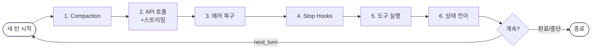
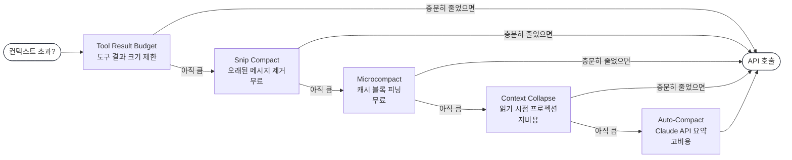
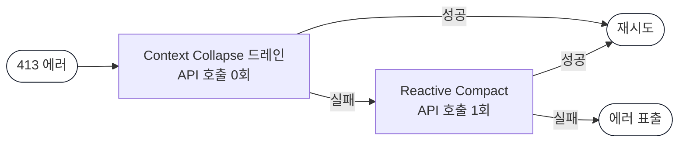
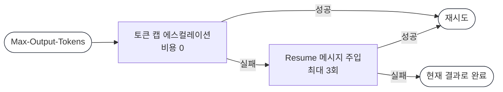
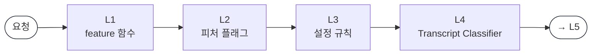
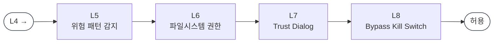
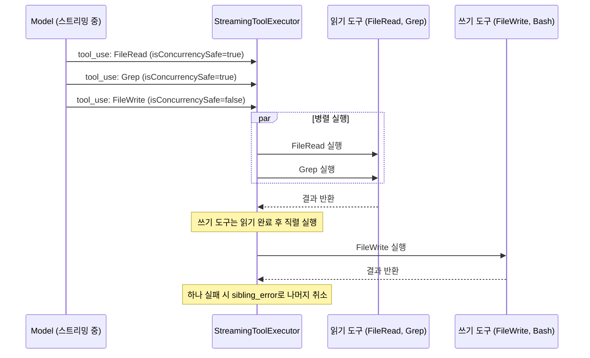
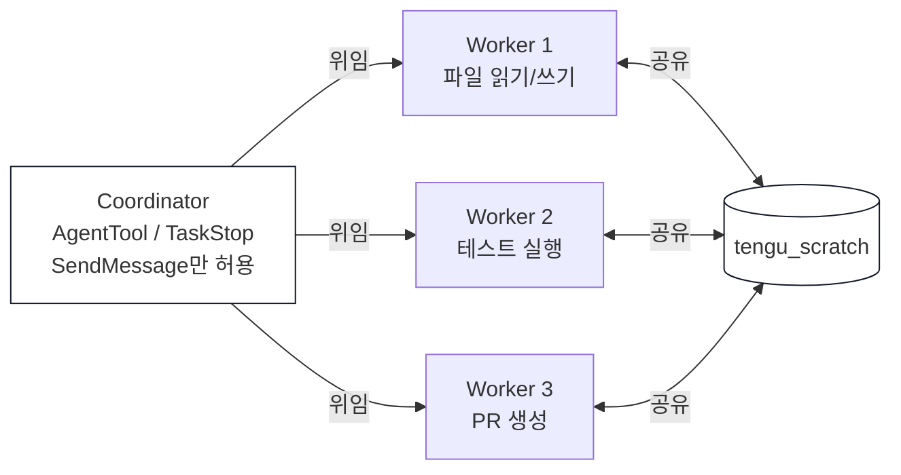
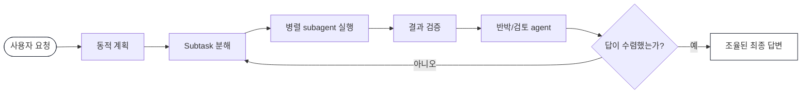
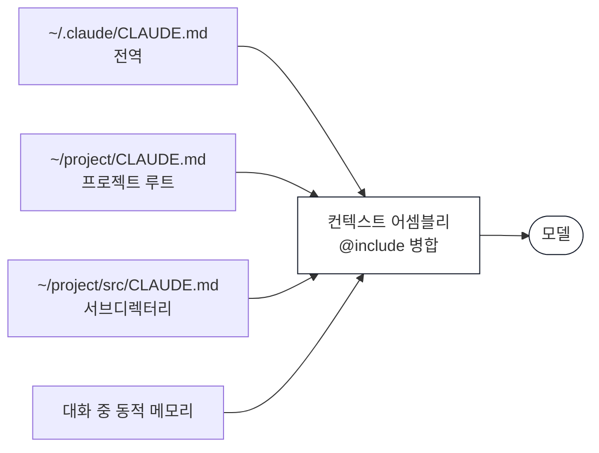

* TOC
{:toc}

# Claude Code

Anthropic이 만든 터미널 기반 에이전틱 코딩 도구. 소스맵 유출로 드러난 내부 아키텍처와, 이후 공식 발표된 Dynamic Workflows를 함께 정리한다.

> 참고 자료
> - [Learn Claude Code (9bow)](https://9bow.github.io/learn-claude-code/)
> - [Claude Code Source Map Leak Analysis](https://bits-bytes-nn.github.io/insights/agentic-ai/2026/03/31/claude-code-source-map-leak-analysis.html)
> - [claude-code-sourcemap (GitHub)](https://github.com/leeyeel/claude-code-sourcemap/tree/main)
> - [Introducing dynamic workflows in Claude Code](https://claude.com/blog/introducing-dynamic-workflows-in-claude-code)

---

## 1. 소스코드 유출 사건

### 1.1 경위

Claude Code npm 패키지 **v2.1.88** 배포 시 59.8MB의 소스맵 파일이 실수로 포함되었다. 소스맵에는 Cloudflare R2 버킷에 호스팅된 zip 파일 경로가 담겨 있었고, 그 안에 원본 TypeScript 소스가 그대로 존재했다.

보안 연구자 Chaofan Shou가 X에서 최초 공개했고, Anthropic은 "릴리즈 패키징 과정의 인적 오류(human error)"라고 공식 발표했다.

주목할 점은 이것이 첫 번째 사건이 아니라는 것이다. **2025년 2월에도 동일한 방식**으로 초기 버전의 소스가 유출된 바 있다. 8겹의 보안 레이어를 갖춘 시스템이 `.npmignore` 한 줄 누락으로 무너진 아이러니다.

### 1.2 유출 규모

| 항목 | 수치 |
|------|------|
| 노출된 파일 수 | 4,600개 이상 |
| 공식 오픈소스 저장소 파일 수 | 279개 (플러그인 인터페이스만) |
| 코드 줄 수 | 약 51만 줄 이상 |
| GitHub 포크 수 | 41,500회 이상 |

공식 저장소에는 279개 파일(플러그인 인터페이스)만 공개되어 있었지만, 핵심 엔진은 완전히 비공개 상용 코드였다. 유출로 인해 그 전체가 드러났다.

---

## 2. 기술 스택

| 항목 | 내용 |
|------|------|
| 런타임 | Bun (빠른 시작, TypeScript 네이티브) |
| UI | React 18 + Ink (터미널 UI 렌더링) |
| API | Anthropic SDK, MCP 클라이언트 |
| 번들러 | Bun의 `feature()` 함수로 빌드 타임 데드코드 제거 |

**React + Ink 조합**이 흥미롭다. 터미널 UI를 DOM처럼 선언적으로 작성할 수 있어, 복잡한 스트리밍 출력을 컴포넌트 단위로 관리한다. UI 레이어에 React 상태 관리 철학이 그대로 적용된 셈이다.

주요 진입점은 `src/entrypoints/` 디렉터리에 있으며, CLI 모드와 SDK 모드가 분리되어 있다. 핵심 루프인 `query.ts`는 두 모드에서 공통으로 사용된다.

---

## 3. 에이전틱 루프 (`query.ts`, 1,729줄)

에이전틱 루프는 Claude Code의 심장부다. 핵심 설계 선택은 **async generator 패턴**이다.

실제 `src/query.ts` 시그니처:

```typescript
// src/query.ts:124
export async function* query(
  messages: Message[],
  systemPrompt: string[],
  context: { [k: string]: string },
  canUseTool: CanUseToolFn,
  toolUseContext: ToolUseContext,
  getBinaryFeedbackResponse?: (
    m1: AssistantMessage,
    m2: AssistantMessage,
  ) => Promise<BinaryFeedbackResult>,
): AsyncGenerator<Message, void>
```

이 시그니처가 보여주는 것은:
- `yield`: 중간 이벤트(스트리밍 텍스트, 도구 호출 등)를 실시간으로 소비자에게 전달
- `return`: 루프가 끝난 이유(`Terminal` 타입 — 완료, 에러, 사용자 중단 등)를 명확히 표현
- 소비자는 `for await...of`로 자연스럽게 처리하고 에러도 자동 전파

콜백이나 EventEmitter로 같은 것을 구현하면 복잡한 상태 머신이 된다. Generator는 "중간 값을 계속 내보내면서 최종 결과도 반환한다"는 의미를 코드 구조 자체로 표현한다.

### 3.1 매 턴의 6단계 파이프라인



#### 1단계: Pre-Request Compaction (프롬프트 최적화)

API를 호출하기 전에 5개의 압축 메커니즘을 순서대로 시도한다. 순서 자체가 핵심이다 — 앞 단계에서 충분히 줄어들면 비용이 큰 뒤 단계가 발동하지 않는다.



#### 2단계: API 호출 + 스트리밍

모델이 응답을 생성하는 중에도 도구가 병렬 실행된다. 분기 기준은 `isReadOnly()`다. 실제 코드:

```typescript
// src/query.ts:178 — isReadOnly()로 병렬/직렬 분기
if (
  toolUseMessages.every(msg =>
    toolUseContext.options.tools.find(t => t.name === msg.name)?.isReadOnly(),
  )
) {
  for await (const message of runToolsConcurrently(...)) { ... }
} else {
  for await (const message of runToolsSerially(...)) { ... }
}

// src/query.ts:244 — 병렬 실행: MAX_TOOL_USE_CONCURRENCY = 10
async function* runToolsConcurrently(...): AsyncGenerator<Message, void> {
  yield* all(
    toolUseMessages.map(toolUse => runToolUse(toolUse, ...)),
    MAX_TOOL_USE_CONCURRENCY,
  )
}
```

각 도구는 `isReadOnly()`를 구현한다:

```typescript
// src/tools/FileReadTool/FileReadTool.tsx:66 — 읽기 전용
isReadOnly() { return true }

// src/tools/BashTool/BashTool.tsx:72 — 쓰기 가능
isReadOnly() { return false }
```

상태를 변경하는 도구(`FileWrite`, `Bash`)는 직렬 실행만 허용된다.

프리페치 전략도 이 단계에서 시작된다. 스킬 디스커버리나 메모리 어태치먼트 같이 6단계에서 필요할 정보를 미리 백그라운드에서 가져오기 시작한다. 블로킹 없이 진행하고 결과는 나중에 수확하는 방식이다.

#### 3단계: 에러 복구 캐스케이드

에러가 발생하면 무조건 비용이 낮은 방법부터 시도한다.

`Prompt-Too-Long(413)` 에러와 `Max-Output-Tokens` 에러의 복구 순서:

**Prompt-Too-Long (413)**:



**Max-Output-Tokens**:



첫 번째 시도는 항상 무료다. 사용자는 자동 복구가 일어나는 것을 느끼지 못한다.

#### 4단계: Stop Hooks

사용자가 정의한 검증 로직을 실행한다. 예를 들어 "테스트를 실행하고 통과하면 계속, 실패하면 에러 메시지를 대화에 다시 주입해라"는 식의 커스텀 게이트다.

**감소 수익(Diminishing Returns) 감지**:

```
연속 3회 계속했는데 매번 500 토큰 미만 생성 → "더 이상 의미 없음" → 중단
```

무한 루프 방지의 실전 전략이다. 의도적으로 설계된 조기 종료다.

#### 5단계: 도구 실행

배치 모드와 스트리밍 모드가 공존한다. 형제 도구 중 하나가 에러를 내면 나머지도 `sibling_error` 사유로 취소된다. 모델 폴백 시에는 고아 메시지에 tombstone을 생성하여 대화 일관성을 유지한다.

#### 6단계: Post-Tool — 상태 전이

`Continue Site` 패턴으로 상태를 전체 재할당한다.

```typescript
state = {
  ...state,
  messages: [...messagesForQuery, ...assistantMessages, ...toolResults],
  turnCount: nextTurnCount,
  transition: { reason: 'next_turn' }
}
```

9개의 개별 필드를 하나씩 수정하지 않고 전체 객체를 재할당한다. 이렇게 하면:
- **원자성 보장**: 9개 필드 중 일부만 업데이트된 중간 상태가 존재하지 않는다
- **전이 추적**: `transition.reason`으로 "왜 다음 턴으로 넘어갔는지"가 기록된다 — 테스트에서 메시지 내용을 파싱하지 않고도 전이 이유로 단언(assert)할 수 있다

React의 불변 상태 관리 철학이 백엔드 에이전틱 루프에까지 스며든 설계다. 6단계에서는 2단계에서 시작해 둔 프리페치 결과도 수확한다.

---

## 4. 메시지 압축: 4단계 계층

| 단계 | 비용 | 정보손실 | 핵심 특징 |
|------|------|---------|---------|
| Snip | 무료 | 높음 | 오래된 메시지 통째로 제거 |
| Microcompact | 무료 | 중간 | 캐시 블록 피닝으로 선택적 제거 |
| Context Collapse | 낮음 | 중간 | 원본 보존, 읽기 시점 프로젝션 |
| Auto-Compact | 높음 | 낮음 | Claude API로 의미 기반 전체 요약 |

### 4.1 각 단계의 설계 의도

**Snip**: 가장 단순한 전략. 오래된 내부 메시지를 통째로 제거하고 최근 컨텍스트만 유지한다. `snipTokensFreed` 메트릭이 후속 단계로 전달되어, 이미 충분히 줄었으면 추가 압축을 막는다.

**Microcompact**: 도구 결과를 선택적으로 제거하면서 프롬프트 캐싱 히트를 보존한다. 캐시된 블록의 ID를 추적하여, 이미 캐시된 내용을 지웠다가 재계산하는 불필요한 비용을 방지한다.

**Context Collapse**: 원본 메시지는 그대로 남겨두고, 축소된 뷰만 별도 저장소에 보관한다. Git의 스냅샷처럼 읽기 시점 프로젝션을 제공하면서 캐시 무효화를 피한다. "원본은 건드리지 않는다"는 원칙 덕분에 필요하면 언제든 원본으로 복구 가능하다.

**Auto-Compact**: 전체 대화 히스토리를 Claude에게 보내서 의미 기반 요약을 요청한다. API 호출이 필요하지만 핵심 정보 보존율이 가장 높다. 3회 연속 실패 시 서킷 브레이커가 작동한다.

각 계층은 **비용-정보보존 트레이드오프** 축에서 다른 지점을 차지하며, 모두 파레토 최적점이다. 중요한 것은 이 4단계가 프롬프트 캐싱 설계와 긴밀하게 얽혀 있다는 점이다. 압축할 때 캐시 히트율을 떨어뜨리면 실질적인 비용이 더 커질 수 있기 때문이다.

---

## 5. 보안: 8개 레이어

**L1 ~ L4 (빌드 · 서버 · AI 판정)**



**L5 ~ L8 (실행 단계)**



| 레이어 | 메커니즘 | 특징 |
|--------|---------|------|
| 1 | 빌드 타임 게이트 | `feature()`로 코드가 바이너리에 존재하지 않음 |
| 2 | 피처 플래그 | GrowthBook 서버 측 킬 스위치 |
| 3 | 설정 기반 규칙 | 8개 소스의 우선순위 체계 |
| 4 | Transcript Classifier | AI가 AI의 도구 사용 안전성 판정 |
| 5 | 위험 패턴 감지 | Bash 인터프리터 와일드카드 차단 |
| 6 | 파일시스템 권한 | symlink 탈출 방지, 경로 정규화 |
| 7 | Trust Dialog | 초기 실행 시 사용자 동의 |
| 8 | Bypass Kill Switch | 최후 수단, 권한 우회 모드 전체 차단 |

### 5.1 주목할 설계들

**빌드 타임 게이트**: `feature()` 함수는 런타임 플래그가 아니라 컴파일 타임에 코드를 물리적으로 제거한다. 런타임에 환경변수를 조작해도 해당 코드가 바이너리에 없으므로 활성화가 불가능하다. 보안의 가장 강한 형태다.

**Bash 권한 검사** 실제 구현 — 허용 명령어 화이트리스트:

```typescript
// src/permissions.ts:17
const SAFE_COMMANDS = new Set([
  'git status', 'git diff', 'git log', 'git branch',
  'pwd', 'tree', 'date', 'which',
])

// src/permissions.ts:25
export const bashToolCommandHasExactMatchPermission = (
  tool: Tool,
  command: string,
  allowedTools: string[],
): boolean => {
  if (SAFE_COMMANDS.has(command)) {
    return true
  }
  if (allowedTools.includes(getPermissionKey(tool, { command }, null))) {
    return true
  }
  return false
}
```

**Transcript Classifier**: "자동 모드"에서 AI가 AI의 도구 사용 안전성을 판정한다. 분류기가 판단 불가 상황에서는 거부가 아닌 **사용자 프롬프팅으로 폴백**한다. 이를 "Fail-open" 철학이라 한다 — 안전을 위해 기능을 막기보다 사용자 판단을 신뢰한다. 연속 3회 거부 시에는 폴백이 발동된다.

**Defense in Depth**: 한 레이어가 실패해도 다음 레이어가 잡는다. 레이어들이 서로 독립적이므로, 피처 플래그 서버가 다운되어도 빌드 타임 게이트가 살아있다.

---

## 6. 도구 시스템

### 6.1 병렬 실행 메커니즘

`query.ts`의 `runToolsConcurrently` / `runToolsSerially`가 모델 응답 스트림과 도구 실행을 동시에 관리한다.



`AbortReason`이 취소 사유를 추적하여 취소가 사용자 요청인지, 에러인지, 형제 도구 실패인지를 구분한다. 이 정보는 `tengu_tool_use_cancelled` 이벤트로 기록된다.

### 6.2 도구 정렬과 프롬프트 캐싱

도구 목록을 프롬프트에 포함할 때 순서가 중요하다. 빌트인 도구와 MCP 도구를 각각 따로 정렬한 뒤 이어 붙인다. MCP 서버를 추가하거나 제거해도 빌트인 도구 목록의 순서가 바뀌지 않아 프롬프트 캐시가 무효화되지 않는다. 사소해 보이지만 실제 비용에 직결되는 최적화다.

유출된 소스의 도구 목록 (`src/tools/` 디렉터리):

```
AgentTool      ArchitectTool   BashTool       FileEditTool
FileReadTool   FileWriteTool   GlobTool       GrepTool
MCPTool        MemoryReadTool  MemoryWriteTool NotebookEditTool
NotebookReadTool  StickerRequestTool  ThinkTool  lsTool
```

`StickerRequestTool`과 `ThinkTool`의 존재가 눈에 띈다. `ThinkTool`은 모델이 명시적으로 "생각"을 도구 호출로 수행하게 하는 설계다.

---

## 7. 미출시 기능 (피처 플래그 뒤)

### 7.1 Voice Mode

OAuth 전용(Claude.ai 계정 필요)으로, API 키나 Bedrock/Vertex로는 사용이 불가하다. `tengu_amber_quartz_disabled` 킬 스위치로 즉시 비활성화 가능하다. 음성 인터페이스를 계정 기반으로만 제공하는 것은 사용량 추적과 안전 정책 적용을 위한 선택으로 보인다.

### 7.2 Web Browser Tool

실제 JavaScript 렌더링을 포함한 자동화 도구다. Computer Use의 CLI 버전에 해당한다. 현재 Bash 도구로 처리하는 웹 관련 작업을 브라우저 수준에서 처리할 수 있게 된다.

### 7.3 Coordinator Mode

메타 오케스트레이터가 워커 에이전트를 관리하는 구조다. Coordinator는 직접 도구를 실행하지 않는다. `AgentTool`, `TaskStop`, `SendMessage`만 허용된다.



**최소 권한 원칙(Least Privilege)**의 극단적 적용이다. 오케스트레이터에게 실행 권한을 주지 않고 위임만 허용한다. 권한이 없으면 실수로 파괴적인 작업을 직접 실행하는 사고를 원천 차단한다.

### 7.4 Kairos (선제적 모드)

기존 Claude Code가 사용자의 명령을 기다리는 반응형이라면, Kairos는 독립적으로 작동하는 선제적 모드다.

- `SleepTool`: 다음 이벤트까지 백그라운드 대기
- `SubscribePRTool`: GitHub PR 웹훅을 구독
- `PushNotificationTool`: 모바일 알림 전송

사용자 세션이 없어도 Claude가 PR을 모니터링하고, 지정된 조건이 충족되면 자율적으로 작업을 시작한다. 지금의 "Claude에게 시키는" 패러다임에서 "Claude가 알아서 하는" 패러다임으로의 전환점이다.

### 7.5 ArchitectTool

도구 목록(`src/tools/ArchitectTool`)에 존재하지만 일반 사용자에게는 노출되지 않는 설계 전용 도구다. 코드 작성 대신 시스템 설계와 계획 수립에 특화된 것으로 보인다. Claude Code가 단순 코딩 보조를 넘어 아키텍처 설계 에이전트로 확장되는 방향을 시사한다.

### 7.6 Bridge (원격 제어)

33개 파일로 구성된 원격 제어 시스템이다.

- **Git worktree 격리**: 각 세션이 독립된 worktree에서 실행되어 세션 간 상태 오염을 방지
- **2티어 인증**: Standard / Elevated 권한으로 작업의 민감도에 따라 차등 보안 적용
- **claude.ai 웹 → 로컬 머신 제어**: 웹 인터페이스에서 로컬 환경을 원격으로 조작

모바일이나 다른 기기에서 로컬 개발 환경을 통제하는 유스케이스를 노린 것으로 보인다.

---

## 8. Dynamic Workflows

> 레퍼런스 문서
> - 원문: [Introducing dynamic workflows in Claude Code](https://claude.com/blog/introducing-dynamic-workflows-in-claude-code)
> - 발행: 2026-05-28, Anthropic Product announcements
> - 주제: Claude Code가 하나의 세션 안에서 수십~수백 개의 병렬 subagent를 실행하고, 결과를 사용자에게 전달하기 전에 자체 검증하는 workflow 기능

2026년 5월 28일 Anthropic은 Claude Code에 **Dynamic Workflows**를 도입했다. 목적은 Claude가 어려운 작업을 끝까지 처리할 수 있게 하는 것이다. 보통 분기 단위로 계획하던 작업을 며칠 안에 끝내는 것을 목표로 하며, Claude는 한 세션 안에서 오케스트레이션 스크립트를 동적으로 작성하고 수십~수백 개의 병렬 subagent를 실행한다. 결과가 사용자에게 도달하기 전에는 Claude가 먼저 자기 작업을 검토한다.

단일 agent가 한 번에 처리하기에는 너무 큰 문제가 있다. 복잡한 legacy codebase 전체에서 버그를 찾는 일, 수백 개 파일에 걸친 migration, 실행하기 전에 여러 각도에서 검증받고 싶은 계획이 여기에 해당한다. Dynamic Workflows는 이런 작업을 end-to-end로 처리하기 위해 만들어졌다.

### 8.1 제공 범위

출시 시점의 상태는 **research preview**다.

| 항목 | 내용 |
|------|------|
| 제품 | Claude Code CLI, Desktop, VS Code extension |
| 플랜 | Max, Team, Enterprise(admin enabled) |
| API 경로 | Claude API, Amazon Bedrock, Vertex AI, Microsoft Foundry |
| 기본값 | Max/Team/API는 기본 활성화, Enterprise는 출시 시점 기본 비활성화 |

Dynamic Workflows는 일반 Claude Code 세션보다 훨씬 많은 token을 사용할 수 있다. Anthropic은 처음부터 큰 범위를 맡기기보다, 먼저 좁은 task로 사용량 감각을 잡으라고 권한다.

가장 좋은 사용 경험을 위해서는 auto mode를 켜는 것이 권장된다. workflow를 시작하는 방법은 두 가지다.

1. Claude에게 직접 dynamic workflow를 만들라고 요청한다. 예: `Create a workflow`
2. Claude Code 전용 설정인 `ultracode`를 켠다. 이 설정은 effort level을 `xhigh`로 올리고, Claude가 task에 workflow가 필요한지 자동 판단하게 한다.

첫 workflow 실행 시 Claude Code는 앞으로 무엇을 실행할지 보여주고 사용자 확인을 요청한다. 조직 관리자는 managed settings를 통해 workflow를 비활성화할 수 있다.

### 8.2 Dynamic Workflows가 겨냥하는 작업

초기 사용자와 Anthropic 내부 팀은 다음 유형의 작업에 Dynamic Workflows를 사용했다.

| 유형 | 원문이 강조한 방식 |
|------|--------------------|
| 코드베이스 전역 버그 헌트 | service/repo를 병렬로 검색하고, 각 발견 사항을 독립 검증한 뒤 실제 이슈만 보고 |
| profiler 기반 최적화 감사 | 성능 병목을 여러 영역으로 나눠 병렬 조사 |
| 보안 감사 | auth check, input validation, unsafe pattern을 codebase 전체에서 점검 |
| 대규모 migration/modernization | framework 교체, API deprecation 대응, 언어 포팅처럼 수천 파일에 걸친 변경 처리 |
| 두 번 확인해야 하는 중요 작업 | 독립 시도와 adversarial agent를 통해 결과를 깨뜨려 본 뒤 사용자에게 전달 |

원문의 핵심은 병렬성 자체보다 **검증 구조**다. Claude는 문제를 여러 독립 각도에서 풀고, 다른 agent가 그 결과를 반박하게 하며, 답이 수렴할 때까지 반복한다. 그래서 단일 pass로는 도달하기 어려운 결과를 노린다.

### 8.3 작동 방식

workflow가 시작되면 Claude는 prompt를 바탕으로 동적으로 계획을 세운다. 그 다음 작업을 subtask로 쪼개고, 병렬 subagent에게 fan-out한다. 각 결과는 바로 합쳐지지 않고 먼저 검증된다. 사용자는 마지막에 하나의 조율된 답을 받는다.



Dynamic Workflows는 hours~days 단위로 이어지는 병렬·장기 작업을 전제로 한다. 실행 중 progress가 저장되므로 중단된 job은 처음부터 다시 시작하지 않고 이어서 진행할 수 있다. 또 coordination은 대화 바깥에서 일어나므로, task가 커져도 plan이 대화 컨텍스트에 묻혀 흐트러지는 문제를 줄인다.

이 구조는 앞서 유출 소스에서 보였던 `Coordinator Mode`, `AgentTool`, `TaskStop`, `SendMessage`, `tengu_scratch`류의 흔적과 방향이 맞다. 당시에는 feature flag 뒤에 있던 미출시 구조가, 공식적으로는 Dynamic Workflows라는 제품 기능으로 드러난 셈이다.

### 8.4 Bun rewrite 사례

원문이 제시한 대표 사례는 Jarred Sumner의 Bun rewrite다. Dynamic Workflows를 사용해 Bun을 Zig에서 Rust로 porting했다.

| 항목 | 내용 |
|------|------|
| 작업 | Bun을 Zig에서 Rust로 porting |
| 테스트 | 기존 test suite 99.8% 통과 |
| 규모 | 약 750,000 lines of Rust |
| 기간 | 첫 commit부터 merge까지 11일 |
| 첫 workflow | Zig codebase의 각 struct field에 적절한 Rust lifetime 매핑 |
| 다음 workflow | 각 `.zig` 파일에 대응하는 behavior-identical `.rs` 파일 작성 |
| 검토 방식 | 수백 개 agent가 병렬 작업하고, 각 파일에 reviewer 2개를 붙임 |
| 수습 loop | build/test suite가 깨끗하게 통과할 때까지 fix loop 실행 |
| 후속 작업 | merge 후 overnight workflow로 불필요한 data copy를 찾아 PR 생성 |

이 사례에서 중요한 점은 “생성”만 한 것이 아니라는 점이다. workflow는 파일 단위 구현자와 reviewer를 함께 배치했고, build/test loop로 결과를 계속 수렴시켰다. 즉 Dynamic Workflows는 대규모 작업을 병렬로 흩뿌리는 기능이라기보다, **생산·검토·수정 loop를 묶은 임시 agent 조직**에 가깝다.

단, 원문은 이 Bun rewrite가 아직 production에는 적용되지 않았다고 밝힌다. 따라서 이 사례는 가능성을 보여주는 강한 데모이지, 운영 안정성까지 완전히 입증한 사례는 아니다.

### 8.5 해석

Dynamic Workflows는 Claude Code를 “터미널에서 명령을 수행하는 단일 coding agent”에서 **작업을 분해하고, 여러 agent를 실행하고, 검증 결과를 수렴시키는 실행 플랫폼**으로 확장한다.

실무에서 바로 쓸 만한 영역은 단순 기능 구현보다 다음에 가깝다.

- 넓은 codebase에서 놓친 문제를 찾는 discovery
- security/performance audit처럼 독립 검증이 중요한 작업
- 대규모 migration처럼 파일 수가 많고 반복 패턴이 있는 작업
- 중요한 계획을 여러 관점에서 반박해 보는 review

적용할 때는 범위와 검증 기준을 먼저 좁혀야 한다. repo 전체를 한 번에 맡기기보다 module/service 단위로 시작하고, tests/lint/typecheck/benchmark처럼 기계적으로 판정 가능한 완료 조건을 명시해야 한다. long-running workflow에는 token budget과 시간 상한이 필요하며, deploy·credential 접근·destructive command는 auto mode에서도 별도 승인 대상으로 남겨두는 편이 안전하다.

---

## 9. 메모리 시스템

CLAUDE.md 파일을 4계층 구조로 관리한다:



`@include` 지시자로 파일을 포함할 수 있고, 컨텍스트 어셈블리 단계에서 이 4계층이 병합된다. `Auto-Compact` 압축이 일어난 뒤에도 CLAUDE.md 기반 메모리는 보존된다.

---

## 10. 아키텍처 관통 원칙

유출된 소스에서 드러난 가장 중요한 설계 철학은 하나다: **비용 인식(Cost Awareness)**.

- 에러 복구는 항상 무료 옵션부터
- 프리페치는 비블로킹 백그라운드에서
- 도구 정렬로 프롬프트 캐시 히트 최적화
- 트랜스크립트 저장은 사용자 메시지만 블로킹, 어시스턴트 메시지는 fire-and-forget
- 압축 단계마다 "얼마나 줄였는가"를 다음 단계로 전달해 중복 비용 방지

이는 단순한 기술적 우아함이 아니다. API 호출 한 번이 곧 비용인 LLM 시스템에서 비용 인식은 **경제적 생존 전략**이다. 아키텍처의 모든 결정이 이 원칙으로 수렴한다.

---

## 11. 교훈

8겹의 보안 레이어, 정교한 압축 시스템, 비용 인식 아키텍처를 갖췄음에도, `source map을 .npmignore에 추가`하는 기초적인 빌드 프로세스 체크리스트를 두 번 연속 놓쳤다.

이것이 소프트웨어 공학의 본질이다. **시스템의 정교함과 운영 실수는 서로 다른 축에 있다.** 복잡한 보안 아키텍처는 의도적인 공격을 막지만, 인간의 단순 실수를 막지는 못한다.

구체적으로, 아래 중 하나만 있었어도 막을 수 있었다:

- **`npm pack --dry-run`을 CI에서 실행** — 실제 배포될 파일 목록을 미리 출력해 소스맵 포함 여부를 확인할 수 있다
- **번들 파일 크기 임계값 검사** — 정상 배포 크기(수 MB)를 벗어나면 빌드를 실패시키는 단순 스크립트
- **`.npmignore` 변경 시 리뷰 필수 정책** — 패키징 규칙은 별도 승인 없이 수정할 수 없도록 브랜치 보호 규칙 추가

빌드 파이프라인의 자동화된 검증이 왜 중요한지를 보여주는 사례다.
