* TOC
{:toc}

# COSMOS(homelab)

COSMOS는 프로젝트와 서비스가 태어나고 연결되는 개인 인프라다. Mac mini 위에서 SRE 운영을 연습하고 사이드 프로젝트를 배포하며, 새 도구를 부담 없이 시험한다.
NAS나 미디어 서버를 대체하려는 구성은 아니다.

관련 문서: [[kubernetes]]

---

## 1. 스택

| 계층 | 도구 | 메모 |
|---|---|---|
| 컨테이너 런타임 | OrbStack | Apple Silicon 네이티브, 개인 무료 |
| 로컬 Kubernetes | k3d | k3s를 도커 컨테이너로 띄워 멀티노드 시뮬레이션 |
| IaC (플랫폼) | Terraform | 플랫폼 컴포넌트 코드화 |
| GitOps (앱) | ArgoCD | App-of-Apps 패턴 |
| 원격 접속 | Tailscale | NAT 관통 |
| 관측성 | Prometheus + Grafana + Loki + Alloy | 메트릭 / 시각화 / 로그 수집·조회 |
| 시크릿 | sops + age | git 저장소에 암호화 보관 |

---

## 2. 외부 접속 토폴로지

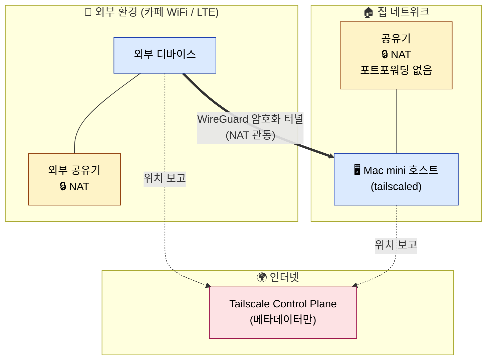

### 2.1 NAT의 동작

홈 공유기는 NAT(Network Address Translation), 라우터, 기본 방화벽 역할을 동시에 수행한다.
사설 IP(`192.168.x.x`)는 외부에서 직접 보이지 않는다. 외부에서 들어오는 패킷은 공유기가 라우팅 대상을 모르므로 폐기한다.
별도 방화벽 설정 없이도 인바운드 트래픽은 기본적으로 차단된다.

포트포워딩을 설정하면 특정 외부 포트를 내부 장치로 전달하는 규칙이 생긴다.

### 2.2 Tailscale의 NAT 관통

1. STUN 서버를 통해 두 장치가 자신의 외부 IP와 포트를 확인한다.
2. 두 장치가 동시에 패킷을 보내면 NAT가 기존 연결의 응답으로 인식해 통과시킨다 (hole punching).
3. 이후 WireGuard 암호화 P2P 터널로 직접 통신한다.
4. 관통이 실패하면 DERP 릴레이 서버가 트래픽을 중계한다.

Tailscale Control Plane은 장치의 접속 정보만 처리한다. 실제 데이터는 두 장치 사이의 터널로 흐른다.

---

## 3. 호스트 계층

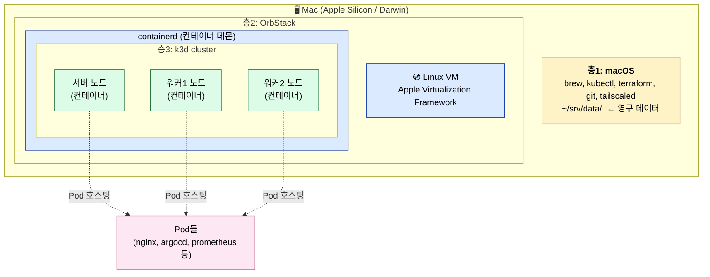

### 3.1 층1: macOS

CLI 도구(brew, kubectl, terraform, git), Tailscale 데몬이 실행된다.
영구 데이터 위치는 `~/srv/data/`로 고정한다.

### 3.2 층2: OrbStack

컨테이너는 리눅스 커널의 기능(namespaces + cgroups + chroot)이며, 리눅스 커널 없이 존재할 수 없다.
macOS는 Darwin 커널을 사용하므로 컨테이너를 직접 실행할 수 없다.

OrbStack은 Apple Virtualization Framework로 리눅스 VM을 한 대 띄우고 그 안에서 containerd를 실행한다. macOS 위에 컨테이너를 실행할 리눅스 환경을 마련하는 역할이다.

### 3.3 층3: k3d 클러스터

k3d는 k3s(경량 Kubernetes 배포판)를 도커 컨테이너로 실행하는 도구다.
각 "노드"는 OrbStack VM 안의 도커 컨테이너이며, 그 컨테이너 안에서 k3s 바이너리가 실행된다.
Pod는 그 안에서 다시 컨테이너로 실행된다.

```bash
docker ps
# k3d-cosmos-server-0   ← 노드 (컨테이너)
# k3d-cosmos-agent-0    ← 노드 (컨테이너)
# k3d-cosmos-agent-1    ← 노드 (컨테이너)

kubectl get pods -A
# 위 노드 컨테이너 안에서 실행되는 Pod들
```

---

## 4. 클러스터 구조

### 4.1 노드

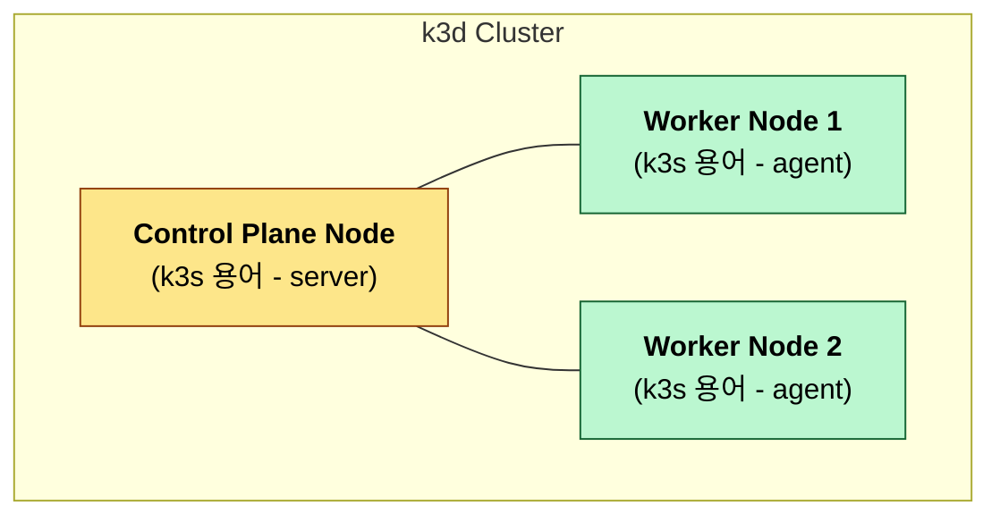

| 종류 | k3s 용어 | 역할 |
|---|---|---|
| Control Plane | server | 클러스터 상태 관리, 변경 권한 |
| Worker | agent | Pod 실제 실행 |

Control Plane이 멈추면 새 Pod 배치, 자동 복구, kubectl 같은 클러스터 변경 작업도 멈춘다. 이미 실행 중인 Pod의 트래픽은 워커가 계속 처리한다.

운영 환경에서는 etcd의 raft 합의를 위해 Control Plane을 홀수(3, 5, 7…)로 둔다.

### 4.2 컨트롤 플레인 컴포넌트

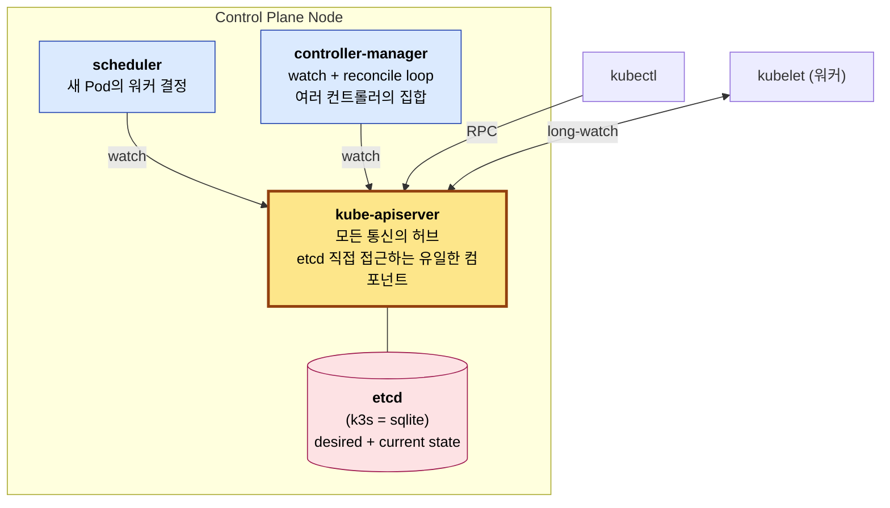

| 컴포넌트 | 역할 |
|---|---|
| kube-apiserver | 모든 통신의 진입점. etcd에 직접 접근하는 유일한 컴포넌트 |
| etcd (k3s = SQLite) | 클러스터의 desired state + current state 저장소 |
| scheduler | 새 Pod이 어느 워커에 배치될지 결정 |
| controller-manager | deployment, replicaset, node, endpoint 등 여러 컨트롤러의 집합. desired state를 watch해 reconcile |

모든 컴포넌트는 apiserver를 경유해 통신한다. 컴포넌트 간 직접 호출은 없다.

### 4.3 kubectl apply 처리 흐름

`kubectl apply -f deployment.yaml` 실행 시 일어나는 일:

1. kubectl → apiserver: deployment 등록 요청
2. apiserver → etcd: deployment 객체 저장
3. controller-manager의 deployment-controller가 watch로 감지 → ReplicaSet 생성 요청
4. controller-manager의 replicaset-controller가 watch로 감지 → Pod 객체 N개 생성 (nodeName 미지정)
5. scheduler가 nodeName 미지정 Pod 발견 → 워커 결정 후 nodeName 필드 채움
6. 각 워커의 kubelet이 자기 노드에 할당된 Pod을 watch로 받음 → 컨테이너 런타임에 생성 명령
7. Pod 실행 후 status를 apiserver에 보고

각 컴포넌트는 apiserver의 변경을 감지하고 맡은 작업을 수행한 뒤 결과를 다시 기록한다. 이 흐름이 Kubernetes의 선언적 reconcile loop다.

### 4.4 워커 컴포넌트

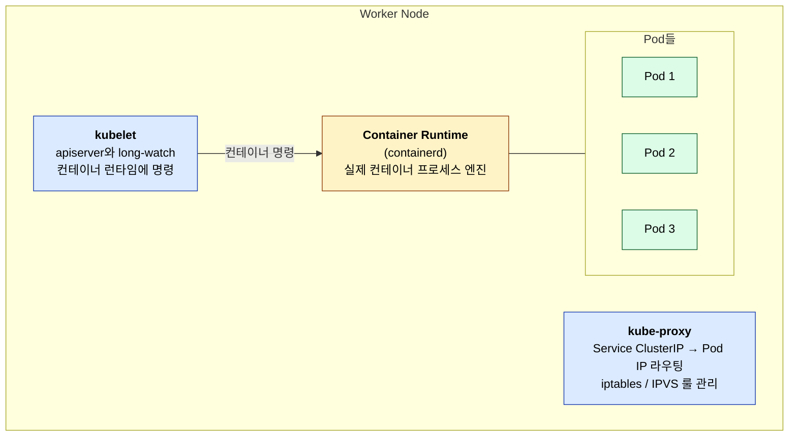

| 컴포넌트 | 역할 |
|---|---|
| kubelet | apiserver와 long-lived watch 연결. 자기 노드에 할당된 Pod을 컨테이너 런타임에 명령 |
| kube-proxy | Service ClusterIP → 실제 Pod IP 라우팅. iptables 또는 IPVS 룰 관리 |
| Container Runtime (containerd) | 실제 컨테이너 프로세스 실행 |

kubelet은 scheduler나 controller-manager와 직접 통신하지 않는다. 모든 상호작용은 apiserver를 통해 이루어진다.

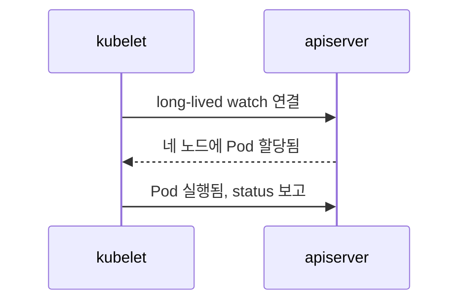

### 4.5 네임스페이스

네임스페이스는 논리적 라벨이다. 노드를 물리적으로 나누지 않는다.
같은 워커 노드에 여러 네임스페이스의 Pod이 함께 실행된다.

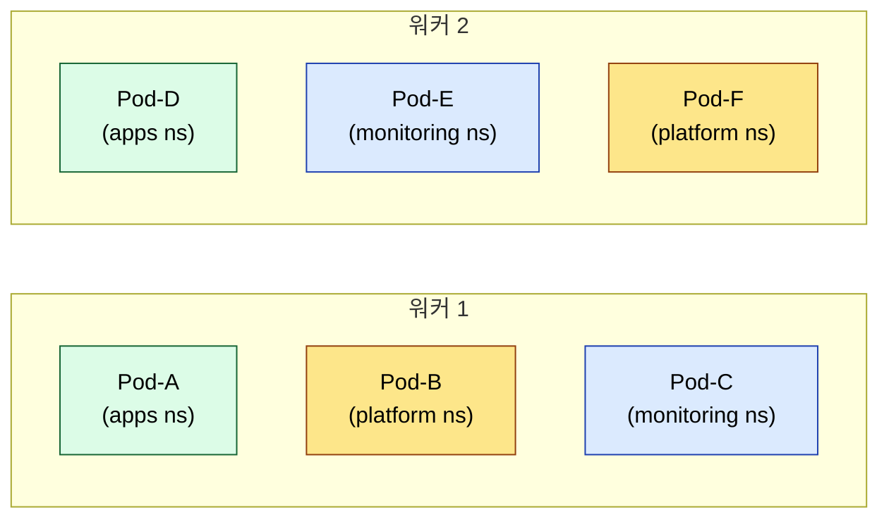

용도:

- **격리**: RBAC, 리소스 쿼터, NetworkPolicy의 단위
- **이름 충돌 방지**: 다른 네임스페이스에 같은 이름의 리소스가 공존 가능 (`apps/nginx`, `monitoring/nginx`)
- **삭제 단위**: `kubectl delete namespace foo` → 네임스페이스 안의 모든 리소스 일괄 삭제
- **시야 분리**: `kubectl get pods`는 현재 네임스페이스만 표시

Service와의 차이:

- Service: Pod 라우팅 (가상 IP, DNS, 변경되는 Pod IP를 추상화)
- Namespace: Pod 그룹화 (조직, 권한, 격리)

### 4.6 datastore 장애 영향

| 데이터 상태 | 결과 |
|---|---|
| 데이터 파일 무사 (k3s `state.db`) | 자동 재시작 → 정상 복귀 |
| 데이터 파일 소실 | 선언된 클러스터 상태가 사라져 새 클러스터처럼 됨 |
| 백업 존재 | 백업 시점으로 복구 |

datastore 장애 시 영향:

- 이미 실행 중인 Pod: 워커에서 계속 실행
- kubectl 명령: 실패
- scheduler / controller-manager: watch 중단
- 신규 배포 / 자동 복구: 동작하지 않음

---

## 5. 배포 책임

### 5.1 구성 순서

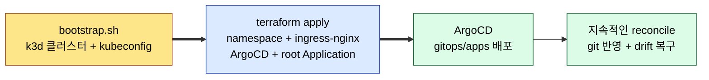

### 5.2 책임 경계

- bootstrap은 k3d 클러스터와 kubeconfig를 만든다.
- Terraform은 kubeconfig를 받아 namespace, ingress-nginx, ArgoCD와 root Application을 설치한다.
- ArgoCD는 `gitops/apps/`의 Application을 배포하고 git과 다른 상태를 되돌린다.

### 5.3 App-of-Apps 패턴

Terraform은 ArgoCD와 root Application까지만 설치한다. root Application은 `gitops/apps/` 아래의 Application을 읽어 실제 앱을 배포한다.

```
cosmos/gitops/
├── apps/
│   ├── podinfo.yaml
│   ├── kube-prometheus-stack.yaml
│   ├── loki.yaml
│   └── alloy.yaml
└── projects/
```

Terraform과 ArgoCD의 책임은 나뉘어 있다.

- Terraform: ArgoCD 최초 설치 + root-app 등록까지
- ArgoCD: `gitops/apps/`에 선언된 앱 배포와 상태 복구
- Terraform 재실행: 클러스터를 다시 만들거나 플랫폼 구성을 바꿀 때

---

## 6. 트래픽 종류

클러스터 안의 트래픽은 사용자, GitOps, 관측 경로로 나눠 볼 수 있다.

### 6.1 사용자 트래픽

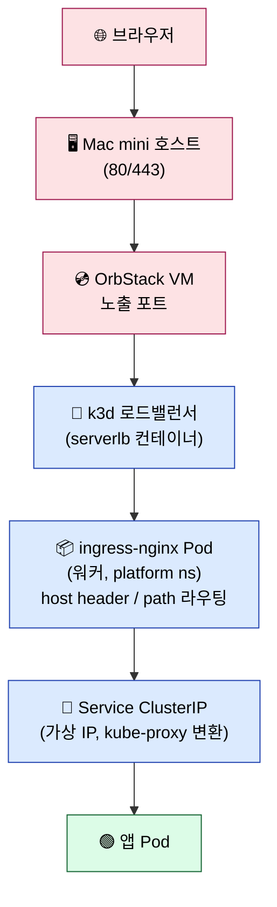

사용자 트래픽은 apiserver를 거치지 않고 data plane으로 흐른다.

### 6.2 GitOps 트래픽

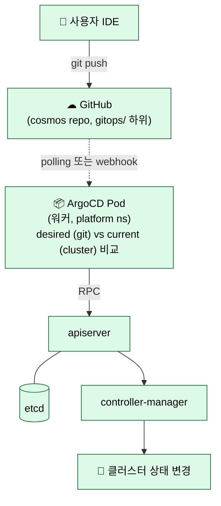

ArgoCD는 git을 3분마다 확인한다. GitHub webhook도 함께 사용해 push 직후 동기화를 시작하며, polling은 webhook이 실패했을 때를 대비한 안전망으로 남긴다.

ArgoCD는 일반 Kubernetes client처럼 apiserver를 호출하며 etcd에는 직접 접근하지 않는다.
GitOps 트래픽은 control plane 트래픽으로 분류된다.

### 6.3 관측 트래픽

Prometheus, Grafana, Alertmanager, exporter, Loki, Alloy는 `monitoring` 네임스페이스에서 실행된다.

#### 메트릭 (Prometheus, pull 방식)

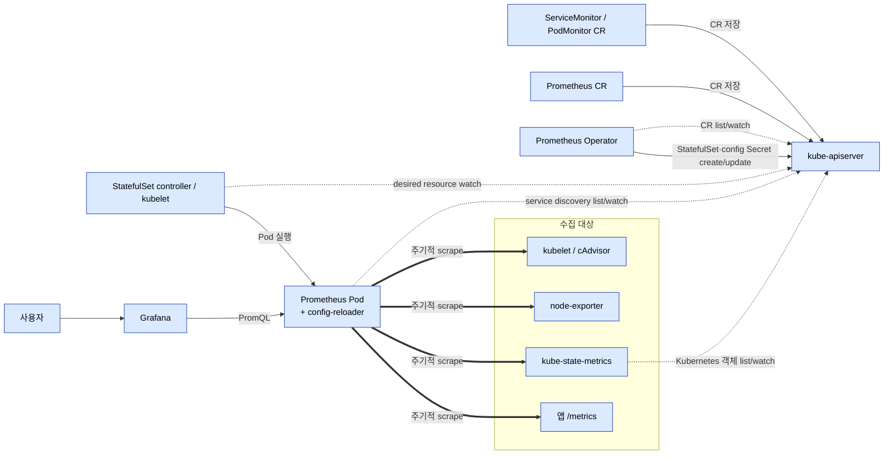

Prometheus Operator는 `Prometheus`, `ServiceMonitor`, `PodMonitor` 리소스를 보고 StatefulSet과 수집 설정을 만든다. Prometheus는 apiserver에서 수집 대상을 찾은 뒤 각 exporter와 앱의 `/metrics`를 직접 읽는다. Grafana는 PromQL로 Prometheus를 조회하며 메트릭을 따로 저장하지 않는다.

#### 로그 (Alloy → Loki, push 방식)

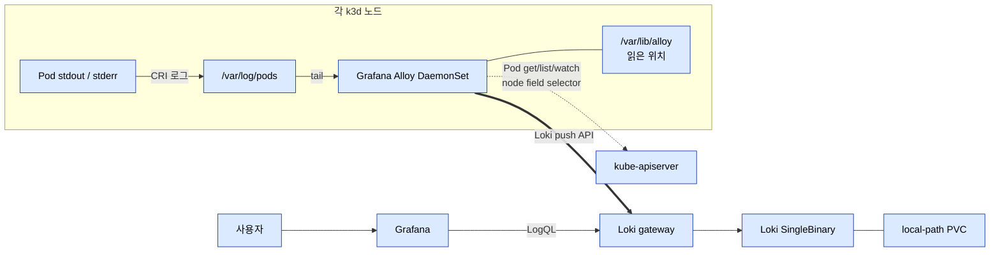

Alloy는 각 노드의 Pod 로그를 읽어 Loki로 보낸다. `spec.nodeName`으로 자기 노드의 Pod만 찾고, 읽은 위치는 `/var/lib/alloy`에 보관한다. 로그에는 `namespace`, `pod`, `container`, `node`, `job`, `cluster` 라벨이 붙는다. Promtail은 지원이 끝났기 때문에 사용하지 않는다.

### 6.4 경로 비교

| 트래픽 | apiserver 경유 | 경로 |
|---|---|---|
| 사용자 | 아니오 | data plane (ingress → service → pod) |
| GitOps | 예 | control plane (ArgoCD → apiserver → etcd) |
| 관측 | 메타데이터 조회만 | data plane + apiserver (타겟 목록) |

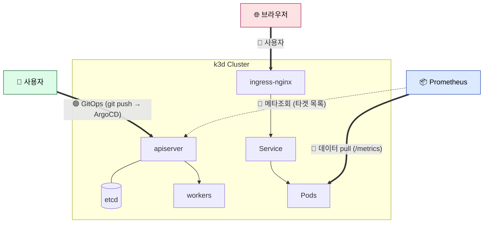

### 6.5 관측성 배포 구조

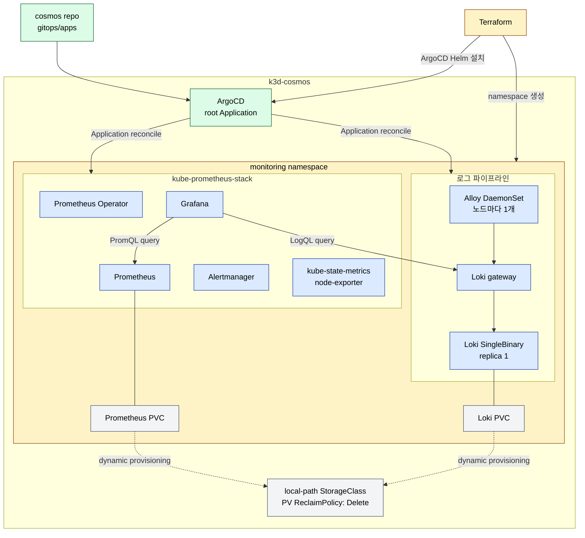

관측성 스택의 Helm chart 버전은 다음과 같다.

| 역할 | Chart | Chart 버전 | App 버전 | 배포 형태 |
|---|---|---:|---:|---|
| 메트릭·대시보드·알림 | `kube-prometheus-stack` | `87.17.0` | `v0.92.1` | Prometheus/Grafana/Operator/Alertmanager |
| 로그 저장·조회 | `loki` | `7.1.0` | `3.6.8` | SingleBinary 1 replica |
| 노드 로그 수집 | `alloy` | `1.10.1` | `v1.17.1` | DaemonSet 3 replicas |

Prometheus와 Loki는 각각 5Gi PVC를 쓴다. Grafana의 Prometheus·Loki 데이터 소스는 배포할 때 자동으로 등록된다.

Grafana는 `http://cosmos.tail511b20.ts.net/grafana`에서 연다. `COSMOS Overview`에는 노드와 Pod 상태, 리소스 사용량, 알림, 최근 로그가 모여 있다. 시간대는 `Asia/Seoul`, 새로 고침 주기는 30초다. 메트릭 수집 경로는 하위 경로에 맞춰 `/grafana/metrics`로 지정했다.

Alloy에는 Pod 조회 권한만 준다. Loki는 사용하지 않는 rules sidecar와 서비스 계정 토큰 마운트를 끈다. Grafana Pod는 `monitoring` 네임스페이스의 ConfigMap을 읽을 수 있지만 Secret은 읽을 수 없다.

Loki는 로그를 7일 보관하고, 만료된 데이터는 compactor가 비동기로 지운다. StatefulSet을 축소하거나 삭제해도 PVC는 남는다. 다만 PVC를 직접 삭제하면 `local-path` PV의 `Delete` 정책에 따라 데이터도 지워진다. 이 저장소는 클러스터 삭제나 호스트 장애를 견디는 백업이 아니다.

Prometheus·Loki·Grafana와 Alloy Pod를 교체해도 컨트롤러가 새 Pod를 만들고 기존 PVC를 다시 연결한다. 이 과정에서 재시작 전 메트릭과 로그가 유지되고 Alloy의 신규 로그 수집도 재개되는 것을 확인했다. ArgoCD가 관리하는 Deployment의 replica 수를 Git 선언과 다르게 바꾸면 self-heal이 선언된 값으로 되돌린다.

공유기 포트포워딩은 열지 않고 Tailscale MagicDNS로 접속한다. MagicDNS는 접근할 이름을 제공할 뿐, ingress의 출발지 제한까지 보장하지는 않는다. k3d가 호스트의 80/443을 열기 때문에 엄격한 접근 제한에는 별도의 호스트 바인딩이나 방화벽 설정이 필요하다.

k3s는 scheduler와 controller-manager를 별도 Pod가 아닌 단일 서버 프로세스에 포함하며, 현재 단일 server 구성의 datastore는 SQLite다. 따라서 etcd monitor는 비활성화하고, 표준 배포처럼 독립된 in-cluster scrape endpoint가 노출되지 않는 scheduler/controller-manager monitor도 비활성화해 거짓 장애 신호를 막는다.

---

## 7. 리포지토리 구조

Terraform 영역과 ArgoCD가 감시하는 영역을 한 저장소 안에서 디렉토리로 나눈다.

```
cosmos/
├── infra/                    # Terraform 영역 (ArgoCD watch ❌)
│   ├── bootstrap/
│   │   ├── install.sh
│   │   └── restore-secrets.sh
│   ├── secrets/              # sops 암호문
│   ├── terraform/
│   │   ├── modules/
│   │   └── envs/local/
├── gitops/                   # ArgoCD watch 영역
│   ├── apps/                 # podinfo, prometheus-stack, loki, alloy
│   └── projects/
└── docs/
    ├── remote-access.md
    ├── secrets.md
    └── decisions/
```

ArgoCD는 `gitops/apps`만 감시한다. `infra/`의 Terraform 상태나 bootstrap 스크립트 변경은 자동 배포 대상이 아니다.

`infra/terraform/` 하위의 state 파일은 `.gitignore`로 보호한다.

```
infra/terraform/**/.terraform/
infra/terraform/**/*.tfstate
infra/terraform/**/*.tfstate.backup
```

---

## 8. 운영

### 8.1 백업 우선순위

| 우선순위 | 대상 | 위치 | 잃었을 때 영향 |
|---|---|---|---|
| 1 | age 개인키 | `~/srv/secrets/age/keys.txt` | Git에 저장한 Secret 암호문을 복호화할 수 없음 |
| 2 | terraform.tfstate | 로컬 파일 | Terraform이 기존 리소스를 인식하지 못해 중복 생성이나 충돌이 발생할 수 있음 |
| 3 | 클러스터 datastore | k3s SQLite (`state.db`) | 현재 클러스터의 desired state 소실 |
| 4 | 영구 데이터 | `~/srv/data/<app>/` | stateful 앱 데이터 손실 |
| 자동 | git repo | GitHub | (GitHub이 보존) |

### 8.2 호스트 이전 절차

새 호스트에는 다음 네 항목을 옮긴다.

1. cosmos repo (GitHub clone)
2. terraform.tfstate (로컬 파일, 직접 옮김)
3. ~/srv/data/ (rsync)
4. ~/srv/secrets/age/keys.txt

새 호스트에서 실행:

```bash
brew install orbstack k3d kubectl helm terraform sops age tailscale
git clone github.com/currenjin/cosmos
# tfstate, ~/srv/data, sops key 옮기기
cd cosmos && ./infra/bootstrap/install.sh   # 빈 k3d 클러스터 생성
cd infra/terraform/envs/local && terraform apply  # platform 다시 설치
cd ../../../.. && ./infra/bootstrap/restore-secrets.sh  # ArgoCD repo credential 복원
# ArgoCD가 root-app을 sync해 모든 앱 자동 복원
```

Terraform이 root Application을 먼저 만들기 때문에 repository credential 복원 전에는 일시적으로 sync가 실패할 수 있다. Secret 복원 후 ArgoCD가 재시도하며, `root`와 하위 Application이 `Synced / Healthy`인지 확인한다.

### 8.3 디버깅 진입점

| 증상 | 점검 위치 |
|---|---|
| 외부에서 앱 접속 안 됨 | Tailscale 연결 → ingress-nginx Pod 상태 → Service endpoints → 앱 Pod |
| kubectl 명령 실패 | apiserver 상태 → k3s datastore (`state.db`) 정상성 |
| git push했는데 배포 안 됨 | ArgoCD가 git 변경을 감지했는지 (polling/webhook) → root-app sync 상태 → application Pod |
| 메트릭 빈 칸 | Prometheus의 ServiceMonitor/PodMonitor → /metrics 엔드포인트 응답 |
| 로그 안 보임 | Alloy DaemonSet의 파일 읽기 상태 → Loki 전송 상태 → LogQL 조회 상태 |
| 클러스터 전체 사망 | bootstrap → terraform apply → ArgoCD 자동 복구 |
| 호스트 이전 | tfstate + data + git + sops 키 |

---

## 9. 결정 사항

### 9.1 이전 가능성 원칙

호스트가 바뀌어도 같은 구성을 다시 만들 수 있어야 한다.

- 호스트 IP/이름 하드코딩 금지 (localhost, magic DNS, ClusterIP 사용)
- 데이터 경로 절대 고정 (`~/srv/data/<app>/`)
- 시크릿은 sops + age로 git에 암호화 저장
- Terraform / ArgoCD / 매니페스트 모두 git에 보관

### 9.2 외부 접속 정책

- 공유기 포트포워딩은 사용하지 않고 Tailscale MagicDNS를 기본 접속 경로로 사용
- 공개 앱이 필요해지면 Cloudflare Tunnel 추가

### 9.3 Mac mini를 24시간 운영하기

- `pmset -c sleep 0`, `pmset -c disksleep 0`
- 시스템 설정 → 일반 → 공유 → 원격 로그인 (SSH)
- macOS hostname은 `home-mac`, Tailscale hostname은 `cosmos`으로 고정

---

## 10. 참고

- [[kubernetes]]
- [[grafana-loki-tempo]]
- [[docker]]
- [Promtail EOL and Alloy migration](https://grafana.com/docs/loki/latest/send-data/promtail/)
- [Prometheus Community Helm charts](https://prometheus-community.github.io/helm-charts/)
- [Grafana Helm charts](https://grafana.github.io/helm-charts/)
