- TOC
{:toc}

# Designing Data-Intensive Applications(데이터 중심 애플리케이션 설계)

마틴 클레프만의 *Designing Data-Intensive Applications*를 장별 노트 형식으로 정리한다. 원서의 흐름을 따라 개념을 먼저 잡고, 각 장에서 설계자가 판단해야 하는 선택지를 함께 기록한다.

- [San Diego Machine Learning Book Club 정리](https://github.com/SanDiegoMachineLearning/bookclub/blob/master/designing-data-intensive-apps.md)
- [Alexandria playground](https://github.com/currenjin/alexandria-playground/tree/main/book-designing-data-intensive-applications)
- [DDIA 참고 문헌 저장소](https://github.com/ept/ddia-references)
- [DDIA 운영 플레이북](https://github.com/currenjin/alexandria-playground/blob/main/book-designing-data-intensive-applications/runbook.md)
- [DDIA 플레이북 리허설 가이드](https://github.com/currenjin/alexandria-playground/blob/main/book-designing-data-intensive-applications/runbook-drill.md)

## 책의 구성

- 아래 내용은 San Diego Machine Learning Book Club의 장별 Google Doc 노트를 한국어로 옮긴 것이다. 원문 구조와 불릿 흐름을 기준으로 정리한다.

## Chapter 1. 신뢰성, 확장성, 유지보수성 있는 애플리케이션

### 도서 정리
- 이 책은 세 부분으로 구성되어 있습니다.
  - 1부는 데이터 시스템의 기초로서 주제와 구성 요소를 소개합니다.
  - 2부에서는 분산 데이터로, 여러 머신으로 확장할 때의 과제를 논의합니다.
  - 3부에서는 파생 데이터(Derived Data)로 배치 및 스트림 처리를 포함한 데이터 통합에 대해 논의합니다.

### 소개

> 개념 흐름

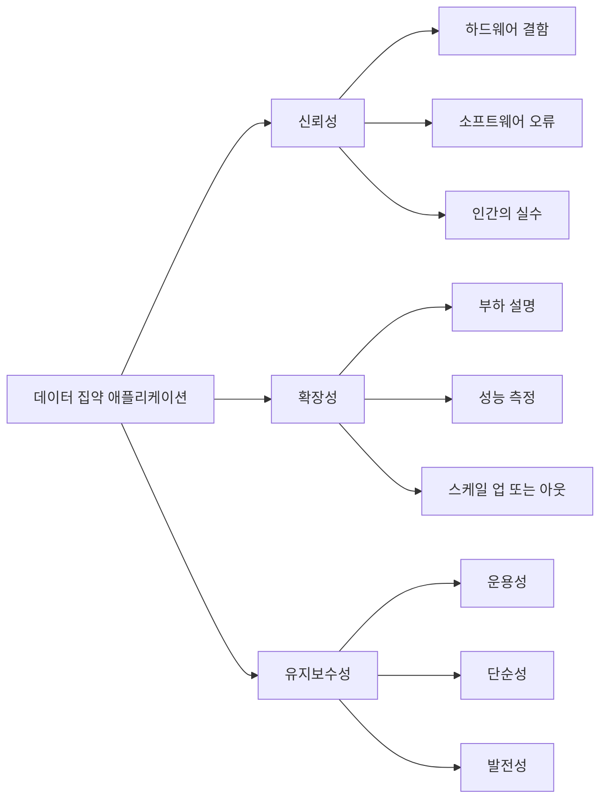

- 대부분의 애플리케이션은 컴퓨팅 집약적이지 않고 데이터 집약적입니다.
- 데이터 시스템은 성공적인 추상화이기 때문에 우리는 그것에 대해 전혀 생각하지 않고 항상 사용합니다.
- 이 책에서는 데이터 시스템의 원리와 실용성에 대해 이야기합니다.  이들의 공통점은 무엇이며, 무엇이 구별되며, 어떻게 그 특성을 달성합니까?
- 데이터 시스템의 세 가지 주요 관심사는 신뢰성, 확장성, 유지 관리성입니다.

### 신뢰성
- 신뢰성에 대한 간단한 정의는 문제가 발생하더라도 계속해서 올바르게 작동하는 것입니다.
- 하드웨어 결함
  - 단일 시스템은 중복 하드웨어를 통해 더욱 탄력적으로 만들어집니다.
  - 더 큰 데이터 및 컴퓨팅 요구로 인해 종종 소프트웨어 내결함성 기법을 사용하여 다중 시스템 중복으로 전환되었습니다.
- 소프트웨어 오류
  - 감지하기 어렵고 비정상적인 상황이 발생할 때까지 휴면 상태로 있을 수 있음
  - 하드웨어 오류와는 달리 여러 시스템 오류를 일으키는 체계적인 오류나 계단식 오류가 있을 수 있습니다.
  - 빠른 해결책 없음 - 계획, 철저한 테스트, 프로세스 격리, 충돌 및 재시작 허용, 시스템 동작 모니터링 등 각각 도움이 되는 작은 것들의 집합
- 인간의 실수
  - 인적 오류를 처리하기 위해 다음과 같은 여러 가지 접근 방식을 결합할 수 있습니다.
    - 인적 오류 가능성 최소화
    - 사람들이 실수를 가장 많이 하는 곳과 실수로 인해 실패가 발생할 수 있는 곳을 분리하세요.
    - 문제로부터 빠르고 쉽게 복구 가능
    - 상세하고 명확한 모니터링을 사용하십시오.
    - 좋은 관리 및 교육 제공

### 확장성
- 시스템이 잘 작동하더라도 사용자가 10배 더 많아도 반드시 신뢰할 수 있는 것은 아닙니다.
- 확장성을 계획한다는 것은 시스템이 특정 방식으로 성장하는지, 그러한 성장에 대처할 수 있는 옵션은 무엇인지 묻는 것을 의미합니다.
- 부하 설명
  - 로드 매개변수라는 측정항목을 사용합니다. 게시물 트윗 평균 초당 4.6,000개 요청, 최고 12,000개 요청/초
  - 홈 타임라인 업데이트를 처리하기 위한 트위터의 다양한 디자인 예
- 성능 설명
  - 일반적인 관심사는 응답 시간과 처리량입니다.
  - 응답 시간과 같은 지표는 백분위수로 보고됩니다. 중앙값, 95번째, 99번째
- 부하 대처 방법
  - 스케일 업 또는 스케일 아웃 가능
  - 상태 비저장 서비스는 확장하기 쉽지만 상태 저장 시스템을 확장하면 많은 복잡성이 발생할 수 있습니다.

### 유지 관리성
- 운용성: 작업을 쉽게 수행할 수 있도록 해줍니다.
  - 우수한 조작성은 다음을 포함합니다:
    - 런타임 동작 및 내부에 대한 가시성 제공
    - 표준 도구와의 자동화 및 통합 지원
    - 자가 치유
- 단순성: 복잡성 관리
  - 우발적인 복잡성을 제거하는 데 좋습니다(문제에 내재된 것이 아니라 구현만).
  - 좋은 추상화는 이해하기 쉬운 인터페이스 뒤에 구현 세부 사항을 숨깁니다.
- 진화성: 변화를 쉽게 만들기
- 민첩한 작업 패턴은 변화에 적응하기 위한 프레임워크를 제공합니다.
  - 진화성은 대규모 데이터 시스템 수준의 민첩성으로 정의됩니다.
  - 단순성과 좋은 추상화는 진화 가능성에 큰 도움이 될 수 있습니다.

## Chapter 2. 데이터 모델과 쿼리 언어

### 소개

> 개념 흐름

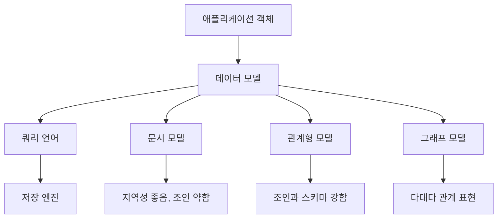

- 대부분의 애플리케이션은 하나의 데이터 모델을 다른 데이터 모델 위에 계층화하여 구축됩니다.
  - 앱 코드 -> 데이터베이스 -> 바이트 -> 전류
- 문제를 해결하고 생각하는 방법의 중심입니다.

### 관계형 모델과 문서 모델 비교
- SQL - 관계로 구성된 데이터
  - 기본 구현 세부정보를 숨기는 데 도움이 됨
- 네트워크/계층적 모델
### NoSQL의 탄생
- 더 큰 확장성과 매우 높은 쓰기 처리량을 처리하는 것을 목표로 합니다.
- 상용 소프트웨어보다 무료 오픈 소스 소프트웨어를 선호합니다.
- 추가적인 유연성을 허용하는 특수 쿼리
### 객체 관계 불일치
- 임피던스 불일치 - 때때로 SQL의 구조가 애플리케이션 코드의 현실과 일치하지 않을 수 있습니다.
- 사람들은 여러 개의 이전/현재 직업을 가질 수 있지만 구조화된 방식으로 단일 열에만 저장되거나 정리하기 위해 추가 작업이 필요할 수 있습니다.
- 문서 중심 DB는 이러한 문제를 일부 완화할 수 있습니다.
### 다대일·다대다 관계
- 때로는 정규화/중복 축소가 관계를 단순화하는 데 유용할 수 있습니다.
  - 텍스트로 동일한 영역을 표현하는 방법은 다양할 수 있습니다.
  - 영역의 이름이 변경될 수 있으며 모든 기록에 걸쳐 간단하게 업데이트될 수 있습니다.
  - 많은 텍스트 입력을 ID에 매핑하는 과정이 복잡해질 수 있습니다.

### 문서 데이터베이스는 기록을 반복하나요?
- IBM의 IMS는 이러한 시스템보다 앞서 있었으며 유사한 어려움을 겪었습니다.
- 네트워크 모델 - CODASYL을 사용하면 여러 상위 레코드를 가질 수 있습니다.
  - "광역 시애틀 지역"은 해당 지역의 모든 사용자에게 연결될 수 있습니다.
  - 접근 경로를 통해 개별 기록에 접근해야 했습니다. 연결리스트를 순회하는 것과 같습니다.
- 관계형 모델
  - 테이블은 단지 튜플(행)의 모음입니다.
  - 열과 행에 대한 훨씬 간단한 읽기 작업
  - 쿼리 최적화 프로그램은 기본 데이터에 대한 명령을 실행하는 최적의 방법을 찾는 작업을 다룹니다.
### 오늘날의 관계형 데이터베이스와 문서 데이터베이스 비교
- 문서 모델은 유연성, 지역성을 통한 더 나은 성능, 애플리케이션 표현에 더 가까운 것을 선호합니다.
- 관계형 모델은 조인과 다대일, 다대다 관계를 보다 기본적으로 지원합니다.
- 어떤 데이터 모델이 더 간단한 애플리케이션 코드로 이어지는가?
  - 데이터의 기본 구조와 용도에 따라 다름
- 문서 모델을 사용하면 스키마 없이 데이터를 DB에 넣을 수 있습니다.
  - 읽기 시 스키마가 적용됩니다.
  - 보이지 않는 새로운 것이 나중에 추가되어 처리될 수 있는 이질적인 데이터에 유용할 수 있습니다.
  - 전체 문서를 검색해야 하지만 실제로는 그 중 작은 부분만 검색해야 하는 경우 추가 비용이 발생할 수 있습니다.
- 쓰기 스키마가 있는 관계형 모델과 대조
  - 스키마 변경이 어려울 수 있습니다.
  - 관계형 DB는 문서 이점 중 일부를 포착하기 위해 XML/JSON을 지원하기 시작했습니다.
- 프로그래밍의 정적 타이핑과 동적 타이핑과 유사합니다.
### 데이터 쿼리 언어
- 선언적
  - 데이터 패턴을 지정한 다음 쿼리 최적화 프로그램은 해당 패턴과 일치하는 데이터를 찾기 위한 최적의 방법을 찾으려고 시도합니다.
  - 후드 아래에서 더 쉽게 병렬화 가능
- 필수
  - 훨씬 더 장황하지만 유연합니다. 특정 작업 코딩
  - 각 쿼리에 대해 병렬 코드를 작성하기가 더 어렵습니다.
### 웹에서의 선언적 쿼리
- CSS/XSL과 Javascript를 사용하여 선언적 및 명령형을 보여주는 예
- CSS/XSL(선언적)은 Javascript(필수적)보다 이 작업에 훨씬 더 간결합니다.
### MapReduce 쿼리
- 명령형과 선언형 사이
- map 함수와 reduce 함수를 별도로 작성해 데이터를 변환하고 집계합니다.
  - 각 함수는 한 레코드 처리에 외부 상태나 부작용이 필요 없는 순수 함수여야 합니다.
### 그래프와 유사한 데이터 모델
- 다대다 관계를 더 잘 처리합니다.
- FB에는 사람, 위치, 이벤트 등을 나타내는 정점이 있는 하나의 거대한 그래프가 있으며 가장자리는 이들 간의 연결을 나타냅니다.
- 이러한 그래프를 표현하는 속성 그래프와 트리플 스토어
- 이러한 그래프를 쿼리하기 위한 Cypher, SPARQL, Datalog
### 속성 그래프
- 정점
  - 식별자
  - 아웃/인 엣지
  - 속성 수집
- 엣지
  - 식별자
  - 모서리의 시작점
  - 엣지의 끝점
  - 관계를 설명하는 라벨
  - 속성 수집
- 실제 스키마가 없으며 모든 것이 상호 연결될 수 있습니다.
- 인바운드, 아웃바운드 양방향으로 갈 수 있습니다.
- 거리, 도시, 주, 국가 등과 같이 중첩된 항목에 적합합니다.
### 암호 쿼리 언어
- "출생"=미국 및 "거주"=EU를 모두 갖는 모든 사람을 찾는 것과 같은 형식의 쿼리
- 다양한 방법으로 요청할 수 있습니다.
### SQL의 그래프 쿼리
- 훨씬 더 장황하고 재귀 호출이 필요합니다.
### 트리플 스토어와 SPARQL
- 주어 술어 목적어 - Jim likes 바나나
- 이러한 개념을 바탕으로 많은 사이트가 상호작용하고 정보를 공유할 수 있도록 시맨틱 웹을 만들기 위해 만들어진 RDF(Resource Description Framework)는 큰 호응을 얻지 못함
- Cypher와 유사한 쿼리 형식
### 기초: 데이터로그
- 트리플스토어와 유사하지만 더 오래됨

## Chapter 3. 저장소와 검색

### 소개
- 동기를 부여하는 예로 저자는 단순히 키-값 쌍을 로그에 추가하는 간단한 데이터베이스를 보여줍니다.
  - 로그는 추가 전용입니다.  키를 업데이트하려면 새 항목을 추가하면 이전 항목은 이제 무시됩니다.
  - 이 시스템은 쓰기 속도가 매우 빠르지만 읽기 성능은 선형적이므로 항목이 수백만, 수십억 개 이상인 경우 매우 나쁩니다.
- 읽을 항목을 찾는 데 도움이 되는 추가 데이터 구조를 인덱스라고 합니다.
  - 스토리지 시스템의 중요한 균형점은 좋은 인덱스는 읽기 속도를 높이지만 모든 인덱스는 쓰기 속도를 늦춘다는 것입니다.

### 해시 인덱스
- 키-값 저장소는 Python 및 기타 언어의 사전 유형과 마찬가지로 해시 맵(일명 해시 테이블)으로 구현될 수 있습니다.
- 해시 맵은 메모리에 존재하며 키-값 항목이 있는 디스크의 로그 파일에 있는 오프셋을 가리킵니다.
- 이는 모든 키가 메모리에 맞는 한 실행 가능한 시스템을 구축하기에 충분합니다. 쓰기는 여전히 한 위치에서 추가 전용이며 빠르며 해시 맵 조회는 대략 일정한 시간이므로 매우 빠릅니다.
- 보다 현실적으로는 로그 파일이 엄청난 양의 디스크 공간을 소모하지 않도록 하고 싶을 것입니다.
  - 로그 파일을 자주 세그먼트로 나눕니다.
  - 백그라운드에서 중복된 키를 제거하는 압축을 수행하고 선택적으로 압축된 로그 파일을 함께 병합합니다.
  - 이제 읽기를 위해서는 가장 최근부터 가장 오래된 것까지 각 로그 파일 세그먼트에 대한 해시 맵의 키를 순차적으로 찾아야 합니다.
    - 이러한 이유로 로그 세그먼트 수를 작게 유지하기 위해 압축을 원합니다.
- 그 밖에 현실 세계에서 처리해야 할 세부 사항으로는 기록 삭제, 충돌 복구, 동시성 제어 등이 있습니다.

### SSTable 및 LSM-트리
- 해시 인덱스의 한계는 단일 키를 읽는 데는 빠르지만 일련의 키 범위에 대해서는 빠르지 않다는 것입니다.
- 정렬된 문자열 테이블(SSTable)은 각 파일 세그먼트가 정렬된 순서로 정렬되어 있다는 점에서 위의 단순 해시 인덱스 로그 파일과 다릅니다.  정렬된 파일은 읽기 범위를 지원합니다.
- LSM 트리(Log-Structured Merge-Tree)는 두 개 이상의 계층을 사용하며 마지막 계층은 SSTable입니다.
  - 정렬된 순서로 파일 세그먼트에 기록하기 전에 메모리(초기 계층)에 많은 레코드를 저장합니다.
    - Red-Black Tree와 같은 메모리 내 정렬된 레코드를 관리하기 위한 여러 옵션이 있으며 이를 memtable이라고 합니다.
  - 세그먼트당 전체 해시 맵 대신 오프셋의 부분 인덱스를 가질 수 있습니다.
    - 부분 인덱스는 파일 세그먼트의 정렬 순서를 활용하므로 정렬 순서에서 서로 가까운 키는 파일에서 서로 가까워집니다.
  - 파일 세그먼트 병합은 빠른 선형 시간, 최소 메모리 알고리즘입니다.
- 개별 쓰기는 해시 인덱스만큼 빠르거나 빠릅니다.  읽기에는 약간의 오버헤드가 있지만 비슷한 성능을 보일 가능성이 높습니다.
- 이제 두 가지 백그라운드 프로세스가 있습니다. 세그먼트 압축 외에도 memtable의 배치 처리를 새 파일 세그먼트에 주기적으로 작성합니다.
- 최적화에는 다음이 포함됩니다.
  - Bloom 필터를 사용하여 존재하지 않는 대부분의 키 식별
  - 크기 계층 압축은 더 새롭고 작은 세그먼트를 더 오래되고 더 큰 SSTable로 병합합니다.
- 레벨 압축은 세그먼트가 오래되고 커짐에 따라 압축 임계값을 높입니다.
  - 설명: 위의 두 가지 압축 전략에서 "오래된"은 파일이 얼마나 최근에 압축되었는지가 아니라 세그먼트 내부의 원본 레코드의 기간을 나타냅니다.
  - 키 범위를 하위 범위 모음으로 나누고, 각 하위 범위에는 고유한 세그먼트 세트가 있습니다.
### B-트리
- B-트리는 균형 잡힌 트리의 일반적인 형태입니다("B"는 균형이라는 단어에서 유래함).
- 로그 구조 저장소와 달리 B-트리는 중복 항목을 생성하지 않습니다. 대신 삭제 및 업데이트를 허용합니다.
- B-트리는 데이터베이스를 고정된 크기의 페이지로 나누고 페이지를 트리 구조로 디스크에 저장합니다.
- 트리에 익숙하다면 읽기와 쓰기 모두 로그 시간입니다.  분기 인자 b가 수백이면 로그 밑수 b인 100억은 여전히 ​​4보다 작습니다.
  - 트리 검색은 루트에서 시작됩니다.
  - 각 페이지는 키 범위를 최대 b개의 더 작은 하위 범위로 나눕니다.
  - 리프에 도달할 때까지 하위 범위에 대한 포인터/참조를 반복적으로 따릅니다.
- B-트리는 균형을 유지하는 것이 보장되지만 때때로 노드 분할이 발생합니다(이로 인해 루트를 향한 추가 노드 분할이 발생할 수도 있음).  이로 인해 평균 쓰기 비용이 추가되지만 얕은 B-트리의 경우 비용이 많이 추가되지 않습니다.
- B-트리를 안정적으로 만들기
  - 제자리 쓰기 및 페이지 분할은 서버 충돌로 인해 중단될 수 있는 위험한 작업입니다.
  - 대부분의 B-트리 구현은 디스크에서 미리 쓰기 로그(여기에 다시 추가 전용 로그 데이터 구조가 있습니다!)를 사용합니다.  B-트리를 업데이트하기 전에 여기에 수정 사항이 기록됩니다.
- 일반적으로 래치라고 하는 경량 잠금을 사용하여 동시성 제어가 필요합니다.
- 최적화에는 다음이 포함됩니다.
  - 특히 트리 내부에서 긴 키를 단축합니다.
  - 트리 페이지를 순차적 순서로 배치하거나 더 큰 블록으로 배치하거나 페이지 맵을 사용하여
  - 왼쪽/오른쪽 형제 포인터와 같은 트리의 추가 포인터

### B-트리와 LSM-트리 비교

> 개념 흐름

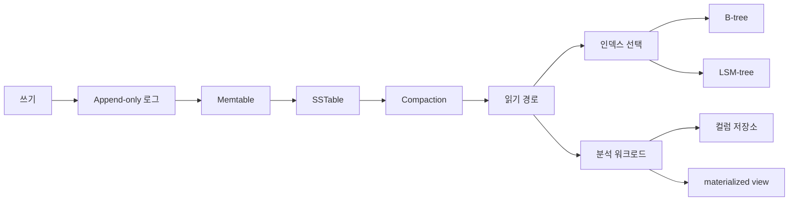

- B-트리는 다양한 워크로드에서 우수한 성능을 제공하는 성숙하고 잘 확립된 기술이지만 LSM-트리에는 몇 가지 흥미로운 속성이 있습니다.
- 특히 LSM 트리는 일반적으로 쓰기 속도가 빠르므로 쓰기가 많은 애플리케이션에 유용합니다.
- 일반적인 통념은 B-트리가 읽기 속도가 더 빠르지만 작업량에 따라 달라질 수 있다는 것입니다.
- LSM 트리의 장점은 다음과 같습니다.
  - 일반적으로 쓰기 증폭이 적음 - SSTable 압축 대 B-트리는 단 하나의 레코드만 변경된 경우에도 전체 페이지를 작성합니다.
  - LSM-트리는 더 잘 압축될 수 있으며 B-트리만큼 내부 조각화를 겪지 않습니다.
- LSM 트리의 단점은 다음과 같습니다.
  - 백그라운드 압축 프로세스는 때때로 쓰기를 방해하거나 느리게 할 수 있습니다.
  - 극단적으로 쓰기 활동이 충분히 높으면 압축이 따라가지 못할 수도 있습니다.  SSTable 수가 늘어나면 성능이 저하됩니다.  일반적으로 관리자는 이 시나리오를 명시적으로 모니터링해야 합니다.
  - 트랜잭션 기능(7장에서 설명)은 각 키가 한 번만 존재하고 키 범위에 대해 잠금을 구현하기가 간단하다는 점을 고려하면 B-트리를 사용하여 구현하기가 더 쉽습니다.

### 기타 인덱스 구조
- RDBMS는 종종 테이블당 하나의 클러스터형 인덱스를 허용하며, 여기서 레코드는 인덱스 트리의 잎에 저장됩니다.
- 보조 인덱스는 기본 키를 보완할 수 있습니다.
  - 보조 인덱스에는 일반적으로 데이터가 포함되지 않고 위치에 대한 참조만 포함됩니다.
    - 실제 레코드 저장은 순서가 지정되지 않은 힙 파일에 있을 수도 있습니다.
- 다중 열 인덱스도 사용되며 때로는 포함 인덱스로 사용됩니다.
- 다른 종류의 인덱스에는 전체 텍스트 및 공간(다차원) 인덱스가 포함됩니다.

### 인메모리 데이터베이스
- RAM 비용이 감소하면 Memcached와 같은 인메모리 데이터베이스가 실행 가능해집니다.
- 저자는 인메모리 데이터베이스의 성능 이점은 주로 디스크에서 느린 읽기를 방지하기 때문이 아니라 디스크에 쓰기 위해 데이터를 인코딩하는 오버헤드를 방지하기 때문이라고 말합니다.
- 캐싱 방지 접근 방식은 OS 스왑 파일과 유사한 내구성 있는 디스크 데이터 구조의 오버헤드 없이 LRU 데이터를 메모리에서 디스크로 제거합니다.

### 트랜잭션 처리와 분석 처리
- 초기 비즈니스 데이터 처리는 상거래성 트랜잭션이 중심이었고, 여기서 온라인 트랜잭션 처리(OLTP)라는 용어가 나왔습니다.
- 트랜잭션 워크로드는 일반적으로 조회되는 레코드 수가 적으며 대부분 사용자 입력에 따라 단일 레코드가 삽입되거나 업데이트됩니다.
- 분석 패턴(OLAP 용어 사용이 감소함)은 많은 수의 레코드를 읽고 집계 수치(예: 수익 합계)를 계산하는 일반적인 경우와 다릅니다.  과거에는 쓰기의 대부분이 대량 로드였으나 스트리밍이 점점 일반화되고 있습니다.

### 데이터 웨어하우징
- OLTP 시스템의 낮은 대기 시간 성능을 보호하기 위해 조직은 분석 워크로드를 위한 데이터 웨어하우스라는 별도의 시스템을 만들기 시작했습니다.
- ETL(추출-변형-로드) 프로세스로 알려진 프로세스를 사용하여 OLTP 시스템에서 읽기 전용 데이터 복사본을 추출하고 정리 및 일관성을 유지한 다음 데이터 웨어하우스에 로드했습니다.
- 데이터 웨어하우스의 데이터 모델은 오랫동안 관계형이었지만 SQL이 여전히 쿼리 언어인지 여부에 관계없이 Hadoop 등 다른 모델과의 분기가 발생했습니다.

### 별과 눈송이: 분석을 위한 스키마
- 많은 데이터 웨어하우스에서는 차원 모델링이라고도 알려진 스타 스키마를 사용합니다.
  - 스키마의 중심에는 개별 이벤트를 나타내는 사실이 포함된 사실 테이블이 있으며 일반적으로 많은 열이 포함되어 매우 넓습니다.
  - 사실의 일부 열에는 이벤트별 데이터 요소가 있지만 다른 열에는 8개의 주요 참조(예: 제품 ID)가 있습니다.
  - 팩트 테이블을 둘러싸는 일반적으로 더 작은 다른 테이블은 차원 테이블입니다.
- 종종 관계 화살표가 있는 중앙 팩트 테이블 주위의 차원 테이블에 대한 시각적 다이어그램은 별처럼 보입니다.
- 차원이 더 정규화되어 저장되는 경우(예: 지역에 대한 하위 차원이 있는 국가 및 지역이 주로 분할된 경우 추가 분기로 인해 다이어그램이 눈송이처럼 보이게 되므로 눈송이 스키마라는 용어가 사용됩니다.
- 데이터 웨어하우스에는 여러 팩트 테이블이 있을 수 있으므로 여러 개의 별/눈송이가 있을 수 있습니다.

### 열 지향 저장소
- 데이터 웨어하우스는 대규모 조직에서 일반적이므로 수십억 또는 수조 개의 행이 있는 팩트 테이블에 대한 쿼리를 최적화하는 방법이 과제가 됩니다.
- 일반적으로 각 분석 쿼리에는 팩트 테이블의 많은 열 중 소수만 필요하다는 점을 활용하여 레코드(행) 덩어리를 물리적으로 저장하는 대신 열 데이터 덩어리를 물리적으로 함께 저장하여 읽기를 줄일 수 있습니다.
- 동일한 사실 테이블의 열은 모두 동일한 순서로 행을 저장해야 합니다.
- 컬럼 압축은 추가적인 이점을 제공합니다.
  - 열의 고유 값 수는 일반적으로 행 수에 비해 적습니다.
  - 비트맵 인코딩(원-핫 인코딩 형식) 및 실행 길이 인코딩(RLE)을 사용하여 열의 내용을 저장하는 데 필요한 공간을 줄일 수 있습니다.
- 벡터화된 처리로 성능이 향상됩니다.
  - 최신 CPU에는 개별 데이터 요소에 대한 명시적 루프보다 훨씬 빠르게 L1 캐시에 대해 AND 및 OR과 같은 간단한 SIMD 작업을 수행하는 기능을 포함하여 복잡한 명령 세트가 있습니다.
- 컬럼 저장소의 정렬 순서
  - 일반 로그 파일이 특별한 순서 없이 추가 전용이지만 SSTable이 정렬되는 것처럼 컬럼 저장소 데이터를 정렬할 수 있습니다.
  - 정렬 순서는 정렬 키 컬럼을 압축하는 데 도움이 됩니다.
  - C-Store에서는 서로 다른 정렬 순서를 갖는 서로 다른 복제본으로 복제를 구현했습니다.  일반적인 경우 정렬 순서가 쿼리의 범위 기준과 일치하는 경우 특정 복제본을 선택할 수 있습니다.
- 컬럼 저장소에 대한 쓰기가 더 복잡합니다.
  - LSM 트리와 마찬가지로 일괄 데이터가 메모리에 축적된 다음 주기적으로 병합되어 디스크에 기록되는 2단계 구조를 가질 수 있습니다.  정렬 순서와 압축 작업은 백그라운드에서 배치 처리됩니다.

### 집계: 데이터 큐브 및 materialized view
- 특정 집계가 자주 요청될 것임을 알고 있는 경우(예: 하루에 매장별 부서별 매출 합계를 계산하면 해당 데이터의 물리적 복사본을 materialized view에 저장할 수 있습니다.
- 데이터 큐브는 하나의 뷰뿐만 아니라 여러 차원에 의한 집계를 저장합니다. 백화점별 매출 합계, 매장별 합계, 일별 합계, 백화점&점포별 합계, 백화점&일별 합계, 매장&일별 합계, 백화점&점포&일별 합계입니다.  이 예와 같이 3차원을 시각화하면 모든 백화점별, 매장별, 요일별 합계를 하나의 큐브로 정리하게 됩니다.  두 요소로 구성된 소계는 행, 열 또는 스택별로 합산됩니다.  단일 요소 부분합은 전체 셀을 합산한 값입니다.

### 요약
- 이 장에서는 관계형 스토리지와 로그 구조 스토리지를 중점적으로 다뤘습니다.
  - 관계형은 각 레코드의 복사본을 하나만 유지하면서 업데이트되지만 임의 액세스가 필요합니다(페이지에 집계됨).
  - 로그 구조 저장소는 쓰기를 더 적은 수의 순차 I/O로 모으지만 여러 데이터 구조가 필요하고 obsolete 레코드 사본 때문에 고급 사용 사례가 복잡해질 수 있습니다.
- 분석 워크로드를 최적화할 수 있는 특별한 사례로 논의함
- 이 장에서는 수직 확장 옵션에 중점을 두었습니다.  책의 2부에 이르면 수평적 확장과 관련된 문제가 소개될 수 있습니다.

### SQLite - 간단한 사례 연구
- 간단한 RDBMS
- 전체 데이터베이스가 하나의 파일로 저장됩니다.
- 매우 제한된 동시성을 지원합니다.
  - 쓰기가 수행되면 파일이 잠기고 다른 모든 작업은 기다려야 합니다.
- 여러 읽기를 동시에 수행할 수 있습니다.
- 현재 버전은 전문 검색 인덱스와 공간 인덱스를 지원합니다.
- 데이터 저장은 매우 간단합니다.
  - 테이블은 B-트리입니다.
  - 인덱스는 B-트리입니다.
  - sqlite_master 테이블에는 모든 객체가 나열됩니다.
- 다른 메타데이터를 설명하기 위해 "인덱스"라는 단어를 느슨하게 사용하면 SQLite가 유지 관리하는 다른 인덱스는 평균 쓰기에 비용을 추가하고 때로는 다른 성능 향상을 제공합니다.
  - 자유 목록 페이지
  - 포인터 맵 페이지 - 조각 모음에 사용되는 역방향 포인터(상위/이전 항목에 대한)
  - B-트리 페이지 헤더
  - B-트리 포인터 배열 - B-트리 페이지 내 셀(키, 포인터 및 페이로드)의 추적 구조
  - sqlite_sequence 테이블 - 자동 증가 추적 테이블
  - 쿼리 플래너가 사용하는 통계 테이블

## Chapter 4. 인코딩과 스키마 진화

- 데이터를 인코딩하는 방법에는 여러 가지가 있습니다(JSON, XML, Protos, Thrift, Avro). 이 장에서 다루는 주요 질문은 다음과 같습니다.
  - 각각 스키마 변경 및 backward/forward compatibility를 어떻게 처리합니까?
  - 이러한 각 형식은 데이터 저장 및 통신에 어떻게 사용됩니까? (웹 서비스, REST, RPC, 메시지 전달 - 액터 및 큐)
- 이러한 다양한 유형의 인코딩에 대해 배울 때 다음 개념을 염두에 두고 이 문제를 처리하기 위해 다양한 인코딩이 필요한 방법을 고려하세요.
### 변경사항 출시
- 문제: 제품 기능 세트를 변경하면 제품에 저장되는 데이터(새 필드, 새 유형 등)가 변경되는 경우가 많습니다. 데이터 형식이 변경되거나 스키마가 변경되면 애플리케이션 코드를 업데이트해야 하는 경우가 많습니다. 그러나 업데이트가 즉시 이루어지지 않는 경우가 많습니다. 업데이트하는 방법?
### 1. 서버측 애플리케이션 솔루션:
    - 롤링 업그레이드 수행: 한 번에 몇 개의 노드에 새 버전을 배포합니다. 출시가 원활하게 진행되고 있는지 지속적으로 확인하세요.
    - 이점: 더 자주 출시되고 진화할 수 있습니다.
### 2. 클라이언트측 애플리케이션 솔루션: 사용자 마음대로 - 업데이트가 필요합니다!

### ⇒ 이로 인해 여러 버전의 코드와 데이터 형식이 동시에 공존하게 됩니다! 양방향(역방향 및 순방향 호환성) 호환성을 유지해야 합니다.

### 메모

### 데이터 인코딩 형식

> 개념 흐름

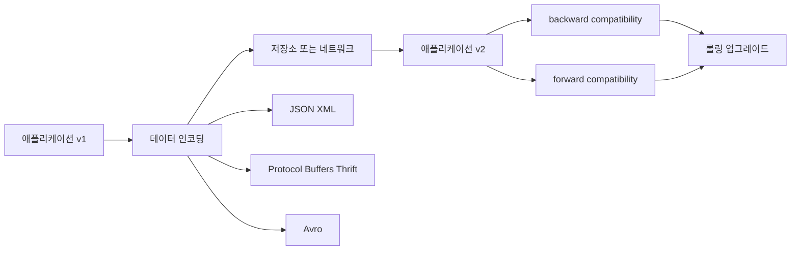

### 프로그램에는 두 가지 유형의 데이터가 있습니다.
### 메모리 내 데이터: 객체, 구조체, 목록, 배열, 해시 테이블, 트리 등의 데이터. CPU에 의한 액세스 및 조작에 최적화되어 있습니다.
### 네트워크를 통해 전송되거나 디스크에 저장되는 데이터: 이 데이터는 자체 포함된 바이트 시퀀스로 인코딩됩니다.

### 핵심 질문
### 메모
### 메모리 내 데이터와 네트워크를 통해 전송해야 하는 데이터를 어떻게 변환하나요?
### 메모리 내 표현을 바이트 시퀀스로 변환하는 것을 인코딩(일명 직렬화 또는 마샬링)이라고 합니다. 그 반대를 디코딩이라고 합니다.
### 메모리 내 데이터를 바이트 시퀀스로 변환하는 자체 인코딩 메커니즘이 있는 프로그래밍 언어의 심각한 문제는 무엇입니까?
### 일시적인 목적이 아닌 다른 용도로 이러한 기능을 사용하는 것이 권장되지 않는 이유는 무엇입니까?
### 1. 인코딩은 프로그래밍 언어와 관련이 있습니다. 언어에 대한 헌신은 오랫동안 필요합니다. 다른 언어와의 통합 프로젝트는 제한됩니다.
### 2. 동일한 객체 유형의 데이터를 복원하려면 디코딩 프로세스에서 임의의 클래스를 인스턴스화해야 합니다. 보안 문제가 발생할 수 있습니다[1].
### 3. 이러한 라이브러리는 backward/forward compatibility를 무시할 수 있습니다. 버전 관리는 나중에 생각하는 것입니다. 빠르고 쉬운 인코딩을 의미합니다.
### 4. 비효율적일 수 있습니다. 이는 이러한 라이브러리에 대해 나중에 생각할 수 있습니다.

### JSON, XML, CSV
- 널리 알려져 있고 지원됩니다. 아직도 - 많은 과제가 있습니다.
- 과제:
  - XML 및 CSV 숫자 인코딩 - 문자열과 숫자를 구별하는 방법은 무엇입니까?
  - JSON: 매우 큰 숫자에 대한 숫자 구문 분석입니다. 사례 연구: Twitter는 64비트 트윗 ID 번호를 캡처하기 위해 두 개의 별도 데이터 포인트를 인코딩해야 합니다. 한 번은 숫자로, 한 번은 10진수 문자열로 인코딩해야 합니다.
  - JSON 및 XML은 바이너리 데이터를 지원하지 않습니다. 해결 방법은 크기 측면에서 비용이 많이 듭니다.
- XML/JSON: 스키마의 복잡성. 스키마가 없으면 애플리케이션은 인코딩/디코딩 논리를 하드코딩해야 합니다.
  - CSV: 스키마가 없습니다. 새 행이나 열은 수동으로 처리해야 합니다. 모든 CSV 구현이 동일한 규칙을 따르는 것은 아닙니다(예: 쉼표 처리 방법).

### 바이너리 인코딩
- 테라바이트 규모로 작업할 때는 인코딩 형식이 정말 중요합니다.
- JSON: XML보다 덜 장황하지만 바이너리 형식에 비해 많은 공간을 차지합니다.
  - XML 및 JSON에 대한 바이너리 인코딩 옵션이 있습니다.
  - MessagePack은 크기를 줄일 수 있지만 사람이 읽을 수 있는 부분이 손실됩니다. 더 좋은 옵션이 있나요? 예 - Thrift와 Protos.
- Apache Thrift
  - 두 가지 바이너리 인코딩 형식: BinaryProtocol 및 Compact Protocol
  - 필드 태그: 필드 이름을 직접 입력하지 않고도 어떤 필드에 대해 이야기하고 있는지 간략하게 표시하는 방법입니다. 이는 MessagePack에 비해 개선된 사항입니다.
  - Compact Protocol 버전에는 BinaryProtocol 설계에 비해 몇 가지 추가 압축 전략이 있습니다.
- 프로토콜 버퍼
  - Thrift의 Compact Protocol과 유사합니다.
  - backward compatibility: 필드 태그를 변경할 수 없습니다. 변경하면 기존의 모든 인코딩된 데이터가 무효화됩니다. 태그는 바이트 시퀀스에서 많이 사용됩니다(그림 4-4 참조). 각각의 새 필드에는 새 태그 번호가 필요합니다. 새 코드는 이전 코드로 인코딩된 데이터를 읽을 수 없으므로 새 필드가 필요할 수 없습니다(필요한 데이터가 인코딩되지 않았을 수 있음). backward compatibility를 유지하려면 초기 배포 이후의 모든 필드는 선택 사항이거나 기본값을 가져야 합니다.
  - forward compatibility: 이전 코드는 새 태그 번호를 무시할 수 있습니다.
  - Protos에서는 선택적 필드가 반복되는 것을 허용합니다. 이전 데이터가 포함된 새 코드에는 요소가 0개 또는 1개 있는 목록이 표시됩니다. 새 데이터를 읽는 이전 코드에는 목록의 마지막 요소만 표시됩니다.
- Apache Avro: Protos 및 Thrift와는 다른 바이너리 인코딩 형식입니다.
  - 두 가지 스키마 언어: (1) 하나는 사람이 편집하기 위한 것입니다. (2) 하나는 기계가 쉽게 읽을 수 있습니다.
  - 태그 번호가 없습니다. 그래도 좀 더 콤팩트하다!?
  - 인코딩은 함께 연결된 값의 목록일 뿐입니다.
  - 디코딩하려면 정확히 동일한 스키마가 필요합니다. 스키마는 살펴볼 데이터 유형을 알려주는 데 사용됩니다. 가변 길이 데이터가 지원됩니다.
  - 인코딩된 데이터는 쓰기 시 사용되는 스키마인 "writer schema"를 사용합니다. 읽을 때 "reader schema", 즉 애플리케이션 코드가 의존하는 스키마를 사용하며 빌드 프로세스 중에 생성되었을 수 있습니다.
    - 흥미롭게도 이들은 동일한 스키마일 필요는 없으며 호환 가능하면 됩니다. 차이점이 해결되었습니다. 그림 4-6을 참조하세요.
  - 호환성을 유지하기 위해 기본값이 있는 경우에만 필드를 추가하거나 제거할 수 있습니다. 예: 리더가 새 스키마를 가지고 있고 이전 스키마로 인코딩된 레코드를 읽는 경우 기본값이 채워집니다.
  - 필드 이름과 "공용체 유형"을 변경할 때 backward compatibility 제한이 있습니다.
  - reader는 writer schema를 어떻게 알 수 있을까요? 스키마 차이를 해석하려면 reader에게 writer schema가 필요합니다.
    - writer schema가 파일 상단에 존재할 수 있습니다. Avro는 동일한 스키마의 수백만 개의 레코드가 있는 Hadoop에서 일반적으로 사용됩니다.
- 또는 - writer schema의 버전 번호가 기록에 포함될 수 있습니다. reader는 버전 번호를 읽고 올바른 writer schema를 조회할 수 있습니다.
    - 또는 - 스키마 버전은 연결 설정 시작 시 전달될 수 있습니다. Avro RPC 프로토콜을 참조하세요.
  - 스키마 레지스트리는 어떤 옵션을 사용하든 유용합니다. 문서화와 스키마 호환성 검증 지점이 됩니다.
  - Avro는 스키마를 동적으로 생성하는 데 적합합니다. 예를 들어 콘텐츠를 파일에 덤프해야 하는 관계형 데이터베이스가 있는 경우입니다.
  - Avro는 정적으로 유형이 지정된 언어(Java, C++, C#)에 대한 선택적 코드 생성을 제공하지만 코드 생성 없이 사용할 수도 있습니다. 대조적으로 Thrift와 Protos는 코드 생성에 의존합니다. Avro는 JSON의 방식을 자체 설명합니다. Avro 라이브러리로 파일을 열고 데이터를 읽으면 됩니다.
- 요약: 바이너리 인코딩은 더 간결하고, 스키마는 문서를 제공하며(디코딩에 필요하기 때문에 항상 최신 상태임), 스키마 레지스트리를 유지하면 backward/forward compatibility를 확인할 수 있으며, 코드 생성은 컴파일 시 유형 확인에 유용합니다.

### 데이터 흐름 모델: 프로세스 간에 데이터가 어떻게 흐르나요?
- 데이터베이스를 통한 데이터 흐름
  - backward compatibility가 필요합니다. 데이터베이스에서 쓰고 읽는 프로세스는 하나만 있을 수 있습니다. 해당 프로세스와 데이터베이스의 향후 버전도 이전 데이터를 읽어야 합니다.
  - forward compatibility도 필요합니다. 많은 프로세스가 데이터베이스를 읽고 씁니다. 일부 프로세스는 최신 업데이트를 받았을 수 있으며 최신 코드로 데이터베이스에 새 데이터를 쓰고 있습니다. 그러면 이전 코드에서 해당 데이터를 읽을 수 있습니다.
  - Snag: 새 코드가 새 필드를 쓰면 어떻게 될까요? 그런 다음 이전 코드가 해당 레코드를 업데이트합니다. 이 새로운 필드를 어떻게 처리해야 할까요? 그것은 알려지지 않을 것입니다.
  - "데이터가 코드보다 오래 지속됨" - 스키마 진화는 코드가 이전 데이터와의 호환성을 유지하는 데 도움이 되어야 합니다.
- 서비스를 통한 데이터 흐름: REST 및 RPC
  - 서비스 지향 아키텍처의 주요 설계 목표는 서비스를 독립적으로 배포 및 발전 가능하게 만들어 애플리케이션을 더 쉽게 변경하고 유지 관리할 수 있도록 하는 것입니다.
    - 이는 종종 여러 팀에서 이전 버전과 새 버전의 서버가 동시에 실행될 수 있음을 의미합니다. 클라이언트와 서버에 걸쳐 캡슐화된 데이터는 이러한 버전 간에 호환되어야 합니다.
  - SOAP(REST 대체, XML 기반)는 상호 운용성 문제로 인해 소규모 기업에서는 선호되지 않습니다.
  - RPC 모델은 원격 네트워크 서비스에 대한 요청을 프로그래밍 언어로 함수나 메서드를 호출하는 것과 동일하게 보이도록 합니다(위치 투명성). 그러나 차이점이 있습니다.
    - 네트워크 요청은 예측할 수 없습니다. 통제할 수 없는 문제가 발생하므로 이를 예측해야 합니다.
    - 시간 초과가 발생할 수 있으며(로컬 호출에서는 발생할 수 없음) 디버그하기가 어렵습니다.
    - 요청이 처리되었지만 응답이 전달되지 않을 수 있습니다. 멱등성이 필요합니다. 그렇지 않으면 노력이 중복됩니다.
    - 네트워크 호출의 대기 시간이 더 깁니다.
    - 더 큰 객체는 네트워크 호출로 효율적으로 전달할 수 없습니다. 그러나 로컬 호출에서는 포인터를 사용할 수 있습니다.
- 클라이언트와 서버가 서로 다른 언어를 사용하는 경우 언어 간 데이터 유형 호환성 문제가 발생할 수 있습니다.
  - 스트림: 호출은 하나의 요청과 하나의 응답으로 구성되는 것이 아니라 시간이 지남에 따라 일련의 요청과 응답으로 구성됩니다.
  - 약속: 실패할 수 있는 비동기 작업을 캡슐화합니다. 병렬화를 단순화합니다.
  - 바이너리 인코딩을 사용하는 RPC 프로토콜은 REST를 통한 일반 JSON보다 성능이 더 좋습니다. 그러나 RESTful API에는 실험 및 디버깅에 적합하고 널리 지원되며 많은 도구가 있다는 다른 장점도 있습니다.
  - RPC 프레임워크는 주로 같은 조직 내 서비스 간 요청에 사용됩니다. REST는 공개 API에 우세합니다.
  - RPC의 backward/forward compatibility 속성은 RPC가 사용하는 인코딩에서 상속됩니다.
    - 참고: RPC는 조직 전체의 통신에 자주 사용됩니다. 서비스는 클라이언트를 제어할 수 없고 강제로 업그레이드할 수 없으므로 여러 버전의 서비스 API를 지원해야 할 수도 있습니다.
    - REST에 버전 관리를 사용할 수 있습니다. 버전 추적은 API 키가 있는 사용자의 데이터베이스에서 발생하거나 요청 헤더에서 추적될 수 있습니다.
- 메시지 전달을 통한 데이터 흐름
  - 메시지는 "큐" 또는 "topic"로 전송됩니다. 메시지 브로커는 해당 주제에 대해 1개 이상의 "consumer" 또는 "subscriber"에게 메시지가 전달되도록 합니다.
  - 비동기 메시지 전달 시스템은 RPC와 데이터베이스 사이에 있습니다. 장점:
    - 수신자에게 과부하가 걸릴 수 있으며 이는 버퍼 역할을 하여 신뢰성을 향상시킵니다.
    - 메시지 유실 방지: 충돌이 발생한 프로세스에 메시지를 재전송할 수 있습니다.
    - 발신자는 수신자의 IP를 알 필요가 없습니다. IP가 계속 변경되는 경우 유용합니다.
    - 하나의 메시지를 여러 수신자에게 보낼 수 있습니다.
    - 송신자와 수신자를 분리합니다.
  - 데이터는 메시지 브로커(네트워크 연결이 아닌 메시지의 임시 저장소인 중개자)를 통해 전송됩니다.
  - 발신자는 메시지가 전달될 때까지 기다리지 않습니다.
  - 한 topic의 consumer는 메시지를 처리하고 다른 topic에 enqueue할 수도 있습니다! 또는 원래 보낸 사람이 응답을 받을 수 있도록 응답 큐에 enqueue할 수도 있습니다.
  - 모든 인코딩 형식을 사용할 수 있습니다. 해당 인코딩이 backward/forward compatibility를 유지하는 한 게시자와 소비자는 독립적으로 배포 및 출시될 수 있습니다.
  - 분산 액터 프레임워크: 로직이 스레드가 아닌 액터에 캡슐화됩니다. 애플리케이션은 여러 노드에 걸쳐 확장됩니다. 위치 투명성이 지원됩니다. 발신자와 수신자는 동일한 노드 또는 다른 노드에 있을 수 있으며 액터 모델이 메시지가 손실될 수 있다고 가정하므로 RPC보다 더 잘 작동합니다. <<< 여기에 더 많은 예제가 필요합니다. 손실된 메시지를 처리하는 액터 모델이 위치 투명성에 더 나은 이유를 완전히 이해하지 못합니다.

### [1] 공격자가 애플리케이션이 임의 바이트 시퀀스를 디코딩하도록 할 수 있는 경우 임의 클래스가 호출되어 원격으로 임의 코드를 실행할 수 있습니다.

## Chapter 5. 복제

### 2부
- 1부에서는 데이터가 단일 머신에 저장될 때의 빌딩 블록에 대해 논의했습니다.
- 2부에서는 여러 시스템에 걸친 스토리지에 대해 설명합니다.
- 수평적 확장의 이유:
  - 확장성
  - 내결함성/고가용성
  - 지연 시간 감소, 예: 지역 데이터 센터
- 공유 메모리 및 공유 디스크 아키텍처가 있지만 이 논의는 shared-nothing 아키텍처에 관한 것입니다. 왜냐하면 다른 것들은 특히 지리적 확장에 심각한 제한이 있기 때문입니다.

### 소개

> 개념 흐름

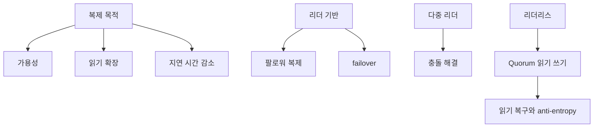

- 복제는 여러 시스템에 데이터의 전체 복사본을 보관하는 것입니다.  다음 장에서는 복사본이 여러 서버로 분할되는 논의를 확장합니다.
- 복제의 과제는 모든 노드가 모든 쓰기를 처리해야 하기 때문에 쓰기(변경)를 처리하는 방법입니다.

### 단일 리더 복제
### 리더와 팔로워
- 하나의 복제본/노드가 리더로 지정됩니다. 다른 사람들은 모두 팔로워입니다
- 모든 쓰기는 리더를 거쳐야 합니다. 읽기는 모든 복제본에서 올 수 있습니다.
- 쓰기 시 리더는 변경 로그 정보를 모든 팔로워에게 보냅니다.
  - 동기식 - 명확한 성공/실패; 클라이언트는 모든 복제본을 기다려야 합니다.
  - 비동기식 - 대기 시간이 가장 낮습니다. 쓰기 성공 후 내구성이 보장되지 않습니다.
  - 단일 동기 팔로워로 내구성 향상
- 팔로워 추가에는 일반적으로 스냅샷(예: 백업)과 스냅샷 이후 변경 사항 적용이 포함됩니다.
- 팔로워 실패는 따라잡기 회복을 사용합니다.

### 리더 실패 - failover
- 리더가 실패하면 팔로워 중 한 명을 리더로 승격시킵니다.  간단해 보이지만…
- 리더가 실패했다는 것을 어떻게 알 수 있나요?  타임아웃은 얼마나 걸리나요?
- 새로운 리더는 어떻게 선출하나요?  어떤 노드가 가장 최신인가요?
- 새로운 리더를 위한 시스템은 어떻게 재구성하는가?  모든 사람이 새로운 구성을 갖고 있는지 어떻게 확인할 수 있습니까?  리더가 돌아오면 어떨까요?  두 노드가 모두 자신이 리더라고 생각하면 어떻게 되나요?
- 이전 리더에서 아직 완전히 복제되지 않은 쓰기는 어떻게 되나요?
- 8장과 9장은 분산 시스템, 일관성 및 합의 문제에 대해 자세히 설명합니다.
- 쉬운 대답이 없기 때문에 일부 운영 팀은 수동으로 failover를 수행합니다.

### 복제 로그 구현
- 명령문 기반 복제 - 원래 명령을 반복합니다.  간결하고 비결정적인 명령은 문제를 야기하지만
  - 예: RAND(), 자동 증가 열, 기타 부작용
- 미리 쓰기 로그(WAL) 배송 - 자세한 물리적 쓰기 변경 로그를 보냅니다.  단순하지만 용량이 클 수 있으며 물리적인 세부 사항으로 인해 버전 업그레이드를 지원하기가 어렵습니다.
- 논리적(행 기반) 로그 전달 - 행 수준 키 및 데이터 전송
- 트리거 기반 복제 - 수동으로 코딩됩니다.  유연하고 오버헤드가 높으며 버그 위험이 있음

### 복제 지연 문제
- 현실적으로 많은 팔로워를 비동기식으로만 확장할 수 있습니다.
- 이상적으로 최종 일관성은 짧지만 복제 지연은 몇 초 또는 몇 분이 될 수 있습니다.
- 자신이 쓴 글을 읽는다

### 복제 지연 상태에서 read-your-writes가 깨지면 사용자는 데이터가 사라진 것처럼 느낍니다.
  - 수정할 수 있는 항목이 거의 없는 경우 하나의 옵션, 리더로부터 모두 읽어 보세요.
  - 최신 업데이트를 추적하고 짧은 기간 동안 리더로부터 강제 읽기를 수행할 수 있습니다. 1분
- 클라이언트가 마지막 쓰기의 타임스탬프를 알고 있는 경우 복제본은 최소한 해당 타임스탬프까지 최신 상태가 아닌 경우 읽기를 위임할 수 있습니다.
  - 장치 간 쓰기 후 읽기 일관성은 더욱 까다롭습니다.
  - 단조로운 읽기 - 사용자가 두 번의 읽기를 수행하고 두 번째 읽기는 더 지연된 복제본에서 수행됩니다.  이는 사용자에게 정보가 시간이 지남에 따라 거꾸로 된 것처럼 보일 것입니다.
  - 동일한 복제본에서 지속적으로 읽으면 이 문제가 해결됩니다(사용자 선호도 해싱).
  - 일관된 접두사 읽기 - 두 번의 쓰기가 역순으로 제3자에게 나타나는 경우 인과관계를 위반하는 것처럼 보일 수 있습니다.  분할할 때도 더 일반적입니다.
  - 동일한 파티션에 인과적으로 관련된 쓰기를 강제로 시도할 수 있지만 정말 어렵습니다.
  - 이 장의 마지막 부분에서는 순차 쓰기와 동시 쓰기에 대해 논의합니다.

### 복제 지연에 대한 솔루션
  - 트랜잭션은 동작 보장을 캡슐화하는 단일 노드 방식입니다.
  - 분산 시스템에 대한 아이디어는 9장과 3부에서 논의됩니다.

### 다중 리더 복제
  - 다수의 리더가 있는 경우 각 리더는 다른 리더의 팔로워 역할도 수행합니다.

### 사용 사례
  - 다중 데이터 센터 운영 - 데이터 센터별 리더는 성능을 향상시키고 데이터 센터 간 중단 및 느린 트래픽을 더 잘 허용합니다.
  - 오프라인 작업을 수행하는 클라이언트 - 오프라인 클라이언트는 리더 역할을 한 후 다시 온라인이 되면 동기화됩니다.
  - 공동 편집 - Google Docs는 본질적으로 다중 리더 복제입니다.

### 쓰기 충돌 처리
  - 다중 리더의 단점은 쓰기 충돌이 발생할 수 있어 충돌 해결이 필요하다는 것입니다.
  - 충돌은 일반적으로 비동기식으로 감지되므로 사용자에게 메시지를 표시하기에는 너무 늦습니다.
  - 충돌 회피 - 회피를 적극 권장합니다.
  - 각 사용자에게 홈 데이터 센터를 할당하면 장애가 발생하거나 이동할 때까지 작동합니다.
  - 일관된 상태로 수렴 - 쓰기 순서는 노드마다 다를 수 있습니다.
  - 마지막 쓰기 승리 - 종종 임의의 고유 ID를 기반으로 함
  - 임의의 복제본 우선 순위 규칙을 미리 정의하면 노드 A가 항상 B를 무시합니다.
  - 작성 중인 충돌하는 값을 어떻게든 병합합니다. 연결
  - 충돌 로그에 기록하고 나중에 사용자 입력을 통해 해결
  - 사용자 정의 충돌 해결 논리 - 고유한 애플리케이션별 논리 작성
  - 쓰기 시 해결 - 충돌이 감지되면 자동화된 코드를 실행합니다.
  - 읽기 시 해결 - 모든 충돌 정보를 저장합니다. 읽을 때 자동화된 코드를 실행하거나 사용자 정보를 표시하고 해결 방법을 묻는 메시지를 표시합니다.

### 자동 충돌 해결
  - 충돌 없는 복제 데이터 유형(CRDT) - 합리적인 충돌 해결 규칙이 내장된 세트, 순서 목록, 카운터 등에 대한 데이터 구조
  - 병합 가능한 영구 데이터 구조 - 기록을 추적하고 3방향 병합 기능을 사용합니다(양방향 병합 아님).
  - 연산 변환 - Google Docs에서 사용하는 정렬된 목록에 대한 충돌 해결 알고리즘(순서화된 문자 시퀀스에 대해)

### 다중 리더 복제 토폴로지
  - 일반적인 토폴로지는 다음과 같습니다.
  - 전체적 - 가장 간단함
  - 원형 - 단순 버전은 단방향입니다.
  - 스타 - 하나의 중앙 허브; 트리로 일반화할 수 있음
  - 원형 및 스타 토폴로지는 여러 홉이 필요합니다.
  - 각 쓰기에 대해 표시된 노드를 추적해야 함
  - 단일 노드 오류로 인해 복제 오류가 발생할 수 있음
- All-to-All에서는 일관된 접두사 읽기 문제가 발생할 수 있습니다.
  - 버전 벡터(이 장 후반부)를 사용할 수 있지만 이 책을 인쇄할 당시에는 인기가 없었습니다.

### 리더 없는 복제
  - Amazon Dynamo는 리더 없는 복제를 주도했습니다.
  - 클라이언트가 직접 여러 복제본에 쓰기를 보내거나 코디네이터가 이를 처리합니다.

### 노드가 다운되었을 때 데이터베이스에 쓰기
  - 리더리스의 이점은 충분한 노드가 쓰기를 완료하는 한 성공적으로 계속할 수 있다는 것입니다.  노드가 다시 작동하면 일부 데이터가 오래되었습니다.
  - 클라이언트는 여러 노드에서 읽어 오래된 읽기를 감지합니다.
  - 누락된 쓰기로 인해 오래된 데이터 따라잡기:
  - 읽기 복구 - 클라이언트가 오래된 읽기를 감지하면 새로운 값을 다시 씁니다.
  - 안티엔트로피 프로세스 - 복제본 간의 차이점을 검색하고 수정하는 백그라운드 프로세스입니다.  수리까지의 순서나 시간은 보장되지 않습니다.

### 읽기·쓰기 쿼럼
  - 읽기/쓰기 성공에 필요한 최소 노드 수를 쿼럼이라고 합니다.
  - n개의 노드가 있는 경우 r은 읽기에 필요하고 w는 쓰기에 필요하며 w + r > n
  - 일반적으로 n은 홀수입니다.  종종 w와 r은 n의 절반이거나 반올림되거나 (n + 1) / 2입니다.
  - 쓰기는 n - w 노드가 다운되는 것을 허용할 수 있습니다. 읽기는 n - r 노드 다운을 허용할 수 있습니다.
### 그 이상 다운되면 작업은 오류를 반환합니다.

### 쿼럼 일관성의 한계
    - w + r <= n을 선택하면 오래된 읽기 위험이 있습니다.  적절한 쿼럼이 있더라도 극단적인 경우에는 다음이 포함됩니다.
    - 엉성한 쿼럼(다음 섹션)
    - 동시 쓰기
    - 쓰기 작업이 쿼럼을 얻지 못하면 노드의 하위 집합이 롤백되지 않으므로 잘못된 새 값을 갖게 됩니다.
    - 실패한 노드 A가 노드 B에서 복원되면 B의 오래된 내용은 이제 A에서도 오래된 것이 되며 A와 B 모두 읽기 쿼럼에 기여할 수 있습니다.

### 비활성 모니터링
    - 리더 기반 복제를 사용하면 각 리더와 관련하여 각 팔로워의 "버전"을 비교하여 팔로워가 쓰기 적용에 얼마나 뒤떨어져 있는지 확인할 수 있기 때문에 일반적으로 부실 상태를 모니터링하는 것이 매우 쉽습니다.
    - 리더 없는 복제에서는 쓰기가 동일한 순서로 적용되지 않기 때문에 측정하기가 더 어렵다는 점에 유의하세요.  또한 엔트로피 방지 백그라운드 프로세스를 사용하지 않는 경우 쓰기가 오래전에 발생했더라도 자주 읽지 않는 항목은 오래되는 것이 합리적인 동작입니다.

### 엉성한 쿼럼과 힌트가 있는 핸드오프
    - 대규모 클러스터에서는 네트워크 중단으로 인해 쿼럼에 필요한 노드가 부족해질 수 있습니다.
    - 단순히 오류를 반환하는 것이 더 낫습니까, 아니면 해결 방법을 시도하는 것이 더 낫습니까?
    - 엉성한 쿼럼은 w개의 노드를 얻는 해결 방법이지만 그 중 일부는 쓰기가 저장되어야 하는 적절한 노드가 아닙니다.  연결이 복원되면 임시 노드는 힌트가 있는 핸드오프를 사용하여 데이터가 속한 노드에 데이터를 다시 씁니다.
    - 이는 내결함성을 제공하지만 쿼럼 속성을 위반하여 오래된 읽기를 허용합니다.

### 다중 데이터센터 운영
    - 여러 데이터 센터를 포함하는 복제는 각 데이터 센터의 n개 노드 중 일부를 사용하여 구현할 수 있지만 그 외에는 일반적인 복제와 유사합니다.
- 데이터 센터 간의 통신 속도가 느려질 것으로 예상되는 점을 고려하여 일부 제품은 데이터 센터 간 쓰기를 비동기적으로 보내도록 구성됩니다.  Riak은 초기 복제를 데이터 센터 내로 제한하고 데이터 센터 간의 다중 리더 전략을 사용합니다.

### 동시 쓰기
    - 동시 쓰기는 다중 리더 복제 또는 리더 없는 복제에서 발생할 수 있습니다.  리더 없는 복제에서는 읽기 복구 및 힌트 전달 중에도 발생할 수 있습니다.
    - 간단한 접근 방식은 LWW(마지막 쓰기 승리)입니다.  각 쓰기에서 일부 "타임스탬프"의 가장 큰 값이 승리합니다.  클라이언트가 여러 번의 성공적인 쓰기를 보더라도 하나만 빼고 모두 손실됩니다.
    - 동시 쓰기를 더 잘 처리하려면 더 많은 정보를 저장해야 하며 동시성을 정의해야 합니다.
    - A가 B 쓰기를 알고 있었다면 B가 A보다 먼저 일어났다고 말합니다.
    - B가 A를 알고 있었다면 A가 B보다 먼저 일어났습니다.
    - 벽시계 기준으로 시간에 관계없이 A와 B가 서로를 인식하지 못하는 모든 상황에서는 A와 B를 동시 쓰기로 정의합니다.
    - 저자는 쓰기 추적을 위한 단일 노드 알고리즘을 보여줍니다.  일부 세부정보는 다음과 같습니다.
    - 서버는 각 키의 버전을 유지합니다.
    - 클라이언트는 쓰기 전에 버전과 값을 포함하는 읽기를 수행해야 합니다.
    - 클라이언트는 쓰기를 수행하기 전에 읽은 여러 값을 병합해야 합니다.
    - 서버는 쓰기마다 최대 버전을 증가시킵니다.
    - 쓰기를 수신하는 서버는 해당 버전 또는 이전 버전의 데이터를 삭제할 수 있지만 최신 데이터는 유지합니다.
    - 클라이언트가 여러 값을 병합하는 것은 사소한 일이 아니며 장바구니에 있는 값을 간단히 결합하면 제거된 항목이 다시 나타나는 예가 제공됩니다(삭제 표시가 구현되지 않았기 때문에).
    - 버전 벡터는 위 알고리즘의 다중 복제본 버전입니다.
    - 이를 위해서는 서버가 키별, 복제본별로 버전을 유지해야 합니다.
    - 이제 서버는 각 복제본의 여러 버전 및 값을 추적합니다.
    - 여러 형제 값을 병합하는 클라이언트는 각 복제본의 버전을 고려해야 합니다.

### 요약
    - 복제에 대한 세 가지 주요 접근 방식은 단일 리더, 다중 리더, 리더 없는 방식입니다.
    - 단일 리더가 가장 간단하지만 다른 두 리더만큼 확장할 수는 없습니다.
    - 복제 활동은 동기식 또는 비동기식일 수 있으며 성능 속성은 매우 다릅니다.
    - 단일 리더 복제라도 복제 지연으로 인해 어려움을 겪을 수 있으며, 쓰기 후 읽기 일관성, 단조로운 읽기 또는 일관된 접두사 읽기를 제공하지 못할 수 있습니다.
    - 데이터 손실 없이 동시 쓰기를 처리하는 알고리즘이 있습니다.

## Chapter 6. 파티셔닝

### 소개
- 파티셔닝은 데이터의 각 조각이 하나의 파티션의 일부가 되도록 데이터를 분할하고 파티션이 여러 서버에 분산되는 것입니다.
- 파티셔닝의 주요 동기는 확장성입니다.
- 파티셔닝은 복제와 함께 사용될 수 있으며 파티셔닝 전략은 복제 방법론과 크게 독립적이므로 두 가지를 대부분 별도로 고려할 수 있습니다.

### 키-값 데이터 분할

> 개념 흐름

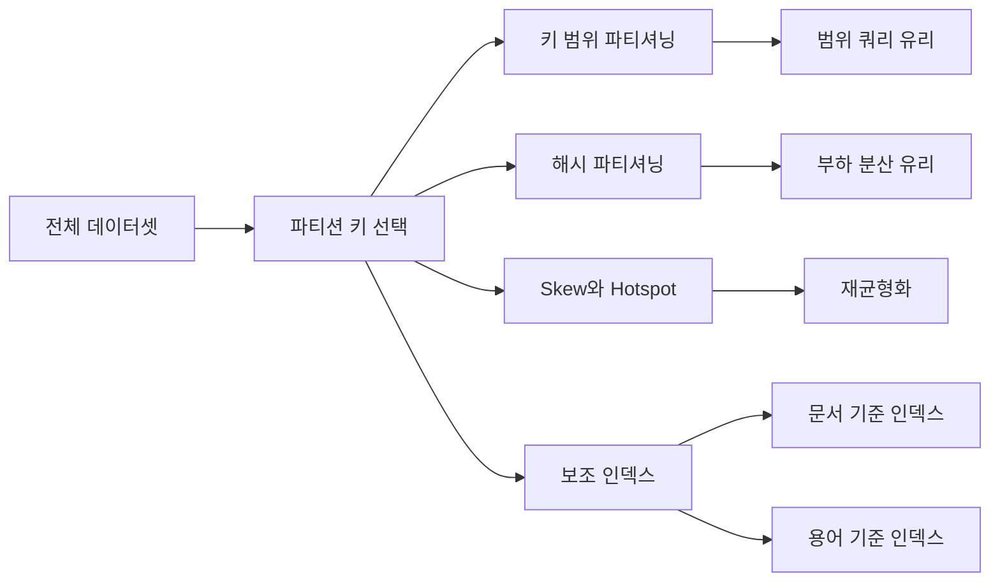

- 목표는 데이터를 파티션 전체에 균등하게 분산시키는 것입니다.
- Partitioning by key range
  - 연속적인 범위의 키를 파티션에 할당
  - 데이터가 균등하게 분산되지 않으면 범위가 균등하게 배치되지 않습니다.
  - 경계는 수동으로 선택하거나 자동으로 선택할 수 있습니다.
    - Automatic used with automated rebalancing
  - 데이터를 정렬된 순서로 저장할 수 있어 범위 쿼리가 효율적입니다.
  - 범위 분할로 인해 쉽게 핫스팟이 발생할 수 있다는 점에 주의하세요.
- Partitioning by hash of key
  - 해시 함수는 편향된 데이터를 균일하게 분산시키지만 암호화가 강력할 필요는 없습니다.
  - 연속된 범위의 해시 값을 파티션에 할당
  - 이제 범위 쿼리가 어려워지고 일부 제품/쿼리에서는 지원되지 않습니다.
    - Cassandra는 복합 기본 키를 허용하며 첫 번째 열에서는 범위 쿼리를 수행할 수 없지만 두 번째 열(및 추가 열)에서는 수행할 수 있습니다.

### Skewed workload와 hot spot 완화
- 해싱은 일반적으로 키 전체에 걸쳐 요청을 균등화하지만 핫스팟이 없음을 보장하지는 않습니다.
- 동일한 키에 대한 요청 수가 너무 많아도 여전히 핫스팟이 남아 있습니다.
- 대부분의 시스템은 이러한 유형의 상황을 자동으로 해결할 수 없습니다.
- 임의의 값으로 키를 확장하면 해시 전체에 배포가 강제되지만 모든 키에 대해 수행하기에는 너무 많은 오버헤드가 추가됩니다.
  - 특수한 경우의 대용량 키에 대한 적용은 여전히 ​​달려 있습니다.

### 파티셔닝 및 보조 인덱스
- 보조 인덱스는 일반적으로 고유하지 않음을 알림
- 일부 키-값 저장소는 보조 인덱스를 지원하지 않지만 점점 일반화되고 있습니다.
- 문서별로 보조 인덱스 분할
  - 지역 인덱스입니다.
  - 각 파티션은 해당 파티션의 키에 대한 자체 보조 인덱스를 유지합니다.
  - 업데이트가 필요한 모든 보조 인덱스가 키/문서와 동일한 파티션에 있으므로 쓰기가 쉽습니다.
  - 그러나 읽기는 분산/수집이라고 하는 모든 파티션으로 전송되어야 합니다.
    - 모든 파티션이 응답할 때까지 동기적으로 기다려야 하기 때문에 분산/수집은 지연 시간 증폭을 지연시키는 경향이 있습니다.
- 용어별로 보조 인덱스 분할
  - 이는 글로벌 지수이지만 핫스팟을 피하기 위해 여전히 분산되어야 함
  - 일반적으로 용어로 분할된 보조 인덱스는 해시된 값이 아닌 값(용어) 범위를 사용합니다.
  - 보조 인덱스 액세스를 사용한 읽기에는 일반적으로 하나/몇 개의 파티션만 필요합니다.
    - 참고: 보조 인덱스가 많은 문서를 반환하는 경우 문서가 여러 파티션에 분산될 가능성이 높습니다.  복잡성이 클라이언트에 숨겨지더라도 이는 여전히 성능에 영향을 미칩니다.
  - 그러나 쓰기는 존재하는 각 보조 인덱스에 대해 다른 파티션을 업데이트해야 할 수 있으므로 더 복잡합니다.
- 이러한 이유로 글로벌 보조 인덱스 업데이트는 비동기식인 경우가 많습니다.

### 파티션 재조정
- 하드웨어를 추가하거나 노드 오류가 발생하면 한 노드에서 다른 노드로 요청을 이동해야 합니다.
- 이러한 노드 간 작업 부하 이동 프로세스를 재조정이라고 합니다.  목표는 다음과 같습니다:
  - 재조정 중에도 읽기 및 쓰기는 계속 지원됩니다.
  - 이후 노드 간 부하가 공정하게 공유됩니다.
  - 재조정 중에 이동되는 데이터의 양을 최소화하십시오.

### 리밸런싱 전략
- 하지 않는 방법: 해시 모드 N. 이렇게 하면 매번 엄청난 양의 데이터 이동이 발생합니다.
- 고정된 수의 파티션
  - 노드당 하나의 파티션이 아닌, 노드 수보다 훨씬 많은 파티션을 생성
  - 한 노드의 모든 작은 파티션은 이미 다른 노드에 있는 데이터에 영향을 주지 않고 다른 노드에 재배포될 수 있습니다.
  - 파티션 수와 파티션에 대한 키 할당은 재조정의 영향을 받지 않습니다.
  - 이론적으로 하드웨어가 고르지 않은 경우 응답 시간이 상대적으로 일관되도록 느린 노드에 의도적으로 더 적은 수의 파티션을 제공할 수 있습니다.
  - 상당한 데이터베이스 증가가 예상되는 경우(수배 규모) 적절한 파티션 수를 선택하는 것이 어려울 수 있습니다.
- 동적 파티셔닝
  - 키 범위 파티셔닝을 사용하는 데이터베이스에 고정 파티션이 있는 경우 데이터가 고르지 않게 분산되기 쉬우며 수동 변경이 매우 어려울 수 있습니다.
  - 동적 파티셔닝은 파티션이 특정 크기를 초과하면 파티션을 분할하고, 다른 크기 임계값 아래로 떨어지면 파티션을 다른 파티션과 병합합니다.
  - 데이터 크기에 따라 파티션 수가 증가합니다.
    - 노드당 하나의 파티션으로 빈 데이터베이스를 초기화할 수 있습니다.
- 노드에 비례하여 파티셔닝
  - 고정된 수의 파티션이나 고정된 크기 범위의 파티션 대신 노드 수에 비례하는 고정된 수의 파티션(즉, 노드당 고정된 수의 파티션)을 갖습니다.
  - 데이터베이스 크기에 따라 워크로드가 증가하는 경우가 많기 때문에 노드 수는 데이터베이스 크기에 따라 증가하는 경우가 많습니다.  이는 실제로 파티션의 크기가 어느 정도 안정적으로 유지된다는 것을 의미합니다.
  - 노드가 추가되면 분할할 기존 파티션 수를 선택하고 각 파티션의 절반을 차지합니다.
    - 분할할 파티션을 무작위로 선택하면 가능성은 낮지만 불공평한 분할이 발생할 수 있습니다.  Cassandra 3.0에는 균형을 보장하는 알고리즘이 있습니다.

### 작업: 자동 또는 수동 재조정
- 재조정은 완전 자동, 완전 수동 또는 그 사이에서 수행될 수 있습니다(예: 파티션 재할당을 제안하지만 관리자의 승인이 필요함).
- 완전 자동의 한 가지 위험은 재조정으로 인해 많은 데이터가 이동하고 재조정이 잘못된 시간에 시작될 경우 시스템 성능이 저하될 수 있다는 것입니다.
- 또 다른 문제는 자동 오류 감지 간의 잠재적인 상호 작용입니다.  원래 오류가 과도한 로드와 관련된 경우 재조정을 시작하면 로드 문제가 더 악화될 수 있습니다.

### 라우팅 요청
- 노드를 이동하고 재조정할 수 있으므로 클라이언트는 각 요청을 어디로 보낼지 어떻게 알 수 있습니까?  서비스 검색 문제의 경우입니다.  세 가지 높은 수준의 디자인:
- 클라이언트는 임의의 노드로 전송하고, 배후의 노드는 필요할 때 요청을 적절한 파티션으로 전달합니다.
  - 클라이언트는 중간 라우팅 계층으로 전송하고 해당 계층은 요청을 전달합니다.
  - 클라이언트는 파티셔닝을 추적하고 올바른 노드로 직접 이동합니다.
- 모든 경우에 파티션 변경 사항을 추적해야 하는 노드/계층/클라이언트가 있습니다.
  - 9장에서 논의된 합의는 어려울 수 있음
  - 많은 시스템은 클러스터/파티션 메타데이터를 추적하기 위해 Zookeeper와 같은 외부 서비스를 사용합니다.
  - Cassandra와 Riak은 가십 프로토콜을 사용하여 변경 사항을 전달합니다.  노드는 배후에서 요청을 전달하므로 클라이언트를 방해하지 않고 아직 업데이트를 알지 못한 엣지 케이스를 처리할 수 있습니다.

### 병렬 쿼리 실행
- 분석 사용 사례의 경우 (여러 키에서) 많은 양의 데이터를 원하는 경우가 많습니다.  대부분의 NoSQL 구현은 단순 읽기만 지원하고 분산/수집도 지원합니다.
- 일부 관계형 제품은 복잡한 조인, 그룹화, 집계 및 필터링이 포함된 쿼리를 여러 노드에서 병렬로 조정할 수 있는 대규모 병렬 처리(MPP)를 지원합니다.  일반적으로 최적화 프로그램은 모든 활동을 조정합니다.  자세한 내용은 10장에서 설명합니다.

### 요약
- 파티셔닝에 대한 두 가지 주요 접근 방식은 키 범위와 해시 파티셔닝입니다.
- 보조 인덱스는 문서 분할 또는 용어 분할이 가능합니다.
- 요청 라우팅은 반드시 처리해야 할 기술적 장애물입니다.
- 여러 파티션에 정보를 쓰는 작업에는 매우 복잡한 실패 모드가 있습니다.  앞으로 더 많은 내용이 추가될 예정입니다(8장 및 9장).

## Chapter 7. 트랜잭션

### 소개
- 이 장에서는 항상 잘못될 수 있는 일이 있다는 것을 다룹니다.
- 트랜잭션은 특정 보장을 제공하여 애플리케이션의 프로그래밍 모델을 단순화하는 방법이므로 애플리케이션은 특정 오류 모드나 동시성 문제에 대해 걱정할 필요가 없습니다.
- 트랜잭션은 하나의 단위로 묶인 일련의 작업으로, 시스템은 위에서 언급한 특정 보증 세트를 제공합니다.
- 이 장에서는 시스템이 제공하는 보장의 종류에 대해 설명하고 이러한 다양한 수준에서 해결할 수 있는 여러 가지 경쟁 조건을 열거합니다.
- 트랜잭션의 개념은 분산 데이터베이스에 적용되지만, 이 장의 예제는 보다 간단한 예제로 주제를 소개하기 위해 모두 단일 노드 관점에서 구성되었습니다.

### ACID의 의미

> 개념 흐름

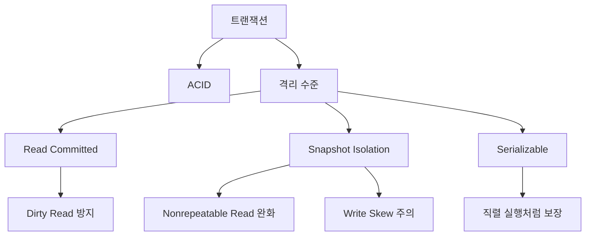

- 트랜잭션을 통해 제공되는 안전 보장은 원자성(Atomicity), 일관성(Consistency), 격리성(Isolation) 및 내구성(Durability)을 뜻하는 잘 알려진 약어 ACID로 특징지어지는 경우가 많습니다.
- 구현이 다르며 ACID 준수 주장은 특히 격리 부분에서 다른 의미를 갖습니다.
- 원자성 - 모든 쓰기가 성공하거나 모두 실패합니다.  오류가 발생하면 부분 쓰기를 취소해야 합니다.
- 일관성(Consistency) - 이 맥락에서는 DB가 항상 일관된 상태에 있음을 의미하는 데 사용됩니다.
  - 사용자는 아마도 이를 불변 속성이 항상 참으로 유지된다고 해석할 것입니다.
  - 그러나 불변성을 보존하는 것은 실제로 애플리케이션이 트랜잭션에서 작업을 차단하는 방식에 관한 것입니다.
  - 따라서 일관성은 실제로 애플리케이션 속성이므로 데이터베이스 보장 세트의 일부가 되어서는 안 됩니다.
- 격리 - 정의는 동시 트랜잭션이 서로 전혀 간섭하지 않지만 완전히 사실인 경우는 거의 없다는 것입니다.
  - 전혀 간섭하지 않는 것은 직렬성, 즉 트랜잭션이 실제로 일부 또는 전체 부분이 동시에 실행되었을지라도 한 번에 하나씩(어떤 순서로) 실행된 것처럼 작동하는 것입니다.
  - 비용이 많이 들기 때문에 대부분의 시스템은 완전한 직렬화 기능을 제공하지 않습니다.
  - 이 장의 나머지 부분은 대부분 격리에 관한 것입니다.
- 내구성 - 거래 성공이 보고되면 기록된 모든 데이터가 손실되지 않습니다.
  - 실제로 이는 매우 직관적입니다. 데이터가 디스크에 기록되었습니다
  - 기술적으로 (여러) 디스크에 장애가 발생할 수 있으며, 기타 스토리지 이상으로 인해 디스크에 기록된 데이터가 100.0% 완전히 안전하지 않음을 의미합니다.

### 단일 개체 및 다중 개체 작업
- ACID에서는 트랜잭션이 여러 쓰기를 수행하는 경우 두 가지 보장이 제공됩니다.
  - 도중에 오류가 발생하면 트랜잭션을 중단해야 하며 지금까지 수행된 모든 쓰기를 롤백/실행 취소해야 합니다.  쓰기는 전부 아니면 전무입니다.
  - 동시 트랜잭션은 서로 간섭해서는 안 됩니다.  다른 트랜잭션에서는 쓰기가 모두 표시되거나 전혀 표시되지 않지만 일부 적절한 하위 집합은 표시되지 않습니다.
- 단일 객체 쓰기에는 보장이 필요할 수 있습니다(예: 대규모 JSON 문서 작성).
- 트랜잭션에 여러 개체가 있는 경우 시스템이 동일한 트랜잭션에 속하는 작업을 알아야 하는 복잡성이 추가됩니다.
- 사용자가 여러 객체를 업데이트하고 있다고 생각하지 않더라도 다중 객체 트랜잭션의 필요성이 발생합니다.
- 비정규화된 데이터를 업데이트하려면 한 번에 여러 위치를 업데이트해야 합니다.
  - 항목이 삽입/업데이트/삭제될 때 보조 인덱스를 업데이트해야 합니다.
- 거래 보장은 오류 발생 후 안전하게 재시도할 수 있음을 의미하지만 대부분의 시스템은 자동으로 그렇게 하지 않습니다.
  - 많은 ORM(객체 관계형 매핑) 레이어에서는 이 작업을 수행하지 않습니다.
  - 안전하더라도 재시도가 의미가 없을 때가 있습니다. 제약 조건 위반

### 약한 격리 수준
- 더 나은 확장성을 제공하기 위해 직렬화 가능보다 약한 격리 수준이 구현되었습니다.
- 대부분의 시스템은 직렬성을 제공하지 않기 때문에 저자는 “무작정 도구에 의존하기보다는 존재하는 동시성 문제의 종류와 이를 방지하는 방법에 대한 올바른 이해가 필요하다”고 설명합니다.
- 약한 격리 수준을 강도가 높은 순서대로 나열하고 이를 통해 예방할 수 있는 6가지 경쟁 조건을 나열합니다(해당 난이도 순서).
- 참고: 트랜잭션이 성공적으로 완료되면 커밋되었다고 합니다.  커밋되지 않은 쓰기라는 용어는 아직 완료되지 않은 트랜잭션의 일부인 쓰기를 나타냅니다.  커밋되지 않은 쓰기는 결국 커밋되거나 롤백될 수 있습니다.
- 참고: 이 토론에서는 다양한 종류의 잠금에 대해 설명합니다.  자물쇠에 익숙하지 않은 경우 Wikipedia에 간단한 설명이 있습니다: https://en.wikipedia.org/wiki/Record_locking.  더 자세한 내용은 다음과 같습니다: https://www.methodsandtools.com/archive/archive.php?id=83.

### Dirty read
- 각주에만 언급된 가장 약한 격리 수준은 시스템이 하나의 경쟁 조건(더티 쓰기)만 방지하는 것입니다.
- 더티 쓰기 - 한 트랜잭션이 다른 트랜잭션의 동일한 객체에 대한 커밋되지 않은 쓰기를 덮어씁니다.
  - 이 책은 자동차를 판매하려면 누가 차를 샀는지에 대해 한 번 쓰고 송장을 생성하기 위해 두 번째 쓰기가 필요한 더티 쓰기 상황의 예를 제공합니다.  더티 쓰기를 사용하면 자동차를 한 사람에게 판매할 수 있지만 송장은 다른 사람에게 보낼 수 있습니다.
- 구현:
  - 일반적으로 더티 쓰기는 행 수준 잠금을 사용하여 방지됩니다.  쓰기 전에 배타적 잠금을 얻습니다.  동일한 객체를 쓰려고 하는 다른 트랜잭션은 차단됩니다.
- 커밋되지 않은 읽기는 다른 프로세스에 의한 쓰기가 발생하지 않을 것으로 예상되는 분석 워크로드에 사용됩니다.
- 커밋되지 않은 읽기는 읽기에 오버헤드가 없기 때문에 읽기 워크로드에 대해 빠른 성능과 최대 동시성을 제공합니다.

### Read committed
- 더티 쓰기 외에도 읽기 커밋을 통해 더티 읽기를 방지합니다.
- 더티 읽기 - 한 트랜잭션은 커밋되기 전에 다른 트랜잭션의 쓰기를 읽습니다.
  - 더티 읽기를 통해 다른 트랜잭션이 이 트랜잭션의 일부 쓰기 집합을 볼 수 있습니다.
  - 더티 읽기가 발생한 후 이 트랜잭션이 롤백되면 더티 읽기를 통해 다른 트랜잭션이 실제로 기록되지 않은 값을 볼 수 있습니다.
- 구현:
  - 더티 읽기는 읽기 전에 공유 읽기 잠금을 획득하고(쓰기가 위에서 언급한 배타적 잠금을 사용한다고 가정) 읽기 후 즉시 해제함으로써 방지할 수 있습니다.  느린 쓰기로 인해 다른 트랜잭션이 차단되면 성능이 저하될 수 있습니다.
- Alternative is to record the value of each object before it is written, and return that old value to all other transactions until the writing transaction completes.
- 읽기 커밋은 구현하기 쉽고, 우수한 동시성을 제공하며, 트랜잭션이 없는 것보다 훨씬 낫기 때문에 매우 일반적입니다.
- 그러나 많은 사람들은 커밋된 읽기가 여전히 수많은 경쟁 조건을 허용한다는 사실을 깨닫지 못합니다.

### Snapshot isolation과 repeatable read
- 모든 스냅샷 격리 구현이 동일한 것은 아닙니다.  위의 내용 외에도 모두 읽기 편향을 방지합니다.  일부는 업데이트 손실을 방지하기도 합니다.
- 스냅샷 격리를 사용하면 트랜잭션이 단일 시점의 모든 데이터에 대한 일관된 스냅샷을 읽을 수 있습니다.
  - 일부 제품에서는 스냅샷 격리를 "반복 가능 읽기"라고 부릅니다.  혼란을 더하기 위해 다른 제품은 "반복 읽기"로 인해 다른 의미를 갖습니다.
- 스냅샷 격리는 데이터베이스 백업, 일관성 확인 및 장기 실행 분석 쿼리에 중요합니다.
- Read skew (nonrepeatable reads) -- A transaction sees different parts of the database at different points in time (due to write activity from other users).
  - 이 책에서는 사용자가 두 계좌의 은행 잔고를 읽는 예를 제시하며, 여기서 계좌 간 이체가 별도로 발생합니다.  It’s okay if the user sees both before values or both after values, but read skew is when one account sees the before value and the other sees the after value.
- 구현:
  - 더티 쓰기를 방지하기 위해 쓰기 잠금이 계속 사용됩니다.
  - 스냅샷 격리 동작은 일반적으로 MVCC(다중 버전 동시성 제어)로 구현됩니다.
    - 각 거래는 고유하고 항상 증가하는 거래 ID 번호를 갖습니다.
    - 모든 쓰기는 트랜잭션 ID로 추적됩니다.
    - 트랜잭션이 실행되면 이미 진행 중이거나 이후에 시작된 트랜잭션의 값을 무시합니다.
- 업데이트 손실 - 두 트랜잭션이 동일한 객체에 대해 읽기-수정-쓰기 주기를 동시에 수행합니다. 한 트랜잭션은 다른 트랜잭션의 변경 사항을 통합하지 않고 다른 트랜잭션의 쓰기를 덮어쓰므로 데이터가 손실됩니다.
- 업데이트 손실 상황은 다음을 통해 줄일 수 있습니다.
  - 원자 쓰기 작업
    - 예: UPDATE 카운터 SET 값 = value + 1 WHERE key = 'foo';
  - 업데이트 잠금을 수동으로 설정
    - 예: SELECT value FROM counters WHERE key = 'foo' FOR UPDATE;
  - 원자 비교 및 설정 작업
  - 데이터 복사본이 여러 개 있기 때문에 복제로 인해 잠금 및 비교 및 설정 작업이 더욱 복잡해집니다.
- 스냅샷 격리의 일부 구현에서는 손실된 업데이트를 자동으로 감지합니다.

### Write skew와 phantom
- 마지막 두 경쟁 조건은 완전한 직렬화를 통해서만 방지할 수 있습니다.
- 쓰기 편향 - 트랜잭션은 무언가를 읽고, 읽은 내용에 따라 결정을 내리고, 결정에 따라 값을 씁니다.  트랜잭션이 실행되는 동안 다른 객체에 대한 다른 쓰기로 인해 결정이 더 이상 정확하지 않습니다.
- 팬텀 읽기(Phantom reads) - 트랜잭션이 일부 기준과 일치하는 개체를 읽습니다.  또 다른 트랜잭션은 검색 기준에 영향을 미치는 새 레코드를 생성하는 쓰기를 수행합니다. 스냅샷 격리는 간단한 팬텀 읽기를 방지하지만 쓰기 왜곡 컨텍스트의 팬텀에는 인덱스 범위 잠금과 같은 특별한 처리가 필요합니다.
  - 충돌 구체화는 실제 데이터를 저장하지 않고 격리 목적으로만 잠금 집합을 생성하는 방법입니다.  오류가 발생하기 쉬울 수 있습니다.

### Serializable 보장
- 직렬화 가능 격리는 트랜잭션이 단독으로 실행될 때 올바르게 실행되는 경우 동시에 실행될 때도 여전히 올바르게 실행되도록 보장하는 유일한 방법입니다.
- 사용하지 않는 이유는 비용과 성능 때문

### 실제 serial execution
- 단일 스레드에서 모든 트랜잭션을 실행합니다.
- 인메모리 데이터베이스가 있는 경우 트랜잭션이 너무 빨라서 하나의 코어에 하나의 스레드만 있어도 계속 유지할 수 있습니다.
- 트랜잭션이 단일 저장 프로시저 호출이 되도록 요구하면 트랜잭션 내부 명령문 간의 사용자/애플리케이션 지연을 방지할 수 있습니다.
- 각 스레드가 별도의 데이터 파티션에서 작동하는 경우 여러 코어에서 실행할 수 있지만 파티션 간 트랜잭션은 매우 제한되어야 합니다.
- 트랜잭션을 중단하고 모든 데이터가 메모리에 로드된 후 다시 시도하는 안티 캐싱은 직렬 실행을 지원하는 흥미로운 전략입니다.

### 2단계 잠금(2PL)
- 일반적으로 잠금으로 구현됩니다.  읽기에는 공유 잠금이 필요하고 쓰기에는 배타적 잠금이 필요합니다.  블록 쓰기를 읽고 블록 읽기를 씁니다.
  - 한번 획득한 잠금은 거래가 끝날 때까지 유지되어야 합니다.
  - 이론적으로 조건자 잠금은 관련 데이터 범위를 제한할 수 있지만 실행 속도가 느립니다.
  - 일반적으로 인덱스 범위 잠금이 대신 사용됩니다.
    - 정확한 기준을 구현하기 어려운 경우 상위 집합을 잠글 수 있습니다.
    - 최악의 경우 테이블 전체가 잠길 수 있습니다.
- 잠금 오버헤드는 하나의 부정적이지만 실제 문제는 트랜잭션이 다른 트랜잭션에 의해 차단되기가 너무 쉽기 때문에 동시성이 열악할 수 있다는 것입니다.
- 하나는 다른 하나가 잠금을 해제하기를 기다리고 다른 하나는 첫 번째 트랜잭션이 잠금을 해제하기를 기다리는 사이클에 두 개 이상의 트랜잭션이 포착될 수 있습니다.  이 상황은 저절로 해결되지 않으며 교착 상태라고 합니다.
  - 교착 상태를 자동으로 감지하고 하나의 트랜잭션이 종료됩니다.
  - 의도 잠금은 교착 상태를 방지하는 데 도움이 될 수 있습니다.

### 직렬화 가능한 스냅샷 격리(SSI)
- 상대적으로 새로운 알고리즘은 낙관적 동시성 제어 기술입니다.
- 동시성을 허용하고 커밋 시 격리 위반 여부를 감지합니다.
- 경합이 높은 최악의 경우는 많은 트랜잭션이 중단되는 것입니다.
- 스냅샷 격리 MVCC를 기반으로 구축
  - 이 트랜잭션이 커밋되기 전에 커밋된 오래된 MVCC 읽기를 감지합니다.
  - 이전 읽기에 영향을 미치는 쓰기를 감지합니다.

## Chapter 8. 분산 시스템의 골칫거리

- 이 장에서는 사물의 비관적인 측면을 살펴봅니다.
- 잘못될 수 있는 모든 일이 잘못될 것이라고 가정
- 분산 시스템을 사용하면 더 많은 실패 모드가 있습니다.
### 오류 및 부분 오류

> 개념 흐름

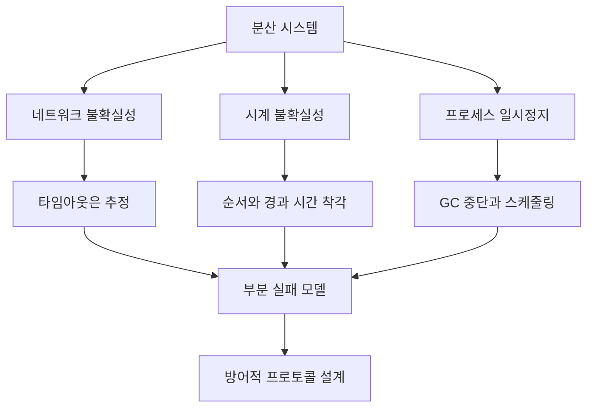

- 적절한 코드가 있는 단일 시스템 애플리케이션에서는 애플리케이션이 작동하거나 작동하지 않습니다.
  - 하드웨어에 오류가 발생하면 시스템이 완전히 충돌합니다.
- 분산 시스템을 사용하면 상황이 좀 더 모호해질 수 있습니다.
  - 개별 시스템이 실패하거나 시스템 그룹이 실패할 것이라는 것을 알고 있지만 계속 작동하려면 전체 시스템이 필요합니다.
  - 어떤 시스템이 실패했는지 정확히 알 수 없는 경우도 있습니다. 부분적인 실패만 있었을 수도 있고, 한 부분은 작동하지만 다른 부분은 작동하지 않거나 신뢰할 수 없는 경우도 있습니다.

### 클라우드 컴퓨팅 및 슈퍼컴퓨팅
- 고성능 컴퓨터(슈퍼컴퓨터)는 긴밀하게 네트워크로 연결되어 통합되어 작동하며, 단일 컴퓨터에 더욱 긴밀하게 기능합니다.
  - 일반적으로 체크포인트 작업이 이루어지며 실패하면 간단히 중지됩니다.
  - 시스템이 수리되면 체크포인트가 재개되고 컴퓨팅이 계속됩니다.
- 클라우드 컴퓨팅은 다양한 종류의 시스템, 데이터 센터 및 국가에 분산될 수 있는 보다 느슨하게 네트워크로 연결된 시스템입니다.
  - 일반적인 글로벌 웹 애플리케이션으로, 수리를 위해 전체 시스템을 중지하는 것은 허용되지 않습니다.
  - 낮은 대기 시간이 필요합니다.
- 시스템이 클수록 깨뜨릴 부분이 많아집니다. 충분히 큰 시스템에서는 무언가가 항상 손상된다고 가정하는 것이 안전합니다.
- 부분적인 오류가 발생할 것이라고 가정하고 애플리케이션에 내결함성을 구축해야 합니다.
### 신뢰할 수 없는 네트워크
- 네트워크가 느리고 불안정하며, 많은 양의 정보를 공유하기 어렵습니다.
  - 이러한 제한으로 인해 아무것도 공유하지 않는 것을 염두에 두고 구축해야 합니다.
- 대부분의 네트워크는 비동기 패킷 네트워크입니다. 정보 전송에 대한 보장은 없습니다.
  - 요청이 손실될 수 있습니다.
  - 다른 트래픽으로 인해 요청이 지연될 수 있습니다.
  - 요청 수신자가 사망했을 수 있습니다.
  - 수신기가 일시적으로 응답하지 않을 수 있습니다.
  - 요청을 받았지만 응답이 손실되었습니다.
  - 요청을 받고 응답을 보냈으나 지연됨
- 응답이 없는 이유를 정확히 알 수 없음
  - 재시도하기 전의 합리적인 시간을 결정하기 위해 타임아웃을 사용하거나 무언가가 실패했다고 생각하는 것이 가능합니다.
### 실제 네트워크 오류
- 네트워크 하드웨어의 신뢰성은 점점 높아지고 있지만 인적 오류는 항상 존재합니다.
- EC2와 세계 최고 수준의 데이터 센터에도 여전히 문제가 있습니다.
- 애플리케이션에서 허용하는 경우 일시적인 중단 시 오류 메시지만 표시해도 괜찮습니다. 항상 완벽하게 내결함성을 가질 필요는 없습니다.
### 오류 감지
- 실패한 시스템을 감지할 수 있어야 합니다. 그렇지 않으면 시스템이 누적되어 요청이 다운된 시스템으로 계속 이동하여 전체 네트워크 속도가 느려지고 실제 응답에 대한 대기 시간이 늘어납니다.
  - 로드 밸런서는 다운된 노드를 제거해야 합니다.
  - 단일 리더 시스템에서는 리더가 다운되면 새 리더를 할당할 수 있어야 합니다.
- 시스템이 여전히 작동 중이지만 애플리케이션에 문제가 발생한 경우 시스템은 존재하지만 작동하지 않는다는 반환을 받을 수 있습니다.
- 어떤 요청을 받고 응답하지 않았는지, 어떤 데이터가 전송되었으나 손실되었는지 알 수 있는 방법이 없습니다.
  - OS가 실패했음을 직접 알리는 것이 가능하므로 다른 시스템이 시간 초과를 기다릴 필요가 없습니다.
- 네트워크가 밀접하게 연결된 경우 원격 관리 도구를 사용하여 시스템을 확인할 수 있습니다.
### 시간 초과 및 unbounded delay
- 정확한 제한 시간을 결정하기가 어렵습니다.
  - 단순히 속도 저하 때문에 시스템이 조기에 종료되고 시스템이 종료되었다고 선언하고 싶지 않습니다.
  - 시스템이 다운된 노드에 대해 과도한 시간을 기다리는 것을 원하지 않습니다.
- 지연이 무한정 있습니다. 정보 제공 시점에 대한 보장은 없습니다.
- 어떤 종류의 큐로 인해 지연이 발생하는 경우가 많습니다.
  - 여러 시스템이 동일한 시스템에 정보를 보내려고 하면 수신된 순서에 관계없이 모두 처리해야 하지만 일부는 기다려야 합니다.
  - 시스템의 모든 CPU 코어가 사용 중이면 정보를 처리하기 위한 주기를 기다려야 합니다.
  - 가상 시스템에서는 다른 VM이 작업을 수행하는 동안 일시적으로 정지될 수 있습니다.
- 네트워킹 용량을 사용하여 지연을 유발하는 시끄러운 이웃이 있을 수 있습니다.
- 적절한 타임아웃 길이를 실험적으로 결정해야 함
### 동기식 네트워크와 비동기식 네트워크 비교
- 고정 전화선과 같은 시스템은 동시에 작동합니다.
  - 고정되고 일정한 트래픽 양은 통신에 적합한 양의 대역폭을 제공하고 특정 대기 시간을 보장합니다.
  - 지연은 제한되어 있습니다.
- 네트워킹에 이러한 보장이 있으면 좋겠지만 함정도 있습니다.
- 이더넷과 IP는 패킷 교환 프로토콜이므로 큐가 필요하며 이로 인해 무한한 지연이 발생합니다.
  - 버스트가 많고 유연한 트래픽에 더 적합합니다.
  - QoS 및 승인 제어를 사용하면 거의 제한된 지연을 얻을 수 있습니다.
### 신뢰하기 어려운 clock
- 타이밍은 여러 가지 이유로 분산 애플리케이션에 매우 중요합니다.
  - 요청 시간이 초과되었는지 확인
  - 99번째 백분위수 응답 시간
  - 지난 5분 동안 수신된 쿼리 수
  - 기타
- 때로는 사물의 지속 시간(x가 발생한 후 5초)을 측정하는 것이 중요하지만 다른 경우에는 절대 시점(토요일 12시)이 중요합니다.
- 분산 시스템에서는 모든 사람이 동의하지 않기 때문에 시간이 까다롭습니다.
- 각 시스템에는 시간을 추적하기 위한 수정 발진기가 있을 가능성이 높지만 특별히 정확하지는 않습니다.
- NTP(네트워크 시간 프로토콜)는 일종의 시간 권한과 동기화하여 동의를 얻으려고 시도하지만 여전히 대기 시간 및 기타 문제가 발생할 수 있습니다.
### monotonic clock과 wall-clock time 비교
- 시간 시계/벽시계 시간 - 날짜/시간을 대략적으로 알 수 있도록 에포크 이후의 시간에 맞춰 정렬됨
  - 재동기화될 수 있으므로 관련 작업에는 적합하지 않습니다. 시간 여행을 하는 것처럼 보일 수도 있습니다
- 단조 시계 - 기본적으로 경과된 시간을 알려주는 상수 카운터
  - 물건의 순서를 추적하는 데 좋습니다.
  - 사물의 지속 시간을 측정하는 데는 더 좋지만 여전히 불완전합니다.
### 시계 동기화 및 정확도
- 석영 크리스털 기반 시간 표시는 하루에 최대 17초까지 표류할 수 있습니다.
- 드리프트 동기화가 충분하면 동기화가 거부되거나 강제로 재설정되어 시간 점프가 발생할 수 있습니다.
- 네트워크 지연만큼 좋은 NTP 동기화
- NTP가 틀리거나 약간 어긋날 가능성이 있음
- 가상 머신은 기본적으로 정지되어 시간이 흐를 수 있습니다.
- 사람들이 의도적으로 컴퓨터 시계를 변경할 수도 있습니다.
### 시계 동기화에 의존
- 때로는 타이밍의 작은 불일치가 매우 중요할 수 있습니다.
- 비동기화가 완료될 때까지 일반적으로 치명적인 오류가 발생하지 않기 때문에 시간에 따른 비동기화를 말하기 어렵습니다.
- 요청이 순서대로 발생하는지 확인하기 위해 이벤트에 타임스탬프를 찍는 데 유용하지만 시간이 합의되지 않으면 많은 문제가 발생할 수 있습니다.
- 마지막 쓰기 성공 시나리오에서는 마지막 쓰기가 실제로 마지막 쓰기가 아닐 수 있으며 최신 정보가 덮어쓰이거나 손상될 수 있습니다.
- 시간 기록은 이 문제를 해결할 만큼 정확하기가 쉽지 않습니다.
- 시계 판독값은 요청이 실제로 다른 요청보다 앞에 있는지 또는 어느 것이 먼저 왔는지에 대한 불확실성이 있는지를 결정하는 데 유용한 신뢰 구간을 가질 수 있습니다.
- 특정 시점까지 모든 정보를 백업하는 데 시간을 사용할 수 있지만 시스템이 실제 시간에 동의하지 않으면 정보가 손실될 수 있습니다.
### 프로세스 일시 중지
- 리더가 누구인지 확인하기 위해 임대를 사용할 수 있음
  - 리더는 리더를 유지하려면 주기적으로 임대를 갱신해야 합니다.
  - 시스템이 잠시 일시 중지되고 임대 갱신이 누락될 수 있지만 여전히 해당 기간 동안 시스템이 리더라고 가정하고 문제가 있는 쓰기를 수행합니다.
- 실시간 보장이 가능한 시스템을 만드는 것이 가능하지만 개발 비용이 훨씬 더 많이 들고 특정 운영 체제와 프로그래밍 언어가 필요합니다.
- 긴 가비지 수집 호출로 인해 상당한 일시 중지가 발생할 수 있습니다.
### 지식, 진실, 그리고 거짓말
- 결함이 있을 수 있는 감각에 기초하여 현실이 무엇인지 판단하기 어려움
### 진실은 다수에 의해 정의됩니다
- 분산 시스템에서는 몇 가지 사항에 대한 합의가 필요합니다. 특정 조치를 취하려면 과반수 또는 기타 기준이 필요합니다.
- 한 노드는 자신이 여전히 리더라고 생각할 수 있지만 다른 모든 노드는 이에 동의하지 않고 새 리더로 이동했습니다.
- 이를 완화하기 위해 임대 또는 잠금과 같은 방법을 사용할 수 있지만 타이밍은 여전히 문제를 일으킬 수 있습니다.
- 리더는 임대를 확인하고 잠시 멈추고 임대를 갱신하지 않고 다른 시스템이 인계받은 후 자신이 여전히 리더라고 믿을 수 있습니다.
- 오래된 토큰을 사용할 때 이전 리더가 쓰기를 시도하는 것을 차단하는 증가 카운터인 펜싱 토큰을 사용하는 것이 좋습니다.
### 비잔틴 결함
- 이런 종류의 관용을 구축하는 것이 항상 필요한 것은 아니지만 생각해 보면 좋습니다.
- 여러분 중에 나쁜 액터가 있을 수 있으며 이에 맞서 싸우려면 다수와 동의를 얻어야 합니다.
- 시스템이 의도적으로 나쁜 정보를 보내는 것이 아니라 실수로 거짓말을 할 수도 있습니다.
### 시스템 모델과 현실
- 모델
  - 동기식 - 제한된 네트워크 지연 및 시간 드리프트
  - 부분적으로 동기식 - 네트워크 지연 및 시간 드리프트가 발생할 때 때때로 비동기식 속성
  - 비동기식 - 타이밍 가정 없음
- 결함
  - 충돌 중지 - 노드에 오류가 발생하면 영구적으로 중지됩니다.
  - 충돌 복구 - 오류가 발생하여 죽은 것처럼 보일 수 있지만 나중에 복구될 수 있습니다.
  - 비잔틴 - 노드는 무엇이든 할 수 있으며 심지어 의도적으로 속이고 속일 수도 있습니다.
- 일반적으로 부분 동기식 및 충돌 복구는 대부분의 시스템이 모델/결함 매트릭스에 속하는 곳입니다.
### 좋은 이론과 연구는 많지만 지저분한 세상에서는 많은 일이 일어날 수 있으며 다양한 시나리오에 대비해야 합니다.

## Chapter 9. 일관성과 합의

### 소개
- 우리는 빌딩 블록을 살펴봤고, 지난 장에서는 분산 시스템에서 잘못될 수 있는 모든 것에 대해 논의했습니다.
- 이 장에서는 가장 어려운 문제 중 하나인 합의를 해결하는 몇 가지 방법에 대해 설명합니다. 우리는 이것이 매우 까다롭고 접근 방식이 어렵거나 비용이 많이 들 수 있음을 알게 될 것입니다.

### 일관성 보장

> 개념 흐름

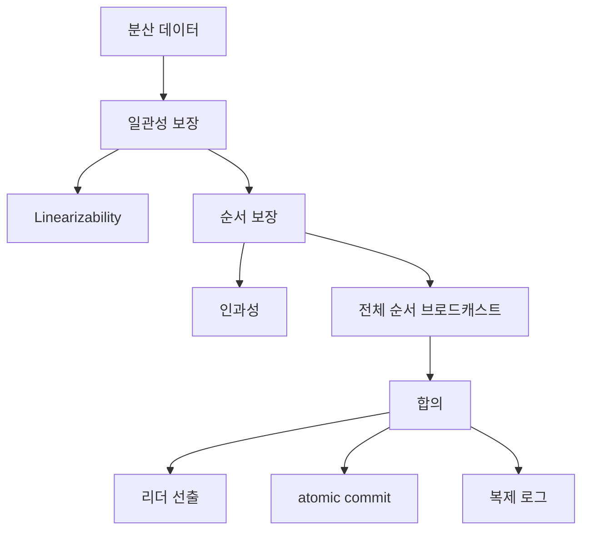

- 대부분의 복제된 데이터베이스는 최종 일관성을 제공하지만 너무 약해서 애플리케이션을 추론하고 구축하기가 어렵습니다.
- 선형성, 전체 순서 및 합의를 포함하여 분산 시스템이 제공할 수 있는 보다 강력한 일관성 보장을 살펴보겠습니다.

### 선형성
- 서로 다른 복제본에서 서로 다른 답변을 얻는 대신 선형성은 구현 세부 사항을 추상화하고 단일 복제본이라는 환상을 제공합니다.
- 시간이 거꾸로 흐르는 것처럼 보이는 스포츠 점수는 선형화할 수 없습니다.
- 선형성은 요청 시간과 응답 시간 사이를 나타내는 특정 순간을 갖는 각 읽기/쓰기 작업으로 설명할 수 있으며 결과는 계속해서 진행되는 일부 특정 순간 세트와 일치합니다.
- 참고: 선형화 가능성과 Serializable 보장은 비슷하게 들리지만 독립적인 개념입니다.  시스템은 이들 중 어느 것도 제공하지 않거나, 하나 또는 둘 다를 제공할 수 없습니다.
### 선형성에 의존
- 사용 사례는 다음과 같습니다.
  - 잠금 및 리더 선출
  - 고유한 제약 조건
  - 교차채널 타이밍 종속성
### 선형화 가능한 시스템 구현
- 복제된 시스템은 다음과 같이 선형화될 수 있습니다.
  - 단일 리더 복제 - 잠재적으로; 스냅샷 격리를 사용하는 경우는 아님, 비동기식 쓰기를 사용하는 경우는 아님 리더 failover가 만족스러운지 확인해야 함
  - 합의 알고리즘 -- 예
  - 다중 리더 복제 - 선형적이지 않고 동시 쓰기 가능
  - 리더 없는 복제 - 아마도 선형화가 불가능할 것입니다. 갈등 해결에 달려 있으며 엄격한 쿼럼를 요구합니다.
    - Dynamo 스타일 쿼럼을 사용하면 동기 읽기 복구를 수행해야 하며 리더는 각 쓰기 전에 노드 쿼럼에서 읽어야 합니다.
- 비용 - 두 데이터 센터 간의 복제 사용 사례를 상상하면 문제가 드러납니다.  선형화 가능한 시스템에서는 데이터센터 간의 연결이 끊어지면 리더가 없는 데이터센터에 대한 요청을 처리할 수 없습니다.
- CAP 정리 - 이 정리는 선형성이 필요한 모든 시스템에서 일부 노드의 연결이 끊어지면 요청을 처리할 때까지 기다려야 한다고 말합니다.  선형성이 필요하지 않은 시스템은 연결이 끊긴 노드가 기다릴 필요가 없도록 작성될 수 있습니다.
  - CAP에 대한 오해와 오해를 불러일으키는 주장에 주의하세요.
- 선형화 및 네트워크 지연 - 선형화에는 성능 비용이 많이 듭니다.  요청의 응답 시간은 최소한 네트워크 지연의 불확실성에 비례한다는 것이 입증되었습니다.  다중 코어가 있는 경우 단일 시스템의 RAM도 선형화할 수 없습니다.

### 주문 보장
- 순서화, 선형성, 합의 사이에는 강한 연관성이 있습니다.
- 인과적으로 일관된 시스템은 인과관계에 의해 요구되는 순서를 따릅니다.
  - 이미 논의된 인과관계의 예로는 일관된 접두사 읽기, 스냅샷 격리, 쓰기 편향 등이 있습니다.
- 인과적 순서는 부분적 순서인 반면, 선형화 가능한 시스템은 전체적 순서를 갖습니다.  전자는 동시 작업을 가질 수 있지만 후자는 그럴 수 없습니다.
- 선형화는 인과관계를 보장하므로 선형화를 추론하기 쉽습니다.
- 선형화까지 가지 않으면서 인과적 의존성을 포착하고 인과적 일관성을 제공하는 연구가 진행되고 있습니다.  한 가지 가능성은 모든 키에 걸쳐 버전 벡터를 확장하는 것입니다.

### 시퀀스 번호 순서
- 인과관계를 추적하는 것보다 더 간단한 것은 단순히 일련번호를 추적하여 사건을 주문하는 것입니다.
- 논리적 시퀀스 번호는 전체 순서(인과적으로 일관된)를 제공할 수 있습니다.  예를 들어 번호가 지정된 복제 로그가 있는 단일 리더 복제가 이를 수행합니다.
- Lamport 타임스탬프 - 인과적으로 일관된 분산 환경의 시퀀스 번호를 처리하는 방법
  - 카운터 및 노드 ID 쌍을 사용합니다.
  - 모든 노드와 모든 클라이언트는 자신이 본 최대 카운터를 추적합니다.  현재 카운터보다 큰 값을 발견할 때마다 일치하도록 카운터를 높입니다.
  - 전체 주문 제공
- 아쉽게도 전체 주문만으로는 고유한 제약 조건을 해결하기에 충분하지 않습니다.
  - 순서는 사실을 알고 나서야 알 수 있기 때문이다.  고유 제약 조건 위반으로 인해 삽입을 거부하려면 요청 당시 첫 번째 요청자가 아닌지 알아야 합니다.

### total order broadcast
- 총 주문 브로드캐스트는 다음을 통해 노드 간에 메시지를 교환하기 위한 프로토콜입니다.
  -신뢰할 수 있는 전달 - 한 노드에 전달되면 모든 노드에 전달되어야 합니다.
  - 완전히 순서대로 전달 - 모든 노드가 동일한 순서로 메시지를 받습니다.
  - 노드 연결이 끊기거나 다운되면 전달이 지연될 수 있지만 결국에는 올바른 순서로 발생해야 합니다.
- 전체 주문 브로드캐스트를 사용하여 복제 또는 직렬화 가능한 트랜잭션을 구현할 수 있습니다.
- 전체 주문 브로드캐스트를 활용한 선형화 가능한 스토리지 구현
  - 선형화 가능한 비교 및 설정 쓰기
    - 기록하려는 키를 로그에 추가합니다.
    - 쓴 내용이 보일 때까지 로그를 읽으세요.
    - 메시지를 보내기 전에 키에 어떤 메시지가 있는지 확인하세요.
  - 선형화 가능한 읽기의 경우 오래된 읽기를 방지하기 위해 언급된 세 가지 옵션
    - 로그에 추가하고, 나타날 때까지 기다린 후 읽으십시오.
    - 최신 로그 위치를 가져올 수 있으면 그것이 나타날 때까지 기다린 다음 읽으십시오.
    - 동기적으로 업데이트된 복제본이 있는 경우 해당 복제본에서 읽습니다.
- 선형화 가능한 스토리지를 활용한 전체 주문 방송 구현
  - 원자 증가 및 가져오기 또는 원자 비교 및 설정 기능을 갖춘 선형화 가능한 레지스터가 있다고 가정합니다.
  - 이 레지스터를 증가시키고 새 값을 얻습니다.
  - 이 번호를 보내는 메시지의 일련 번호로 사용하세요.
    - 실패한 메시지는 계속해서 다시 시도하세요.
- 원자 비교 및 설정을 갖춘 전체 주문 브로드캐스트 또는 선형화 가능 레지스터가 합의와 동일하다는 것이 밝혀졌습니다.

### 분산 트랜잭션과 합의
- 리더 선택 및 atomic commit(여러 노드에 걸쳐)을 포함하여 모든 노드가 특정 사항에 동의하기를 원합니다.

### atomic commit 및 2단계 커밋(2PC)
- 단일 노드에서는 데이터가 먼저 기록되고 커밋 기록이 기록됩니다.
- 분산 시스템에서는 각 노드에 독립적으로 커밋을 요청할 수 없습니다.
- 2단계 커밋은 별도의 코디네이터를 사용합니다.
  - 코디네이터는 모든 노드에 준비 메시지를 보내고 모든 노드의 확인이 필요합니다.
  - 그런 다음 코디네이터는 커밋 기록을 작성합니다.
  - 커밋(또는 중단) 결정은 각 노드로 전송되며 영원히 재시도해야 합니다.
- 노드 실패는 2PC로 처리하기가 상당히 쉽지만, 준비 후 커밋 전에 코디네이터가 실패하면 노드는 불명예에 빠지게 됩니다.
- Non-Blocking인 3단계 커밋 설계가 있지만 제한된 지연 및 응답 시간이 필요하므로(즉, 완벽한 실패 감지가 가능함) 사용되지 않습니다.

### 실제 분산 트랜잭션
- 분산 트랜잭션에는 장단점이 있습니다.  atomic commit은 바람직한 기능이지만 많은 시스템에 성능 문제와 운영 문제가 있습니다.
- 저자는 두 가지 사용 사례를 구분합니다.
  - 데이터베이스 내부 - 모두 동일한 소프트웨어에 있음
  - 이기종 분산 트랜잭션 - 다른 시스템과 호환되며 지원하기가 더 어렵습니다.
- 정확히 한 번만 메시지 처리 - 메시지 큐에서 메시지 확인을 원자적으로 커밋하고 데이터베이스 쓰기를 하나의 분산 트랜잭션으로 수행합니다.
- X/Open XA는 1991년부터 이기종 2PC에 대한 표준입니다.
  - API이며, 트랜잭션을 시작하는 애플리케이션과 동일한 프로세스에서 코디네이터가 실행되는 경우가 많습니다.
  - 의심되는 동안 잠금 유지 - 준비 후 코디네이터가 충돌하는 경우 코디네이터가 성공적으로 중단 또는 커밋을 보낼 때까지 모든 참가자는 재시작 후에도 잠금을 영원히 유지합니다.
  - 코디네이터에서 고아 트랜잭션을 유발하는 결함이 발생하는 경우 참가자 잠금을 해제하기 위해 수동 개입이 필요합니다(또는 원자성 규칙을 위반하더라도 경험적 결정).
  - 운영상의 문제는 다음과 같습니다.
    - 코디네이터는 일반적으로 내결함성이 없습니다.
    - 코디네이터가 애플리케이션 계층에서 실행되는 경우 해당 서버는 더 이상 상태 비저장이 아닙니다.
    - 많은 시스템에서 가장 낮은 공통 분모로서 교착 상태 감지 또는 SSI 참여와 같은 고급 작업을 수행할 수 없습니다.
    - 모든 2PC는 실패를 증폭시키는 경향이 있음

### fault-tolerant consensus
- 합의는 노드가 값을 제안할 수 있고 합의가 해당 값 중 하나를 결정하는 문제로 일반화됩니다.
  - 통일된 합의 - 동일한 결정
  - 무결성 - 한 번만 결정
  - 유효성 - 선택은 제안 중 하나여야 합니다.
  - 종료 - 충돌하지 않는 모든 노드가 결국 결정됩니다.
    - 2PC는 이 요구 사항을 충족하지 않습니다.
- 가장 잘 알려진 합의 알고리즘은 다음과 같습니다:
  - 뷰스탬프 복제(VSR)
  - Paxos (및 Multi-Paxos)
  - 뗏목
  - 자브
- 이들 중 대부분은 반복적인 합의 라운드와 동일한 전체 주문 브로드캐스트를 구현합니다.
- 단일 리더 복제에서는 리더가 합의된 전체 주문 브로드캐스트를 제공합니다.  하지만 리더가 실패하면 새로운 리더를 선출하기 위해서는 합의가 필요합니다.  그럼 당신은 무엇을 합니까?
- 에포크 번호 매기기
  - 이러한 합의 알고리즘은 단조롭게 증가하는 에포크 번호를 추적하고 각 에포크 번호 내에서 리더가 고유한지 확인합니다.
  - 두 명의 리더 후보가 동의하지 않을 경우, 더 높은 시대 번호를 가진 사람이 승리합니다.
  - 리더가 결정을 내리기 전에 노드 쿼럼으로부터 투표를 수집해야 합니다.
- 제한 사항
  - 제안에 대한 투표 프로세스는 동기 복제의 한 형태이며 잠재적으로 느릴 수 있습니다.
  - 합의에는 다수결이 필요하므로 네트워크 분할로 인해 소수 노드가 진행할 수 없게 됩니다.
  - 대부분의 합의 알고리즘은 노드 추가 또는 제거를 허용하지 않습니다.
  - 가변적인 네트워크 지연이 있는 경우 시간 초과로 인해 리더가 자주 선택되어 많은 리소스가 소모될 수 있습니다.
  - Raft가 두 노드 사이에서 리더를 영원히 앞뒤로 튕겨서 튕겨 나가는 것과 같은 엣지 케이스가 존재합니다.

### 멤버십 및 조정 서비스
- ZooKeeper 또는 etcd는 종종 "분산 키-값 저장소"로 설명되지만 애플리케이션 데이터베이스로 사용하지는 않습니다.  일반적으로 시스템 구성 설정이 유지됩니다.
- 소량의 데이터를 모두 메모리에 보관하도록 설계되었습니다.  이 작은 세트는 총 주문된 방송을 사용하여 동기화를 유지합니다.
- ZooKeeper가 제공하는 기타 기능:
  - 선형화 가능한 원자 연산.  이를 사용하여 분산 잠금(또는 만료일이 있는 임대)을 구현할 수 있습니다.
  - 작업의 총 순서
  - 하트비트 연결을 이용한 장애 감지
  - 알림 변경(예: 설정 변경 푸시 알림
- 일반적으로 수천 개의 노드에서 ZooKeeper를 실행하지 않습니다.  오히려 키 조정을 처리하는 3~5개가 있고 다른 모든 노드는 이 소수의 노드를 참조하게 됩니다.
- 노드에 작업 할당 - ZooKeeper는 리더처럼 단일 노드를 선택하는 데 좋고, 리소스 할당에도 좋습니다.
  - 작업 스케줄러
  - 노드에 파티션 할당 및 재조정
  - 원자적 연산, 임시 노드 및 알림을 사용하여 수행할 수 있습니다.  하지만 Apache Curator와 같은 더 높은 수준의 라이브러리가 도움이 될 수 있을 만큼 여전히 복잡합니다.
- 서비스 발견
  - ZooKeeper, etcd, Consul은 서비스 검색에 자주 사용됩니다.
  - 서비스 복구에는 실제로 합의가 필요하지 않을 수 있지만(DNS는 꽤 잘 작동함) 어쨌든 리더를 선출하는 경우 검색에 도움이 될 수 있습니다.  추가 서비스는 모든 결정의 결과를 제공할 수 있지만 투표에는 참여하지 않는 읽기 전용 캐싱 복제본입니다.
- 멤버십 서비스
  - 멤버십 서비스는 어떤 노드가 살아 있고 활성 상태인지 추적합니다.

## Chapter 10. 배치 처리

- 책 전반에 걸쳐 우리는 요청, 쿼리, 응답 및 결과를 살펴보았습니다. 이들의 성공은 일반적으로 응답 시간으로 측정됩니다.
- 배치 작업에서는 응답 시간보다는 처리량에 크게 신경을 쓸 수 있습니다.
- 3가지 종류의 다양한 시스템
  - 서비스
  - 배치 처리
  - 스트림 처리
### Unix 도구를 사용한 배치 처리
- 로그 구문 분석, URL 확보 및 상위 5개 고유 항목 찾기를 보여주는 예
- Unix 명령을 연결하거나 사용자 정의 프로그램을 통해 이를 수행할 수 있습니다.
- 사용자 정의 프로그램은 카운터를 메모리에 유지하지만 Unix 파이프라인은 그렇지 않으며 디스크를 사용할 수 있습니다.
- 계산할 항목 수가 많으면 사용자 정의 프로그램에 결국 메모리가 부족해집니다.

### 유닉스 철학
- 핵심 철학
  - 각 프로그램이 한 가지 일을 잘 수행하도록 하세요.
  - 출력이 입력이 될 것으로 예상
  - 초기에 시도하고 반복할 수 있도록 설계하고 구축합니다.
  - 도구를 사용하여 프로그래밍 작업을 가볍게 합니다.
- Unix는 stdin과 stdout이 항상 ascii인 공통 인터페이스를 선호합니다.
### 맵리듀스 및 분산 파일 시스템

> 개념 흐름

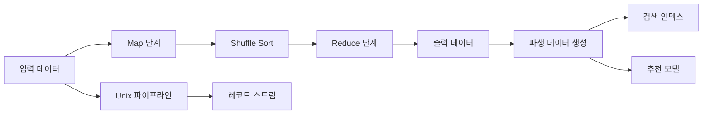

- Unix 도구와 유사하지만 수천 대의 컴퓨터에 분산되어 있음
- HDFS(Hadoop 분산 파일 시스템) 사용
  - 비공유 원칙
- 중앙 네임노드는 파일 블록이 저장된 위치를 추적합니다.
- 내결함성을 위해 시스템 전반에 걸쳐 정보가 복제됩니다.
### MapReduce 작업 실행
- 분산 파일 시스템에서 대규모 데이터 세트를 처리하기 위해 코드를 작성하는 데 사용되는 프로그래밍 프레임워크
  - 입력 파일 세트를 읽고 레코드를 분석합니다.
  - 매퍼 함수를 호출하여 키와 값을 추출합니다.
  - 키별로 키-값 쌍 정렬
  - 정렬된 키-값 쌍을 반복하기 위해 리듀서 함수를 호출하고, 정렬을 통해 일치하는 키를 인접하게 배치하여 다양한 집계를 쉽게 수행할 수 있습니다.
- 매퍼
  - 모든 레코드에 대해 한 번씩 호출됩니다.
  - 키와 값을 추출합니다.
  - 각 입력에 대해 원하는 수의 키-값 쌍을 생성할 수 있습니다(또는 없음).
  - 한 번에 하나의 레코드만 제공되며 어떤 상태도 유지하지 않습니다.
- 감속기
  - 동일한 키에서 모든 값을 수집하고 해당 컬렉션을 반복합니다.
  - 동일한 URL의 발생 횟수 등의 출력 레코드 생성 가능
- 일반적으로 기존 프로그래밍 언어로 작성됨
- 작업을 실행하기 전에 매퍼 및 리듀서용 코드를 모든 시스템에 전송해야 합니다.
- 셔플?
- 여러 작업이 서로 연결되어 있는 것이 일반적이며 일반적으로 워크플로라고 합니다. 이를 관리하기 위해 설계된 다양한 도구, Oozie, Azkaban, Luigi, Airflow, Pinball
### reduce-side join 및 그룹화
- 관계형 모델에서는 다른 레코드, 외래 키와 연관된 정보의 레코드를 갖는 것이 일반적입니다.
- 관계형 DB에서는 인덱스를 사용할 수 있지만 MapReduce는 항상 훨씬 더 비용이 많이 드는 전체 테이블 스캔을 수행합니다.
  - 예를 들어 단일 사용자에 대한 조인이 아닌 모든 사용자에 대해 MapReduce를 수행할 때만 MapReduce를 사용하는 것이 합리적입니다.
- 사용자 활동을 사용자 프로필 정보와 연결해야 할 수도 있습니다.
  - 특히 MapReduce에 의해 요청이 많아지면 외부 데이터 소스를 쿼리하는 속도가 매우 느려질 수 있습니다.
  - 가능한 한 많은 지역성을 홍보하는 것이 가장 좋습니다.
  - HDFS에 데이터베이스 백업을 저장하는 것이 더 좋습니다.
- 정렬-병합 조인
- MapReduce 작업은 감속기가 항상 사용자 db의 레코드를 먼저 확인한 다음 활동 이벤트를 시간 순서대로 볼 수 있도록 정렬할 레코드를 정렬할 수 있습니다(2차 정렬이라고 함).
  - 리듀서는 모든 사용자 ID에 대해 한 번씩 호출되며 첫 번째 값은 생년월일 기록이고 나중에 조회한 URL과 시청자 연령(연도) 쌍을 출력하는 활동을 반복합니다.
- 그룹화 기준
  - 가장 간단한 구현 방법은 매퍼가 키-값 쌍을 내보내 원하는 키 그룹을 생성하도록 하는 것입니다.
- 스큐 처리
  - 한 컴퓨터가 특정 ID에 대한 모든 레코드를 수신하는 경우 일부 컴퓨터는 다른 컴퓨터보다 훨씬 더 많은 레코드를 갖게 될 수 있습니다.
  - 이러한 편향으로 인해 발생하는 핫스팟
  - 전체 작업은 하나의 높은 레코드 ID에서 대기할 수 있습니다.
  - 다양한 도구를 활용한 전투 가능
### map-side join
- 입력 데이터에 대해 가정을 할 수 있다면 map-side join을 사용하여 더 빠르게 조인할 수 있습니다.
- 매퍼는 단순히 하나의 입력 파일 블록을 읽고 하나의 출력 파일을 생성합니다.
  - 브로드캐스트 해시 조인
    - 큰 데이터 세트 + 작은 데이터 세트(메모리에 완전히 들어갈 수 있음)
    - 사용자 데이터베이스를 로드한 후 매퍼는 사용자 활동 이벤트를 스캔하고 해시 테이블에서 각 이벤트에 대한 사용자 ID를 조회할 수 있습니다.
    - 디스크에도 읽기 전용 인덱스를 넣을 수 있음
  - 분할된 해시 조인
    - 지능적으로 결합하려는 모든 정보를 단일 파티션에 넣어 하나의 컴퓨터에 결합할 수 있습니다.
### 배치 workflow의 출력
- 트랜잭션 처리 및 순수 분석이 아님
- Google의 검색 인덱스 구축을 위해
  - 주기적으로 새로운 인덱스를 출력하고 이전에 출력된 인덱스를 대체하여 검색합니다.
- 쿼리를 위해 출력을 새 데이터베이스로 전송
  - 여러 가지 이유로 개별적으로 기록하는 것은 좋지 않으며, 작업이 완료된 후 전체를 옮기는 것이 좋습니다.
- Unix와 유사한 원칙, 입력을 불변으로 취급하고 출력이 입력이 될 것으로 예상
- 이전 코드로 작업을 다시 실행하여 실수를 쉽게 롤백할 수 있습니다.
### Hadoop과 분산 데이터베이스 비교
- Hadoop은 읽기 스키마에 더 가깝습니다.
- 데이터를 HDFS에 덤프하고 나중에 스키마를 적용할 수 있어 사전에 데이터를 모델링할 필요가 없습니다.
- 시스템이 Google의 MapReduce 작업에 대한 우선순위를 잃기 때문에 내결함성을 염두에 두고 설계되었습니다. 반드시 기계가 신뢰할 수 없기 때문은 아닙니다.
### 맵리듀스를 넘어서
- MapReduce 작업을 작성하기 어렵습니다. 털이 많은 부분을 더 쉽게 추상화할 수 있도록 다양한 도구가 작성되었습니다.
  - 돼지, 하이브, 크런치, 캐스케이딩
### 중간 상태의 구현
- MapReduce의 모든 출력은 직접 파이프되는 Unix와는 달리 파일로 표시됩니다.
- 다음 작업이 시작되기 전에 하나의 작업이 완료되어야 합니다.
- 각 노드의 전체 입력 파일을 다시 읽는 것이 중복되고 느린 경우가 많습니다.
- 데이터 흐름 엔진은 다양한 방법으로 이러한 점 중 일부를 완화하려고 시도합니다.
  - 스파크, 테즈, 플링크
- 중간 결과를 materialize하지 않으면 일부 내결함성이 더 까다로워지지만 꼭 필요한 것은 아닐 수도 있습니다.
### 그래프 및 반복 처리
- 분산 파일 시스템에 그래프를 저장하는 것이 가능하지만 특정 작업으로 인해 처리하기가 다소 어색합니다.
- 많은 그래프 알고리즘은 수렴할 때까지 반복이 필요합니다.
- 조건이 충족될 때까지 MapReduce 작업을 반복적으로 실행하면 가능하지만 매우 비효율적일 수 있습니다.
- pregel과 같은 도구는 불필요한 부분을 단순화하고 제거하여 그래프 계산을 보다 효율적으로 만듭니다.
### 고급 API 및 언어
- Map 및 Reduce를 위한 사용자 정의 작성된 프로그램과 달리 보다 선언적인 쿼리 언어 방향으로 나아가고 있습니다.
- 유연성과 사용 편의성 사이의 균형
- MapReduce/hadoop 작업에 도움이 되는 특정 라이브러리의 k-nearest-neighbors와 같은 다양한 공통 쿼리가 구워지기 시작했습니다.

## Chapter 11. 스트림 처리

### 소개
- 지난 장에서 유한한 크기의 입력이 필요한 배치 처리에 대해 이야기했지만 실제로는 많은 데이터 소스가 무한하며 지속적으로 데이터를 생성합니다.
- 배치 프로세스는 매일 또는 매시간 실행될 수 있지만 일부 사용 사례에는 더 자주 업데이트가 필요하며 여기서 스트림 처리가 사용됩니다.
- 이 장에서는 스트리밍을 소개하고, 데이터베이스가 스트리밍에서 페이지를 가져오는 방법에 대해 설명하고, 스트림 데이터가 처리되는 방법을 다룹니다.

### 이벤트 스트림 전송

> 개념 흐름

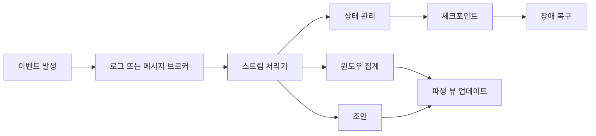

- 변경 사항에 대한 폴링은 빈도가 높을 때 비용이 너무 많이 들기 때문에 스트리밍 데이터를 처리하도록 시스템을 구축했습니다.
- 관련 이벤트의 각 그룹을 주제 또는 스트림이라고 합니다.

### 메시징 시스템
- 게시/구독 모델에서는 여러 생산자 및/또는 소비자가 허용됩니다.
- 메시징 구현을 차별화하는 두 가지 질문:
  - 소비자가 메시지가 생성되는 속도만큼 빠르게 메시지를 처리할 수 없으면 어떻게 됩니까? 삭제, 버퍼링 또는 역압 적용
  - 노드가 다운되면 메시지가 손실될 수 있습니까? 예 또는 아니요
- 생산자가 소비자에게 직접 메시지를 보내는 것도 일종의 구현입니다.
  - 옵션에는 UDP 멀티캐스트, TCP 또는 IP 멀티캐스트, 직접 UDP 또는 HTTP 또는 RPC 호출이 포함됩니다.
  - 일반적으로 애플리케이션이 메시지 오류를 인식하고 내결함성 지원을 구현하도록 요구합니다.

### 메시지 브로커
- 가장 일반적인 것은 메시지 브로커 또는 메시지 큐를 실행하는 별도의 서버입니다.
- 생산자와 소비자는 클라이언트로 연결됩니다.
- 큐잉은 소비자에게 전달되는 것이 비동기적임을 의미합니다(응답을 기다리려는 경우 반환 메시지를 통해 생산자에게 알릴 수 있음).
- 일부 메시지 브로커는 2단계 커밋에 참여하지만 전달된 메시지가 일반적으로 삭제되는 메시지 큐의 특성은 쿼리할 수 있는 영구 데이터베이스와 다릅니다.
- 여러 소비자가 될 수 있습니다:
  - 로드 밸런싱 - 메시지 처리 작업 분할
  - 팬아웃 - 각자 자신의 일을 하는 독립적인 소비자
- 확인 및 재전송 - 다음과 같은 일이 발생할 수 있으므로 주의하세요.
  - 승인되지 않은 메시지가 실제로 처리되었기 때문에 다른 소비자에게 다시 전달될 경우 두 번 처리될 수 있습니다.
  - 로드 밸런싱을 사용하면 재전송으로 인해 처리를 위해 메시지가 재정렬될 수 있습니다.

### partitioned log
- 로그 기반 메시지 브로커는 가벼운 메시지 전달과 내구성 있는 로그 기반 내구성 있는 스토리지를 결합합니다.  여기에는 Apache Kafka 및 Amazon Kinesis가 포함됩니다.
- 이 구조에서는 생산자는 로그에 추가하고 소비자는 로그를 순차적으로 읽습니다.
- 확장성을 위해 로그는 일반적으로 분할됩니다.  내결함성을 위해 복제할 수도 있습니다.
- 로드 밸런싱 소비자는 일반적으로 소비자를 파티션에 할당하여 처리됩니다.  개별 메시지의 균형을 유지하려면 기존 JMS/AMPQ 스타일 메시지 브로커를 구현하는 것이 더 쉽습니다.
- 소비자 오프셋 - 개별 승인 대신 브로커는 각 소비자에 대한 메시지 오프셋만 (주기적으로) 추적하면 됩니다.
- 모든 것이 디스크에 기록되기 때문에 디스크 공간 사용량을 고려해야 합니다.  많은 시스템에서는 최대 저장 용량이 고정된 순환 버퍼를 구현합니다.
- 소비자가 생산자를 따라갈 수 없는 경우 - 일반적으로 메시지 손실이 발생할 수 있지만 이러한 일이 발생하기 전에 관리자에게 경고할 수 있습니다.  부수적인 이점은 종료된 소비자가 큰 메시지 큐를 만들지 않는다는 것입니다.
- 오래된 메시지 재생이 가능합니다.  소비자 오프셋은 의도적으로 이전 값으로 뒤로 설정될 수 있습니다.

### 데이터베이스 및 스트림
- 복제 로그는 쓰기 스트림과 같으므로 데이터베이스는 스트리밍에서 빌려와 이기종 시스템을 처리하는 데 도움이 될 수 있습니다.

### 시스템 동기화 유지
- 대부분의 경우 OLTP 시스템, 데이터 웨어하우스 등 여러 시스템이 모두 동기화 상태를 유지해야 합니다.
- 클라이언트의 이중 쓰기에는 경쟁 조건이 있을 수 있으며 쓰기 커밋 또는 중단을 모두 보장하는 것은 원자 커밋 문제입니다.

### 변경 데이터 캡처(CDC)
- 데이터베이스 복제를 독점적인 내부 구현 세부 사항으로 처리하는 대신 변경 데이터 캡처는 다른 시스템에서 복제할 수 있는 외부에서 볼 수 있는 형식으로 모든 변경 사항을 노출합니다.
- CDC는 변경 사항을 즉시 스트림으로 제공할 수 있으며, 검색 인덱스 등 다른 시스템에서 지속적으로 적용할 수 있습니다.
- 로그 기반 메시지 브로커는 메시지 순서를 보존하여 올바른 종류의 전달을 제공할 수 있습니다.
- 기본적으로 하나의 데이터베이스가 단일 리더가 되고 나머지 데이터베이스는 팔로워 역할을 합니다.
- 스냅샷을 시작하는 것이 처음부터 모든 변경 사항을 재생하는 것보다 초기 동기화가 훨씬 빠릅니다.  일부 CDC 시스템에는 스냅샷이 포함되어 있지만 때로는 수동으로 수행해야 하는 경우도 있습니다.
- 로그 압축은 특히 모든 것을 유지하려는 경우 로그 크기를 줄이는 데 유용합니다.
- 최신 DB는 나중에 추가하는 대신 CDC 기능을 지원합니다.

### 이벤트 소싱
- 이벤트 소싱은 모든 변경 사항이 캡처된다는 점에서 CDC와 유사하지만 애플리케이션 설계가 관련되고 이벤트가 더 높은 수준에 있습니다.
- 이벤트 저장소는 추가만 가능합니다. 업데이트나 삭제는 권장되지 않거나 금지됩니다.
- 이벤트 소싱은 논리적이고 불변적인 작업을 기록합니다.  일반적으로 CDC처럼 전체 기록을 기록하지 않으므로 기록의 전체 현재 상태를 얻으려면 전체 기록이 필요할 수 있으며 로그 압축이 불가능할 수 있습니다.
- 모든 이벤트는 명령으로 시작되지만 모든 유효성 검사가 완료되면 이제 이벤트이며 변경할 수 없습니다.

### 상태, 스트림 및 불변성
- 데이터베이스의 데이터를 변경하는 이벤트는 불변의 기록입니다.  데이터베이스의 내용을 로그의 최신 값에 대한 캐시로 생각할 수 있습니다.
- 불변 이벤트의 장점
  - 책에는 회계와 추가전용원장을 사용하는 예가 나와 있습니다.  불변성은 디버깅을 돕고 분석을 위한 풍부한 기록을 제공할 수도 있습니다.
  - 동일한 이벤트 로그에서 여러 보기 파생 - 이벤트 로그 항목을 데이터베이스로 변환하기 위한 명시적인 프로세스를 가짐으로써 논리가 명시적이게 되어 다중 보기가 용이해집니다.  데이터 쓰기 및 읽기 방법을 분리하면 많은 유연성을 제공할 수 있습니다.
- 동시성 제어 - CDC 및 이벤트 소싱의 큰 단점 중 하나는 이벤트 로그 소비자가 일반적으로 비동기식으로 업데이트되므로 쓰기 후 읽기가 오래될 수 있다는 것입니다.  반대로, 좋은 독립형 이벤트 디자인은 다중 객체 트랜잭션의 필요성을 제거할 수도 있습니다.
- 불변성의 한계
  - 업데이트 및 삭제가 많은 작업은 어려울 수 있습니다.  조각화와 압축 및 가비지 수집 성능이 얼마나 잘 수행되는지가 중요할 수 있습니다.
  - 계정 폐쇄에 관한 개인 정보 보호 규칙과 같은 특정 상황에서는 삭제가 필요하다는 점도 참고하세요.

### 스트림 처리
- 입력 스트림을 처리하여 새로운 출력 스트림을 생성할 수 있습니다.
- 매핑 및 필터링은 파티셔닝 및 병렬화와 마찬가지로 배치 처리와 유사하게 작동합니다.

### 스트림 처리 사용
- 모니터링 및 알림 - 신용카드 사기 감지, 주식 시세 변동 등
- 복잡한 이벤트 처리 - 일반적으로 높은 수준의 선언적 언어가 기준을 정의하는 데 사용됩니다.  데이터베이스와 달리 쿼리는 시간이 지나도 지속되며 데이터는 왔다 갔다 합니다.
- 스트림 분석 - 일반적으로 이벤트가 아닌 측정항목에 관한 것입니다. 분당 댓글 수.
  - 확률적 알고리즘은 훨씬 저렴하고 빠르기 때문에 자주 사용되지만 필수는 아닙니다.
- materialized view 유지 - 논의된 대로 데이터의 또 다른 복사본을 유지할 수 있습니다.
- 스트림 검색 - CEP는 종종 이벤트 조합을 확인하지만 때로는 관심 주제에 대한 뉴스 기사 모니터링과 같이 개별 항목에 대한 복잡한 검색을 원할 때도 있습니다.
- 메시지 전달 및 RPC - 스트림은 RPC가 제공하지 않는 방식으로 내결함성을 제공합니다.  호출을 위한 스트림과 반환을 위한 또 다른 스트림을 가질 수 있으며 이는 여러 노드로 확장될 수 있습니다.

### 시간에 대한 추론
- 메시지 지연에는 제한이 없으므로 일반적으로 메시지가 수신/처리된 시간과 이벤트 시간을 구분합니다.
- 준비가 되었는지 확인 - 1시에서 1시 1분 사이의 창을 사용하여 모든 메시지를 처리하려는 경우 모든 메시지가 언제 있는지 어떻게 알 수 있나요?
  - 시간 초과를 설정하고 늦게 도착하는 낙오자를 삭제할 수 있습니다(그리고 낙오자가 얼마나 자주 발생하는지 모니터링할 수 있습니다).
  - 이전 출력을 무효화하여 수정 출력을 할 수 있습니다.
- 그런데 당신은 누구의 시계를 사용하고 있나요?
  - 시계의 모든 문제로 인해 일부 시스템은 세 번 추적합니다.
    - 이벤트가 발생한 시간, 제작자의 시계 기준
    - 메시지가 전송된 시간(생산자의 시계 기준)
    - 브로커 시계 기준으로 메시지를 수신한 시간
  - 네트워크 지연이 상당히 짧은 경우 마지막 두 시간 간의 차이를 계산하여 생산자의 클럭이 얼마나 떨어져 있는지 추정할 수 있습니다.
- 창문의 종류
  - 텀블링 윈도우 - 인접한 시간 슬롯
  - 호핑 창 - 겹치는 시간 슬롯
  - 슬라이딩 윈도우 - 버퍼에서 가장 오래된 이벤트부터 시작하는 고정 시간 슬롯
  - 세션 창 - 예: 비활성 기간까지 사용자별 이벤트

### 스트림 조인
- 스트림-스트림 조인(창 조인) - 일반적으로 책에 언급된 검색 및 클릭과 같은 두 가지 다른 스트림의 이벤트에 조인하기 위해 상태가 유지됩니다(예: 해시 인덱스).
- 스트림 테이블 조인(스트림 강화) - 일반적으로 테이블의 로컬 복사본은 사용자 테이블과 같은 변경 데이터 캡처를 사용하여 유지됩니다.
- 테이블-테이블 조인(materialized view 유지 관리) - 두 테이블 간 조인의 materialized view를 업데이트하는 스트림의 개념입니다.  두 스트림 중 하나를 변경하면 조인 출력에서 ​​다른 테이블의 여러 행에 잠재적으로 알려야 합니다.
- 조인의 시간 의존성 - 두 스트림 간의 순서가 결정되지 않은 경우 조인은 비결정적일 수 있습니다.  천천히 변화하는 차원에서 히스토리를 사용하면 결정론을 해결할 수 있지만 로그 압축을 수행할 수는 없습니다.

### 내결함성
- 마이크로배칭 및 체크포인트 - 주기적으로 내구성 있는 저장소에 상태 쓰기
- 원자 커밋 재검토 - 이기종 시스템 전체에서 전체 XA를 쉽게 지원할 수 없지만 스트림 간에 내부적으로 원자 커밋에 대한 일부 지원을 제공할 수 있습니다.
- 멱등성(Idempotence) - 반복해도 동일한 이벤트(또는 시도하더라도 반복하지 않을 만큼 스마트한 이벤트)를 위험 없이 재시도할 수 있습니다.
- 장애 후 상태 재구축 - 상태가 필요하므로 내결함성을 위해 주기적으로 로컬 또는 원격 저장소에 유지해야 합니다.

### 요약
- 스트림은 다이렉트 메시징, 메시지 브로커 또는 이벤트 로그를 통해 전송될 수 있습니다.
  - AMQP/JMS 스타일 메시지 브로커 - 소비자는 처리된 개별 메시지를 확인한 후 삭제합니다.
  - 로그 기반 메시지 브로커 - 소비자는 로그 파티션을 읽고 브로커는 디스크에 메시지를 유지합니다.
- 스트림은 모든 종류의 시스템을 통합하는 강력한 방법입니다.
- 스트림 처리에는 시간 창 전략과 세 가지 종류의 조인이 사용됩니다.

## Chapter 12. 데이터 시스템의 미래

- 데이터 시스템의 미래에 대한 저자의 예측
- 안정적이고 확장 가능하며 유지 관리 가능한 시스템을 위해 여러 가지를 하나로 모으는 방법을 마무리하려고 합니다.
### 데이터 통합

> 개념 흐름

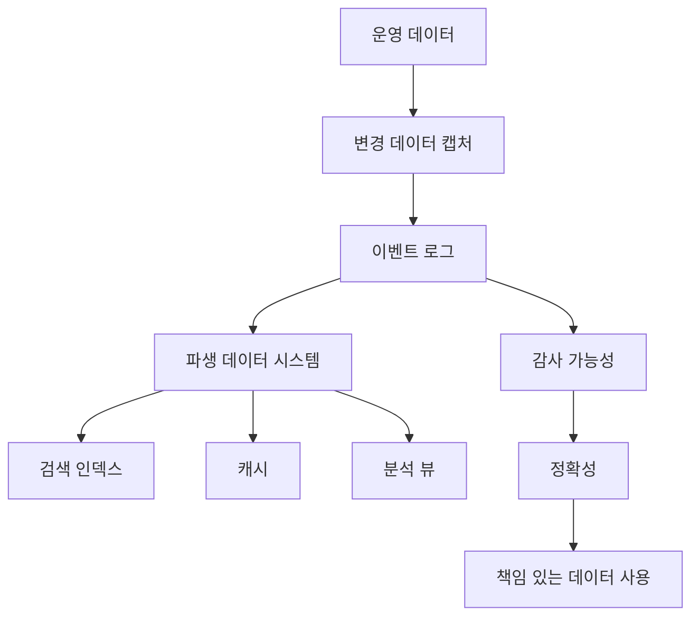

- 다양한 기술을 살펴봤지만 딱 맞는 솔루션은 없습니다.
- 공급업체가 의도적으로 생략할 수 있는 사항에 대한 비판적인 시각으로 배운 지식을 바탕으로 다양한 공급업체의 도구를 평가해야 합니다.
- 모든 요구사항을 모두 충족하는 단일 기술이 없고 여러 가지 기술을 함께 사용해야 하는 경우가 있을 수 있습니다.
### 파생 데이터를 통한 전문 도구 조합
- 일부 기능은 한 조직에는 유용하지 않지만 다른 조직에는 유용할 수 있습니다. 데이터를 쓰고 읽는 다양한 방법을 모두 이해하는 것이 중요합니다.
- 쓰기 복잡성과 읽기 복잡성 사이에는 균형이 있습니다.
- 각각에 필요할 수 있는 다양한 제약 조건이 있습니다(최종 일관성, 쓰기 시 읽기 등).
### 일괄 및 스트림 처리
- 데이터 통합의 목표는 데이터가 올바른 위치에 올바른 형태로 생성되도록 하는 것입니다.
- 초기 쓰기 작업과 별도로 읽기 작업을 더 쉽게 하기 위해 파생 데이터 세트를 생성해야 하는 경우가 많습니다.
- 강력하고 새로운 경쟁자들이 배치 처리와 스트림 처리 사이의 시스템 방향으로 나아가고 있습니다.
- 파생 뷰를 통해 점진적인 발전이 가능합니다.
- Lambda 접근 방식은 스트림 프로세서를 사용하여 대략적인 업데이트를 수행한 다음 배치 프로세서가 나중에 수정된 파생 버전을 생성합니다.
  - 배치 코드와 스트림 코드를 동시에 유지 관리하는 것은 번거로울 수 있습니다.
### 데이터베이스 unbundling
- Unix와 관계형 데이터베이스는 매우 다른 관점에서 문제에 접근해 왔습니다.
  - 많은 세부 사항을 숨기지만 최적화를 추가하는 낮은 수준 추상화와 높은 수준 추상화
### 데이터 저장 기술 구성
- 데이터 솔루션의 두 가지 미래를 제안합니다. 통합 데이터베이스: 읽기 통합, 번들되지 않은 데이터베이스: 쓰기 통합
  - 다양한 기술에서 자동으로 정보를 가져오는 통합 쿼리 언어입니다. 다양한 유형의 상점에서 데이터를 가져와 일종의 메타 쿼리 언어를 사용하여 집계할 수 있습니다.
  - 기술 전반에 걸쳐 쓰기를 통합하고, 쓰기를 동기화할 수 있도록 데이터베이스 인덱스 유지 관리 기능을 번들 해제합니다.
- 여전히 해결해야 할 복잡한 문제이지만, 유사한 기술을 많이 사용하기 때문에 궁극적으로 기술 간의 매핑이 불가능하지는 않습니다.
- 트랜잭션 대신 이벤트 로그에 항목을 푸시하면 시스템 간 독립성이 높아져 일부 호환성과 견고성이 향상될 수 있습니다.
- 번들링 해제의 목표는 성능을 놓고 경쟁하는 것이 아니라 더 많은 유연성을 허용하고 다양한 기술의 장점을 결합하여 데이터를 다양한 방식(깊이보다 폭)으로 소비할 수 있도록 하는 것입니다.
- 현재 한 기술을 다른 기술로 연결할 수 있는 유닉스 같은 명령이 누락되었습니다.
### 데이터 흐름을 중심으로 애플리케이션 설계
- 스프레드시트에는 현재 데이터베이스에 있는 것보다 훨씬 뛰어난 데이터 흐름 기능이 있습니다. 수식 및 데이터 변경 시 자동 재계산이 모두 사용자로부터 추출됩니다.
- 데이터베이스는 내장된 인덱싱 기능을 잘 수행할 수 있지만 사용자 정의 기능은 속도가 느려지는 경우가 많습니다.
- 일부 시스템은 내구성 있는 데이터에 중점을 두고 다른 시스템은 더 많은 사용자 정의 기능을 위해 애플리케이션 코드 실행을 전문으로 하는 것이 합리적일 수 있습니다.
- 현재 대부분의 데이터 솔루션은 무상태가 가정되는 웹을 염두에 두고 구축되었습니다.
- 미래에는 보다 적극적인 상태 관리를 추진할 가능성이 있으며, 애플리케이션 코드는 한 곳의 상태 변경에 응답하고 다른 곳의 변경을 트리거합니다.
- 환율 예시
  - 구매가 이루어질 때마다 시스템이 교환 서버에 쿼리할 수 있습니다.
  - 대체 접근 방식은 환율 변경 사항을 서버에 푸시하여 아웃바운드 요청이 필요하지 않도록 하는 것입니다.
- materialized view 및 캐싱은 사전에 아무것도 처리하지 않고 모든 것을 처리할 수 있으며 읽기 경로와 쓰기 경로를 교환할 수 있습니다.
- 많은 웹 시스템이 상태를 유지하기 시작하고 요청 응답 패러다임에서 벗어날 수 있으며 오프라인에서도 여전히 유용한 작업을 수행할 수 있습니다.
- 다시 연결 후 업데이트 수신, 게시/구독 가능
### 정확성을 목표로
- 일관성 가정에서 벗어나는 많은 애플리케이션
- 어쨌든 높은 동시성에서는 일관성 보장이 무너질 수 있습니다.
### 데이터베이스에 대한 엔드투엔드 주장
- 데이터베이스의 안전성이 보장되더라도 DB에 잘못된 데이터를 쓰는 것은 여전히 가능합니다.
- 작업 식별자를 사용하여 전체 쓰기 절차를 통해 작업이 유지되고 중복되지 않도록 할 수 있습니다.
### 제약조건 시행
- 계정이 마이너스가 되거나 보유하지 않은 주식을 판매하는 등의 일이 발생하지 않도록 할 수 있습니다.
  - 복잡할 수 있지만 작업 확인이 필요한 로그 기반 메시징으로 가능합니다.
  - 트랜잭션 예 - 단일 요청을 기록하고 단일 지시사항에서 대변 및 차변 지시사항을 파생시킬 수 있습니다.
### timeliness와 integrity
- 다양한 사용 사례와 관련된 적시성에 대한 다양한 정의
- 무결성은 데이터 손상이 없는 것입니다.
- 일반적으로 적시성보다 무결성이 더 중요함
- 느슨한 제약 조건을 사용하면 기존 프로세스를 사용하여 제약 조건 위반을 보완하고 사용자 이름이 이미 사용되었다는 이메일을 보내는 등의 작업을 수행할 수 있습니다.
### trust but verify
- 데이터가 올바른지 실제로 확인하기 위해 어떤 형태로든 감사를 수행하는 것이 중요합니다.
- 백업이 실제로 작동하는지 확인하는 것도 중요합니다.
- 이러한 문제 중 일부를 해결하는 다양한 암호화 기술이 등장하고 있지만 여전히 개발 중입니다.
### 올바른 데이터 사용
- 데이터의 윤리, 저장 및 사용을 고려해야 합니다.
- 편견적으로 사용되거나 차별을 위해 사용될 가능성이 있음
- 때로는 인간의 결정처럼 쿼리할 수 없는 불투명한 방식으로 사용되는 데이터
- 개인 정보 보호 및 추적은 큰 관심사이므로 저자는 감시를 위해 단어 데이터를 교환하고 시사점을 고려하는 연습을 제안합니다.
- 데이터 측면에서 사용자가 공유하려는 것이 무엇인지 분명할 때도 있지만 앱이 사용 및 액세스 가능한 기타 다양한 데이터 스트림에서 추론할 수 있는 내용을 고려하면 좀 더 모호할 때도 있습니다.
