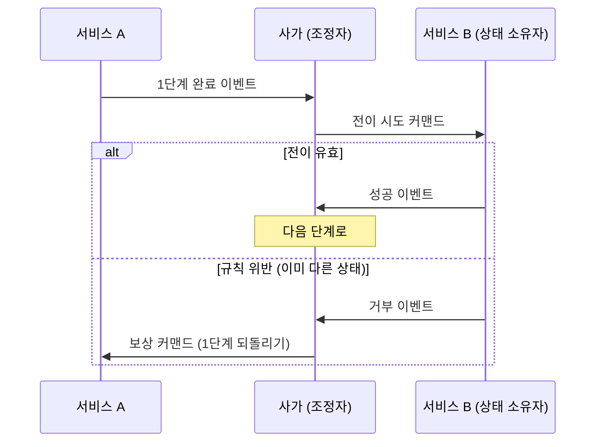

* TOC
{:toc}

# Distributed Transaction

> 각자 자기 DB에 각자 커밋하는 여러 시스템에 걸쳐, 하나의 업무 단위를 "전부 반영 아니면 전부 취소"로 만드는 문제.

한 DB 안에서는 문제가 없다. 로컬 트랜잭션의 ACID가 전부 해결해 준다. 문제는 업무가 시스템 경계를 넘는 순간 시작된다. 주문 시스템이 커밋한 다음 정산 시스템이 실패하면, 이미 커밋된 주문은 롤백할 수 없다.

## 무엇이 어긋날까?

| 문제 | 무슨 일이 생기나 |
| --- | --- |
| 이중 쓰기(dual write) | "DB 커밋"과 "메시지 발행"이 별개 동작이라 하나만 성공하면 상태와 이벤트가 어긋난다 |
| 부분 실패 | 3단계짜리 업무의 2단계에서 실패 — 이미 커밋된 1단계를 어떻게 되돌리나 |
| 중복 | 네트워크 재시도로 같은 요청·메시지가 두 번 도착한다 |

푸는 길은 크게 둘이다. 전체를 하나의 원자 커밋으로 묶는 쪽이 2PC고, 로컬 커밋을 이어가다 실패하면 되돌리는 동작으로 상쇄하는 쪽이 Saga다.

## 2PC (Two-Phase Commit)

> 코디네이터가 모든 참가자에게 "준비됐나"를 묻고, 전원이 yes일 때만 "커밋해라"를 내리는 원자 커밋 프로토콜.

1. **Prepare**: 참가자들이 락을 잡고 커밋 가능 상태를 만든 뒤 yes/no로 답한다.
2. **Commit/Abort**: 전원 yes면 커밋, 하나라도 no면 전원 중단.

### 왜 MSA에서는 안 쓸까?

- **블로킹 프로토콜이다.** prepare에 답한 참가자는 코디네이터의 결정이 올 때까지 락을 쥔 채 기다린다. 코디네이터가 죽으면 참가자들은 커밋도 롤백도 못 하는 in-doubt 상태로 묶인다.
- 코디네이터가 단일 장애점이고, 참가자가 하나라도 느리면 전체가 그 속도에 묶인다.
- 참가 시스템 전부가 같은 프로토콜(XA 등)을 지원해야 한다. Kafka, 많은 NoSQL, 외부 SaaS API는 지원하지 않는다.

정합성을 얻는 대신 가용성·자율성·성능을 내준다. 서비스 자율성이 핵심인 MSA와는 반대 방향이라, 경계 안(단일 DB)에서는 로컬 트랜잭션을 쓰고 경계 밖에서는 Saga 계열로 가는 것이 일반적이다.

## Saga

> 하나의 업무를 로컬 트랜잭션의 연쇄로 쪼개고, 도중 실패하면 이미 커밋된 단계를 보상 트랜잭션으로 되돌리는 패턴.
>
> 1987년 Garcia-Molina와 Salem의 논문에서 나왔다.

- 각 단계는 자기 DB에 즉시 커밋한다. 락을 오래 쥐지 않는다.
- **보상은 롤백이 아니다.** 이미 커밋돼 남들이 봤을 수 있는 결과를, 반대 동작(취소·환불)으로 상쇄하는 것이다.
- 그래서 비가역 동작(이메일 발송, 외부 결제 확정)은 가능한 한 사가의 마지막 단계에 둔다.

### 코레오그래피 vs 오케스트레이션

| | 코레오그래피 | 오케스트레이션 |
| --- | --- | --- |
| 방식 | 각 서비스가 남의 이벤트를 구독해 알아서 반응 | 중앙 조정자가 커맨드로 각 단계를 지시 |
| 장점 | 결합이 낮다, 조정자 없음 | 흐름이 한눈에 보인다, 보상·타임아웃 관리 쉬움 |
| 단점 | 흐름이 여러 코드에 흩어져 전체를 아무도 모름 | 조정자에 로직 집중, 중앙 결합 |
| 어울리는 곳 | 단순 1:1 후속 처리 | 다단계 + 보상이 필요한 흐름 |

둘 중 하나를 고르는 문제라기보다, 단순한 흐름은 코레오그래피로 두고 보상과 가시성이 필요한 흐름만 오케스트레이션하는 하이브리드가 실무에서 흔하다.

### 사가에는 격리(Isolation)가 없다

ACID의 I가 빠져 있다. 각 단계가 즉시 커밋되므로 **완료되지 않은 사가의 중간 상태를 다른 트랜잭션이 볼 수 있다.** 대표적인 대책:

- **시맨틱 락**: 진행 중임을 상태로 표시한다(`APPROVAL_PENDING` 같은 중간 상태). 다른 트랜잭션은 이 상태를 보고 기다리거나 거절한다.
- **재읽기(낙관적 잠금)**: 갱신 직전에 버전을 다시 확인해, 그 사이 바뀌었으면 실패시킨다.
- **소유자 판정**: 한 데이터의 상태 전이는 소유 서비스 하나가 판정한다. 사가는 "전이해 달라"고 시도만 하고, 지금 그 전이가 가능한 상태인지는 소유 서비스가 가드와 낙관적 잠금으로 판정한다. 상충하는 요청이 동시에 와도 상태는 둘 중 하나로만 확정된다.

## Outbox 패턴

> "DB 커밋"과 "메시지 발행"을 하나의 로컬 트랜잭션으로 묶는 패턴. 이중 쓰기를 원천 차단한다.

사가는 이벤트·커맨드 메시지로 굴러가는데, 그 메시지 발행에도 같은 이중 쓰기 문제가 있다. 커밋은 됐는데 발행이 안 되면 사가가 멈추고, 발행은 됐는데 커밋이 롤백되면 유령 이벤트가 돈다.

1. 메시지를 브로커로 직접 보내지 않고, 도메인 변경과 **같은 트랜잭션에서 outbox 테이블에 INSERT**한다.
2. 별도의 릴레이가 outbox에서 커밋된 행만 읽어 브로커로 발행한다. 폴링으로 시작하고, 지연이 문제 되면 CDC(Debezium 등)로 올린다.
3. 보장은 at-least-once다. 중복은 받는 쪽에서 막는다(아래).

## 멱등 소비 (Idempotent Consumer)

> 같은 메시지가 몇 번 오든 한 번만 처리되게 만드는 패턴. Inbox라고도 부른다.

- at-least-once 세계에서 중복은 비정상이 아니라 전제다. 재시도·리밸런스·릴레이 재발행 어디서든 샌다.
- 처리 시작 시 메시지 ID를 inbox 테이블에 `INSERT`한다(unique 제약). 충돌하면 이미 처리한 것이므로 건너뛴다.
- **inbox 기록과 비즈니스 쓰기가 한 로컬 트랜잭션**이어야 한다. 처리 도중 실패하면 기록도 함께 롤백돼 재시도가 가능하다.

## 정리 — 문제와 장치의 매핑

| 문제 | 장치 |
| --- | --- |
| 이중 쓰기 | Outbox (발행 = 도메인 변경과 한 트랜잭션) |
| 부분 실패 | Saga 보상 (완료 단계를 역순으로 상쇄) |
| 중복 | 멱등 소비 (unique 제약으로 한 번만) |
| 격리 부재 | 시맨틱 락 · 낙관적 잠금 · 소유자 판정 |
| 전부를 하나의 원자 커밋으로 | 2PC — 경계 안에서만, MSA에서는 회피 |

2PC는 트랜잭션을 인프라에 맡기고, Saga+Outbox+멱등 소비는 트랜잭션을 애플리케이션 설계로 가져온다. 원자성은 각자의 로컬 트랜잭션에서, 최종 일관성은 메시지와 보상에서 얻는 구조다.

## 관련 문서

- [[kafka]] — 메시지가 실제로 흐르는 기반. 배달 보장(at-least-once·exactly-once)과 맞물린다
- [[designing-data-intensive-applications]] — 7장(트랜잭션)·9장(일관성과 합의)

## 참고

- Hector Garcia-Molina, Kenneth Salem, "Sagas" (1987)
- 마이크로서비스 패턴 (Chris Richardson) — 4장 사가, 격리 대책
- 카프카 핵심 가이드 — ch8 정확히 한 번
