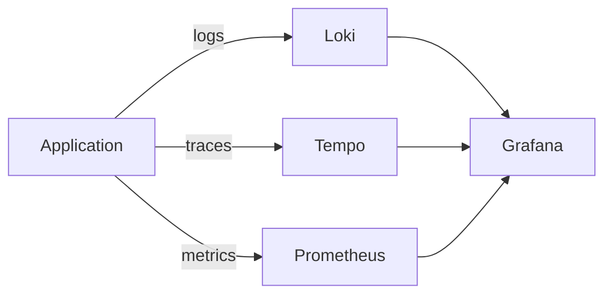
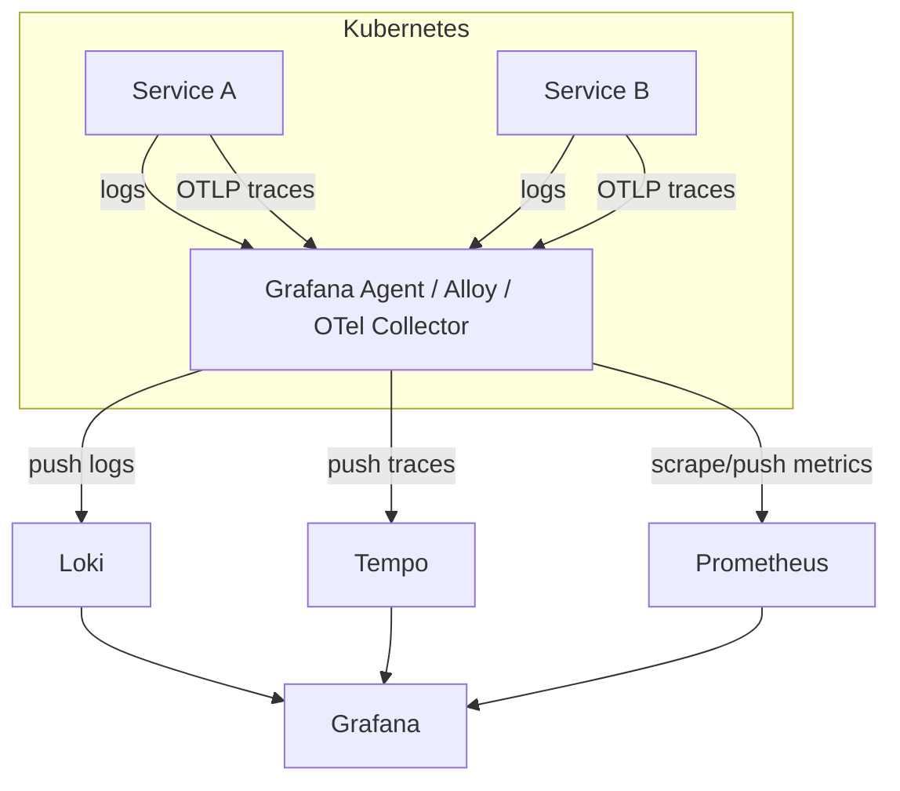
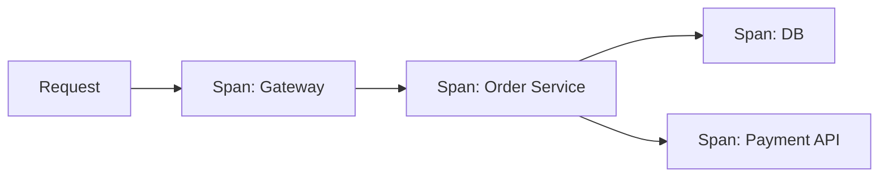
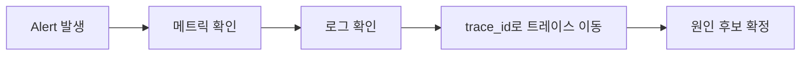

* TOC
{:toc}

# Grafana, Loki, Tempo 정리

이 문서는 Grafana + Loki + Tempo를 **각각 역할 중심으로 분리**해서 정리한다.

빠른 요약:

- **Grafana**: 시각화/탐색/알람 UI
- **Loki**: 로그 저장/검색 (라벨 인덱스 기반)
- **Tempo**: 분산 트레이스 저장/조회

---

## 1) 왜 3개를 같이 쓰는가

운영에서 핵심 질문은 보통 이 3개다.

1. 지금 얼마나 느린가? (메트릭)
2. 어떤 로그가 터졌나? (로그)
3. 어디 구간에서 느려졌나? (트레이스)

세 도구를 같이 쓰면 한 흐름으로 연결된다.



---

## 2) 전체 데이터 흐름 (Kubernetes 기준)



---

## 3) Grafana 챕터

## 3-1. Grafana의 역할

Grafana는 데이터를 저장하는 시스템이 아니라,
여러 데이터소스(Prometheus/Loki/Tempo/SQL)를 붙여서
**대시보드 + 탐색 + 알람**을 제공하는 관측 UI다.

핵심 기능:

- 대시보드
- Explore
- Alerting
- 데이터소스 간 링크(로그↔트레이스)

## 3-2. 실무 대시보드 구성

권장 패널 순서:

1. 트래픽 (RPS)
2. 지연 (p50/p95/p99)
3. 에러율 (4xx/5xx)
4. 리소스 (CPU/Mem)
5. 재시작/배포 이벤트

팁:

- `env`, `namespace`, `service` 변수로 범위 제어
- 한 화면에 모든 걸 넣지 말고 목적별 대시보드 분리

## 3-3. Alerting 운영 포인트

- 임계치 + 지속시간(`for`) 같이 설정
- 심각도 레벨 분리 (`warning`, `critical`)
- 소유자(oncall) 없는 알람 금지

안티패턴:

- 노이즈 알람 폭증
- 알람은 오는데 액션이 없음

## 3-4. Grafana 관련 레퍼런스

- Grafana Docs: <https://grafana.com/docs/grafana/latest/>
- Explore: <https://grafana.com/docs/grafana/latest/explore/>
- Alerting: <https://grafana.com/docs/grafana/latest/alerting/>

---

## 4) Loki 챕터

## 4-1. Loki의 역할

Loki는 로그 저장/검색 시스템이다.
가장 큰 특징은 **로그 본문 전체 인덱싱이 아니라 라벨 인덱싱**이다.

장점:

- 운영 비용 절감 가능
- Kubernetes 라벨과 결합이 쉬움

## 4-2. 라벨 설계 원칙 (핵심)

좋은 라벨 예시:

- `cluster`, `namespace`, `app`, `pod`, `container`, `env`

피해야 할 라벨:

- `requestId`, `userId`, `sessionId`

이런 값은 라벨이 아니라 로그 본문 필드로 두고 파싱해서 필터링해야 한다.

## 4-3. LogQL 실무 예시

```logql
{namespace="prod", app="order-api"}
```

```logql
{app="order-api"} |= "ERROR"
```

```logql
{app="order-api"} | json | level="error"
```

집계 예시:

```logql
sum by (app) (count_over_time({namespace="prod"} |= "ERROR" [1m]))
```

## 4-4. Loki 운영 안티패턴

1. high cardinality 라벨 폭발
2. 로그 포맷 제각각
3. 보존 정책(retention) 부재
4. 공통 필드(trace_id 등) 누락

## 4-5. Loki 관련 레퍼런스

- Loki Docs: <https://grafana.com/docs/loki/latest/>
- LogQL: <https://grafana.com/docs/loki/latest/query/>
- Label best practices: <https://grafana.com/docs/loki/latest/get-started/labels/>

---

## 5) Tempo 챕터

## 5-1. Tempo의 역할

Tempo는 분산 트레이스를 저장/조회한다.

질문 예시:

- 어떤 span이 병목인가?
- 어디서 실패가 전파됐나?
- p95 상승 원인이 DB인가 외부 API인가?

## 5-2. Trace/Span 개념

- Trace: 요청 전체 흐름
- Span: 흐름 내부 개별 작업



## 5-3. 도입 핵심

- trace context 전파 필수 (`traceparent` 등)
- 로그에 `trace_id` 포함
- 샘플링 정책(head/tail) 사전 합의

## 5-4. 샘플링 운영 팁

- 오류/느린 요청은 우선적으로 남기기
- 정상 트래픽은 비율 샘플링
- 비용과 진단 품질 균형 맞추기

## 5-5. Tempo 관련 레퍼런스

- Tempo Docs: <https://grafana.com/docs/tempo/latest/>
- OpenTelemetry: <https://opentelemetry.io/docs/>
- OTel SemConv: <https://opentelemetry.io/docs/specs/semconv/>

---

## 6) 세 도구를 연결해 장애 분석하는 표준 흐름



운영 절차:

1. 메트릭 이상 감지
2. 같은 시간대 로그 필터
3. trace_id로 트레이스 이동
4. 병목 span 확인
5. 액션 확정

---

## 7) 도입 순서 (현실적인 추천)

1. 공통 로그 포맷(JSON) 통일
2. Grafana + Loki 안정화
3. OpenTelemetry로 trace_id 전파
4. Tempo 연결
5. 알람/대시보드 표준화

"한 번에 다 도입"보다
**로그 표준화 → 트레이스 연결**이 실패 확률이 낮다.

---

## 8) 최소 체크리스트

- [ ] 로그에 `timestamp`, `level`, `service`, `trace_id` 포함
- [ ] Loki 라벨 cardinality 점검
- [ ] Tempo 샘플링 정책 합의
- [ ] Grafana 대시보드 템플릿 정리
- [ ] 알람 소유자/응답 정책 지정

---

## 9) 정리

- Grafana는 보는 창, Loki는 로그, Tempo는 요청 경로다.
- 성패는 도구보다 **스키마/라벨/전파/운영 룰**에서 갈린다.
- 목표는 많이 수집하는 게 아니라, **원인을 빠르게 좁히는 것**이다.
