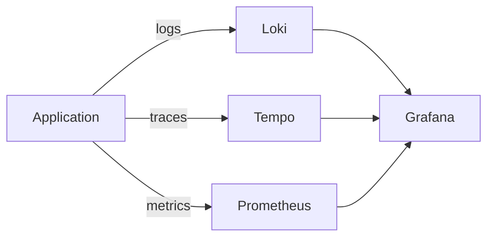
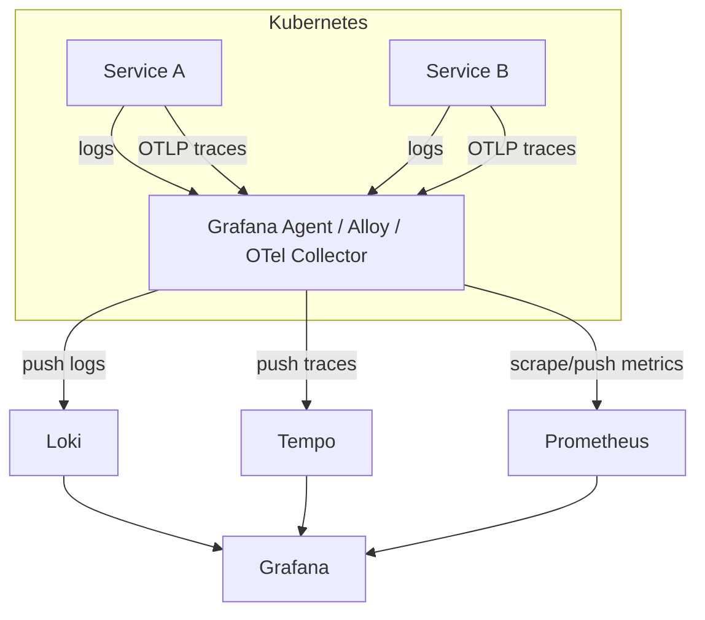
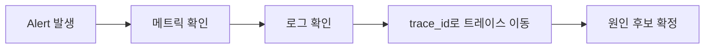

* TOC
{:toc}

# Grafana, Loki, Tempo 정리

이 문서는 Grafana + Loki + Tempo 조합을 기준으로 관측성(Observability) 스택을 정리한다.

핵심:

- **Grafana**: 시각화/탐색 UI
- **Loki**: 로그 저장/검색
- **Tempo**: 분산 트레이스 저장/검색

---

## 1) 왜 3개를 같이 쓰는가

운영에서 필요한 질문은 보통 이 3개다.

1. 지금 얼마나 느린가? (메트릭)
2. 어떤 로그가 터졌나? (로그)
3. 어디 구간에서 느려졌나? (트레이스)

Grafana는 이걸 한 화면에서 연결해 본다.



---

## 2) 구성요소 역할

이 문서 하나에서 각각의 역할을 따로 보려면 아래 소챕터(2-1, 2-2, 2-3)를 보면 된다.

## 2-1. Grafana

- 대시보드, 알람, 탐색 UI
- 여러 데이터소스 통합
- 로그/트레이스/메트릭 상호 링크

대표 기능:

- Explore로 즉시 질의
- 알람 룰 + 노티 채널(Slack 등)
- 대시보드 템플릿 변수

## 2-2. Loki

Loki는 로그 인덱싱 전략이 Elasticsearch와 다르다.

- 전체 로그 본문 인덱싱 X
- 라벨(Label) 중심 인덱싱 O

장점:

- 운영 비용/인덱스 비용 상대적으로 낮음
- Kubernetes 라벨과 결합 쉬움

주의:

- 라벨 설계 실패 시 성능 급락
- high cardinality 라벨 남용 금지 (`userId`, `requestId`를 라벨로 올리는 실수)

## 2-3. Tempo

Tempo는 분산 트레이스를 저장한다.

- Trace ID 기반 조회
- 서비스 간 호출 경로 추적
- 병목 구간(span) 확인

장점:

- 장애 시 “어디서 느려졌는지”를 구조적으로 파악 가능

---

## 3) 실무 데이터 흐름

Kubernetes 기준으로 가장 흔한 흐름:



---

## 4) Loki 핵심 개념

### 4-1. 라벨 설계 원칙

좋은 라벨 예시:

- `namespace`
- `pod`
- `app`
- `container`
- `env`

피해야 할 라벨:

- `requestId`
- `userId`
- `sessionId`

이런 값은 라벨이 아니라 로그 본문 필드로 두고, 파싱 후 필터링하는 방식이 안전하다.

### 4-2. LogQL 기본 예시

```logql
{namespace="prod", app="order-api"}
```

```logql
{app="order-api"} |= "ERROR"
```

```logql
{app="order-api"} | json | level="error"
```

---

## 5) Tempo 핵심 개념

### 5-1. Trace / Span

- Trace: 하나의 요청 전체 흐름
- Span: 그 흐름 안의 개별 작업 단위

예: API 요청 1건

- Span 1: Gateway 수신
- Span 2: Order Service 처리
- Span 3: DB 질의
- Span 4: Payment Service 호출

### 5-2. 트레이싱이 주는 가치

- p95 지연이 늘었을 때 원인 구간 추적
- 외부 API/DB/내부 로직 중 어디가 병목인지 분리

---

## 6) Grafana에서 3개 연결해서 보는 패턴

가장 실무적인 흐름:

1. 대시보드에서 에러율/지연 급증 감지
2. Explore에서 같은 시간대 로그 필터
3. 로그의 trace_id로 Tempo 이동
4. 병목 span 확인 후 원인 후보 축소



---

## 7) 운영에서 자주 겪는 실수

1. 라벨 카디널리티 폭발
- Loki 쿼리 느려지고 비용 상승

2. 로그 포맷 불일치
- 서비스마다 구조가 달라 집계 실패

3. trace_id 로그 미포함
- 로그↔트레이스 연결이 안 됨

4. 샘플링 전략 없음
- 트레이스 저장량 과다 또는 진단 불가

5. 알람 임계치 튜닝 부재
- 노이즈 알람 과다로 신뢰도 하락

---

## 8) 도입 순서 (추천)

1. 공통 로그 포맷(JSON) 통일
2. Grafana + Loki 먼저 안정화
3. OpenTelemetry로 trace_id 전파
4. Tempo 붙여서 trace 탐색
5. 메트릭-로그-트레이스 연동 알람 구축

빠르게 가려면 "모든 걸 한 번에"보다
**로그 안정화 → 트레이스 연결** 순서가 효율적이다.

---

## 9) 최소 체크리스트

- [ ] 로그에 `timestamp`, `level`, `service`, `trace_id` 포함
- [ ] Loki 라벨 high cardinality 점검
- [ ] Tempo 샘플링 정책 합의
- [ ] Grafana 대시보드 표준 템플릿 확보
- [ ] 알람 채널/소유자(oncall) 지정

---

## 10) 참고 레퍼런스

- Grafana Docs: <https://grafana.com/docs/grafana/latest/>
- Loki Docs: <https://grafana.com/docs/loki/latest/>
- Tempo Docs: <https://grafana.com/docs/tempo/latest/>
- Grafana Alloy (Agent): <https://grafana.com/docs/alloy/latest/>
- OpenTelemetry: <https://opentelemetry.io/docs/>
- Prometheus: <https://prometheus.io/docs/introduction/overview/>

---

## 11) 정리

- Grafana는 화면, Loki는 로그, Tempo는 요청 경로다.
- 운영 품질은 도구 도입보다 **로그 포맷/라벨 설계/추적 연결**에서 갈린다.
- 최종 목표는 "많이 수집"이 아니라 **문제 원인을 빠르게 좁히는 것**이다.
