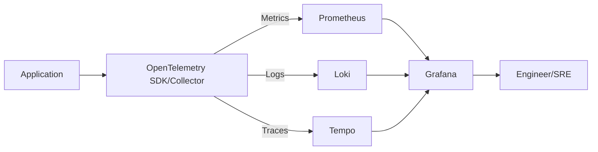
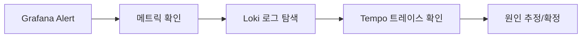

* TOC
{:toc}

# Grafana, Loki, Tempo 정리 (관측성 스택)

이 문서는 Grafana, Loki, Tempo를 **실무 운영 관점**으로 정리한다.
핵심은 도구 소개가 아니라 "장애 분석 속도를 어떻게 높일지"다.

---

## 1) 먼저 큰 그림: Observability 3축

운영에서 보는 관측성은 보통 3축이다.

- **Metrics**: 수치 시계열 (CPU, RPS, latency, error rate)
- **Logs**: 사건의 텍스트 기록
- **Traces**: 분산 요청의 호출 경로

각 축은 역할이 다르다.

- Metrics: 이상 감지(무슨 일이 터졌는지)
- Logs: 증거 확인(무엇이 실패했는지)
- Traces: 원인 경로 추적(어디서 느려졌는지)

---

## 2) 도구 역할 요약

### 2-1. Grafana

- 시각화/대시보드/알람 허브
- Prometheus/Loki/Tempo 같은 여러 데이터소스를 한 화면에서 조회

### 2-2. Loki

- 로그 저장/검색 시스템
- 인덱스를 최소화하고 라벨 중심으로 탐색하는 구조

### 2-3. Tempo

- 분산 트레이스 저장소
- 대규모 트레이스를 비교적 저비용으로 보관/검색

---

## 3) 아키텍처 전체 흐름



실무 포인트:

- Grafana는 저장소가 아니라 "조회/분석 UI"에 가깝다.
- Loki/Tempo/Prometheus는 데이터 저장 계층이다.

---

## 4) Grafana

## 4-1. 왜 중요한가

운영 중에는 여러 도구를 오가면 대응 속도가 급격히 떨어진다.
Grafana는 대시보드/알람/탐색을 통합해 대응 시간을 줄여준다.

### 4-2. 주요 기능

- Dashboard: 서비스 상태 보드
- Alerting: 임계치/조건 기반 경보
- Explore: 쿼리 즉시 탐색
- Correlations: 메트릭 ↔ 로그 ↔ 트레이스 연계

### 4-3. 실무 대시보드 최소 구성

- RED 지표
  - Rate (요청량)
  - Errors (에러율)
  - Duration (지연)
- 인프라 지표
  - CPU/Memory
  - Pod restart
  - Node saturation
- 비즈니스 지표 1~2개

---

## 5) Loki

### 5-1. Loki의 핵심 아이디어

Loki는 로그 본문 전체를 강하게 인덱싱하는 방식보다,
**라벨(label) 중심 인덱스**를 사용해 비용을 줄이는 전략을 택한다.

즉, 라벨 설계가 곧 검색 성능이다.

### 5-2. 라벨 설계 원칙

좋은 라벨 예시:

- `service`
- `namespace`
- `env`
- `pod`
- `level`

주의할 라벨:

- 유니크 값이 너무 많은 필드(예: request_id 전체를 라벨로)
- high cardinality 라벨은 비용/성능에 악영향

### 5-3. LogQL 기본 예시

```logql
{service="order-api", level="error"}
```

```logql
{service="order-api"} |= "timeout"
```

```logql
sum by (service) (rate({level="error"}[5m]))
```

### 5-4. 운영 팁

- 로그는 "찾기 쉬운 구조"가 중요
- JSON 구조 로그를 기본으로
- 공통 필드(trace_id, span_id, request_id)를 일관되게 남기기

---

## 6) Tempo

### 6-1. Tempo가 필요한 이유

마이크로서비스 환경에서 요청은 여러 서비스를 거친다.
로그만 보면 개별 사건은 보이지만, "요청 전체 경로"는 끊긴다.

Tempo는 분산 트레이스를 통해 경로/지연 병목을 보여준다.

### 6-2. 추적의 핵심 개념

- Trace: 하나의 요청 전체 흐름
- Span: 흐름 안의 개별 작업 단위
- Parent/Child: 호출 관계

### 6-3. 트레이스 분석에서 보는 것

- 어떤 span이 가장 느린지
- 에러 span이 어디서 시작됐는지
- 상위 서비스 문제인지, 하위 의존성 문제인지

### 6-4. Tempo + OTel 실무 포인트

- 샘플링 전략 결정 필요
  - 무조건 100% 수집은 비용 부담
- 중요 엔드포인트 우선 샘플링 고려
- span attribute 표준화
  - service name, endpoint, status code, db statement(마스킹)

---

## 7) 세 도구를 같이 쓸 때 진짜 이점

### 7-1. 장애 대응 플로우



1. 알람 수신
2. 메트릭으로 이상 구간 확인
3. 동일 시간대 로그 확인
4. trace_id로 트레이스 점프
5. 병목/에러 지점 확정

이 플로우가 안정되면 MTTR이 크게 줄어든다.

---

## 8) 도입 순서 추천

### 1단계

- Grafana + Prometheus 대시보드/알람 정착

### 2단계

- Loki 도입
- 구조 로그 + 라벨 표준화

### 3단계

- Tempo 도입
- OTel instrumentation + trace 연계

### 4단계

- 대시보드에서 메트릭→로그→트레이스 원클릭 연동

---

## 9) 흔한 실패 패턴

- 도구만 설치하고 라벨/로그 규칙이 없음
- 알람이 너무 많아 노이즈만 증가
- trace_id를 로그에 남기지 않아 연계 불가
- 대시보드가 많기만 하고 운영 의사결정과 연결 안 됨

---

## 10) 실무 체크리스트

- [ ] 서비스 공통 라벨 규칙이 문서화되어 있다
- [ ] 에러 로그에 trace_id/span_id를 남긴다
- [ ] p95/p99 지연 대시보드가 있다
- [ ] SLO 기반 알람이 있다
- [ ] 장애 대응 시 메트릭→로그→트레이스 절차가 팀에 공유되어 있다

---

## 11) 참고 레퍼런스

- Grafana Docs: <https://grafana.com/docs/grafana/latest/>
- Loki Docs: <https://grafana.com/docs/loki/latest/>
- Tempo Docs: <https://grafana.com/docs/tempo/latest/>
- Grafana Alerting: <https://grafana.com/docs/grafana/latest/alerting/>
- OpenTelemetry Docs: <https://opentelemetry.io/docs/>
- Prometheus Docs: <https://prometheus.io/docs/introduction/overview/>

---

## 12) 정리

- Grafana는 관측의 "조종석"이다.
- Loki는 로그 증거를 빠르게 찾는 저장소다.
- Tempo는 분산 요청의 병목 경로를 보여준다.
- 세 도구를 묶어 쓰면 장애 원인 분석 속도가 확실히 빨라진다.
