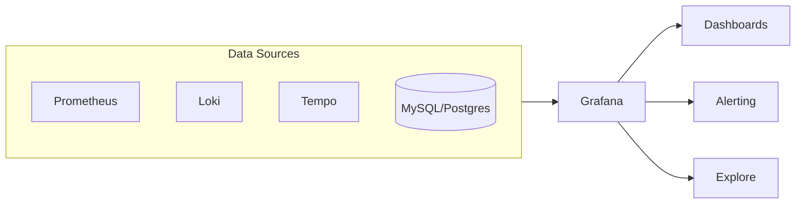

* TOC
{:toc}

# Grafana 정리

## 1) Grafana를 왜 쓰는가

Grafana는 모니터링 데이터를 "저장"하는 도구가 아니라
여러 저장소를 연결해 **한 화면에서 탐색/시각화/알림**을 수행하는 도구다.

핵심 역할:

- 대시보드 시각화
- 실시간 탐색(Explore)
- 알람 룰 실행
- 로그/메트릭/트레이스 상호 링크

---

## 2) 기본 구조

Grafana는 데이터소스를 통합해 "관측 UI"를 제공한다.

---

## 3) 데이터소스 모델

대표 데이터소스:

- Prometheus: 메트릭
- Loki: 로그
- Tempo: 트레이스
- Elasticsearch/OpenSearch: 로그/검색
- SQL: 비즈니스 지표

실무 포인트:

- 데이터소스별 쿼리 언어가 다르다 (PromQL, LogQL 등)
- 대시보드는 결국 "질문"을 시각화한 것

---

## 4) 대시보드 설계 원칙

### 4-1. 대시보드 레이어 분리

- 서비스 개요 대시보드 (SLI/SLO)
- 컴포넌트 상세 대시보드 (DB, Cache, MQ)
- 장애 대응 대시보드 (온콜 전용)

### 4-2. 패널 구성 추천

1. 트래픽 (RPS)
2. 지연 (p50/p95/p99)
3. 에러율 (4xx/5xx)
4. 리소스 (CPU/Mem)
5. 재시작/배포 이벤트

### 4-3. 변수(Template Variable)

- `env`, `namespace`, `service`, `instance` 변수로 범위를 좁히면
  하나의 대시보드를 여러 환경에서 재사용 가능하다.

---

## 5) Explore 사용 패턴

Explore는 장애 대응 시 가장 자주 쓰인다.

운영 흐름 예시:

1. 메트릭에서 에러율 상승 확인
2. 같은 시간대 Loki 로그 조회
3. 로그의 trace_id로 Tempo 이동
4. 병목 span 확인

---

## 6) Grafana Alerting 실무

### 6-1. 룰 설계 원칙

- SLI 기반 룰 우선
- 노이즈 줄이기 위해 `for` 지속시간 사용
- 심각도(critical/warning) 분리

예시:

- `5xx rate > 2%` for 5m
- `p95 latency > 500ms` for 10m

### 6-2. 알림 채널

- Slack/Email/PagerDuty/Opsgenie
- 채널마다 다른 임계치 적용 가능

### 6-3. 안티패턴

- 너무 민감한 임계치로 알람 폭발
- 알람은 많은데 소유자 없음
- 대시보드는 많은데 운영 판단 기준 없음

---

## 7) 운영에서 자주 하는 실수

1. 패널 과다: 화면은 복잡한데 판단이 어려움
2. 지표 정의 불일치: 팀마다 의미가 다름
3. 로그/트레이스 연동 부재: 원인 추적에 시간 과다
4. 알람 정리 없음: 신뢰도 하락

---

## 8) 도입 체크리스트

- [ ] 공통 SLI 정의 (가용성, 지연, 에러율)
- [ ] 서비스별 기본 대시보드 템플릿
- [ ] 알람 소유자/응답 정책
- [ ] 로그/트레이스 링크 정책(trace_id)
- [ ] 대시보드 리뷰 주기(월 1회)

---

## 9) 참고 레퍼런스

- Grafana Docs: <https://grafana.com/docs/grafana/latest/>
- Grafana Alerting: <https://grafana.com/docs/grafana/latest/alerting/>
- Explore: <https://grafana.com/docs/grafana/latest/explore/>

---

## 10) 정리

Grafana의 핵심은 "예쁜 대시보드"가 아니다.
**장애 시 빠르게 원인을 좁히게 만드는 탐색 경험**이다.
