* TOC
{:toc}

# 홈서버 / SRE 학습 멘탈 모델

개인 홈서버를 SRE 운영 훈련, 사이드 프로젝트 배포 기반, 빠른 실험 플랫폼으로 구성한다.
NAS / 미디어 서버 대체가 아니다.

관련 문서: [[kubernetes]]

---

## 1. 호스트 계획

| 시점 | 호스트 | 역할 |
|---|---|---|
| 2026-04 ~ 2026-05 | M2 MacBook Air 24GB (클램쉘 24h) | 설계 검증, 학습 |
| 2026-05 말 ~ | Mac mini M4 | 본격 운영 |

---

## 2. 스택

| 계층 | 도구 | 메모 |
|---|---|---|
| 컨테이너 런타임 | OrbStack | Apple Silicon 네이티브, 개인 무료 |
| 로컬 Kubernetes | k3d | k3s를 도커 컨테이너로 띄워 멀티노드 시뮬레이션 |
| IaC (플랫폼) | Terraform | 플랫폼 컴포넌트 코드화 |
| GitOps (앱) | ArgoCD | App-of-Apps 패턴 |
| 원격 접속 | Tailscale | NAT 관통 |
| 관측성 | Prometheus + Grafana + Loki | 메트릭 / 시각화 / 로그 |
| 시크릿 | sops + age | git 저장소에 암호화 보관 |

---

## 3. 외부 접속 토폴로지

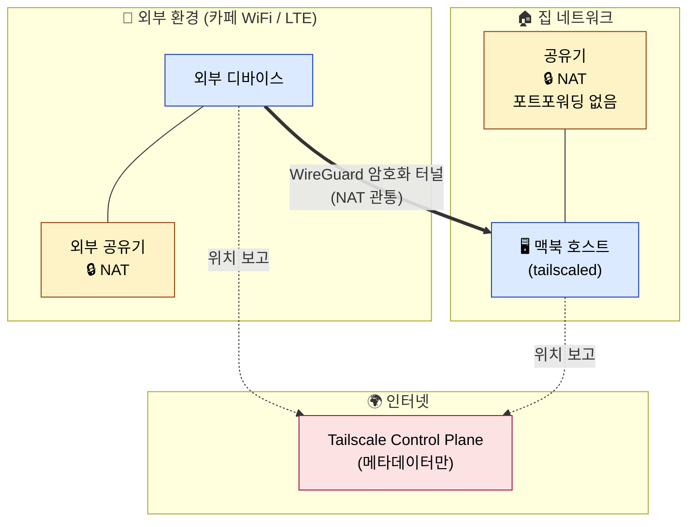

### 3.1 NAT의 동작

홈 공유기는 NAT(Network Address Translation), 라우터, 기본 방화벽 역할을 동시에 수행한다.
사설 IP(`192.168.x.x`)는 외부에서 직접 보이지 않는다. 외부에서 들어오는 패킷은 공유기가 라우팅 대상을 모르므로 폐기한다.
별도 방화벽 설정 없이도 인바운드 트래픽은 기본적으로 차단된다.

포트포워딩은 차단된 벽에 룰 하나를 추가해 구멍을 뚫는 행위다.

### 3.2 Tailscale의 NAT 관통

1. STUN 서버를 통해 양 디바이스가 자신의 외부 IP/포트를 확인한다.
2. 양쪽이 동시에 서로에게 패킷을 전송하면 NAT가 outbound 응답으로 인식해 통과시킨다 (hole punching).
3. 이후 WireGuard 암호화 P2P 터널로 직접 통신한다.
4. 관통이 실패하면 DERP 릴레이 서버가 트래픽을 중계한다.

Tailscale Control Plane은 좌표 메타데이터만 처리한다. 실제 데이터 트래픽은 거치지 않는다.

---

## 4. 호스트 계층

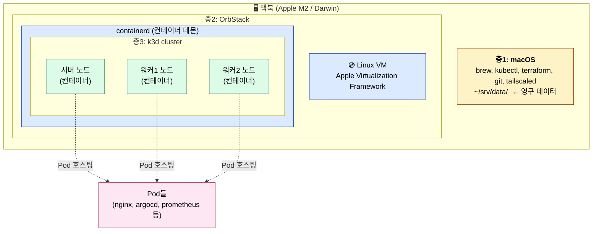

### 4.1 층1: macOS

CLI 도구(brew, kubectl, terraform, git), Tailscale 데몬이 실행된다.
영구 데이터 위치는 `~/srv/data/`로 고정한다.

### 4.2 층2: OrbStack

컨테이너는 리눅스 커널의 기능(namespaces + cgroups + chroot)이며, 리눅스 커널 없이 존재할 수 없다.
macOS는 Darwin 커널을 사용하므로 컨테이너를 직접 실행할 수 없다.

OrbStack은 Apple Virtualization Framework로 리눅스 VM을 한 대 띄우고, 그 안에 containerd를 실행한다.
즉 OrbStack은 "맥북 안에 리눅스 머신 한 대를 끼워넣는" 장치다.

### 4.3 층3: k3d 클러스터

k3d는 k3s(경량 Kubernetes 배포판)를 도커 컨테이너로 실행하는 도구다.
각 "노드"는 OrbStack VM 안의 도커 컨테이너이며, 그 컨테이너 안에서 k3s 바이너리가 실행된다.
Pod은 그 안에서 또 다른 컨테이너로 실행되는 중첩 구조다.

```bash
docker ps
# k3d-homelab-server-0   ← 노드 (컨테이너)
# k3d-homelab-agent-0    ← 노드 (컨테이너)
# k3d-homelab-agent-1    ← 노드 (컨테이너)

kubectl get pods -A
# 위 노드 컨테이너 안에서 실행되는 Pod들
```

---

## 5. 클러스터 구조

### 5.1 노드

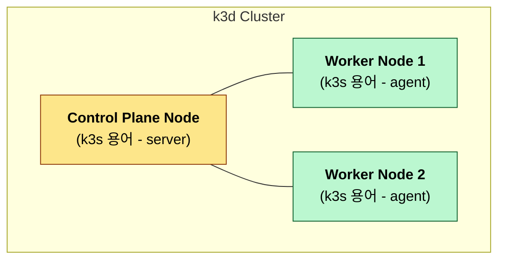

| 종류 | k3s 용어 | 역할 |
|---|---|---|
| Control Plane | server | 클러스터 상태 관리, 변경 권한 |
| Worker | agent | Pod 실제 실행 |

Control Plane이 다운되어도 이미 실행 중인 Pod의 평시 트래픽은 영향을 받지 않는다.
새 Pod 생성/삭제, 자동 복구, kubectl 명령 등 변경 권한만 마비된다.

운영 환경에서는 etcd의 raft 합의를 위해 Control Plane을 홀수(3, 5, 7…)로 둔다.

### 5.2 컨트롤 플레인 컴포넌트

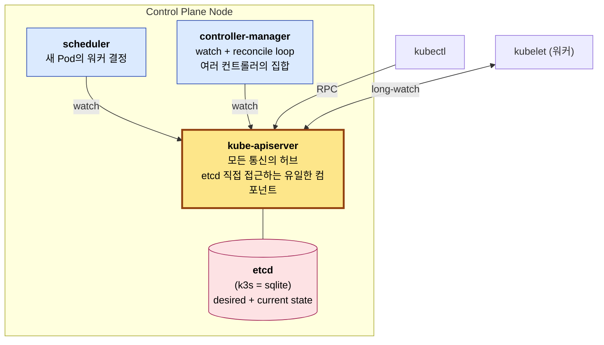

| 컴포넌트 | 역할 |
|---|---|
| kube-apiserver | 모든 통신의 진입점. etcd에 직접 접근하는 유일한 컴포넌트 |
| etcd (k3s = SQLite) | 클러스터의 desired state + current state 저장소 |
| scheduler | 새 Pod이 어느 워커에 배치될지 결정 |
| controller-manager | deployment, replicaset, node, endpoint 등 여러 컨트롤러의 집합. desired state를 watch해 reconcile |

모든 컴포넌트는 apiserver를 경유해 통신한다. 컴포넌트 간 직접 호출은 없다.

### 5.3 kubectl apply 처리 흐름

`kubectl apply -f deployment.yaml` 실행 시 일어나는 일:

1. kubectl → apiserver: deployment 등록 요청
2. apiserver → etcd: deployment 객체 저장
3. controller-manager의 deployment-controller가 watch로 감지 → ReplicaSet 생성 요청
4. controller-manager의 replicaset-controller가 watch로 감지 → Pod 객체 N개 생성 (nodeName 미지정)
5. scheduler가 nodeName 미지정 Pod 발견 → 워커 결정 후 nodeName 필드 채움
6. 각 워커의 kubelet이 자기 노드에 할당된 Pod을 watch로 받음 → 컨테이너 런타임에 생성 명령
7. Pod 실행 후 status를 apiserver에 보고

각 단계는 "apiserver를 watch → 변경 감지 → 자기 일 수행 → 결과를 apiserver에 기록" 패턴을 따른다.
이것이 Kubernetes의 선언적 reconcile loop다.

### 5.4 워커 컴포넌트

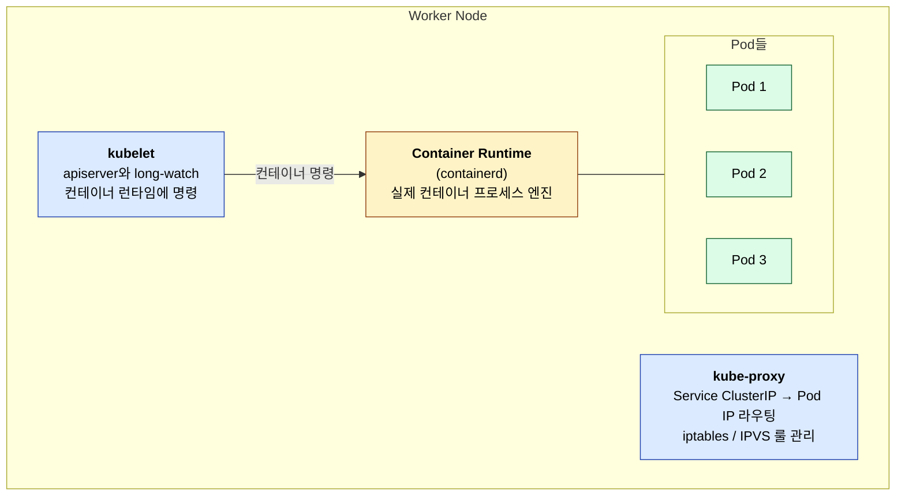

| 컴포넌트 | 역할 |
|---|---|
| kubelet | apiserver와 long-lived watch 연결. 자기 노드에 할당된 Pod을 컨테이너 런타임에 명령 |
| kube-proxy | Service ClusterIP → 실제 Pod IP 라우팅. iptables 또는 IPVS 룰 관리 |
| Container Runtime (containerd) | 실제 컨테이너 프로세스 실행 |

kubelet은 scheduler나 controller-manager와 직접 통신하지 않는다. 모든 상호작용은 apiserver를 통해 이루어진다.

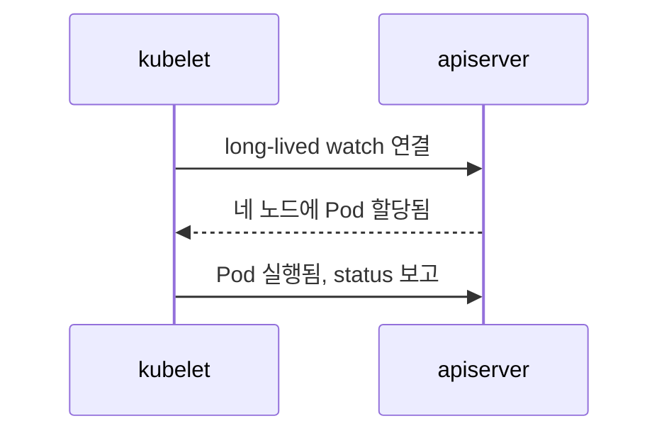

### 5.5 네임스페이스

네임스페이스는 논리적 라벨이다. 노드를 물리적으로 나누지 않는다.
같은 워커 노드에 여러 네임스페이스의 Pod이 함께 실행된다.

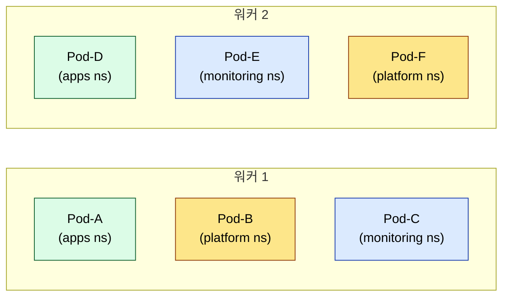

용도:

- **격리**: RBAC, 리소스 쿼터, NetworkPolicy의 단위
- **이름 충돌 방지**: 다른 네임스페이스에 같은 이름의 리소스가 공존 가능 (`apps/nginx`, `monitoring/nginx`)
- **삭제 단위**: `kubectl delete namespace foo` → 네임스페이스 안의 모든 리소스 일괄 삭제
- **시야 분리**: `kubectl get pods`는 현재 네임스페이스만 표시

Service와의 차이:

- Service: Pod 라우팅 (가상 IP, DNS, 변경되는 Pod IP를 추상화)
- Namespace: Pod 그룹화 (조직, 권한, 격리)

### 5.6 etcd 장애 영향

| 데이터 상태 | 결과 |
|---|---|
| 데이터 파일 무사 (k3s `state.db`) | 자동 재시작 → 정상 복귀 |
| 데이터 파일 소실 | 모든 desired state 증발, 사실상 새 클러스터 |
| 백업 존재 | 백업 시점으로 복구 |

etcd 장애 시 즉각 영향:

- 이미 실행 중인 Pod: 워커에서 그대로 작동 (kubelet이 자체 운영)
- kubectl 명령: 실패
- scheduler / controller-manager: watch 실패로 마비
- 신규 배포 / 자동 복구: 불가

---

## 6. 시간축과 책임 분리

### 6.1 단계별 흐름

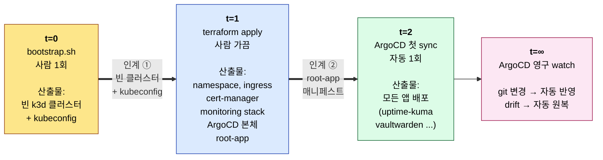

| 시점 | 도구 | 빈도 | 산출물 |
|---|---|---|---|
| t=0 | bootstrap.sh | 1회 (사람) | 빈 k3d 클러스터, kubeconfig |
| t=1 | terraform apply | 가끔 (사람) | namespace, ingress-nginx, cert-manager, monitoring stack, ArgoCD 본체, root-app |
| t=2 | ArgoCD 첫 sync | 1회 (자동) | root-app이 가리키는 모든 앱 배포 |
| t=∞ | ArgoCD watch | 영구 (자동) | git 변경 자동 반영, drift 자동 원복 |

### 6.2 권한 인계

- **인계 ① bootstrap → Terraform**: bootstrap이 빈 k3d 클러스터와 kubeconfig를 생성한다. Terraform은 클러스터 자체를 생성하지 않으며 이미 존재하는 클러스터의 kubeconfig를 사용한다.
- **인계 ② Terraform → ArgoCD**: Terraform이 ArgoCD 본체와 root-app 매니페스트를 등록한다. root-app은 homelab-gitops repo의 `apps/*` 폴더 아래 모든 Application을 등록한다. 이후 Terraform은 추가 작업을 하지 않는다.

### 6.3 App-of-Apps 패턴

ArgoCD는 자기 자신의 매니페스트도 git에서 관리한다.

```
homelab-gitops/
├── platform/
│   ├── argocd/              # ArgoCD 자기 자신의 매니페스트
│   ├── ingress-nginx/
│   └── monitoring/
└── apps/
    ├── uptime-kuma/
    └── vaultwarden/
```

운영상 분담:

- Terraform: ArgoCD 최초 설치 + root-app 등록까지
- ArgoCD git: 그 이후 모든 변경 (앱, ArgoCD 자체 설정)
- Terraform 재실행: 클러스터 재구축 시 (응급 복구 도구 역할)

---

## 7. 트래픽 종류

같은 클러스터 안에서 세 종류의 트래픽이 별도 회선으로 흐른다.

### 7.1 사용자 트래픽

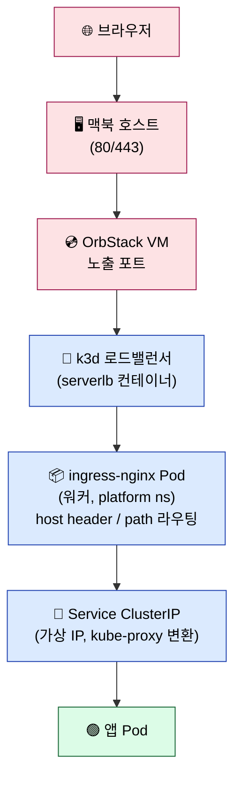

apiserver를 거치지 않는다. 사용자 트래픽은 data plane이며 control plane과 회선이 분리된다.
apiserver가 다운되어도 평시 사용자 트래픽은 흐른다.

### 7.2 GitOps 트래픽

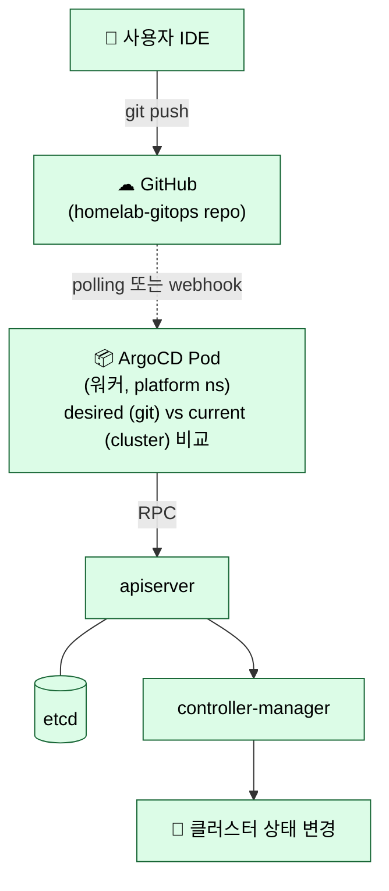

git 변경 감지 방식:

- **기본**: ArgoCD가 git을 3분 주기로 polling
- **최적화**: GitHub webhook 등록 → push 즉시 신호 → 즉시 sync
- **운영**: 둘 다 활성화 (webhook은 빠른 반영, polling은 fallback)

ArgoCD는 일반 Kubernetes client처럼 apiserver를 호출한다. etcd 직접 접근은 불가하다.
GitOps 트래픽은 control plane 트래픽으로 분류된다.

### 7.3 관측 트래픽

#### 메트릭 (Prometheus, pull 방식)

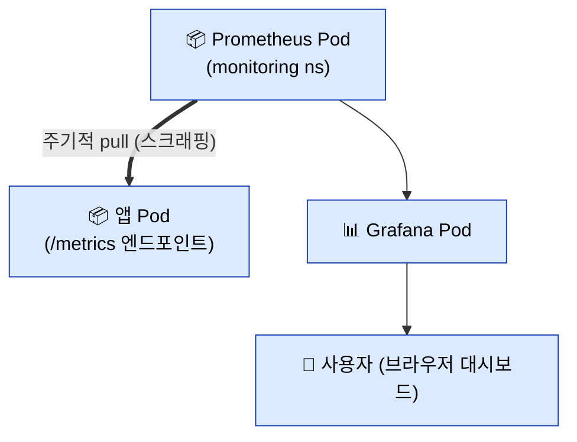

Prometheus는 각 Pod의 `/metrics` 엔드포인트를 주기적으로 스크래핑한다.
타겟 목록은 apiserver에 메타조회로 가져오지만, 실제 메트릭 데이터는 Pod에 직접 접근한다.

#### 로그 (Loki, agent push 방식)

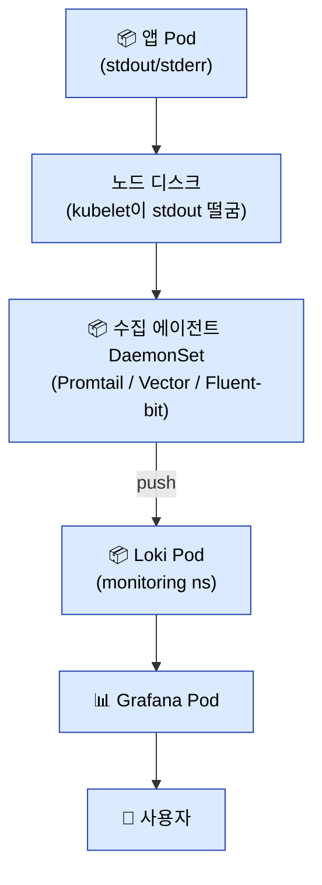

각 워커 노드의 DaemonSet이 stdout 로그를 모아 Loki로 push한다.

### 7.4 회선 비교

| 트래픽 | apiserver 경유 | 회선 |
|---|---|---|
| 사용자 (🔴) | ❌ | data plane (ingress → service → pod) |
| GitOps (🟢) | ✅ 핵심 경로 | control plane (ArgoCD → apiserver → etcd) |
| 관측 (🔵) | 🟡 메타조회만 | data plane (대부분) + apiserver (타겟 목록) |

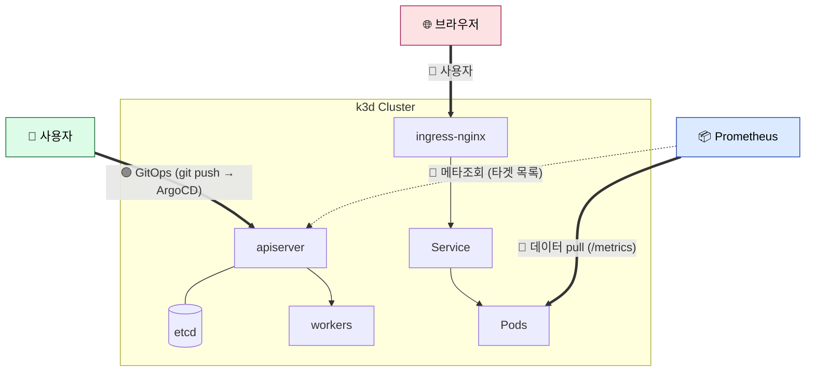

---

## 8. 리포지토리 구조

```
homelab-infra/      # Terraform, 플랫폼 영역, 변경 빈도 낮음
homelab-gitops/     # ArgoCD watch 대상, 앱 영역, 변경 빈도 높음
projects/*/         # 사이드 프로젝트 코드 (별도 repo)
```

플랫폼과 앱을 분리하는 이유는 blast radius 격리다.
일상 push가 플랫폼을 건드리지 않도록 분리한다. 일상 운영의 대부분은 `homelab-gitops`에서 발생한다.

### 8.1 책임 분리

| 영역 | 관리 도구 | 예시 |
|---|---|---|
| 클러스터 자체 | bootstrap script | `k3d cluster create` |
| 플랫폼 | Terraform | namespace, ingress-nginx, cert-manager, prometheus, ArgoCD 본체 |
| 앱 | ArgoCD | uptime-kuma, vaultwarden, 사이드 프로젝트 |
| 앱 코드 | 별도 repo | `projects/project-a/` |

ArgoCD까지 Terraform이 설치하는 이유는 자기 참조 문제 때문이다.
Terraform이 ArgoCD 설치 + root-app 등록을 담당하면, 그 이후는 ArgoCD가 자체 관리한다.

---

## 9. 운영

### 9.1 백업 우선순위

| 우선순위 | 대상 | 위치 | 잃었을 때 영향 |
|---|---|---|---|
| 1 | terraform.tfstate | 로컬 파일 | Terraform이 자기가 만든 리소스를 인식 못함 → 중복 생성 / 충돌 |
| 2 | etcd | k3s = SQLite (`state.db`) | 모든 desired state 증발 |
| 3 | 영구 데이터 | `~/srv/data/<app>/` | stateful 앱 데이터 손실 |
| 자동 | git repo | GitHub | (GitHub이 보존) |

### 9.2 호스트 이전 절차

이전 가능성 원칙을 지킨 경우, 새 호스트로 옮겨야 할 항목:

1. homelab-infra repo (GitHub clone)
2. homelab-gitops repo (GitHub clone)
3. terraform.tfstate (로컬 파일, 직접 옮김)
4. ~/srv/data/ (rsync)
5. sops age 키

새 호스트에서 실행:

```bash
brew install orbstack k3d kubectl helm terraform sops age tailscale
git clone github.com/currenjin/homelab-infra
git clone github.com/currenjin/homelab-gitops
# tfstate, ~/srv/data, sops key 옮기기
./bootstrap.sh        # 빈 k3d 클러스터 생성
terraform apply       # platform 다시 설치
# ArgoCD가 root-app을 sync해 모든 앱 자동 복원
```

### 9.3 디버깅 진입점

| 증상 | 점검 위치 |
|---|---|
| 외부에서 앱 접속 안 됨 | Tailscale 연결 → ingress-nginx Pod 상태 → Service endpoints → 앱 Pod |
| kubectl 명령 실패 | apiserver 상태 → etcd (k3s state.db) 정상성 |
| git push했는데 배포 안 됨 | ArgoCD가 git 변경을 감지했는지 (polling/webhook) → root-app sync 상태 → application Pod |
| 메트릭 빈 칸 | Prometheus의 ServiceMonitor/PodMonitor → /metrics 엔드포인트 응답 |
| 로그 안 보임 | Promtail/Vector DaemonSet 상태 → Loki 연결 |
| 클러스터 전체 사망 | bootstrap → terraform apply → ArgoCD 자동 복구 |
| 호스트 이전 | tfstate + data + git + sops 키 |

---

## 10. 결정 사항

### 10.1 이전 가능성 원칙

5월 말 Mac mini로 이전이 첫 검증 시나리오다. 이를 위한 규칙:

- 호스트 IP/이름 하드코딩 금지 (localhost, magic DNS, ClusterIP 사용)
- 데이터 경로 절대 고정 (`~/srv/data/<app>/`)
- 시크릿은 sops + age로 git에 암호화 저장
- Terraform / ArgoCD / 매니페스트 모두 git에 보관

### 10.2 외부 접속 정책

- Tailscale only, 포트포워딩 사용 안 함
- 공개 앱이 필요해지면 Cloudflare Tunnel 추가

### 10.3 클램쉘 운영 (M2 MBA 한정)

- 외부 모니터 / 키보드 / 전원 상시 연결
- `pmset -c sleep 0`, `pmset -c disksleep 0`
- 시스템 설정 → 배터리 → "디스플레이 끄기 후 잠자기 방지"
- 시스템 설정 → 일반 → 공유 → 원격 로그인 (SSH)
- 컴퓨터 이름 고정 (예: `homelab`)

---

## 11. 추후 학습 영역

핵심 모델에서 다루지 않은 영역. 구현 중 필요 시 학습한다.

| 영역 | 키워드 | 학습 시점 |
|---|---|---|
| Storage | PV / PVC / hostPath / StorageClass | 첫 stateful 앱 배포 시 |
| Secrets 운영 | sops + age, External Secrets | 첫 비밀 배포 시 |
| CNI / NetworkPolicy | Flannel, Calico | 트래픽 격리 필요 시 |
| Service Mesh | Istio, Linkerd | mTLS / 관측성 강화 시 |
| Backup/Restore | Velero, Restic | 정기 백업 자동화 시 |
| 업그레이드 | k3s / ArgoCD / Terraform 버전업 | 6개월차 |

---

## 12. 참고

- [[kubernetes]]
- [[grafana-loki-tempo]]
- [[docker]]
