* TOC
{:toc}

# 홈서버 / SRE 학습 멘탈 모델

이 문서는 개인 홈서버를 구축하면서 잡아둔 **설계 결정**과, 운영 감각을 위한 **멘탈 모델 5장 그림**을 정리한 것이다.

목적은 NAS/미디어 서버 대체가 **아니다**:

- SRE 운영 감각을 손으로 익히는 훈련장
- 사이드 프로젝트 배포 기반
- 빠른 실험을 위한 개인 플랫폼

관련 문서: [[kubernetes]]

---

## 1. 아키텍처 결정

### 1.1 스택

| 계층 | 도구 |
|---|---|
| 컨테이너 런타임 | OrbStack |
| 로컬 Kubernetes | k3d |
| IaC (플랫폼 영역) | Terraform |
| GitOps (앱 영역) | ArgoCD |
| 원격 접속 | Tailscale |
| 관측성 | Prometheus + Grafana + Loki |
| 시크릿 | sops + age |

선택 이유 요약:

- **OrbStack**: Apple Silicon 네이티브, RAM 점유 적음, 개인 무료. Docker Desktop 대비 1/3 수준.
- **k3d**: 한 노드 머신에서 멀티노드 k8s를 컨테이너로 시뮬레이션. 부수기 쉬움, 학습용 최적.
- **Terraform**: 플랫폼 레이어를 IaC로. ArgoCD까지 Terraform으로 깔아서 부트스트랩 자동화.
- **ArgoCD**: 앱 레이어 GitOps. App-of-Apps 패턴으로 자기 자신도 git에서 관리 가능.
- **Tailscale**: NAT 관통 + WireGuard. 포트포워딩 없이 외부 접속 가능, 보안 부채 ↓.

### 1.2 호스트 계획

- **현재 (2026-04)**: 곧 팔 예정 M2 MacBook Air 24GB, 클램쉘 24h 운영
- **5월 말**: Mac mini M4 도착 예정 → 본격 운영 호스트로 이전

### 1.3 리포 분리

```
homelab-infra/      # Terraform — 플랫폼 영역 (자주 안 바뀜)
homelab-gitops/     # ArgoCD가 watch — 앱 영역 (자주 바뀜)
projects/*/         # 사이드 프로젝트 코드 (별도 repo)
```

분리 이유: **blast radius 격리**. 플랫폼이 흔들리면 모든 앱이 죽는다. 이 둘이 한 repo에 있으면 일상 push가 platform까지 건드릴 위험이 있다.

일상 운영의 95%는 `homelab-gitops`에서 일어난다. `homelab-infra`는 거의 안 건드린다.

### 1.4 책임 분리 (Terraform vs ArgoCD)

| 영역 | 누가 관리 | 예시 |
|---|---|---|
| 클러스터 자체 | bootstrap script | `k3d cluster create` |
| 플랫폼 | Terraform | namespace, ingress-nginx, cert-manager, prometheus, argocd 본체 |
| 앱 | ArgoCD | uptime-kuma, vaultwarden, 사이드 프로젝트들 |
| 앱 코드 | 별도 repo | `projects/project-a/` |

ArgoCD까지 Terraform이 까는 이유: ArgoCD가 자기 자신을 관리하는 건 닭-알 문제. Terraform이 "ArgoCD 설치 + root-app 등록"까지 해주면, 그 뒤로는 ArgoCD가 알아서 모든 앱을 sync.

### 1.5 이전 가능성 원칙

5월 말 Mac mini로 이전하는 것이 첫 번째 검증 시나리오. 이를 위해 모든 것이 **git/IaC 안**에 있어야 한다.

지킬 룰:

- **호스트 IP/이름 하드코딩 금지** — 항상 `localhost`, magic DNS, ClusterIP 같은 추상화된 주소 사용
- **데이터 경로 절대 고정** — `~/srv/data/<app>/` 형태. 호스트 바뀌어도 같은 경로
- **시크릿은 sops + age** — 평문으로 박지 말고 처음부터 암호화해서 git에 둠
- **Terraform/ArgoCD/매니페스트 모두 git에**

이전 시 부활 키트 (5개):

```
① homelab-infra repo        ← GitHub clone (자동)
② homelab-gitops repo       ← GitHub clone (자동)
③ terraform.tfstate 파일    ⭐ 로컬 파일 → 직접 옮겨야 함
④ ~/srv/data/ 디렉토리       ⭐ 영구 데이터 → rsync
⑤ secrets (sops age 키)     ⭐ 비밀 → 안전 채널
```

새 호스트 부활 절차:

```bash
# 새 맥미니에서
brew install orbstack k3d kubectl helm terraform sops age tailscale
git clone github.com/currenjin/homelab-infra
git clone github.com/currenjin/homelab-gitops
# tfstate, ~/srv/data, sops key 옮겨오기
./bootstrap.sh        # 빈 k3d 클러스터 생성
terraform apply       # platform 다시 박힘
# ArgoCD 깨어나서 root-app 보고 모든 앱 자동 sync
```

> tfstate를 잊으면 Terraform이 "내가 뭐 만들었는지 모름" 상태가 된다. 두 번 만들거나 충돌남. **state 백업이 1순위.**

### 1.6 외부 접속

- **Tailscale only** — 포트포워딩 ❌
- 공개 앱이 필요해지면 그때 Cloudflare Tunnel 추가

### 1.7 클램쉘 운영 (M2 MBA 한정)

- 외부 모니터/키보드/전원 상시 연결
- `pmset -c sleep 0`, `pmset -c disksleep 0`
- 시스템 설정 → 배터리 → "디스플레이 끄기 후 잠자기 방지"
- 시스템 설정 → 일반 → 공유 → 원격 로그인 (SSH)
- 컴퓨터 이름 고정 (`homelab` 같이)

### 1.8 백업 우선순위

각 도구의 state 위치를 알면 백업 대상이 자동 도출된다.

| 도구 | state 위치 | 백업 대상? |
|---|---|---|
| bootstrap | 거의 없음 (재실행으로 복구) | ❌ |
| Terraform | `terraform.tfstate` 파일 | ✅ 1순위 |
| ArgoCD | etcd 안 (k3s = sqlite) | ✅ 2순위 (etcd 통째) |
| 영구 데이터 | `~/srv/data/` | ✅ 3순위 |
| git repo | GitHub | 자동 (GitHub이 백업) |

---

## 2. 멘탈 모델 5장 그림

운영 감각의 골격. 알람이나 사고가 났을 때 "어디 봐야 하지?"가 자동으로 떠오르려면 이 5개가 머릿속에 박혀 있어야 한다.

### 2.1 그림 1 — 경계선과 Tailscale의 NAT 관통

외부에서 집의 호스트에 어떻게 안전하게 접근하는가?

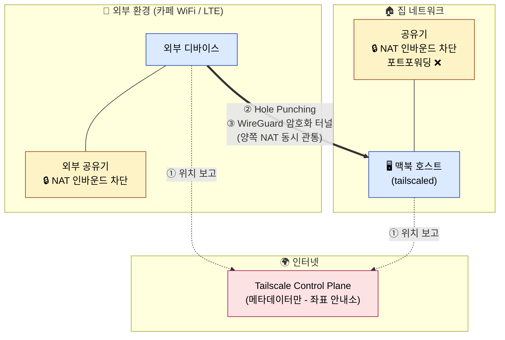

핵심 개념:

**NAT의 부수효과 = 인바운드 기본 차단**

- 집안 기기들은 모두 공유기의 사설 IP(192.168.x.x)
- 외부 인터넷에서 보면 "192.168.x.x 같은 건 안 보임" — 공유기 한 대만 보임
- 외부에서 갑자기 패킷이 와도 공유기가 "이거 누구한테 줘야 하지?" 모름 → 버림
- **즉 별도 방화벽 설정 없이도, 인바운드는 기본 차단**
- **포트포워딩** = "외부에서 80번으로 오면 192.168.0.10:8080으로 보내" 룰 1개 추가 = 일부러 막힌 벽에 구멍 뚫는 행위

**Tailscale의 NAT 관통 (hole punching)**

1. **STUN 서버**로 양쪽 디바이스가 자신의 외부 IP/포트 알아냄
2. **동시 발사**: 양쪽이 동시에 서로에게 패킷을 쏨. NAT는 outbound로 보낸 적 있는 곳에서 오는 답신은 통과시킴(상태 추적). 이 트릭으로 양쪽 NAT를 동시에 뚫음
3. **WireGuard 암호화 P2P 터널** 형성. 이때부터 직접 통신
4. **안 뚫릴 때 fallback**: DERP 릴레이 서버가 중간에서 트래픽만 패스 (속도 약간 느려짐)

**Tailscale Control Plane은 메타데이터만**

- "누가 누구랑 연결할지"만 코디네이션
- **실제 데이터는 절대 거치지 않음** → P2P 또는 DERP fallback
- 그래서 안전하고 빠름

박을 한 줄:

> 다니엘이 카페에서 노트북으로 `ssh homelab`을 치면, **Tailscale Control Plane이 둘의 위치만 알려주고**, 실제 통신은 **양쪽 공유기 NAT을 동시에 뚫어 만든 암호화 터널**로 직접 흐름. 집 공유기엔 포트포워딩이 단 하나도 없음에도.

---

### 2.2 그림 2 — 호스트 안 3층 케이크

macOS 위에 어떻게 컨테이너가 도는가?

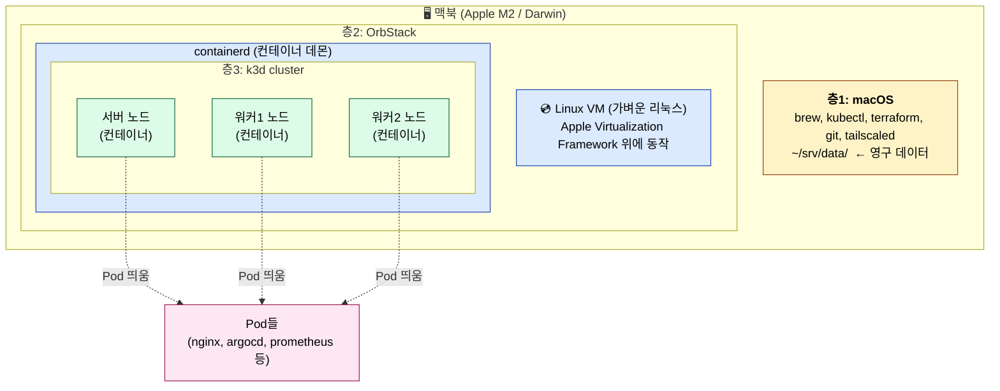

핵심 개념:

**컨테이너는 리눅스 커널 기능 그 자체**

```
컨테이너 = Linux Kernel의 namespaces + cgroups + chroot
           (= 리눅스 커널 없이는 존재 불가능)
```

- 리눅스에서는 컨테이너가 네이티브
- macOS에는 리눅스 커널이 없음 (Darwin 커널 별도)
- 그래서 macOS에서 컨테이너를 돌리려면 → **리눅스 머신을 어떻게든 끌어와야 함 → 가상머신(VM)**

**OrbStack의 정체**

OrbStack은 단순한 도구가 아니라 **본질적으로 리눅스 머신 한 대를 맥북 안에 끼워넣는 장치**:

- Apple Virtualization Framework (Apple Silicon 네이티브 가상화) 사용
- 리눅스 VM을 띄우고
- 그 안에 containerd/dockerd 같은 컨테이너 데몬을 둠

그래서 OrbStack은 RAM도 따로 잡아먹고, OrbStack 끄면 그 안의 모든 게 같이 죽는다.

**k3d 노드의 정체**

```
k3d가 만드는 "노드"
   = OrbStack 리눅스 VM 안에서 도는 도커 컨테이너
   = 그 컨테이너 안에서 k3s 바이너리가 돌고 있음
   = 그 k3s가 또 컨테이너(= Pod)를 띄움
```

확인:

```bash
docker ps
# CONTAINER ID   IMAGE          NAMES
# abc123         rancher/k3s    k3d-homelab-server-0    ← 이게 "노드"
# def456         rancher/k3s    k3d-homelab-agent-0     ← 이것도 "노드"
# ghi789         rancher/k3s    k3d-homelab-agent-1     ← 이것도

kubectl get pods -A
# NAME                          ← 위 컨테이너들 안에서 도는 또 다른 컨테이너
# coredns-xxx
# nginx-yyy
```

→ **컨테이너(노드) 안의 컨테이너(Pod)** 구조. 도커 in 도커 비슷한 신공.

박을 통찰 3개:

1. 컨테이너는 **리눅스 커널 기능**. macOS에선 VM 없이는 불가능
2. OrbStack = **리눅스 머신 한 대를 맥북 안에 끼워넣는 장치**
3. k3d 노드 = **컨테이너**. Pod은 그 안에서 또 도는 컨테이너 (중첩 구조)

---

### 2.3 그림 3 — 클러스터 내부

#### 2.3.1 3-A. control plane vs worker

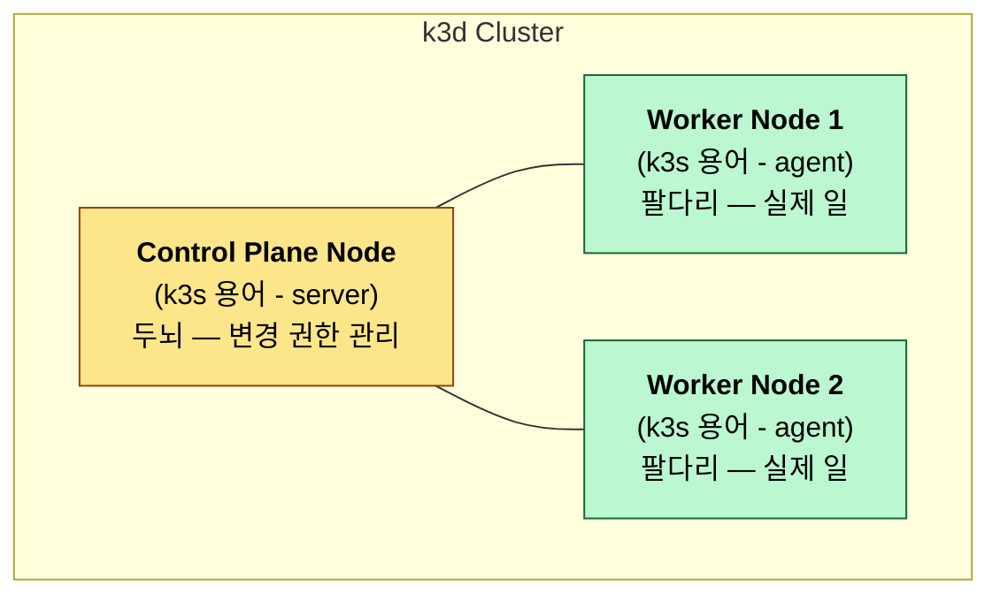

회사 비유:

- **Control Plane** = 사장 + 인사팀 + 회계팀 (관리 부서)
- **Worker** = 현장 직원 (실제 일)

**Control plane이 죽으면?**

자주 헷갈리는 포인트. 워커가 같이 죽지 **않는다**.

| 상황 | 결과 |
|---|---|
| Control plane 죽음 → 이미 떠있던 Pod들 | 그대로 작동 (트래픽 처리도 OK) |
| Control plane 죽음 → 새 배포 시도 | ❌ 안 됨 (kubectl apply 안 받음) |
| Control plane 죽음 → 워커 노드 같이 죽음 | ❌ 다른 워커로 재스케줄 불가 |
| Control plane 죽음 → 자동 복구 | ❌ 마비 (HPA, deployment controller 등) |

**Control plane은 "변경 권한"만 가짐. 평시 트래픽은 무관.**

**운영에선 control plane 몇 개?**

- 학습용/홈랩: 1개
- 진짜 운영: **3개 (HA)**
- etcd가 raft 합의 사용 → 과반수 필요 → 홀수가 정설 (1, 3, 5, 7…)

**Worker가 죽으면?**

`deployment` (또는 daemonset, statefulset)으로 정의된 Pod만 자동 복구됨. 단발 `kubectl run nginx`로 띄운 Pod은 복구 안 됨.

#### 2.3.2 3-B. Control plane 내부

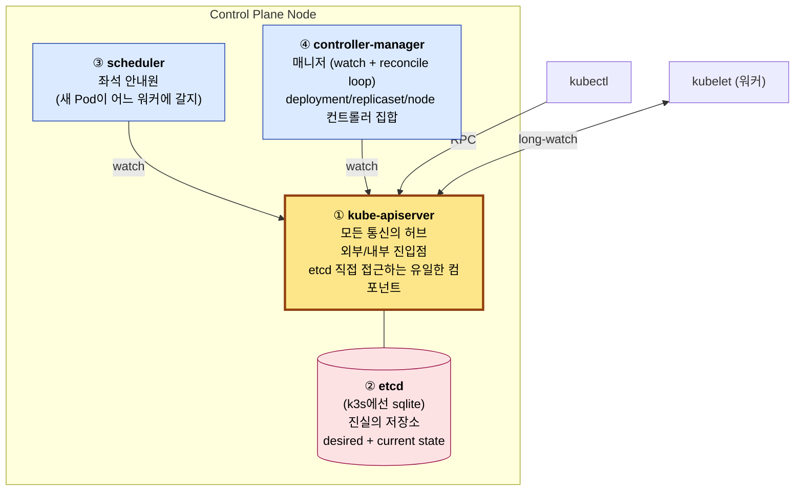

**컴포넌트별 역할**

| 컴포넌트 | 역할 |
|---|---|
| kube-apiserver | 외부/내부 모두의 진입점. kubectl, kubelet, scheduler 등 **모두가 이걸 통해서만** 통신 |
| etcd | 클러스터의 desired state + current state 저장소. k3s에선 SQLite 파일 |
| scheduler | 새로 만들어진 Pod이 어느 워커 노드로 갈지 결정. **단순한 일** |
| controller-manager | desired state를 항상 watch. 현실과 차이 나면 메우는 reconcile loop. **여러 컨트롤러의 집합** |

**기억법**

- scheduler = 좌석 안내원 (어느 자리에 앉을지만 결정)
- controller-manager = 매니저 (계속 현황 감시하면서 부족하면 채우고 넘치면 줄임)

**중요 패턴: 모두가 apiserver 통과**

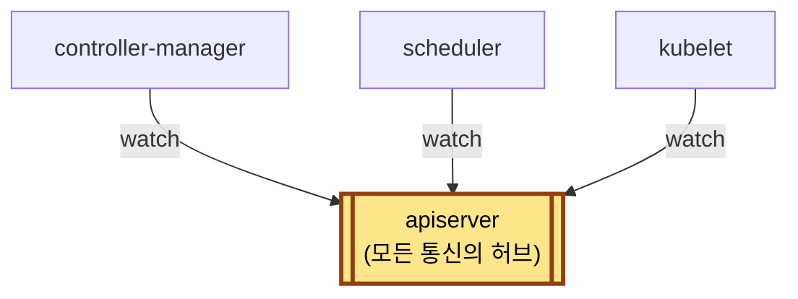

다른 컴포넌트끼리 **직접 안 부름**. 모두 apiserver 경유. **etcd는 apiserver만 직접 접근**.

**kubectl apply -f deployment.yaml 흐름**

```
1. kubectl → apiserver (deployment 등록)
2. apiserver → etcd (deployment 객체 저장)
3. controller-manager 안의 deployment-controller가 watch:
   "deployment 새로 생김" → "ReplicaSet 만들어야겠다"
   → apiserver → etcd
4. controller-manager 안의 replicaset-controller가 watch:
   "ReplicaSet 새로 생김 + replicas=3" → "Pod 3개 만들어야겠다"
   → apiserver → etcd  (Pod 객체 생성, nodeName=비어있음)
5. ⭐ scheduler가 watch:
   "nodeName 비어있는 Pod 발견 = 아직 스케줄 안 됨"
   → "이건 worker-1, 이건 worker-2..." 결정
   → apiserver → etcd  (Pod의 nodeName 필드 채움)
6. 각 워커 노드의 kubelet이 watch:
   "내 노드명이 nodeName에 박힌 Pod이 새로 생김"
   → 컨테이너 런타임에 Pod 생성 명령
7. Pod 떠서 status 업데이트 → apiserver → etcd
```

**핵심 패턴**: 모든 컴포넌트가 `apiserver를 watch + 변경 감지 + 자기 일 함 + 결과를 apiserver에 다시 씀`. 이게 k8s의 본질 = **선언적 reconcile loop**.

**etcd가 죽으면?**

| 데이터 상태 | 결과 |
|---|---|
| 데이터 파일 무사 (k3s `state.db` 살아있음) | 자동 재시작 → 정상 복귀 |
| 데이터 파일 소실 | 모든 desired state 증발. **사실상 새 클러스터** |
| 백업 있음 | 백업 시점으로 복구 |

→ SRE의 핵심 작업 중 하나 = **etcd 백업**.

**etcd 죽음의 즉각 영향**

- ✅ 이미 떠있던 Pod들 = 워커에서 그대로 작동 (kubelet이 알아서 굴림)
- ❌ kubectl 모든 명령 실패
- ❌ scheduler/controller-manager 마비
- ❌ 새 Pod 생성/삭제/재배포 불가
- ❌ 자동 복구 마비

#### 2.3.3 3-C. Worker + 네임스페이스 + ingress

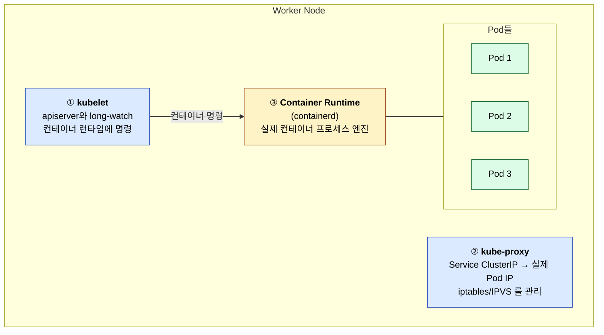

**kubelet은 누구와 통신?**

apiserver와만. scheduler/controller-manager와 **직접 안 함**. 모든 것을 apiserver를 통해서.

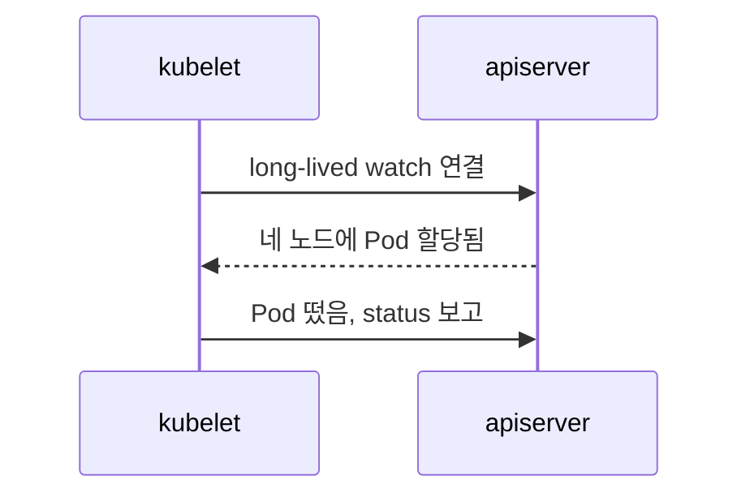

#### 네임스페이스 = 논리적 라벨, 물리적 영역 ❌

흔한 오해: 네임스페이스가 노드를 나눔. **틀림**.

**보기 A (잘못된 멘탈 모델 ❌)** — 네임스페이스가 노드를 물리적으로 나눈다고 착각:

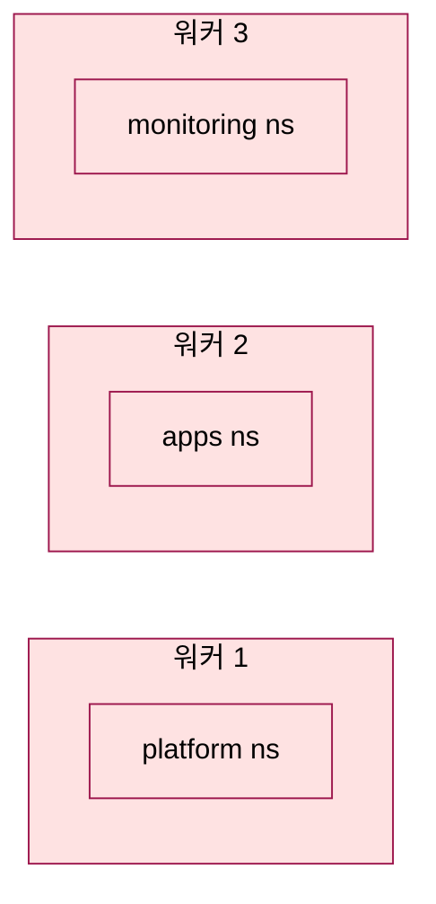

**보기 B (정답 ✅)** — 네임스페이스는 라벨일 뿐, 같은 노드에 여러 ns의 Pod이 섞여 있음:

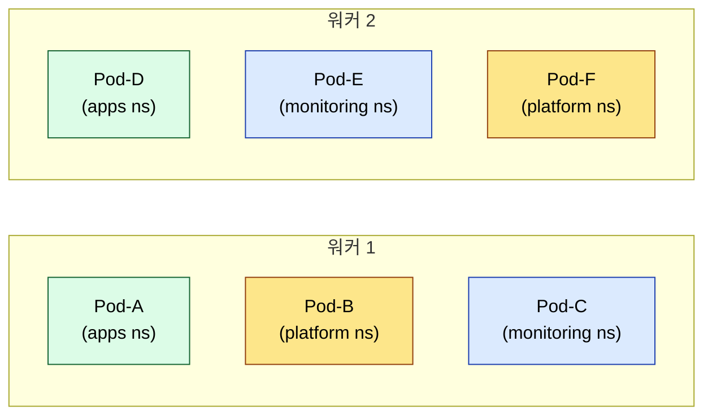

네임스페이스는 **이름 앞에 붙는 prefix** 같은 것. 물리적 분리는 일어나지 않음. 같은 워커 노드에서 다른 네임스페이스의 Pod이 같이 돈다.

**네임스페이스의 진짜 용도 4가지**

| 용도 | 설명 |
|---|---|
| 격리 | RBAC: "Daniel은 apps ns만 만질 수 있음". 리소스쿼터: "monitoring ns는 CPU 2코어까지만". NetworkPolicy: "apps와 monitoring 사이 통신 차단" |
| 이름 충돌 방지 | `apps/nginx`와 `monitoring/nginx` 둘 다 존재 가능 |
| 삭제 단위 | `kubectl delete namespace apps` → 안의 모든 리소스 한 번에 정리 |
| 시야 분리 | `kubectl get pods` → 현재 namespace만. 정신 사납지 않음 |

**기억법**

- **Service** = 어떻게 **찾아갈지** (라우팅)
- **Namespace** = 어떻게 **묶을지** (조직)

> Pod이 죽었다 살아나면 IP 바뀐다(ephemeral). 그래서 **Service**가 고정 가상 IP + DNS 이름 제공. 다른 Pod이 `uptime-kuma-svc.apps.svc.cluster.local`로 부르면 알아서 살아있는 Pod로 라우팅. 이게 "찾기"의 일이고, **namespace는 "묶기"의 일**이지 찾기가 아니다.

#### Ingress 트래픽 경로

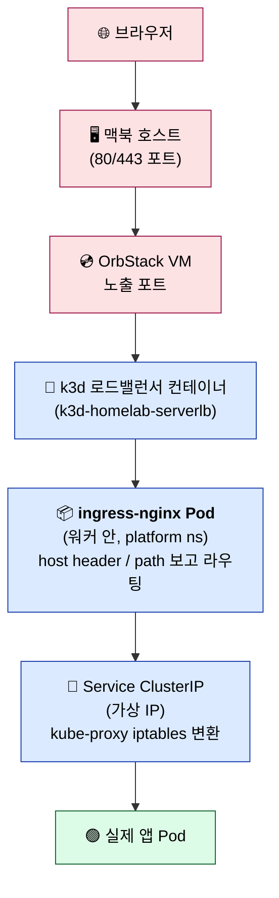

**중요**: 이 경로에 **apiserver가 없다**. data plane은 control plane과 별도 회선.

---

### 2.4 그림 4 — 시간축

누가 만들고 누가 관리하는가? 시간순으로 정리.

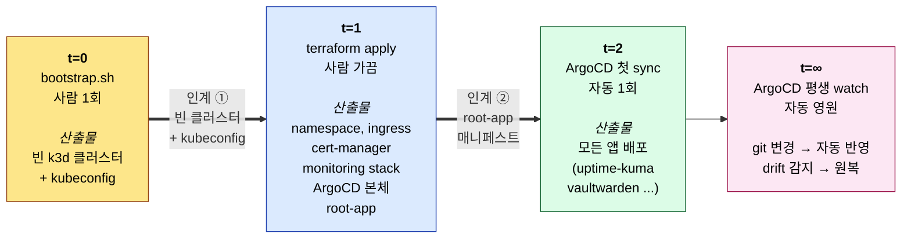

**산출물**

| 시점 | 산출물 |
|---|---|
| t=0 | 빈 k3d 클러스터 + kubeconfig |
| t=1 | namespace들, ingress-nginx, cert-manager, monitoring stack, **ArgoCD 본체**, **root-app** 매니페스트 |
| t=2 | root-app이 가리킨 모든 앱들이 떠있음 (uptime-kuma, vaultwarden, project-a, ...) |
| t=∞ | git 푸시 감지 → 자동 반영. drift 감지 → 원복 |

**권한 인계 두 번**

```
bootstrap ──[인계 ①]──▶ Terraform ──[인계 ②]──▶ ArgoCD
```

- **인계 ①**: bootstrap이 빈 k3d 클러스터를 만들어둠 → Terraform이 그 kubeconfig를 사용해서 클러스터 안에 platform 컴포넌트 설치. **Terraform은 클러스터 자체를 안 만든다**. 이미 만들어진 거 빌려쓴다.
- **인계 ②**: Terraform이 ArgoCD 본체 + root-app 매니페스트를 박음. root-app은 "homelab-gitops repo의 apps/* 폴더에 있는 모든 Application 등록". ArgoCD가 그 list를 보고 알아서 sync 시작. **이 시점부터 Terraform은 손 뗌**.

**App-of-Apps 패턴 (ArgoCD가 자기 자신을 관리)**

```
homelab-gitops/
├── platform/
│   ├── argocd/              ← ArgoCD 자기 자신의 매니페스트
│   ├── ingress-nginx/
│   └── monitoring/
└── apps/
    ├── uptime-kuma/
    └── vaultwarden/
```

흐름:

1. Terraform이 ArgoCD 처음 설치 + root-app 등록
2. ArgoCD 깨어나서 root-app 봄 → "homelab-gitops/platform/* 와 apps/* 다 watch해야 하네"
3. ArgoCD가 자기 자신(platform/argocd/)도 watch 시작
4. `platform/argocd/values.yaml` 고치고 git push → ArgoCD 자기 자신을 업그레이드

**현실적 절충**: 자기 죽였다 살리는 건 위험할 수 있어서 보통:

- Terraform = ArgoCD **최초 설치 + root-app 등록**까지만
- ArgoCD git = **그 이후 모든 변경** (앱 + ArgoCD 자체 설정)
- 위급할 때 = Terraform 다시 사용 (ArgoCD가 죽었거나 처음부터 재구축할 때)

→ **Terraform은 "응급실/리셋 버튼", ArgoCD는 "평소 운영"**.

**자동 반응 체크 (그림 4 통과 시)**

| 질문 | 자동 답 |
|---|---|
| 맥미니 이전 시 무엇을 가져가? | tfstate + ~/srv/data + git repo + sops key |
| ArgoCD를 통째 날렸을 때? | `terraform apply` 한 번 |
| 새 사이드 프로젝트 추가? | `homelab-gitops/apps/`에 application.yaml commit |

---

### 2.5 그림 5 — 트래픽 3색

같은 클러스터 안에 사실 3종의 트래픽이 따로 흐른다.

```
🔴 사용자 트래픽    — 다니엘이 브라우저로 앱 사용
🟢 GitOps 트래픽   — git push → 자동 배포
🔵 관측 트래픽      — 로그/메트릭 → 대시보드
```

#### 🔴 빨강: 사용자 트래픽

(그림 3-C의 ingress 경로와 동일)

데이터 플레인 only. apiserver를 거치지 않는다.

#### 🟢 초록: GitOps 트래픽

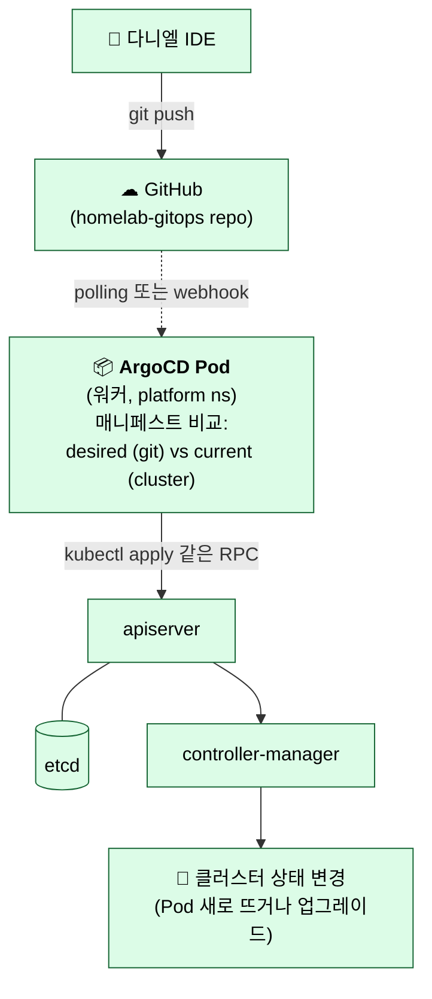

**git push 감지 방식**

- **기본**: ArgoCD가 git을 3분마다 polling
- **최적화**: GitHub webhook 등록 → push 즉시 ArgoCD에 신호 → 바로 sync
- 운영에선 **둘 다 켬**. polling은 fallback, webhook은 빠른 반영

**ArgoCD는 결국 "kubectl 같은 client"**

ArgoCD가 클러스터를 바꿀 때는 일반 client처럼 apiserver를 호출한다. etcd 직접 수정 불가.

→ **GitOps 트래픽은 control plane 트래픽**.

#### 🔵 파랑: 관측 트래픽

두 종류 따로:

**메트릭 (Prometheus = pull)**

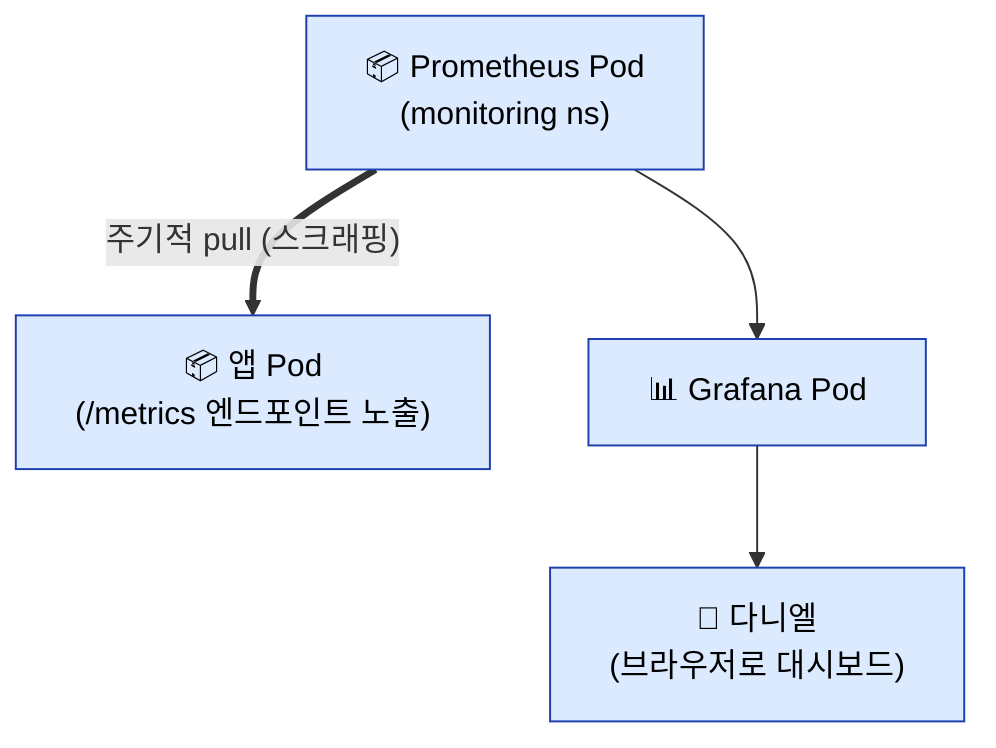

**로그 (Loki = agent push)**

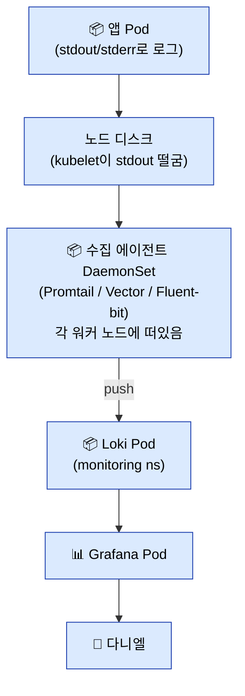

#### 🎯 종합: 3색의 회선 구분

| 트래픽 | apiserver 거침? | 회선 정체 |
|---|---|---|
| 🔴 사용자 | ❌ 안 거침 | 데이터 플레인 only (ingress→svc→pod) |
| 🟢 GitOps | ✅ 핵심적으로 거침 | 컨트롤 플레인 (ArgoCD→apiserver→etcd) |
| 🔵 관측 | 🟡 메타데이터만 거침 | 데이터 플레인 (대부분) + apiserver 메타조회 (Prometheus가 "타겟 목록" 가져갈 때만) |

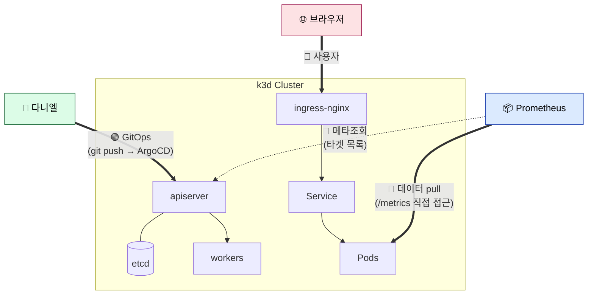

**핵심 통찰**: 같은 클러스터 안에 트래픽 격리가 이미 들어있다. SRE는 알람/문제 진단할 때 **"어떤 색 트래픽 문제인지" 먼저 분류**하면 시간 절반 단축.

---

## 3. 운영 디버깅 가이드

| 증상 | 어느 그림? | 점검 포인트 |
|---|---|---|
| 외부에서 앱 접속 안 됨 | 그림 1 + 5🔴 | Tailscale 연결? → ingress-nginx Pod 살아있나? → Service endpoints? → 앱 Pod 상태? |
| kubectl 안 먹힘 | 그림 3-B | apiserver 살아있나? → etcd (k3s state.db) 정상? |
| git push 했는데 배포 안 됨 | 그림 5🟢 | ArgoCD가 git을 봤나 (polling/webhook)? → root-app sync 상태? → application의 Pod 상태? |
| 메트릭 빈 칸 | 그림 5🔵 | Prometheus가 타겟 발견 못함? → ServiceMonitor/PodMonitor 정상? → /metrics 엔드포인트 응답? |
| 로그 안 보임 | 그림 5🔵 | Promtail/Vector DaemonSet 살아있나? → Loki 연결? |
| 호스트 이전 | 그림 4 | tfstate + data + git + sops key |
| 클러스터 전체 죽음 | 그림 4 | bootstrap → terraform apply → ArgoCD 자동 복구 |

---

## 4. 다음 학습 영역 (그림으로 안 다룸)

핵심 5장은 SRE 멘탈 모델의 **골격**. 다음 영역은 구현하면서 자연 학습 (just-in-time):

| 영역 | 키워드 | 학습 시점 |
|---|---|---|
| Storage | PV / PVC / hostPath / StorageClass | 첫 stateful 앱 띄울 때 |
| Secrets | sops + age, External Secrets | 첫 비밀번호 박을 때 |
| CNI / NetworkPolicy | Flannel, Calico, NetworkPolicy | 트래픽 격리 필요할 때 |
| Service Mesh | Istio, Linkerd | mTLS/관측성 더 필요할 때 |
| Backup/Restore | Velero, Restic | 정기 백업 자동화할 때 |
| 업그레이드 | k3s/ArgoCD/Terraform 버전업 | 운영 6개월차쯤 |

---

## 5. 참고

- [[kubernetes]] — Kubernetes 기초부터 운영까지
- [[grafana-loki-tempo]] — 관측성 스택 정리
- [[docker]] — 컨테이너 기초
