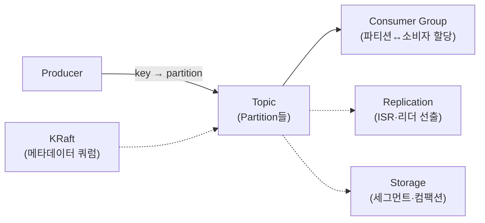
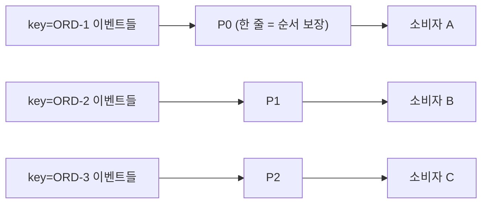
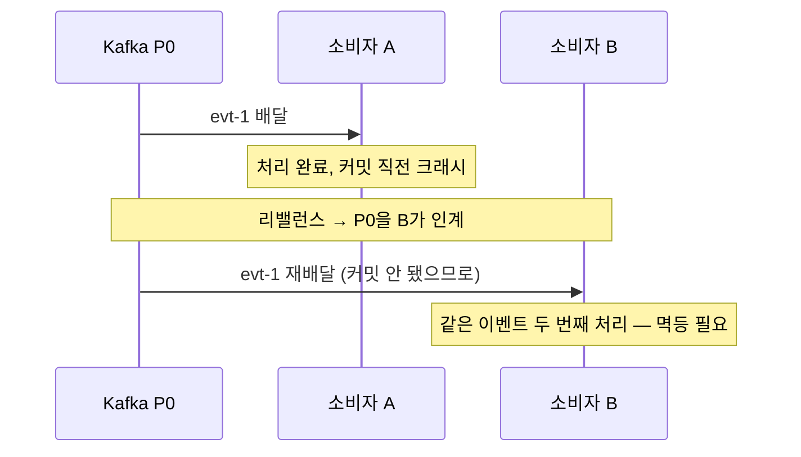

* TOC
{:toc}

# Kafka

> 링크드인에서 시작된 분산 이벤트 스트리밍 플랫폼.
>
> 이벤트를 append-only 로그에 쌓고, 여러 소비자가 각자의 속도로 읽어간다.

메시지 큐(RabbitMQ 등)와 결이 다르다. 큐는 메시지를 소비하면 지우지만, 카프카는 로그를 남겨두고 소비자가 자기 위치(오프셋)를 옮겨가며 읽는다. 그래서 같은 데이터를 여러 시스템이 독립적으로 읽을 수 있고, 되감기(재처리)도 된다.

## 구성 요소

- Producer는 이벤트를 토픽의 파티션에 쓴다.
- Consumer Group은 파티션을 소비자들에게 나눠 할당해 병렬로 읽는다.
- Replication이 브로커 장애에도 데이터를 지키고, Storage가 로그를 디스크에 눕힌다.
- KRaft가 클러스터 메타데이터를 관리한다. (주키퍼를 대체)

## Partition

> 토픽을 이루는 append-only 로그 단위.
>
> 카프카에서 순서 보장과 병렬 처리의 단위다.

### 파티션은 왜 있을까?

- 순서 보장은 "한 줄로 세우기"다. 전부 한 줄로 세우면 병렬이 죽는다.
- 카프카는 순서가 진짜 필요한 범위(같은 key)만 같은 파티션에 태우고, 파티션 사이는 병렬로 처리한다.
- **순서 보장은 같은 파티션 안에서만 성립한다.** 전역 순서는 없다.

### 프로듀서는 파티션을 어떻게 고를까?

1. key가 있으면 `hash(key) % 파티션 수`로 정해진다.
2. 같은 key는 항상 같은 파티션으로 간다. 그래서 그 key의 이벤트끼리는 순서가 보장된다.
3. key가 없으면 스티키 파티셔닝으로 배치를 채우고 다음 파티션으로 넘어간다. 순서 개념이 없다.

### 주의할 점

- **파티션 수를 늘리면 순서 경계가 한 번 깨진다.** `hash(key) % N`의 N이 바뀌어 같은 key가 다른 파티션으로 가기 시작한다. 줄이는 건 불가능하다.
  - 그래서 처음부터 약수가 많은 수(12 등)로 여유 있게 잡는다.
- 파티션이 많다고 공짜가 아니다. 파티션마다 파일 핸들·복제·리더 선출 비용이 붙는다.

## Producer

> 이벤트를 배치로 모아 파티션 리더 브로커에 쓰는 클라이언트.

### 전송은 어떻게 일어날까?

1. `send()`는 즉시 네트워크를 타지 않는다. 파티션별 배치 버퍼에 쌓인다.
2. `batch.size`가 차거나 `linger.ms`가 지나면 배치째 전송한다. (지연을 조금 주고 처리량을 버는 손잡이)
3. 실패하면 `retries`만큼 재시도한다. 일시 장애(리더 교체 등)는 대부분 여기서 흡수된다.

### acks — 어디까지 확인받고 성공이라 할까?

| acks | 의미 | 성격 |
| --- | --- | --- |
| 0 | 확인 안 받음 | 빠름, 유실 가능 |
| 1 | 리더 기록까지 | 리더 죽으면 유실 가능 |
| all | ISR 전부 기록까지 | 유실 방어. `min.insync.replicas`와 세트 |

- **acks=all은 `min.insync.replicas`와 세트로 봐야 한다.** 복제 3에 min.insync=2면 "리더+팔로워 1까지 기록돼야 성공". ISR이 min 밑으로 떨어지면 쓰기가 거부된다(가용성을 내주고 유실을 막는 선택).

### 재시도가 만드는 문제 둘

- **중복**: 브로커엔 기록됐는데 응답만 유실되면, 재시도가 같은 메시지를 한 번 더 쓴다.
- **순서 뒤집힘**: `max.in.flight > 1`에서 앞 배치만 실패해 재시도되면 뒤 배치가 먼저 기록된다.
- 둘 다 멱등 프로듀서가 막는다(아래 Exactly-Once). Kafka 3.0부터 기본 활성화.

## Consumer Group

> 같은 `group.id`를 가진 소비자들의 묶음.
>
> 그룹 안에서 파티션 하나는 소비자 하나가 맡는다.

- 파티션 수가 그 토픽의 최대 병렬도다. 소비자를 파티션 수보다 많이 띄우면 남는 소비자는 논다.
- 같은 이벤트를 여러 시스템이 각자 읽으려면 그룹을 나눈다. 그룹마다 오프셋을 따로 관리하기 때문이다.

### 리밸런스는 언제, 어떻게 일어날까?

> 그룹의 파티션 담당을 다시 나누는 절차.

- 트리거: 소비자 합류/이탈, `session.timeout.ms` 내 하트비트 실패, `max.poll.interval.ms` 내 poll() 미호출(= 처리가 너무 오래 걸림).
- 기본(eager) 방식은 전원이 파티션을 내려놓고 다시 받는 stop-the-world다. `CooperativeStickyAssignor`를 쓰면 움직여야 하는 파티션만 옮긴다(incremental).
- 배포 때마다 리밸런스가 나는 게 싫으면 `group.instance.id`(static membership)로 "잠깐 나갔다 온 것"으로 처리한다.

### 중복은 왜 생길까?

- 소비자가 처리를 끝내고 **오프셋 커밋 전에 죽으면**, 파티션을 인계받은 소비자가 마지막 커밋 지점부터 다시 읽는다. 같은 이벤트가 두 번 처리된다.
- **컨슈머 그룹의 보장은 "정상일 때 한 번"이지 "정확히 한 번"이 아니다.** 중복 방어는 소비 측 멱등(idempotent consumer)으로 푸는 게 정석이다.

### 오프셋 커밋 방식

| 방식 | 동작 | 위험 |
| --- | --- | --- |
| auto commit | poll 주기마다 자동(기본 5초) | 처리 전 커밋될 수 있음 → 유실 / 처리 후 죽으면 중복 |
| 수동 sync | 처리 후 블로킹 커밋 | 안전하지만 느림 |
| 수동 async | 처리 후 논블로킹 커밋 | 실패 시 재시도 순서 주의 |

- 커밋을 처리 **앞**에 두면 at-most-once(유실 가능), **뒤**에 두면 at-least-once(중복 가능). 무엇을 감수할지의 선택이다.

## Replication

> 파티션을 여러 브로커에 복제해 장애에도 데이터를 지키는 장치.

### 리더와 팔로워

- 파티션마다 리더 하나, 나머지는 팔로워다. 읽기와 쓰기는 리더로만 간다(팔로워는 복제만).
- ISR(In-Sync Replicas): 리더를 잘 따라오고 있는 레플리카 집합. `replica.lag.time.max.ms`(기본 10초) 안에 따라오면 ISR이다.
- 리더가 죽으면 ISR 중에서 새 리더를 뽑는다.

### High Watermark — 컨슈머는 어디까지 읽을 수 있나?

- ISR 전부에 복제된 지점이 HW(High Watermark)다. **컨슈머는 HW까지만 읽는다.**
- 리더에만 있고 복제 안 된 메시지를 읽게 하면, 리더 장애 시 "읽었는데 사라진" 메시지가 생기기 때문이다.

### unclean leader election

- ISR이 전멸했을 때 ISR 밖(뒤처진) 레플리카를 리더로 뽑을 것인가.
- 기본값은 false다. 유실을 막기 위해 가용성을 포기하는 선택이라, 그 파티션은 리더가 복구될 때까지 멈춘다. true로 바꾸면 서비스는 계속되지만 뒤처진 만큼 유실된다.

## Storage

> 파티션은 디스크에서 세그먼트 파일들의 나열이다.

- 파티션 = 세그먼트 파일들. 쓰기는 항상 마지막(active) 세그먼트에 append.
- 세그먼트마다 오프셋 인덱스·타임스탬프 인덱스가 붙어 "오프셋 → 파일 위치"를 빠르게 찾는다.
- 순차 쓰기 + 페이지 캐시 + zero-copy 전송. 카프카가 디스크 기반인데도 빠른 이유다.

### 데이터는 언제 지워질까?

| 정책 | 동작 | 쓰임 |
| --- | --- | --- |
| retention (시간/크기) | 오래된 세그먼트째 삭제 (기본 7일) | 일반 이벤트 스트림 |
| compaction | key별 최신 값만 남김 | 상태 스냅샷 성격 토픽 (`__consumer_offsets`가 대표) |

- compaction에서 value=null(톰스톤)은 "이 key 지워라"는 표시다.
- **retention은 "소비 완료"와 무관하다.** 소비자가 읽었든 안 읽었든 시간이 되면 지워진다. 느린 소비자가 retention을 넘기면 유실이다.

## Exactly-Once

> "정확히 한 번"은 하나의 기능이 아니라 멱등 프로듀서 + 트랜잭션 + read_committed의 조합이다.

### 멱등 프로듀서

- 프로듀서마다 PID, 배치마다 파티션별 시퀀스 번호를 붙인다. 브로커가 "이미 받은 시퀀스"를 알아채고 중복 기록을 거른다.
- 재시도로 인한 중복과 순서 뒤집힘을 브로커 수준에서 차단한다. 3.0부터 기본 on.
- 단, 한 프로듀서 세션 안에서의 보장이다. 앱을 재시작해서 "같은 메시지를 다시 send()"하는 건 못 막는다.

### 트랜잭션

- `transactional.id`를 가진 프로듀서가 여러 파티션 쓰기 + 오프셋 커밋을 하나의 원자 단위로 묶는다.
- 같은 transactional.id로 새 프로듀서가 뜨면 epoch가 올라가고 이전 인스턴스(좀비)의 쓰기는 거부된다(zombie fencing).
- 소비자가 `isolation.level=read_committed`면 커밋된 트랜잭션의 메시지만 읽는다.
- 주 용도는 "카프카에서 읽어 카프카로 쓰는" 스트림 처리(consume-transform-produce)다. 외부 DB까지 원자로 묶어주진 않는다. 그건 Outbox/Inbox 같은 애플리케이션 패턴의 몫이다. ([[distributed-transaction]])

### 배달 보장 정리

| 보장 | 만드는 법 | 대가 |
| --- | --- | --- |
| at-most-once | 커밋을 처리 앞에 | 유실 감수 |
| at-least-once | acks=all + 커밋을 처리 뒤에 | 중복 감수 (소비 멱등으로 방어) |
| exactly-once | 멱등 프로듀서 + 트랜잭션 + read_committed | 지연·복잡도, 카프카 안에서만 |

## KRaft

> 주키퍼를 걷어내고 카프카가 자기 메타데이터를 자기 로그로 관리하는 합의 프로토콜(Raft 기반).

### 주키퍼는 왜 사라졌을까?

- 시스템이 둘이라 운영도 장애 모드도 두 벌이었다.
- 메타데이터의 진실이 주키퍼와 컨트롤러에 이원화돼 불일치가 났다.
- 컨트롤러 페일오버 때 주키퍼에서 전체 메타데이터를 다시 읽어야 해서, 파티션이 많을수록 복구가 느렸다.

### KRaft에서는

- 컨트롤러 쿼럼(보통 3대)이 메타데이터를 카프카 로그 자체로 관리하고 Raft로 합의한다.
- 페일오버 시 대기 컨트롤러가 이미 최신 메타데이터를 갖고 있어 즉시 승격된다. 지원 파티션 수 상한도 크게 늘었다.
- 3.3부터 프로덕션 지원, 4.0부터는 주키퍼 모드 자체가 제거됐다.

## 운영에서는 뭘 지켜볼까?

| 지표 | 무엇을 잡아내나 |
| --- | --- |
| consumer lag | 소비가 발행을 못 따라감. 계속 늘면 retention 초과 유실로 간다 |
| under-replicated partitions | ISR에서 빠진 레플리카 존재 — 브로커 장애·과부하 신호 |
| active controller count | 정확히 1이어야 한다. 0이나 2는 사고 |
| request latency (p99) | 브로커 병목 |

- 토픽 자동 생성(`auto.create.topics.enable`)은 끄는 게 정석이다. 오타 토픽이 조용히 생기는 걸 막는다.

## 관련 문서

- [[distributed-transaction]]
- [[designing-data-intensive-applications]]

## 참고

- 카프카 핵심 가이드 (개정증보판, 제이펍) — ch3 프로듀서 / ch4 컨슈머 / ch6 복제·컨트롤러 / ch7 저장 / ch8 정확히 한 번
- 실전 카프카 개발부터 운영까지 (책만)
