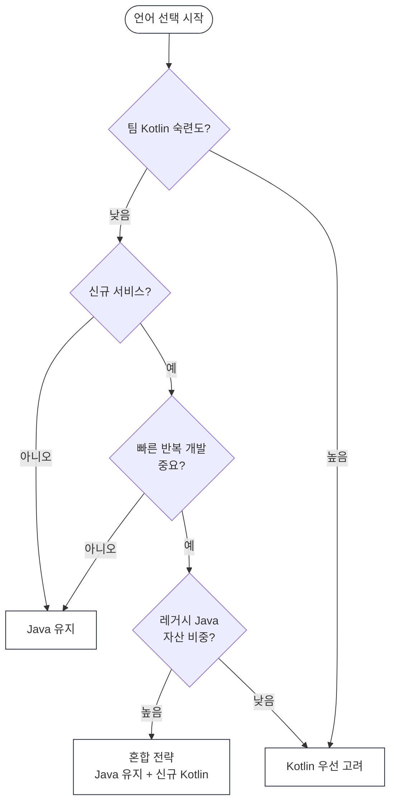

* TOC
{:toc}

# Kotlin vs Java 트레이드오프 정리

"어떤 언어가 더 좋다"가 아니라, **팀·제품·운영 맥락에서 어떤 선택이 더 유리한지**를 정리한다.

---

## 1. 한 눈에 보는 비교

| 항목 | Kotlin | Java |
|------|--------|------|
| Null 안전성 | 타입 시스템 강제 (`String?`) | 어노테이션/컨벤션 의존 |
| 보일러플레이트 | 적음 (data class 등) | 많음 |
| 비동기 | 코루틴 (구조화된 동시성) | CompletableFuture / Virtual Thread |
| 상속 기본값 | `final` (명시적 `open` 필요) | `open` |
| 타입 변환 | 명시적 (`toLong()`) | 암시적 (int → long) |
| 생태계 | JVM + Android + KMP | JVM, 레거시 자산 압도적 |
| 빌드 속도 | 증분 컴파일 개선 중, 여전히 무거운 편 | 성숙, 빠름 |
| 온보딩 난이도 | 높음 (고급 문법 학습 필요) | 낮음 |
| 채용 풀 | 좁음 | 넓음 |

---

## 2. 핵심 차이 — 코드로 비교

### 2.1 Null 안전성

**Java** — 런타임까지 NPE를 발견하지 못한다.

```java
String name = user.getName(); // null일 수 있지만 컴파일러가 모름
System.out.println(name.length()); // NPE 가능
```

**Kotlin** — 컴파일 타임에 null 가능성을 강제한다.

```kotlin
val name: String? = user.name     // nullable 명시
println(name?.length)             // 안전 호출
println(name ?: "unknown")        // Elvis 연산자
println(name!!)                   // NPE 의도적 허용 (명시적)
```

> **인사이트**: Kotlin은 null을 타입 시스템의 일부로 만들었다. `!!`를 쓰는 순간 "나는 여기서 NPE를 감수하겠다"고 선언하는 셈이다.

---

### 2.2 데이터 클래스

**Java** — Lombok 없이는 반복 코드가 매우 많다.

```java
public class User {
    private final String name;
    private final int age;

    public User(String name, int age) {
        this.name = name;
        this.age = age;
    }

    public String getName() { return name; }
    public int getAge() { return age; }

    @Override
    public boolean equals(Object o) { ... }

    @Override
    public int hashCode() { ... }

    @Override
    public String toString() { ... }
}
```

**Kotlin** — 한 줄이다.

```kotlin
data class User(val name: String, val age: Int)
```

`equals`, `hashCode`, `toString`, `copy`, `componentN`이 자동 생성된다.

```kotlin
val user = User("Alice", 30)
val updated = user.copy(age = 31) // 불변 복사
val (name, age) = user            // 구조 분해
```

---

### 2.3 확장 함수

기존 클래스를 상속 없이 확장할 수 있다.

**Java** — 유틸 클래스를 따로 만들어야 한다.

```java
StringUtils.isNullOrEmpty(str);
```

**Kotlin** — 마치 원래 메서드처럼 호출한다.

```kotlin
fun String?.isNullOrEmpty(): Boolean = this == null || this.isEmpty()

str.isNullOrEmpty() // 자연스러운 호출
```

> **주의**: 확장 함수는 정적으로 바인딩된다. 다형성이 없으므로 상속 관계에서 오버라이드처럼 동작하지 않는다.

---

### 2.4 Sealed Class vs Enum

**Java Enum** — 상태만 표현, 상태별 데이터를 담기 어렵다.

```java
enum Result { SUCCESS, FAILURE }
```

**Kotlin Sealed Class** — 상태별로 다른 데이터를 담을 수 있다.

```kotlin
sealed class Result {
    data class Success(val data: String) : Result()
    data class Failure(val error: Throwable, val code: Int) : Result()
    object Loading : Result()
}

when (result) {
    is Result.Success -> println(result.data)
    is Result.Failure -> println(result.error)
    is Result.Loading -> println("loading...")
    // else 불필요 — 컴파일러가 완전성을 검사
}
```

`when`에서 `else`가 없어도 컴파일러가 모든 케이스를 처리했는지 검사한다. 새 케이스가 추가되면 컴파일 에러가 난다.

---

### 2.5 비동기: 코루틴 vs CompletableFuture

**Java** — 콜백 체인이 길어질수록 복잡해진다.

```java
CompletableFuture.supplyAsync(() -> fetchUser(id))
    .thenCompose(user -> fetchOrders(user.getId()))
    .thenApply(orders -> summarize(orders))
    .exceptionally(e -> handleError(e));
```

**Kotlin 코루틴** — 동기 코드처럼 읽힌다.

```kotlin
suspend fun getUserSummary(id: Long): Summary {
    val user = fetchUser(id)        // suspend 함수, 블로킹 아님
    val orders = fetchOrders(user.id)
    return summarize(orders)
}
```

병렬 실행도 간결하다.

```kotlin
coroutineScope {
    val userDeferred = async { fetchUser(id) }
    val configDeferred = async { fetchConfig() }
    process(userDeferred.await(), configDeferred.await())
}
```

> **Java 21 Virtual Thread와의 비교**: Virtual Thread는 블로킹 코드를 그대로 쓰면서 동시성을 얻는다. 코루틴은 `suspend` 함수 경계를 명시해야 한다. 레거시 블로킹 코드가 많은 팀이라면 Virtual Thread가 더 자연스러울 수 있다.

---

### 2.6 스코프 함수

Kotlin의 `let`, `run`, `apply`, `also`, `with`는 강력하지만 남용 시 가독성을 해친다.

```kotlin
// 좋은 사례 — null 처리
user?.let { sendEmail(it) }

// 좋은 사례 — 객체 초기화
val dialog = Dialog().apply {
    title = "확인"
    message = "계속하시겠습니까?"
}

// 나쁜 사례 — 과도한 체인
result.let { it.also { log(it) }.run { transform(this) }.apply { save() } }
```

> **팀 규칙 예시**: `let`은 null-check에만, `apply`는 빌더 패턴에만, 중첩 스코프 함수는 금지.

---

## 3. 장단점 요약

### Kotlin

**장점**
- null-safety로 런타임 NPE 감소
- 보일러플레이트 감소 → 도메인 로직 집중
- 코루틴 기반 비동기 코드 가독성
- sealed class로 상태 표현력 향상
- Spring Boot와 궁합이 좋고 실무 사례 충분

**단점**
- 고급 문법 남용 시 코드 이해도 저하
- Java-only 팀에서 학습 비용 발생
- 컴파일 속도가 대형 프로젝트에서 체감될 수 있음
- 일부 Java 라이브러리의 Java-first API가 어색하게 느껴질 수 있음

### Java

**장점**
- 성숙한 생태계와 방대한 참고 자료
- 대규모 조직 표준화·운영 안정성
- 채용·온보딩 수급 측면 유리
- Virtual Thread (Java 21)로 비동기 단순화
- 성능 튜닝, 도구 지원, 관측성 경험이 풍부

**단점**
- 보일러플레이트가 상대적으로 많음 (Lombok으로 완화 가능)
- nullable 안전성이 언어 차원 강제 아님
- sealed class, 확장 함수 같은 표현력 부재

---

## 4. 상황별 선택 가이드



### Java가 더 유리한 경우
- 대형 조직·장기 유지보수 중심
- 팀의 Java 숙련도가 높고 Kotlin 경험이 낮음
- 레거시 Java 자산 비중이 매우 큼
- 표준화·일관성 우선
- Java 21 Virtual Thread로 비동기 요건이 충분히 해결되는 경우

### Kotlin이 더 유리한 경우
- 신규 서비스 중심, 빠른 반복 개발 필요
- null 안정성과 개발 생산성이 중요
- 팀 내 Kotlin 숙련도 확보된 상태
- 도메인 모델 표현력과 코드 간결성이 중요한 프로젝트
- Android 포함한 멀티플랫폼 전략

### 혼합 전략이 유효한 경우
- 기존 Java 서비스 유지 + 신규 모듈 Kotlin 도입
- 경계가 명확한 패키지·모듈 단위로 점진 전환
- 공통 룰(코드 스타일, 코루틴 사용 규칙) 먼저 합의

---

## 5. 팀 적용 시 주의할 점

**1. 언어보다 규칙이 먼저**

Kotlin을 도입해도 규칙이 없으면 오히려 코드 품질이 떨어진다.

```kotlin
// 팀 규칙 예시
// ✅ 허용: let은 null-check에만
user?.let { process(it) }

// ❌ 금지: 중첩 스코프 함수
user?.let { it.run { also { } } }

// ❌ 금지: !! 무분별 사용
user!!.name // 리뷰에서 반드시 사유 설명 필요
```

**2. Interop 경계 정리**

Java ↔ Kotlin 혼합 코드베이스에서 주의할 점:

```kotlin
// Kotlin에서 Java의 nullable 반환값은 플랫폼 타입(!)으로 추론됨
val name = javaUser.getName() // String! — nullable일 수도 있음

// 명시적 타입 선언으로 안전하게
val name: String = javaUser.getName() // NPE 가능성 인지하고 사용
val name: String? = javaUser.getName() // 안전
```

**3. 성능·빌드는 측정 기반으로 판단**

체감이 아니라 빌드 시간·배포 리드타임으로 비교한다. Kotlin의 증분 컴파일은 꾸준히 개선되고 있다.

---

## 6. 의사결정 체크리스트

언어 선택 전 아래 4가지를 점검한다.

| 질문 | Java 신호 | Kotlin 신호 |
|------|-----------|-------------|
| 팀 숙련도 | 지금 당장 Java로 생산성 낸다 | Kotlin 경험자 다수 |
| 제품 속도 | 안정적 운영이 우선 | 실험·변경이 잦다 |
| 운영 안정성 | 장애 비용이 크다 | 빠른 복구가 가능하다 |
| 채용·유지보수 | 2년 뒤 운영 인력 걱정 | 팀 내 Kotlin 내재화 가능 |

---

## 7. 결론

Kotlin vs Java는 우열 문제가 아니라 **운영 전략 문제**다.

- 안정성과 표준화를 우선하면 Java가 유리한 경우가 많다.
- 생산성과 표현력을 우선하면 Kotlin이 강력하다.
- 대부분 팀의 현실 해법은 "한 번에 교체"가 아니라 **점진적 혼합 전략**이다.

> 언어는 도구다. 팀이 잘 쓸 수 있는 도구가 좋은 도구다.
