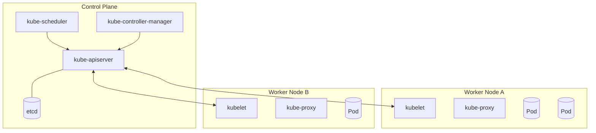
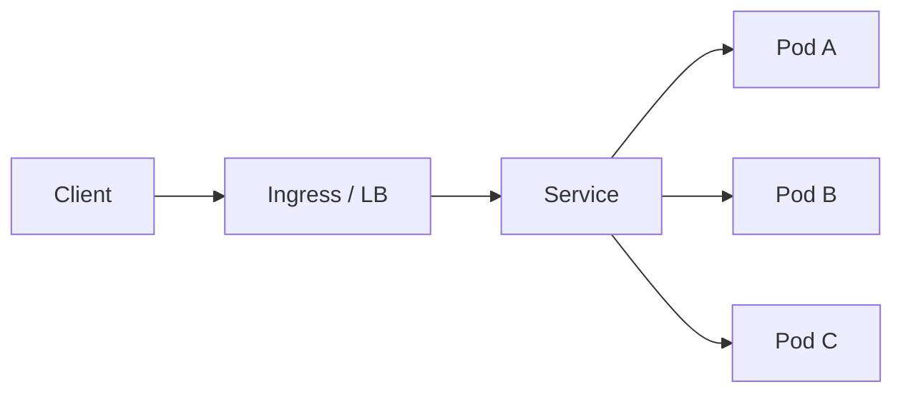
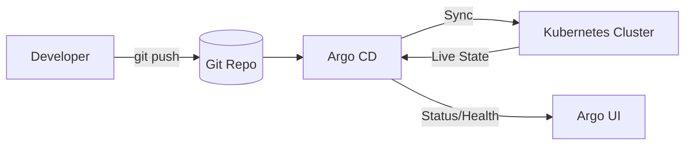

* TOC
{:toc}

# Kubernetes

이 문서는 Kubernetes를 처음 잡을 때 필요한 핵심부터,
실무에서 운영할 때 자주 부딪히는 지점까지 한 번에 정리한 문서다.

마지막에는 Argo CD(GitOps) 챕터를 포함한다.

---

## 1) Kubernetes를 왜 쓰는가

Kubernetes는 컨테이너를 "실행"하는 도구가 아니라,
컨테이너 기반 애플리케이션의 **배포/확장/복구/운영을 자동화**하는 오케스트레이터다.

핵심 가치:

- 원하는 상태(Desired State) 선언
- 실제 상태(Live State)와 차이 감지
- 차이를 자동으로 수렴(Reconcile)

즉, 운영자가 수동으로 맞추는 대신 시스템이 계속 맞춘다.

---

## 2) 클러스터 구조

Kubernetes 클러스터는 크게 **Control Plane**과 **Worker Node**로 나뉜다.



### 2-1. Control Plane

- `kube-apiserver`
  - 모든 요청의 진입점
  - 인증/인가/검증/리소스 처리
- `etcd`
  - 클러스터 상태 저장소 (Key-Value)
- `kube-scheduler`
  - 어떤 Pod를 어떤 Node에 배치할지 결정
- `kube-controller-manager`
  - 다양한 컨트롤러 실행 (Deployment/Node/Job 등)

### 2-2. Worker Node

- `kubelet`
  - 노드 에이전트, Pod 상태 보고/유지
- `container runtime` (containerd 등)
  - 실제 컨테이너 실행
- `kube-proxy`
  - Service 네트워킹 규칙 관리(iptables/ipvs)

---

## 3) Kubernetes 동작 원리 (핵심)

### 3-1. 선언형 모델

```yaml
apiVersion: apps/v1
kind: Deployment
metadata:
  name: app
spec:
  replicas: 3
```

이 선언은 "Pod 3개를 유지하라"는 의도를 표현한다.
실제 Pod가 2개가 되면 컨트롤러가 다시 3개로 맞춘다.

### 3-2. Reconciliation Loop

- 현재 상태 관찰
- 원하는 상태와 비교
- 차이 발생 시 보정

이 루프 덕분에 장애 복구, 스케일 조정, 롤아웃이 자동화된다.

```mermaid
flowchart LR
  Desired[Desired State\n(YAML/Spec)] --> Compare[Controller Compare]
  Live[Live State\n(Cluster)] --> Compare
  Compare -->|Drift 있음| Act[Create/Update/Delete]
  Act --> Live
  Compare -->|일치| Stable[No-op]
```

---

## 4) 핵심 리소스 빠르게 정리

### 4-1. Pod

Kubernetes의 최소 실행 단위.
보통 "앱 컨테이너 1개 + 사이드카" 형태로 묶어 배포한다.

### 4-2. Deployment

무상태(Stateless) 앱 배포 표준.

- replica 관리
- 롤링 업데이트
- 롤백

### 4-3. StatefulSet

상태(State)가 중요한 워크로드용.

- 고정 네트워크 ID
- 안정적인 스토리지 매핑
- 순차적 배포/종료

### 4-4. Service

Pod 집합에 대한 안정된 접근 지점.

- `ClusterIP` : 클러스터 내부
- `NodePort` : 노드 포트 노출
- `LoadBalancer` : 클라우드 LB 연동



### 4-5. Ingress

L7(HTTP) 라우팅 규칙.

- Host/path 기반 라우팅
- TLS 종료
- 다수 Service 통합 진입점

### 4-6. ConfigMap / Secret

- `ConfigMap`: 일반 설정
- `Secret`: 민감정보

애플리케이션 설정과 이미지를 분리하는 데 핵심.

### 4-7. Job / CronJob

- `Job`: 배치 1회
- `CronJob`: 스케줄 배치

---

## 5) 스케줄링과 확장

### 5-1. 스케줄링 기준

Scheduler는 다음을 보고 배치한다.

- 요청/제한 리소스 (`requests/limits`)
- Node selector / affinity / taint-toleration
- topology spread constraints

### 5-2. 오토스케일

- `HPA` (Horizontal Pod Autoscaler)
  - CPU/메모리/커스텀 메트릭 기반 Pod 수 조절
- `VPA`
  - Pod 리소스 요청값 자동 조정
- `Cluster Autoscaler`
  - 노드 수 자체를 증감

---

## 6) 네트워크 모델

Kubernetes 기본 네트워크 전제:

- 모든 Pod는 고유 IP를 가짐
- Pod 간 직접 통신 가능해야 함

실제 구현은 CNI 플러그인(Calico/Cilium/Flannel 등)이 담당한다.

운영에서 자주 보는 이슈:

- NetworkPolicy 미설정으로 과도한 허용
- DNS 장애로 서비스 디스커버리 실패
- Ingress controller 병목

---

## 7) 스토리지 모델

- `PV` (PersistentVolume)
- `PVC` (PersistentVolumeClaim)
- `StorageClass`

상태 저장 앱은 PVC를 통해 스토리지를 선언적으로 요청한다.

주의:

- 스토리지 성능(IOPS/latency) 고려
- 백업/복구 전략 별도 설계
- StatefulSet과 함께 운영 정책 명확화

---

## 8) 배포 전략

### 8-1. Rolling Update

기본 전략.

- 무중단 배포에 유리
- `maxUnavailable`, `maxSurge`로 제어

### 8-2. Blue/Green, Canary

리스크를 낮추려면 점진 배포 필요.

- 트래픽 일부만 신규 버전으로 전환
- 모니터링 후 단계적 확장

보통 Argo Rollouts/서비스메시와 함께 사용한다.

---

## 9) 관측성(Observability)

최소 3가지 축:

- Metrics (Prometheus/Grafana)
- Logs (Loki/ELK/OpenSearch)
- Traces (OpenTelemetry/Jaeger/Tempo)

운영 기준으로 꼭 보는 지표:

- Pod restart 수
- CrashLoopBackOff 비율
- 요청 지연 p95/p99
- 에러율(5xx)
- 노드 리소스 포화

---

## 10) 운영 체크리스트 (실무)

### 10-1. 리소스

- `requests/limits` 없는 Pod 제거
- 과도한 limit으로 OOM 유발 여부 점검

### 10-2. 안정성

- readiness/liveness probe 필수
- PDB(PodDisruptionBudget) 설정

### 10-3. 보안

- 최소 권한 RBAC
- 네임스페이스 분리
- Secret 관리 정책
- 이미지 취약점 스캔

### 10-4. 배포

- 롤백 경로 명확화
- 배포 후 검증 지표 자동화

---

## 11) Argo CD (GitOps)

Argo CD는 Kubernetes 위에서 동작하는 GitOps CD 도구다.
핵심은 "Git이 배포의 단일 소스"가 되는 것이다.

### 11-1. Argo CD를 왜 쓰는가

- 수동 kubectl 배포 제거
- Git 변경 이력 = 배포 이력
- 드리프트(클러스터 수동 변경) 감지/복구

### 11-2. 핵심 개념

- **Desired State**: Git에 있는 매니페스트
- **Live State**: 현재 클러스터 상태
- **Sync**: 둘을 일치시키는 작업
- **Health**: 리소스 상태 평가



### 11-3. App 단위 운영

Argo CD는 Application 단위로 배포 대상을 관리한다.

예시 개념:

- source repo/path
- target cluster/namespace
- sync policy (manual/auto)

### 11-4. Sync 전략

- Manual Sync
  - 사람이 승인하고 동기화
- Auto Sync
  - Git 변경 감지 시 자동 반영

운영 초기에선 보통 manual로 시작하고,
검증 체계가 잡히면 auto로 확장한다.

### 11-5. Drift 대응

클러스터에서 수동 수정이 발생하면 Argo CD가 OutOfSync로 감지한다.
정책에 따라 다음을 수행한다.

- 경고만
- 자동 복원(Self-heal)

### 11-6. Argo CD 운영 시 주의

- Git 저장소 구조 표준화 필요
- 환경(dev/stage/prod) 분리 전략 필요
- secrets 관리 도구(Vault/External Secrets/SOPS)와 연동 필요
- 강한 auto sync는 변경 통제 없이 위험할 수 있음

### 11-7. Kubernetes와 Argo CD의 관계 요약

- Kubernetes: 상태 수렴 엔진
- Argo CD: Git 기반으로 원하는 상태를 공급/통제하는 배포 계층

즉 Argo CD를 이해하려면 Kubernetes의 선언형/수렴 모델 이해가 필수다.

---

## 12) 빠른 시작 학습 루트

1. Pod / Deployment / Service / Ingress
2. requests/limits + probe
3. HPA + 모니터링
4. 배포 전략(rolling/canary)
5. GitOps(Argo CD)

---

## 13) 참고 레퍼런스

### Kubernetes 공식

- Kubernetes Docs: <https://kubernetes.io/docs/home/>
- Concepts: <https://kubernetes.io/docs/concepts/>
- Workloads: <https://kubernetes.io/docs/concepts/workloads/>
- Services, Load Balancing, Networking: <https://kubernetes.io/docs/concepts/services-networking/>
- Storage: <https://kubernetes.io/docs/concepts/storage/>

### Argo CD 공식

- Argo CD Docs: <https://argo-cd.readthedocs.io/en/stable/>
- Getting Started: <https://argo-cd.readthedocs.io/en/stable/getting_started/>
- Application Spec: <https://argo-cd.readthedocs.io/en/stable/operator-manual/declarative-setup/>
- Sync Options: <https://argo-cd.readthedocs.io/en/stable/user-guide/sync-options/>

### CNCF / GitOps

- GitOps Principles (OpenGitOps): <https://opengitops.dev/>
- CNCF Cloud Native Landscape: <https://landscape.cncf.io/>

---

## 14) 정리

- Kubernetes 핵심은 "선언 + 수렴"이다.
- 운영 난이도는 배포보다 관측성/보안/표준화에서 결정된다.
- Argo CD는 Kubernetes 위에 Git 기반 배포 통제를 얹는 도구다.
- 결국 중요한 건 도구가 아니라, 팀의 운영 규칙과 변경 통제 수준이다.
