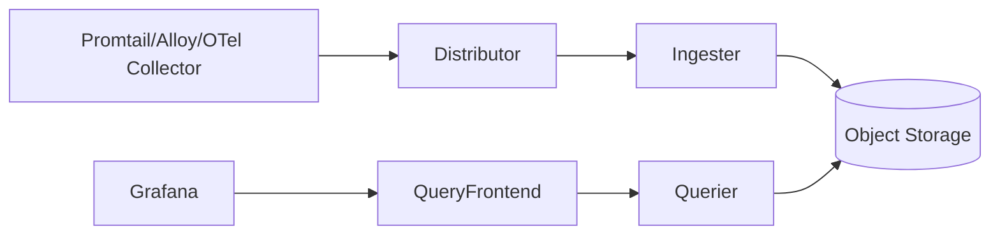

* TOC
{:toc}

# Loki 정리

## 1) Loki는 무엇인가

Loki는 로그 저장/검색 시스템이다.
Elasticsearch 계열과 달리 **라벨 중심 인덱싱**을 사용한다.

핵심 특징:

- 로그 본문 전체 인덱싱 X
- 라벨만 인덱싱 O
- 비용/운영 복잡도 절감 가능

---

## 2) 아키텍처 개요



구성요소 요약:

- Distributor: 수신/분배
- Ingester: 메모리 버퍼 + chunk 생성
- Store: 장기 저장 (S3/GCS 등)
- Querier/Query Frontend: 조회 최적화

---

## 3) 라벨 설계가 성능을 결정한다

### 3-1. 권장 라벨

- `cluster`
- `namespace`
- `app`
- `pod`
- `container`
- `env`

### 3-2. 금지에 가까운 라벨

- `request_id`
- `user_id`
- `session_id`
- `timestamp` 변형값

이런 값은 cardinality를 폭발시켜 쿼리 성능/비용을 망친다.

---

## 4) LogQL 실무 예시

기본 필터:

```logql
{namespace="prod", app="order-api"}
```

문자열 매칭:

```logql
{app="order-api"} |= "ERROR"
```

JSON 파싱 후 필터:

```logql
{app="order-api"} | json | level="error"
```

집계 예시(분당 에러 건수):

```logql
sum by (app) (count_over_time({namespace="prod"} |= "ERROR" [1m]))
```

---

## 5) 수집 파이프라인

일반적인 Kubernetes 수집 흐름:

- Node 에이전트가 컨테이너 로그 수집
- 라벨 부착
- Loki로 push

실무 팁:

- 애플리케이션 로그 포맷을 JSON으로 통일
- 필수 필드: `timestamp`, `level`, `service`, `trace_id`, `message`

---

## 6) 운영 안티패턴

1. 라벨 남용
- 검색이 느려지고 메모리/스토리지 비용 증가

2. 로그 보존 정책 없음
- 저장소 비용 예측 불가

3. 파싱 규칙 난립
- 서비스별 형식 달라 재사용 불가

4. 에러 로그 기준 불일치
- 팀마다 error 정의가 달라 집계 신뢰도 하락

---

## 7) 튜닝 포인트

- 라벨 cardinality 정기 점검
- 쿼리 범위(time range) 좁혀서 조회
- 쿼리 프론트엔드 캐시 활용
- retention 기간을 환경별 분리

예:

- prod: 30일
- stage: 7일
- dev: 3일

---

## 8) 체크리스트

- [ ] 라벨 표준 문서화
- [ ] 금지 라벨 목록 합의
- [ ] 공통 JSON 로그 스키마 적용
- [ ] trace_id 로그 포함
- [ ] 보존기간 정책 적용

---

## 9) 참고 레퍼런스

- Loki Docs: <https://grafana.com/docs/loki/latest/>
- LogQL: <https://grafana.com/docs/loki/latest/query/>
- Labels best practices: <https://grafana.com/docs/loki/latest/get-started/labels/>

---

## 10) 정리

Loki는 "설치"보다 **라벨 설계**가 성패를 가른다.
로그 도구보다 운영 규칙이 먼저다.
