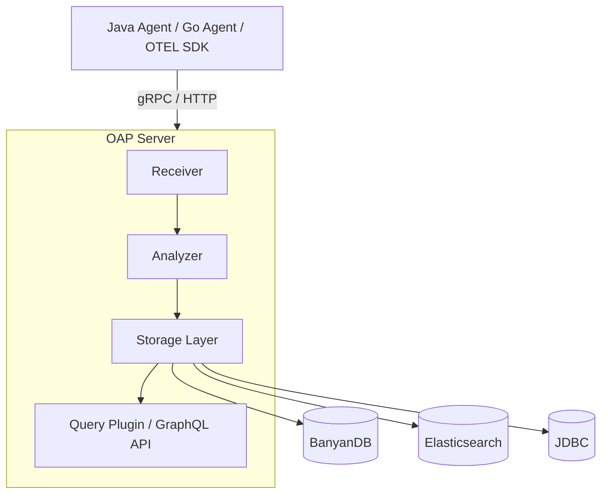

* TOC
{:toc}

# Apache SkyWalking

마이크로서비스, 클라우드 네이티브 환경에서 distributed tracing과 성능 모니터링을 담당하는 APM(Application Performance Monitoring) 오픈소스다. Alibaba, Tencent 등에서 실제 운영 환경에 사용하고 있고, Apache 재단의 top-level 프로젝트이기도 하다.

한마디로 설명하면 "내 서비스가 언제 어디서 느려지는지 알고 싶을 때 쓰는 도구"다.

agent를 붙이면 서비스 간 요청 흐름을 추적할 수 있고, MAL/OAL 같은 자체 DSL로 metric을 정의해서 집계할 수도 있다. 백엔드는 OAP(Observability Analysis Platform) 서버가 담당하고, storage는 BanyanDB, Elasticsearch, 혹은 JDBC 기반 RDB를 선택해서 붙일 수 있다.

## Architecture

코드를 읽으면서 파악한 전체 구조다.

데이터 흐름은 크게 세 단계다. agent가 서비스에서 데이터를 수집하고, OAP가 받아서 분석/집계한 뒤 storage에 저장한다. UI는 OAP의 GraphQL API를 통해 데이터를 가져온다.



### OAP 내부

**Receiver**는 들어오는 데이터를 내부 Source 객체로 변환한다. SkyWalking 자체 프로토콜뿐 아니라 OpenTelemetry, Zipkin, Kafka도 여기서 처리된다.

**Analyzer**가 핵심이다. 세 가지 DSL로 분석 규칙을 정의한다.

- **OAL** — trace/metrics 집계 규칙. `.oal` 파일에 이렇게 쓰면
  ```
  service_resp_time = from(Service.latency).longAvg();
  ```
  컴파일 시점에 Java 코드가 자동으로 생성된다.
- **MAL** — Prometheus 같은 외부 메트릭을 SkyWalking metric 형식으로 변환
- **LAL** — 로그 파싱, trace ID 추출

**Storage**는 DAO 인터페이스만 core에 있고 구현체는 plugin이 담당한다. `application.yml`에서 storage를 선택하면 그에 맞는 구현체가 로드된다. 이 덕분에 storage를 갈아끼워도 비즈니스 로직은 건드릴 필요가 없다.

### 데이터 모델

저장되는 데이터는 크게 두 종류다.

- **Record** — trace span, log처럼 원본 그대로 저장하는 데이터
- **Metrics** — 집계된 지표. 분/시/일 단위로 다운샘플링되어 저장된다. `combine()`, `toHour()`, `toDay()` 같은 추상 메서드를 구현해야 한다.

오래된 데이터일수록 세밀함이 줄어드는 구조인데, time-series 특성상 자연스러운 설계다.

### Module 시스템

OAP 전체가 모듈로 쪼개져 있고 SPI로 연결된다. `ModuleDefine`이 인터페이스 목록을 선언하면, `ModuleProvider`가 `prepare()` 단계에서 `registerServiceImplementation()`으로 구현체를 등록한다.

다른 모듈이 필요하면 구현체를 직접 참조하는 게 아니라 `moduleManager.find(...).provider().getService(인터페이스.class)` 형태로 인터페이스를 통해 가져온다. 모듈 간 결합이 없으니 storage나 cluster 모듈을 교체해도 나머지 코드가 안 바뀐다.

---

## Contributions

### Fix JDBC Profiling Query Bugs

> [apache/skywalking#13785](https://github.com/apache/skywalking/pull/13785) · 2026-04-03 머지

#### Finding the Issue

이슈 목록을 살펴봤는데 대부분 good first issue 레이블이 붙어 있어도 이미 누군가 진행 중이거나, frontend나 protocol submodule이 얽혀 있어서 바로 손대기 어려운 것들이 많았다.

그래서 방향을 바꿔서 직접 코드를 읽다가 이상한 부분을 찾기로 했다. JDBC storage plugin 쪽 DAO 코드를 보던 중에 눈에 걸리는 패턴이 있었다.

```java
public List<JFRProfilingDataRecord> getByTaskIdAndInstancesAndEvent(
        String taskId, List<String> instanceIds, String eventType) throws IOException {
    if (StringUtil.isBlank(taskId) || StringUtil.isBlank(eventType)) {
        return new ArrayList<>();
    }
    // ...
    sql.append(" and ").append(JFRProfilingDataRecord.EVENT_TYPE).append(" =? ");
    condition.add(eventType);

    if (CollectionUtils.isNotEmpty(instanceIds)) {
        sql.append(" and ").append(JFRProfilingDataRecord.INSTANCE_ID).append(" in (?) ");
        String joinedInstanceIds = String.join(",", instanceIds);
        condition.add(joinedInstanceIds);
    }
```

메서드 이름에 `ByTaskId`가 들어가 있는데 `taskId`가 WHERE 절에 없다. validation만 하고 버린다.

그리고 `in (?)` 부분도 이상하다. JDBC `?`는 값 하나를 binding하는 자리인데, 여기에 `"id1,id2,id3"` 같은 문자열을 통째로 넘기고 있다. 실제로 실행되는 SQL은 이렇게 된다.

```sql
WHERE instance_id IN ('id1,id2,id3')
```

이건 `instance_id` 컬럼을 literal 문자열 `'id1,id2,id3'`와 비교하는 거라 instance가 여러 개면 항상 결과가 없다.

#### Root Cause

commit history를 보니 두 버그 모두 [Async Profiler 기능을 처음 추가한 PR](https://github.com/apache/skywalking/pull/12671)(2024년 10월)에서 시작됐다. 그리고 [pprof 기능을 추가한 PR](https://github.com/apache/skywalking/pull/13502)(2025년 10월)이 JFR DAO 코드를 그대로 copy하면서 같은 버그를 가져왔다.

기존에 보고된 이슈도 없었다. 이 code path가 실제로 실행됐을 때 데이터가 안 나와도 task 자체는 동작하니까 티가 잘 안 났던 것 같다.

#### Fix

`taskId` filter는 단순히 WHERE 절에 추가하면 됐다.

IN 절은 instance 수만큼 `?`를 동적으로 만들어야 한다. 같은 프로젝트 안에 `JDBCEBPFProfilingTaskDAO`에 `appendListCondition`이라는 메서드가 이미 그 역할을 하고 있었고, `Collections.nCopies` + `String.join`을 쓰는 패턴이 더 간결했다.

```java
sql.append(" and ").append(JFRProfilingDataRecord.TASK_ID).append(" = ?");
condition.add(taskId);

if (CollectionUtils.isNotEmpty(instanceIds)) {
    sql.append(" and ").append(JFRProfilingDataRecord.INSTANCE_ID)
       .append(" in (").append(String.join(",", Collections.nCopies(instanceIds.size(), "?"))).append(")");
    condition.addAll(instanceIds);
}
```

#### Testing Trouble

`JDBCClient`를 Mockito로 mocking해서 SQL을 capture하려고 했는데 varargs 때문에 한참 헤맸다.

`executeQuery(String sql, ResultHandler handler, Object... params)` signature인데, DAO 내부에서는 `condition.toArray(new Object[0])`를 varargs로 넘긴다. Mockito는 이 배열을 개별 인자로 펼쳐서 보관한다.

그래서 `invocation.getArgument(2)`를 하면 `Object[]`가 아니라 varargs 첫 번째 원소인 `String`이 나온다. 처음에는 `ClassCastException`이 터져서 왜 그런지 한참 찾았다.

```java
// 인자 전체를 가져와서 index 2부터 slicing
final Object[] allArgs = invocation.getArguments();
capturedParams.set(Arrays.copyOfRange(allArgs, 2, allArgs.length));
```

이렇게 하니까 해결됐다. stub matching도 `any(Object[].class)`로 잡아야 했다.

최종 테스트는 세 가지를 확인한다.

- SQL에 `task_id = ?`가 포함되고 parameter에 taskId가 있는가
- instance가 3개면 `in (?,?,?)`가 생성되는가
- taskId가 빈 문자열이면 empty list를 반환하는가

---

### Remove GroupBy.field_name from BanyanDB MeasureQuery

> [apache/skywalking#13786](https://github.com/apache/skywalking/pull/13786) · PR 오픈 중

#### Finding the Issue

이슈 목록을 보다가 [#13779](https://github.com/apache/skywalking/issues/13779)를 발견했다. `QueryRequest.GroupBy.field_name`이 BanyanDB query execution path에서 실제로 쓰이지 않는다는 내용이었다.

BanyanDB는 grouping을 `tag_projection`으로 처리하는데, SkyWalking 쪽에서는 계속 `field_name`을 함께 보내고 있었다. 사용하지 않는 필드를 proto에 실어 보내는 셈이다.

이슈 작성자가 단계적 제거 계획(3 phase)을 정리해뒀고, Phase 1이 SkyWalking main repo에서 해당 필드 사용을 제거하는 것이었다.

#### Fix

`MeasureQuery.java`의 `build()` 메서드에서 `GroupBy.Builder`에 `field_name`을 setting하는 한 줄을 제거했다.

```java
// 제거된 코드
groupByBuilder.setFieldName(this.aggregation.fieldName);
```

`GroupBy`는 이제 `tag_projection`만 담아서 전송한다. `Aggregation.field_name`과 `Top.field_name`은 어떤 필드를 집계/정렬할지 지정하는 별개의 필드라 그대로 유지했다.

변경은 한 줄이지만 이유가 있는 제거다. Phase 2(client proto에서 필드 삭제), Phase 3(BanyanDB server에서 제거)는 각각 다른 repo 작업이다.

---

### Push taskId Filter Down to Storage Layer in AsyncProfilerTaskLog Query

> [apache/skywalking#13787](https://github.com/apache/skywalking/pull/13787) · PR 오픈 중

#### Finding the Issue

[#13593](https://github.com/apache/skywalking/issues/13593)을 보다가 backend 코드를 살펴봤다. 이슈 자체는 UI에서 taskId가 null로 전달되는 문제였는데, service layer 코드에서 이상한 패턴이 눈에 들어왔다.

```java
public List<AsyncProfilerTaskLog> queryAsyncProfilerTaskLogs(String taskId) throws IOException {
    List<AsyncProfilerTaskLog> taskLogList = getTaskLogQueryDAO().getTaskLogList();
    return findMatchedLogs(taskId, taskLogList);
}

private List<AsyncProfilerTaskLog> findMatchedLogs(final String taskID, final List<AsyncProfilerTaskLog> allLogs) {
    return allLogs.stream()
            .filter(l -> Objects.equals(l.getId(), taskID))
            .map(this::extendTaskLog)
            .collect(Collectors.toList());
}
```

`getTaskLogList()`가 taskId 없이 storage에서 모든 task log를 조회한 뒤, service layer에서 stream으로 걸러내는 구조다. interface 시그니처도 그냥 `getTaskLogList()`로, parameter가 아예 없었다.

JDBC, Elasticsearch, BanyanDB 구현체 세 개가 모두 같은 패턴이었다.

#### Fix

interface에 `taskId`를 추가하고, 각 storage 구현체에서 DB 레벨로 필터링하도록 수정했다. 변경이 필요한 파일이 많아서 커밋을 6개로 쪼갰다.

- interface: `getTaskLogList()` → `getTaskLogList(String taskId)`
- JDBC: `WHERE task_id = ?` 추가
- Elasticsearch: `term` query on `task_id` 추가
- BanyanDB: `query.and(eq(TASK_ID, taskId))` 추가
- service: taskId를 DAO에 직접 전달, `findMatchedLogs()` 인메모리 필터 제거

```java
public List<AsyncProfilerTaskLog> queryAsyncProfilerTaskLogs(String taskId) throws IOException {
    return getTaskLogQueryDAO().getTaskLogList(taskId).stream()
            .map(this::extendTaskLog)
            .collect(Collectors.toList());
}
```

---

## References

- [Apache SkyWalking GitHub](https://github.com/apache/skywalking)
- [Apache SkyWalking 공식 문서](https://skywalking.apache.org/docs/)
