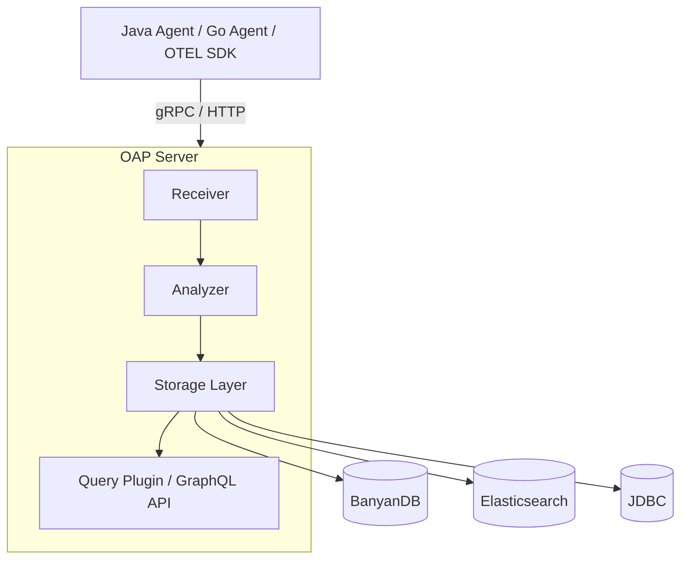
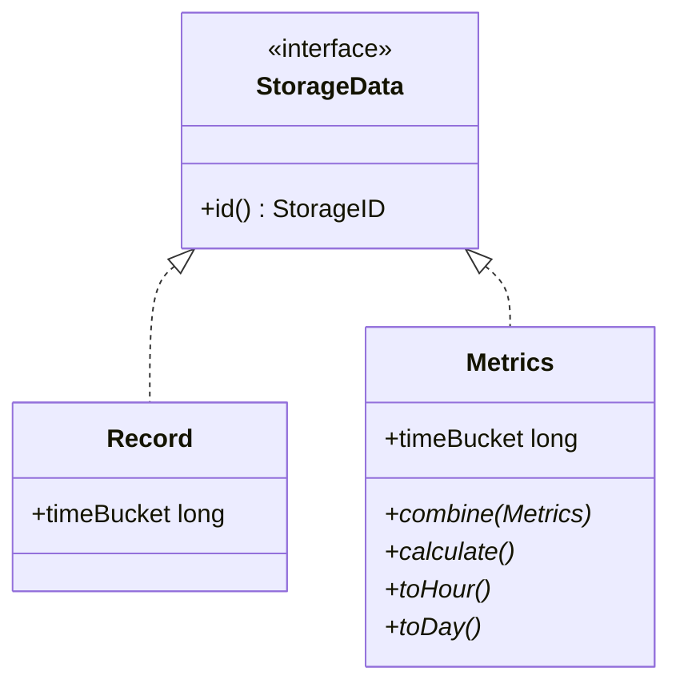
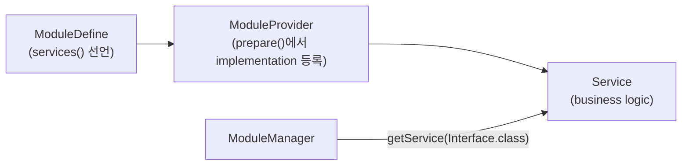
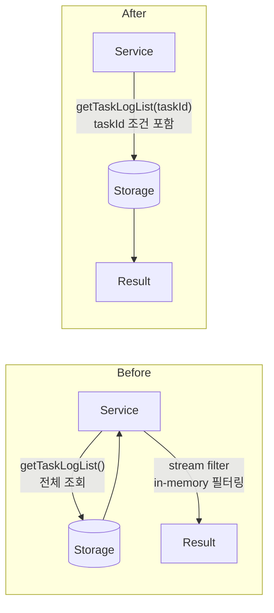

* TOC
{:toc}

# Apache SkyWalking

마이크로서비스, 클라우드 네이티브 환경에서 distributed tracing과 성능 모니터링을 담당하는 APM(Application Performance Monitoring) 오픈소스다. Alibaba, Tencent 등에서 실제 production 환경에 사용하고 있고, Apache 재단의 top-level 프로젝트이기도 하다.

한마디로 설명하면 "내 서비스가 언제 어디서 느려지는지 알고 싶을 때 쓰는 도구"다.

agent를 붙이면 서비스 간 요청 흐름을 추적할 수 있고, MAL/OAL 같은 자체 DSL로 metric을 정의해서 aggregation할 수도 있다. 백엔드는 OAP(Observability Analysis Platform) 서버가 담당하고, storage는 BanyanDB, Elasticsearch, 혹은 JDBC 기반 RDB를 선택해서 붙일 수 있다.

## Architecture

코드를 읽으면서 파악한 전체 구조다.

데이터 흐름은 크게 세 단계다. agent가 서비스에서 데이터를 수집하고, OAP가 받아서 분석/aggregation한 뒤 storage에 저장한다. UI는 OAP의 GraphQL API를 통해 데이터를 가져온다.



### OAP 내부

**Receiver**는 들어오는 데이터를 내부 Source 객체로 변환한다. SkyWalking native protocol뿐 아니라 OpenTelemetry, Zipkin, Kafka도 여기서 처리된다.

**Analyzer**가 핵심이다. 세 가지 DSL로 분석 규칙을 정의한다.

- **OAL**: trace/metrics aggregation 규칙. `.oal` 파일에 이렇게 쓰면
  ```
  service_resp_time = from(Service.latency).longAvg();
  ```
  compile 시점에 Java 코드가 자동으로 생성된다. 생성된 코드는 `oal-rt` 모듈이 담당하고, 결과물은 target 디렉토리에 `.class`로 떨어진다. OAL 파일을 수정하면 generated class도 다시 만들어야 하니 주의.
- **MAL**: Prometheus 같은 외부 metric을 SkyWalking metric 형식으로 변환
- **LAL**: log parsing, trace ID 추출

**Storage**는 DAO interface만 core에 있고 implementation은 plugin이 담당한다. `application.yml`에서 storage를 선택하면 그에 맞는 implementation이 로드된다. 이 덕분에 storage를 갈아끼워도 business logic은 건드릴 필요가 없다.

새 DAO를 추가할 때 건드려야 하는 파일이 정해져 있다. 기여하면서 직접 겪은 순서라 남겨둔다.

1. DAO interface (`server-core/.../storage/`)
2. `StorageModule.services()`에 interface 추가
3. `JDBCStorageProvider`, `ElasticSearchStorageProvider`, `BanyanDBStorageProvider` 각각 `prepare()`에 `registerServiceImplementation()` 추가
4. 각 implementation 파일 작성

3번에서 빠뜨리면 startup 시점에 `ServiceNotProvidedException`이 터진다.

### 데이터 모델

저장되는 데이터는 크게 두 종류다.

- **Record**: trace span, log처럼 원본 그대로 저장하는 데이터
- **Metrics**: aggregation된 지표. 분/시/일 단위로 downsampling되어 저장된다. `combine()`, `toHour()`, `toDay()` 같은 abstract method를 구현해야 한다.

오래된 데이터일수록 세밀함이 줄어드는 구조인데, time-series 특성상 자연스러운 설계다.



### Module 시스템

OAP 전체가 모듈로 쪼개져 있고 SPI로 연결된다. `ModuleDefine`이 interface 목록을 선언하면, `ModuleProvider`가 `prepare()` 단계에서 `registerServiceImplementation()`으로 implementation을 등록한다.

다른 모듈이 필요하면 implementation을 직접 참조하는 게 아니라 `moduleManager.find(...).provider().getService(Interface.class)` 형태로 interface를 통해 가져온다. 모듈 간 coupling이 없으니 storage나 cluster 모듈을 교체해도 나머지 코드가 안 바뀐다.



---

## JDBC Storage Plugin

SQL 기반 storage(`storage-jdbc-hikaricp-plugin`)를 집중적으로 보면서 파악한 내용이다.

### 구조

플러그인은 `oap-server/server-storage-plugin/storage-jdbc-hikaricp-plugin/`에 있다. 핵심 DAO 파일은 `src/main/java/.../jdbc/common/dao/` 아래에 있다.

각 DAO는 `JDBCClient`와 `TableHelper`를 받아서 동작한다.

- `JDBCClient`: SQL 실행. `executeQuery(sql, resultHandler, params...)`가 주요 메서드.
- `TableHelper`: TTL 기준으로 유효한 테이블 목록을 반환. `getTablesWithinTTL(INDEX_NAME)`으로 호출.

SkyWalking의 JDBC storage는 데이터를 time-sharding 방식으로 저장한다. 예를 들어 endpoint traffic은 `endpoint_traffic_20260401`, `endpoint_traffic_20260402` 같은 이름으로 날짜별 테이블이 생긴다. `getTablesWithinTTL()`은 TTL 안에 있는 테이블만 골라서 반환한다. 대부분의 DAO는 이 목록을 순회하면서 각 테이블에 쿼리를 보낸다.

### TABLE_COLUMN 패턴

time-sharding 테이블들은 용도별로 이름이 다르지만, 실제 쿼리 시에는 `table_name` 컬럼으로 한 번 더 필터링한다. 이게 `JDBCTableInstaller.TABLE_COLUMN`이다.

```java
sql.append("select * from ").append(table).append(" where ")
    .append(JDBCTableInstaller.TABLE_COLUMN).append(" = ?");
condition.add(SomeRecord.INDEX_NAME);  // 예: "endpoint_traffic"
```

모든 SELECT 쿼리에서 이 패턴이 첫 번째 WHERE 조건으로 들어간다. 이게 없으면 다른 레코드 타입의 데이터가 섞인다.

### IN 절 parameter binding

JDBC의 `?`는 값 하나를 binding하는 자리다. 리스트를 IN 절에 넣으려면 `?`를 개수만큼 만들어야 한다.

```java
// 잘못된 방식 — String.join으로 만든 문자열을 하나의 ?에 binding
sql.append(" in (?)");
condition.add(String.join(",", ids));  // IN ('id1,id2,id3') — 리터럴 문자열 비교

// 올바른 방식 — ? 자리를 개수만큼 생성
sql.append(" in (")
   .append(String.join(",", Collections.nCopies(ids.size(), "?")))
   .append(")");
condition.addAll(ids);  // IN (?,?,?) — 각각 binding
```

IN 절을 직접 문자열 조합으로 만드는 코드가 보이면 의심해볼 것.

### SQL 생성 패턴

대부분의 DAO는 이 패턴을 따른다.

```java
StringBuilder sql = new StringBuilder();
List<Object> condition = new ArrayList<>();

sql.append("select * from ").append(table).append(" where ")
   .append(JDBCTableInstaller.TABLE_COLUMN).append(" = ?");
condition.add(SomeRecord.INDEX_NAME);

// 조건 추가
if (someValue != null) {
    sql.append(" and ").append(COLUMN_NAME).append(" = ?");
    condition.add(someValue);
}

// 실행
jdbcClient.executeQuery(sql.toString(), resultHandler, condition.toArray(new Object[0]));
```

`condition.toArray(new Object[0])`가 varargs로 넘어가는 부분이 Mockito 테스트에서 varargs 처리 이슈의 원인이 되기도 한다.

### 버그 패턴 체크리스트

코드를 읽다가 아래 항목에 걸리면 버그일 가능성이 높다.

**1. 메서드 이름과 WHERE 절 불일치**

메서드 이름에 `ByXxx`가 들어가 있는데 WHERE 절에 해당 컬럼이 없으면 filter가 누락된 것.

```java
// 메서드 이름: getByTaskId
// WHERE절에 task_id가 없으면 버그
```

**2. IN 절에 단일 파라미터**

`in (?)`에 `String.join(",", list)` 결과를 binding하는 경우. 쿼리가 실행되지만 항상 결과가 없다.

**3. AND/OR 키워드 누락**

조건 문자열을 직접 조합할 때 `and`/`or`가 빠지는 경우. `appendCondition()` 같은 헬퍼를 쓰지 않고 직접 string을 붙이는 코드에서 자주 발생한다.

```java
" = ?" + NEXT_COLUMN + " = ?"  // and 없음 → syntax error
```

**4. 동일 조건 중복**

같은 `WHERE` 조건이 두 번 들어가는 경우. SQL은 실행되지만 같은 parameter를 두 번 binding한다. copy-paste로 생기는 버그.

### 테스트 방식

DAO 테스트는 `JDBCClient`와 `TableHelper`를 Mockito로 mock해서 SQL을 캡처하는 방식으로 작성한다.

```java
final AtomicReference<String> capturedSql = new AtomicReference<>();
final AtomicReference<Object[]> capturedParams = new AtomicReference<>();

doAnswer(invocation -> {
    capturedSql.set(invocation.getArgument(0));
    final Object[] allArgs = invocation.getArguments();
    capturedParams.set(Arrays.copyOfRange(allArgs, 2, allArgs.length));
    return new ArrayList<>();
}).when(jdbcClient).executeQuery(anyString(), any(), any(Object[].class));
```

varargs 캡처 시 `invocation.getArgument(2)`를 쓰면 배열이 아니라 첫 번째 원소가 나온다. `Arrays.copyOfRange(allArgs, 2, allArgs.length)`로 잘라야 한다.

DAO 생성자가 `ModuleManager`를 받아서 내부에서 `TableHelper`를 만드는 구조면, `TableHelper`를 주입받는 package-private 생성자를 따로 추가해서 테스트에서 mock을 넣는다.

---

## Elasticsearch Storage Plugin

ES 기반 storage(`storage-elasticsearch-plugin`)도 코드 리뷰하면서 파악한 내용이다. JDBC와 같은 DAO interface를 구현하지만 쿼리 방식이 다르다.

### 구조

플러그인은 `oap-server/server-storage-plugin/storage-elasticsearch-plugin/`에 있다. 쿼리 DAO는 `src/main/java/.../elasticsearch/query/` 아래.

JDBC가 `JDBCClient` + `TableHelper`를 쓰는 것처럼, ES는 `ElasticSearchClient`를 상속받는 `EsDAO`를 기반으로 한다. `getClient().search(index, search.build())`로 쿼리를 실행한다.

### 쿼리 빌더 패턴

JDBC가 `StringBuilder`로 SQL을 직접 조립하는 것과 달리, ES는 타입 안전한 빌더를 쓴다.

```java
final BoolQueryBuilder query = Query.bool();
query.must(Query.term(SomeRecord.SERVICE_ID, serviceId));
query.must(Query.range(SomeRecord.TIME_BUCKET).gte(startTimeBucket));
if (CollectionUtils.isNotEmpty(ids)) {
    query.must(Query.terms(SomeRecord.INSTANCE_ID, ids));
}
final SearchBuilder search = Search.builder().query(query).size(limit);
```

`Query.bool()`이 AND/OR 구조를 잡고, `Query.term()`이 단일 값, `Query.terms()`가 IN 절, `Query.range()`가 범위 조건을 담당한다. 빌더가 쿼리 구조를 관리하기 때문에 JDBC에서 발견했던 AND 누락, 괄호 빠짐, IN 절 오용 같은 버그는 구조적으로 발생하지 않는다.

### Merged Table과 isMergedTable()

ES에서는 여러 논리 테이블을 하나의 물리 인덱스로 합칠 수 있다. 기본 설정(`logicSharding=false`)에서의 규칙은 다음과 같다.

```java
// IndexController.getTableName()
if (!logicSharding) {
    return model.isMetric() ? "metrics-all" :
        (model.isRecord() && !model.isSuperDataset() ? "records-all" : model.getName());
}
```

- Metrics 계열 -> `"metrics-all"`
- Record 계열(superDataset 아닌 것) -> `"records-all"`
- superDataset이거나 위에 해당하지 않는 것 -> 자기 이름 그대로

merged table에 여러 레코드 타입이 섞이면 쿼리 시 어떤 타입의 데이터인지 구분해야 한다. 이걸 `RECORD_TABLE_NAME` 또는 `METRIC_TABLE_NAME` 필드로 필터링한다.

```java
if (IndexController.LogicIndicesRegister.isMergedTable(SomeRecord.INDEX_NAME)) {
    query.must(Query.term(IndexController.LogicIndicesRegister.RECORD_TABLE_NAME, SomeRecord.INDEX_NAME));
}
```

`isMergedTable()`은 물리 테이블명이 논리명과 다르면 `true`를 반환한다. 이 체크에 **자기 자신의 INDEX_NAME**을 넘겨야 하는데, copy-paste로 다른 레코드의 INDEX_NAME을 넘기면 merged 여부 판단이 틀어질 수 있다.

### JDBC와의 차이

| | JDBC | Elasticsearch |
|---|------|---------------|
| 쿼리 조립 | `StringBuilder`로 SQL 직접 조립 | 타입 안전한 빌더 패턴 |
| 테이블 구분 | `TABLE_COLUMN = ?` WHERE 조건 | `RECORD_TABLE_NAME` term 쿼리 |
| 발생하는 버그 유형 | AND 누락, 괄호 빠짐, IN 절 오용, 조건 중복 | index name copy-paste 오류 |
| 단위 테스트 | Mockito로 SQL 캡처 가능 | `IndexController`가 static이라 mocking 어려움 |

---

## Contributions

### Fix JDBC Profiling Query Bugs

> [apache/skywalking#13785](https://github.com/apache/skywalking/pull/13785) · merged on 2026-04-02

#### Finding the Issue

이슈 목록을 살펴봤는데 대부분 good first issue 레이블이 붙어 있어도 이미 누군가 진행 중이거나, frontend나 protocol submodule이 얽혀 있어서 바로 손대기 어려운 것들이 많았다.

그래서 방향을 바꿔서 직접 코드를 읽다가 이상한 부분을 찾기로 했다. JDBC storage plugin 쪽 DAO 코드를 보던 중에 눈에 걸리는 패턴이 있었다.

```java
public List<JFRProfilingDataRecord> getByTaskIdAndInstancesAndEvent(
        String taskId, List<String> instanceIds, String eventType) throws IOException {
    if (StringUtil.isBlank(taskId) || StringUtil.isBlank(eventType)) {
        return new ArrayList<>();
    }
    // ...
    sql.append(" and ").append(JFRProfilingDataRecord.EVENT_TYPE).append(" =? ");
    condition.add(eventType);

    if (CollectionUtils.isNotEmpty(instanceIds)) {
        sql.append(" and ").append(JFRProfilingDataRecord.INSTANCE_ID).append(" in (?) ");
        String joinedInstanceIds = String.join(",", instanceIds);
        condition.add(joinedInstanceIds);
    }
```

메서드 이름에 `ByTaskId`가 들어가 있는데 `taskId`가 WHERE 절에 없다. validation만 하고 버린다.

그리고 `in (?)` 부분도 이상하다. JDBC `?`는 값 하나를 binding하는 자리인데, 여기에 `"id1,id2,id3"` 같은 문자열을 통째로 넘기고 있다. 실제로 실행되는 SQL은 이렇게 된다.

```sql
WHERE instance_id IN ('id1,id2,id3')
```

이건 `instance_id` 컬럼을 literal 문자열 `'id1,id2,id3'`와 비교하는 거라 instance가 여러 개면 항상 결과가 없다.

#### Root Cause

commit history를 보니 두 버그 모두 [Async Profiler 기능을 처음 추가한 PR](https://github.com/apache/skywalking/pull/12671)(2024년 10월)에서 시작됐다. 그리고 [pprof 기능을 추가한 PR](https://github.com/apache/skywalking/pull/13502)(2025년 10월)이 JFR DAO 코드를 그대로 copy하면서 같은 버그를 가져왔다.

기존에 보고된 이슈도 없었다. 이 code path가 실제로 실행됐을 때 데이터가 안 나와도 task 자체는 동작하니까 티가 잘 안 났던 것 같다.

#### Fix

`taskId` filter는 단순히 WHERE 절에 추가하면 됐다.

IN 절은 instance 수만큼 `?`를 동적으로 만들어야 한다. 같은 프로젝트 안에 `JDBCEBPFProfilingTaskDAO`에 `appendListCondition`이라는 메서드가 이미 그 역할을 하고 있었고, `Collections.nCopies` + `String.join`을 쓰는 패턴이 더 간결했다.

```java
sql.append(" and ").append(JFRProfilingDataRecord.TASK_ID).append(" = ?");
condition.add(taskId);

if (CollectionUtils.isNotEmpty(instanceIds)) {
    sql.append(" and ").append(JFRProfilingDataRecord.INSTANCE_ID)
       .append(" in (").append(String.join(",", Collections.nCopies(instanceIds.size(), "?"))).append(")");
    condition.addAll(instanceIds);
}
```

#### Testing Trouble

`JDBCClient`를 Mockito로 mocking해서 SQL을 capture하려고 했는데 varargs 때문에 한참 헤맸다.

`executeQuery(String sql, ResultHandler handler, Object... params)` signature인데, DAO 내부에서는 `condition.toArray(new Object[0])`를 varargs로 넘긴다. Mockito는 이 배열을 개별 인자로 펼쳐서 보관한다.

그래서 `invocation.getArgument(2)`를 하면 `Object[]`가 아니라 varargs 첫 번째 원소인 `String`이 나온다. 처음에는 `ClassCastException`이 터져서 왜 그런지 한참 찾았다.

```java
// 인자 전체를 가져와서 index 2부터 slicing
final Object[] allArgs = invocation.getArguments();
capturedParams.set(Arrays.copyOfRange(allArgs, 2, allArgs.length));
```

이렇게 하니까 해결됐다. stub matching도 `any(Object[].class)`로 잡아야 했다.

최종 테스트는 세 가지를 확인한다.

- SQL에 `task_id = ?`가 포함되고 parameter에 taskId가 있는가
- instance가 3개면 `in (?,?,?)`가 생성되는가
- taskId가 빈 문자열이면 empty list를 반환하는가

---

### Remove GroupBy.field_name from BanyanDB MeasureQuery

> [apache/skywalking#13786](https://github.com/apache/skywalking/pull/13786) · merged on 2026-04-03

#### Finding the Issue

이슈 목록을 보다가 [#13779](https://github.com/apache/skywalking/issues/13779)를 발견했다. `QueryRequest.GroupBy.field_name`이 BanyanDB query execution path에서 실제로 쓰이지 않는다는 내용이었다.

BanyanDB는 grouping을 `tag_projection`으로 처리하는데, SkyWalking 쪽에서는 계속 `field_name`을 함께 보내고 있었다. 사용하지 않는 필드를 proto에 실어 보내는 셈이다.

이슈 작성자가 단계적 제거 계획(3 phase)을 정리해뒀고, Phase 1이 SkyWalking main repo에서 해당 필드 사용을 제거하는 것이었다.

#### Fix

`MeasureQuery.java`의 `build()` 메서드에서 `GroupBy.Builder`에 `field_name`을 setting하는 한 줄을 제거했다.

```java
// 제거된 코드
groupByBuilder.setFieldName(this.aggregation.fieldName);
```

`GroupBy`는 이제 `tag_projection`만 담아서 전송한다. `Aggregation.field_name`과 `Top.field_name`은 어떤 필드를 집계/정렬할지 지정하는 별개의 필드라 그대로 유지했다.

변경은 한 줄이지만 이유가 있는 제거다. Phase 2(client proto에서 필드 삭제), Phase 3(BanyanDB server에서 제거)는 각각 다른 repo 작업이다.

---

### Push taskId Filter Down to Storage Layer in AsyncProfilerTaskLog Query

> [apache/skywalking#13787](https://github.com/apache/skywalking/pull/13787) · merged on 2026-04-03

#### Finding the Issue

[#13593](https://github.com/apache/skywalking/issues/13593)을 보다가 backend 코드를 살펴봤다. 이슈 자체는 UI에서 taskId가 null로 전달되는 문제였는데, service layer 코드에서 이상한 패턴이 눈에 들어왔다.

```java
public List<AsyncProfilerTaskLog> queryAsyncProfilerTaskLogs(String taskId) throws IOException {
    List<AsyncProfilerTaskLog> taskLogList = getTaskLogQueryDAO().getTaskLogList();
    return findMatchedLogs(taskId, taskLogList);
}

private List<AsyncProfilerTaskLog> findMatchedLogs(final String taskID, final List<AsyncProfilerTaskLog> allLogs) {
    return allLogs.stream()
            .filter(l -> Objects.equals(l.getId(), taskID))
            .map(this::extendTaskLog)
            .collect(Collectors.toList());
}
```

`getTaskLogList()`가 taskId 없이 storage에서 모든 task log를 조회한 뒤, service layer에서 stream으로 걸러내는 구조다. interface signature도 그냥 `getTaskLogList()`로, parameter가 아예 없었다.

JDBC, Elasticsearch, BanyanDB implementation 세 개가 모두 같은 패턴이었다.

#### Fix

interface에 `taskId`를 추가하고, 각 storage implementation에서 DB 레벨로 필터링하도록 수정했다. 변경이 필요한 파일이 많아서 commit을 6개로 쪼갰다.



- interface: `getTaskLogList()` → `getTaskLogList(String taskId)`
- JDBC: `WHERE task_id = ?` 추가
- Elasticsearch: `term` query on `task_id` 추가
- BanyanDB: `query.and(eq(TASK_ID, taskId))` 추가
- service: taskId를 DAO에 직접 전달, `findMatchedLogs()` in-memory filter 제거

```java
public List<AsyncProfilerTaskLog> queryAsyncProfilerTaskLogs(String taskId) throws IOException {
    return getTaskLogQueryDAO().getTaskLogList(taskId).stream()
            .map(this::extendTaskLog)
            .collect(Collectors.toList());
}
```

---

### Fix Missing AND Keyword in JDBCEBPFProfilingTaskDAO SQL

> [apache/skywalking#13789](https://github.com/apache/skywalking/pull/13789) · merged on 2026-04-04

#### Finding the Issue

JDBC DAO 쪽 코드를 계속 읽고 있었는데, `JDBCEBPFProfilingTaskDAO.getTaskRecord()`에서 눈에 띄는 문제가 있었다.

```java
String sql = "select * from " + table +
    " where " + JDBCTableInstaller.TABLE_COLUMN + " = ?" +
    EBPFProfilingTaskRecord.LOGICAL_ID + " = ?";
```

상수를 대입하면 이렇게 된다.

```sql
select * from ebpf_profiling_task where table_name = ?logical_id = ?
```

`?` 바로 뒤에 `logical_id`가 붙는다. `and` 키워드가 빠져 있어서 SQL syntax error가 난다. 이 메서드는 호출될 때마다 무조건 실패하는 완전히 깨진 코드다.

같은 파일의 다른 메서드들(`queryTasksByServices`, `queryTasksByTargets`)은 `appendCondition()` 헬퍼를 통해 `and`를 자동으로 붙이는데, `getTaskRecord()`만 직접 문자열을 조립하면서 빠뜨린 것이다.

#### Fix

`" = ?"` 뒤에 `" and "`를 추가했다.

```java
String sql = "select * from " + table +
    " where " + JDBCTableInstaller.TABLE_COLUMN + " = ? and " +
    EBPFProfilingTaskRecord.LOGICAL_ID + " = ?";
```

테스트는 Mockito로 `JDBCClient.executeQuery`를 캡처해서 생성된 SQL에 `where`, `and`, `logical_id = ?`가 모두 포함되는지, 파라미터가 올바르게 바인딩되는지 확인한다.

---

### Fix Missing Parentheses in JDBCZipkinQueryDAO Trace ID Filter

> [apache/skywalking#13790](https://github.com/apache/skywalking/pull/13790) · merged on 2026-04-04

#### Finding the Issue

같은 JDBC DAO 디렉토리에서 `JDBCZipkinQueryDAO.getTraces(Set<String>, Duration)`를 보다가 발견했다.

```java
int i = 0;
sql.append(" and ");
for (final String traceId : traceIds) {
    sql.append(ZipkinSpanRecord.TRACE_ID).append(" = ?");
    condition.add(traceId);
    if (i != traceIds.size() - 1) {
        sql.append(" or ");
    }
    i++;
}
```

trace ID가 3개면 생성되는 SQL은 이렇다.

```sql
WHERE table_name = ? and trace_id = ? or trace_id = ? or trace_id = ?
```

SQL에서 `AND`가 `OR`보다 우선순위가 높다. 그래서 실제로는 이렇게 해석된다.

```sql
WHERE (table_name = ? AND trace_id = ?) OR trace_id = ? OR trace_id = ?
```

첫 번째 trace ID만 `table_name` 필터와 함께 걸리고, 나머지는 테이블 구분 없이 전체 row에서 매칭된다. 결과적으로 관련 없는 테이블의 데이터까지 반환될 수 있다.

#### Fix

OR 체인을 `IN` 절로 교체했다. 이전 PR(#13785)에서도 썼던 `Collections.nCopies` 패턴이다.

```java
sql.append(" and ").append(ZipkinSpanRecord.TRACE_ID)
   .append(" in (").append(String.join(",", Collections.nCopies(traceIds.size(), "?"))).append(")");
condition.addAll(traceIds);
```

생성되는 SQL:

```sql
WHERE table_name = ? and trace_id in (?,?,?)
```

괄호를 추가하는 것만으로도 해결되지만, `IN`이 의미도 명확하고 같은 프로젝트의 다른 DAO들(`JDBCEBPFProfilingTaskDAO.appendListCondition()` 등)과도 일관된 패턴이라 이쪽으로 맞췄다.

테스트는 세 가지를 확인한다.

- trace ID 3개 전달 시 `in (?,?,?)`가 생성되는가
- SQL에 `or`가 포함되지 않는가
- 빈 Set 전달 시 DB 호출 없이 빈 리스트를 반환하는가

---

### Fix Duplicate TABLE_COLUMN Condition in JDBCMetadataQueryDAO.findEndpoint()

> [apache/skywalking#13794](https://github.com/apache/skywalking/pull/13794) · merged on 2026-04-06

#### Finding the Issue

`JDBCMetadataQueryDAO`의 다른 메서드들(`listInstances`, `listProcesses` 등)을 읽다가 `findEndpoint()`에서 이상한 패턴을 발견했다.

```java
sql.append("select * from ").append(table).append(" where ")
    .append(JDBCTableInstaller.TABLE_COLUMN).append(" = ?");
condition.add(EndpointTraffic.INDEX_NAME);
sql.append(" and ").append(EndpointTraffic.SERVICE_ID).append("=?");
condition.add(serviceId);
sql.append(" and ").append(JDBCTableInstaller.TABLE_COLUMN).append(" = ?"); // 중복
condition.add(EndpointTraffic.INDEX_NAME);                                   // 중복
```

`TABLE_COLUMN = ?` 조건이 두 번 들어간다. 생성되는 SQL은 이렇다.

```sql
select * from endpoint_traffic
where table_name = ? and service_id = ? and table_name = ? ...
```

SQL syntax error는 아니라서 쿼리 자체는 실행된다. 하지만 같은 조건을 두 번 체크하고 parameter도 두 번 binding하는 명백한 copy-paste 버그다.

같은 클래스의 다른 모든 메서드는 `TABLE_COLUMN = ?`를 정확히 한 번만 추가한다. `findEndpoint()`만 예외적으로 두 번 들어갔다.

#### Verification

테스트를 먼저 작성해서 버그를 확인했다.

`JDBCMetadataQueryDAO`는 생성자에서 `ModuleManager`를 받아 내부적으로 `TableHelper`를 만드는 구조라서, 테스트를 위해 `TableHelper`를 직접 주입받는 package-private 생성자를 추가했다.

```java
// 테스트용 생성자
JDBCMetadataQueryDAO(JDBCClient jdbcClient, int metadataQueryMaxSize, TableHelper tableHelper) { ... }
```

테스트에서 `findEndpoint()` 호출 후 생성된 SQL을 캡처해 `table_name = ?`의 등장 횟수를 세면, 수정 전에는 `expected: 1, but was: 2`가 나온다.

#### Fix

중복된 두 번째 `TABLE_COLUMN = ?` 조건과 해당 parameter binding을 제거했다.

---

### Add Unit Tests for JDBC Query DAO SQL Building

> [apache/skywalking#13800](https://github.com/apache/skywalking/pull/13800) · merged on 2026-04-06
> 
> [apache/skywalking#13802](https://github.com/apache/skywalking/pull/13802) · merged on 2026-04-08
> 
> [apache/skywalking#13808](https://github.com/apache/skywalking/pull/13808) · merged on 2026-04-09
> 
> [apache/skywalking#13809](https://github.com/apache/skywalking/pull/13809) · merged on 2026-04-10

#### Motivation

앞선 PR들에서 JDBC DAO의 SQL 조립 버그를 여러 건 발견했는데, 이 DAO들에는 SQL이 올바르게 만들어지는지 확인하는 단위 테스트가 없었다. 버그가 있어도 실제 DB를 붙여서 e2e 테스트를 돌리지 않는 한 발견이 어려운 구조다.

SQL 조립 로직만 검증하는 단위 테스트를 추가해서 regression을 잡을 수 있게 했다.

> **기존 테스트 파일 5개(전체 39개 DAO 대비 13%)에서 26개(67%)로, DAO 테스트 커버리지가 5.2배 증가했다.**

#### Coverage

21개 DAO에 대해 테스트를 작성했다. 처음에는 PR 4개로 나눠서 올렸다가 메인테이너(wu-sheng)가 CI 리소스 절약을 위해 하나로 합쳐달라고 요청해서 #13800으로 통합했고, 이후 추가분은 #13802, #13808, #13809로 이어서 올렸다. #13809부터는 `buildSQL()` protected 메서드가 없는 inline SQL DAO들도 Mockito SQL 캡처 방식으로 검증했다.

- **JDBCAlarmQueryDAO**: scope/keyword/duration/tag 필터 조합별 SQL 확인, `TABLE_COLUMN` 조건 단일성 검증, limit/offset 처리
- **JDBCLogQueryDAO**: serviceId/instanceId/endpointId/traceId/segmentId 필터 조합, ASC/DESC 정렬, tag join, limit/offset
- **JDBCTraceQueryDAO**: `queryByTraceId`, `queryBySegmentIdList`, `queryByTraceIdWithInstanceId`의 IN 절 생성 검증
- **JDBCTopologyQueryDAO**: service relation의 OR 조건 괄호 처리, instance relation의 양방향 조건 검증
- **JDBCEventQueryDAO**: `buildQuery()` 테스트. 이 DAO는 `StringBuilder` 대신 `Stream.Builder`로 조건을 쌓고, `Tuple2<Stream<String>, Stream<Object>>`를 반환하는 구조. TABLE_COLUMN, uuid, source(service/instance/endpoint), eventType 조건 검증
- **JDBCBrowserLogQueryDAO**: serviceId, serviceVersionId, pagePathId, BrowserErrorCategory, duration time bucket range, limit+offset 조합 검증
- **JDBCProfileThreadSnapshotQueryDAO**: Mockito SQL 캡처 방식. TABLE_COLUMN 조건, taskId 필터, `sequence = 0` 조건 검증. 첫 번째 snapshot(sequence=0)만 조회해서 segment 목록을 만드는 구조
- **JDBCAggregationQueryDAO**: subquery 구조(avg + group by + order by), TABLE_COLUMN + time bucket range, ASC/DESC 정렬, additionalConditions 파라미터 검증
- **JDBCRecordsQueryDAO**: static `buildSQL()`. entity_id + time_bucket range, ASC/DESC 정렬, limit 검증
- **JDBCHierarchyQueryDAO**: service relations (TABLE_COLUMN + limit), instance relations의 bidirectional OR `((A and B) or (C and D))` 구조, 파라미터 바인딩 순서 검증
- **JDBCTagAutoCompleteQueryDAO**: `buildSQLForQueryKeys()`의 distinct + tag type, `buildSQLForQueryValues()`의 tag key + tag type 조건 검증
- **JDBCEBPFProfilingDataDAO**: schedule ID IN 절, upload time range (>= / <) 검증
- **JDBCEBPFProfilingScheduleDAO**: TABLE_COLUMN + taskId 필터, WHERE 절 구조 검증
- **JDBCMetricsQueryDAO**: protected `buildMetricsValueSql()`로 select + 집계 함수 구조 검증, `readLabeledMetricsValuesWithoutEntity()`의 TABLE_COLUMN + TIME_BUCKET range + limit 검증
- **JDBCServiceLabelQueryDAO**: Mockito 캡처. TABLE_COLUMN + SERVICE_ID 필터, select LABEL 컬럼 검증
- **JDBCSpanAttachedEventQueryDAO**: Mockito 캡처. ZK/SW 두 가지 메서드의 TABLE_COLUMN + trace ID IN 절, order by start_time 검증
- **JDBCProfileTaskLogQueryDAO**: protected `buildSQL()`. TABLE_COLUMN, ORDER BY operation_time DESC 검증
- **JDBCPprofTaskLogQueryDAO**: Mockito 캡처. TABLE_COLUMN + TASK_ID 필터, order by DESC, blank taskId 시 빈 리스트 반환 검증
- **JDBCContinuousProfilingPolicyDAO**: Mockito 캡처. TABLE_COLUMN + SERVICE_ID IN 절, 단일/복수 placeholder 검증
- **JDBCAsyncProfilerTaskLogQueryDAO**: Mockito 캡처. TABLE_COLUMN + TASK_ID 필터, order by OPERATION_TIME desc 검증
- **JDBCAsyncProfilerTaskQueryDAO**: Mockito 캡처. 조건부 SERVICE_ID 필터, ORDER BY CREATE_TIME DESC, LIMIT 절, `getById()`의 TASK_ID + LIMIT 1 검증

---

### Fix Wrong Merged Table Check in JFRDataQueryEsDAO

> [apache/skywalking#13805](https://github.com/apache/skywalking/pull/13805) - merged on 2026-04-08

#### Finding the Issue

JDBC 쪽 버그를 다 잡고 나서 Elasticsearch storage plugin도 같은 패턴이 있는지 훑어봤다. ES는 쿼리 빌더 패턴(`Query.bool()`, `Query.term()`)을 쓰기 때문에 JDBC처럼 AND 누락이나 괄호 빠짐 같은 버그는 구조적으로 발생하지 않는다.

대신 다른 종류의 버그를 하나 발견했다. `JFRDataQueryEsDAO.getByTaskIdAndInstancesAndEvent()`에서 merged table 체크를 할 때 잘못된 index name을 넘기고 있었다.

```java
// jfr_profiling_data를 조회하는 메서드인데
if (IndexController.LogicIndicesRegister.isMergedTable(AsyncProfilerTaskRecord.INDEX_NAME)) {
    // async_profiler_task의 merge 여부를 체크하고 있다
```

프로젝트 전체에서 `isMergedTable()` 호출 50개 이상을 grep해봤는데, 이 한 곳만 자기 자신이 아닌 다른 레코드의 INDEX_NAME을 넘기고 있었다. `AsyncProfilerTaskQueryEsDAO`에서 복사하면서 바꾸지 않은 것.

#### Impact 분석

`isMergedTable()`의 구현은 단순하다.

```java
public static boolean isMergedTable(String logicName) {
    return !getPhysicalTableName(logicName).equals(logicName);
}
```

물리 테이블명이 논리명과 다르면 merged로 판단한다. 기본 설정(`logicSharding=false`)에서는 `JFRProfilingDataRecord`(Record, non-superDataset)과 `AsyncProfilerTaskRecord`(NoneStream extends Record) 둘 다 `"records-all"`로 merge되기 때문에 `isMergedTable()`이 둘 다 `true`를 반환한다. 결과적으로 동작은 맞다.

하지만 `logicSharding=true`로 설정하면 두 테이블이 다른 물리 테이블로 분리될 수 있고, 그 경우 잘못된 결과를 반환한다.

#### Fix

`AsyncProfilerTaskRecord.INDEX_NAME`을 `JFRProfilingDataRecord.INDEX_NAME`으로 교체하고, 사용하지 않게 된 `AsyncProfilerTaskRecord` import를 제거했다.

---

### Fix Missing isMergedTable Check in ProfileTaskQueryEsDAO.getById()

> [apache/skywalking#13813](https://github.com/apache/skywalking/pull/13813) - merged on 2026-04-15

#### Finding the Issue

#13805에서 `JFRDataQueryEsDAO`의 잘못된 INDEX_NAME 버그를 잡고 나서, 같은 `isMergedTable()` 패턴이 다른 DAO들에도 올바르게 적용되어 있는지 확인했다.

`ProfileTaskQueryEsDAO`를 보니 `getTaskList()`에는 `isMergedTable()` 체크가 있는데, **`getById()`에는 빠져 있었다**.

```java
// getTaskList() - 올바르게 체크함
if (IndexController.LogicIndicesRegister.isMergedTable(ProfileTaskRecord.INDEX_NAME)) {
    query.must(Query.term(RECORD_TABLE_NAME, ProfileTaskRecord.INDEX_NAME));
}

// getById() - 체크 없이 바로 TASK_ID로만 검색
final SearchBuilder search = Search.builder()
    .query(Query.bool().must(Query.term(ProfileTaskRecord.TASK_ID, id)))
    .size(1);
```

`AsyncProfilerTaskQueryEsDAO.getById()`와 `PprofTaskQueryEsDAO.getById()`는 둘 다 올바르게 `isMergedTable()` 체크를 하고 있었다. `ProfileTaskQueryEsDAO`만 누락된 상태였다.

#### Impact 분석

기본 설정(`logicSharding=false`)에서는 `profile_task`(NoneStream → Record)도 `records-all`로 merge되므로, `isMergedTable()` 결과는 항상 `true`다. 이 경우 `RECORD_TABLE_NAME` 필터 없이 검색하면 모든 record 타입 중에서 `TASK_ID`가 일치하는 것을 반환한다.

`TASK_ID`가 UUID 등 고유값이면 실제로 잘못된 결과를 반환할 가능성은 낮지만, 다른 record 타입의 데이터가 섞여 파싱 오류를 낼 수 있고, `logicSharding=true`에서는 더 직접적인 문제가 된다.

#### Fix

`getTaskList()`와 동일한 패턴을 `getById()`에도 적용했다. `AsyncProfilerTaskQueryEsDAO`, `PprofTaskQueryEsDAO`의 `getById()`와 동일한 구조.

```java
final BoolQueryBuilder query = Query.bool();
if (IndexController.LogicIndicesRegister.isMergedTable(ProfileTaskRecord.INDEX_NAME)) {
    query.must(Query.term(RECORD_TABLE_NAME, ProfileTaskRecord.INDEX_NAME));
}
query.must(Query.term(ProfileTaskRecord.TASK_ID, id));
```

#### Test

reflection으로 `LOGIC_INDICES_CATALOG` 정적 맵에 `profile_task → records-all` 매핑을 주입하고, `ArgumentCaptor<Search>`로 ES 클라이언트에 전달된 쿼리를 캡처해 Jackson으로 JSON 직렬화한 뒤 `record_table` 필드 포함 여부를 검증했다. ES DAO에 query-level 단위 테스트가 추가된 첫 번째 사례다.

---

### Optimize TraceQueryService.sortSpans from O(N^2) to O(N)

> [apache/skywalking#13831](https://github.com/apache/skywalking/pull/13831) · merged on 2026-04-20

#### Finding the Issue

지금까지 JDBC/ES DAO에서 copy-paste 버그들을 잡아왔는데, query 계층의 hot path에 알고리즘 문제가 있는지도 궁금해서 `server-core/query/` 하위를 훑었다.

`TraceQueryService.sortSpans()`에서 명확한 O(N²) 패턴이 나왔다. 이 메서드는 UI에서 trace 상세를 열 때마다 호출되어 span들을 parent-child 트리 순으로 정렬한다.

```java
// findRoot: N개 span 각각에 대해 전체 N개를 선형 스캔
private List<Span> findRoot(List<Span> spans) {
    spans.forEach(span -> {
        String segmentParentSpanId = span.getSegmentParentSpanId();
        boolean hasParent = false;
        for (Span subSpan : spans) {               // O(N) 스캔
            if (segmentParentSpanId.equals(subSpan.getSegmentSpanId())) {
                hasParent = true;
                break;
            }
        }
        if (!hasParent) { ... rootSpans.add(span); }
    });
}

// findChildren: 재귀 + 매번 전체 N개 스캔
private void findChildren(List<Span> spans, Span parentSpan, List<Span> childrenSpan) {
    spans.forEach(span -> {                         // O(N) 스캔
        if (span.getSegmentParentSpanId().equals(parentSpan.getSegmentSpanId())) {
            childrenSpan.add(span);
            findChildren(spans, span, childrenSpan);  // recurse
        }
    });
}
```

2018년 PR #1685에서 처음 추가된 뒤로 7년간 수정되지 않았다.

#### Impact 분석

typical 규모별로 정리해봤다.

| spans 개수 | 비교 연산 | 예상 latency (Java) |
|---|---|---|
| 50 | 2,500 | < 1ms |
| 100 | 10,000 | ~1-2ms |
| 500 | 250,000 | ~10-50ms |
| 1,000 | 1,000,000 | ~50-200ms |
| 5,000 | 25,000,000 | ~1-5s |

일반적인 trace는 대부분 100 span 이내라 체감이 안 된다. 다만 깊은 마이크로서비스 체인이나 긴 batch trace에서는 충분히 visible한 latency가 발생한다. 오픈 이슈로 복잡한 trace의 느린 조회 문제가 보고된 건 없지만, scaling 관점에서 명백한 개선 지점.

#### Fix

span 리스트를 한 번만 pre-index하고 O(1) lookup으로 전환했다.

```java
static List<Span> sortSpans(List<Span> spans) {
    List<Span> sortedSpans = new LinkedList<>();
    if (CollectionUtils.isNotEmpty(spans)) {
        // 한 번의 순회로 두 개의 인덱스 구축
        final Set<String> segmentSpanIds = new HashSet<>(spans.size());
        final Map<String, List<Span>> childrenByParentSegmentSpanId = new HashMap<>(spans.size());
        for (Span span : spans) {
            segmentSpanIds.add(span.getSegmentSpanId());
            childrenByParentSegmentSpanId
                .computeIfAbsent(span.getSegmentParentSpanId(), k -> new ArrayList<>())
                .add(span);
        }

        List<Span> rootSpans = findRoot(spans, segmentSpanIds);
        rootSpans.forEach(span -> {
            List<Span> childrenSpan = new ArrayList<>();
            childrenSpan.add(span);
            findChildren(childrenByParentSegmentSpanId, span, childrenSpan);
            sortedSpans.addAll(childrenSpan);
        });
    }
    return sortedSpans;
}

private static List<Span> findRoot(List<Span> spans, Set<String> segmentSpanIds) {
    List<Span> rootSpans = new ArrayList<>();
    spans.forEach(span -> {
        if (!segmentSpanIds.contains(span.getSegmentParentSpanId())) {
            span.setRoot(true);
            rootSpans.add(span);
        }
    });
    rootSpans.sort(Comparator.comparing(Span::getStartTime));
    return rootSpans;
}

private static void findChildren(Map<String, List<Span>> childrenByParentSegmentSpanId,
                                 Span parentSpan,
                                 List<Span> childrenSpan) {
    List<Span> children = childrenByParentSegmentSpanId.get(parentSpan.getSegmentSpanId());
    if (children == null) return;
    for (Span child : children) {
        childrenSpan.add(child);
        findChildren(childrenByParentSegmentSpanId, child, childrenSpan);
    }
}
```

세 메서드 모두 instance state를 쓰지 않아서 `private static`으로 바꿨다. 순수 함수였기 때문에 자연스러운 refactoring이고, 덕분에 unit test도 직접 호출 가능해졌다.

**correctness 유지 포인트:**

- `segmentSpanId = segmentId + "S" + spanId` 형식으로 trace 내에서 유일 → HashMap key로 안전
- root sort는 기존대로 `startTime` 기준 (`rootSpans.sort(...)` 유지)
- children 순회 순서도 input order 그대로 (ArrayList 삽입 순서 보존)
- orphan span(parent가 list에 없음)은 기존처럼 root 처리
- cross-segment ref(다른 segment의 span을 parent로 가리킴)도 동일하게 동작

#### Test

`TraceQueryServiceTest`를 새로 만들었다. TraceQueryService에 대한 단위 테스트는 이게 처음이다.

- empty input → empty result
- single root → `isRoot=true`로 마킹
- linear chain (shuffled input) → 순서 재정렬 검증
- multiple roots → startTime 기준 정렬 검증
- multiple children of same parent → input order 보존
- cross-segment ref → 올바른 parent-child 관계
- orphaned span → root 처리
- sibling subtrees → DFS 순회 (root → childA → grandChildA → childB)

총 8개 케이스 모두 통과.

---

## References

- [Apache SkyWalking GitHub](https://github.com/apache/skywalking)
- [Apache SkyWalking 공식 문서](https://skywalking.apache.org/docs/)
