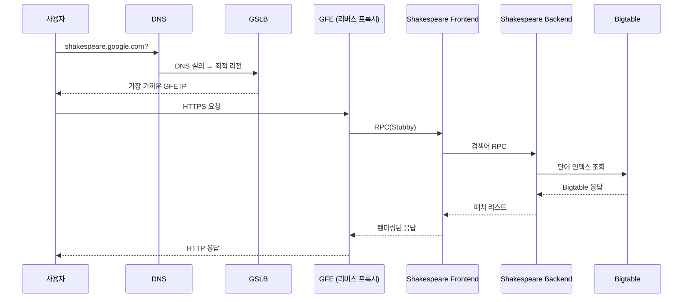
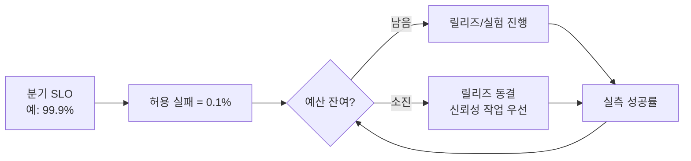
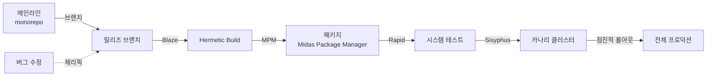
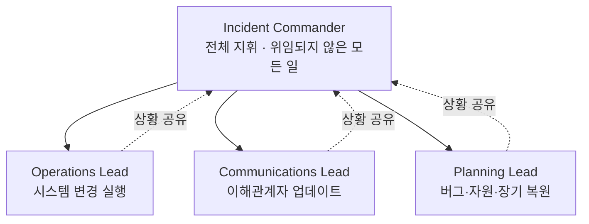
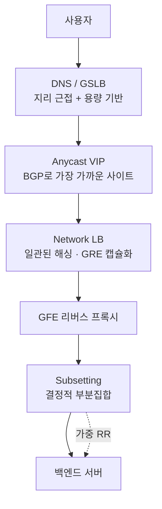
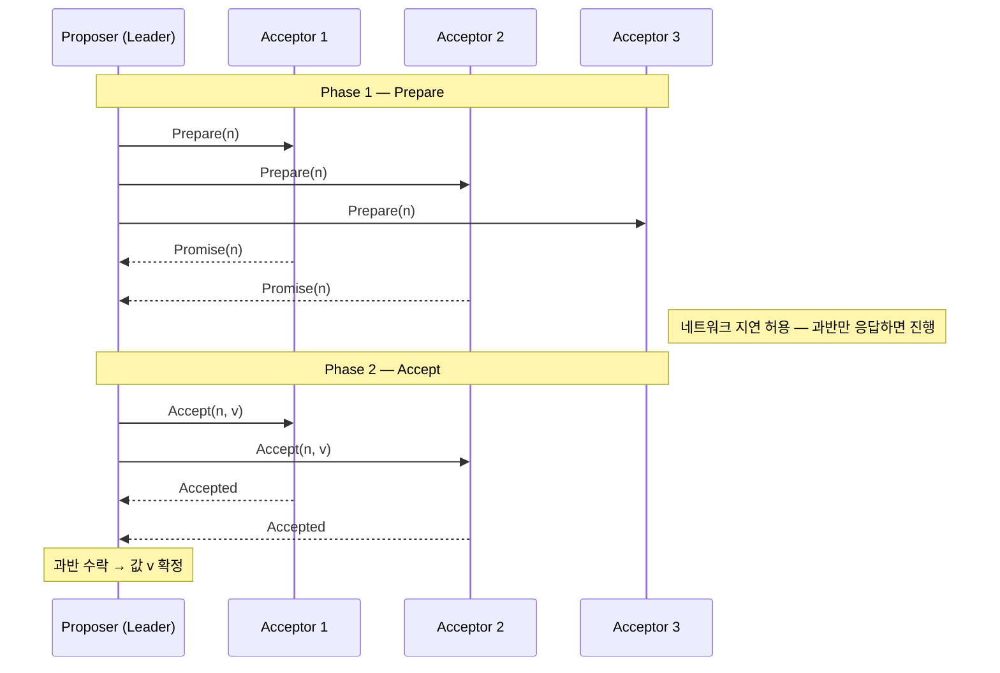
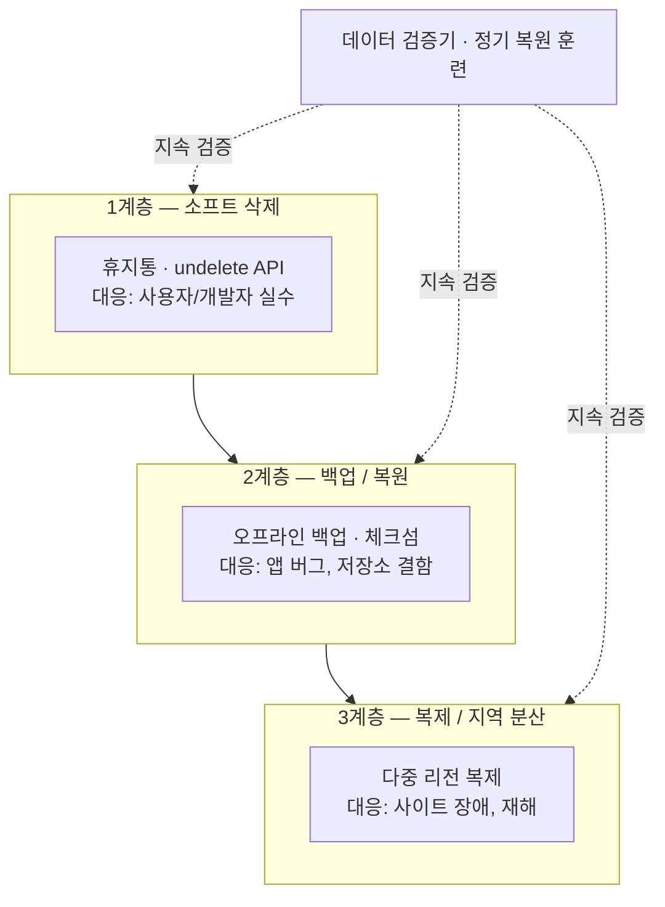

* TOC
{:toc}

# SRE
- [SRE Book — Table of Contents (Google)](https://sre.google/sre-book/table-of-contents/)

## Part I. 소개 (Introduction)

### Ch01. 소개

#### TL;DR
- SRE: 운영팀을 위한 소프트웨어 엔지니어. 이들은 가용성(availability), 응답 시간(latency), 성능(performance), 효율성(efficiency), 변화 관리(change management), 모니터링(monitoring), 위기 대응(emergency response), 수용량 계획(capacity planning)에 대한 책임을 진다.

#### Key Ideas
- 가용성(availability)
- 응답 시간(latency)
- 성능(performance)
- 효율성(efficiency)
- 변화 관리(change management)
    - 제품의 단계적 출시
    - 문제를 빠르고 정확하게 도출하기
    - 문제 발생 시 안전하게 이전 버전으로 되돌리기
- 모니터링(monitoring)
    - 알림(alerts): 문제가 발생했거나, 발생하려 할 때 사람이 즉각적으로 대응해야 함을 알린다.
    - 티켓(tickets): 사람의 대응이 필요하지만 즉각적인 대응이 필요하지 않은 상황을 의미한다.
    - 로깅(logging): 누군가 이 정보를 반드시 확인해야 할 필요는 없지만 향후 분석이나 조사를 위해 기록되는 내용이다.
- 위기 대응(emergency response)
    - MTTF(Mean Time to Failure)
    - MTTR(Mean Time To Repair)
- 수용량 계획(capacity planning)
    - 자연적 수요에 대한 정확한 예측. 필요한 수용력을 확보하기까지의 시간에 대한 예측을 이끌어낼 수 있다.
    - 자연적 수요와 인위적 수요를 정확하게 합산하기
    - 원천적인 수용력(서버, 디스크 등)을 바탕으로 서비스의 수용력을 측정하기 위한 통상의 시스템 부하 테스트

### Ch02. 구글 프로덕션 환경 개요

#### TL;DR
- 구글 데이터센터(datacenter)는 동질화된 하드웨어 위에 Borg, Colossus, Chubby, Stubby 같은 자체 시스템 소프트웨어를 얹어 대규모 장애를 추상화한 환경이다.
- 머신(machine, 하드웨어)과 서버(server, 소프트웨어)를 명확히 구분하며, 자원 할당과 장애 복구는 클러스터 OS인 Borg가 담당한다.
- 네트워킹은 Jupiter 패브릭(fabric)과 글로벌 백본 B4, GSLB(Global Software Load Balancer)로 구성되어 글로벌 트래픽을 효율적으로 분산한다.
- 셰익스피어(Shakespeare) 예제를 통해 MapReduce 배치, Bigtable 저장, GFE 프론트엔드, RPC 백엔드, GSLB 라우팅이 한 요청 안에서 어떻게 맞물리는지 보여준다.

#### Key Ideas
- 하드웨어 토폴로지(topology)
    - 머신(machine)은 하드웨어 또는 VM, 서버(server)는 서비스를 구현한 소프트웨어로 용어를 분리한다.
    - 수십 대의 머신이 랙(rack)을 이루고, 랙들이 행(row)을 이루며, 한두 개 이상의 행이 클러스터(cluster), 여러 클러스터가 데이터센터 빌딩, 인접한 빌딩들이 캠퍼스(campus)를 형성한다.
    - 데이터센터 내부는 Clos 네트워크 패브릭인 Jupiter로 연결되어 최대 1.3 Pbps의 bisection 대역폭을 제공하고, 데이터센터 간은 OpenFlow 기반 SDN 백본 B4로 연결된다.
- 클러스터 운영체제 Borg
    - 분산 클러스터 OS로서 잡(job)을 실행하며, 잡은 다수의 동일한 태스크(task)들로 구성된다.
    - 태스크 위치가 유동적이므로 IP/포트 대신 Borg Naming Service(BNS) 경로(`/bns/<cluster>/<user>/<job>/<task>`)로 참조한다.
    - 자원 요구량을 기반으로 머신에 빈팩킹(binpacking)하면서 랙 단위 장애 도메인을 분산시키고, 자원 초과 사용 태스크는 죽이고 재시작한다.
- 저장소 스택
    - 최하위 D 계층은 거의 모든 머신에서 동작하는 파일서버이고, 그 위 Colossus가 클러스터 전역 파일시스템과 복제/암호화를 제공하는 GFS(Google File System) 후속 시스템이다.
    - Colossus 위에 페타바이트급 NoSQL인 Bigtable, 글로벌 강한 일관성을 지원하는 SQL-like 시스템 Spanner, Blobstore 등이 동작한다.
- 네트워킹과 부하 분산
    - 라우팅 결정을 중앙 컨트롤러로 옮긴 OpenFlow SDN과, 트래픽당 대역폭을 관리하는 Bandwidth Enforcer(BwE)로 네트워크 자원을 최적화한다.
    - GSLB(Global Software Load Balancer)는 DNS 지리적 분산, 사용자 서비스 단위, RPC 단위의 세 계층에서 부하를 분산한다.
- 공유 인프라 시스템 소프트웨어
    - Chubby는 Paxos 기반의 분산 잠금/합의 서비스로, 마스터 선출과 BNS 매핑처럼 일관성이 필요한 데이터를 저장한다.
    - Borgmon은 서버 메트릭을 주기적으로 스크래이프(scrape)해 알림, 회귀 비교, 용량 계획에 활용하는 모니터링 시스템이다.
- 소프트웨어 인프라
    - 모든 서비스는 Stubby(오픈소스 버전 gRPC) RPC로 통신하며, 데이터 직렬화는 XML 대비 작고 빠른 프로토콜 버퍼(protobuf)를 사용한다.
    - 모든 서버는 진단/통계용 HTTP 서버를 내장하고, 코드는 멀티스레드(multithread)로 작성되어 다코어를 활용한다.
- 개발 환경
    - 대부분의 코드를 단일 모노레포(monorepo)에서 관리하며, 모든 변경은 체인지리스트(CL) 리뷰를 거쳐 메인라인에 머지된다.
    - 빌드/테스트는 데이터센터의 빌드 서버에서 병렬 수행되고, CL 제출 시 영향 범위의 테스트가 자동으로 돌며, 일부 프로젝트는 push-on-green으로 자동 배포된다.
- 셰익스피어(Shakespeare) 예제 서비스
    - 배치 컴포넌트는 MapReduce(map → shuffle → reduce)로 셰익스피어 텍스트의 단어 인덱스를 만들어 Bigtable에 저장하고, 항상 떠 있는 프론트엔드가 사용자 검색을 처리한다.
    - 요청 흐름: DNS → GSLB → GFE(Google Frontend) 리버스 프록시 → Shakespeare 프론트엔드 → 백엔드 → Bigtable 순으로 RPC가 이어진다.
    - 100 QPS 처리 가능한 백엔드를 피크 3,470 QPS에 맞춰 N+2 중복으로 최소 37태스크 산정하고, 지역별(미주 17, 유럽 16, 아시아 6, 남미 4) 분산 및 Bigtable 리전 복제로 지연과 비용을 균형 있게 설계한다.

#### Shakespeare 검색 요청 흐름

## Part II. 원칙 (Principles)

### Ch03. 리스크 수용

#### TL;DR
- 100% 신뢰성은 비용 대비 가치가 없으며, 사용자 경험을 좌우하는 약한 고리(네트워크, 단말 등) 때문에 인지조차 되지 않는다.
- SRE는 신뢰성을 비즈니스가 감내 가능한 리스크 수준에 명시적으로 정렬시키는 방식으로 관리한다.
- 오차 예산(error budget)은 제품 개발팀과 SRE가 혁신과 안정성 사이의 균형을 객관적 데이터로 협상하게 해 주는 공통 인센티브다.

#### Key Ideas
- 리스크 관리(risk management)
    - 신뢰성을 한 단계 높일 때 비용은 선형이 아니라 100배씩 증가하므로, 가용성 목표는 최소이자 최대 한도로 다뤄야 한다.
- 서비스 가용성 측정(measuring service risk)
    - 시간 기반 가용성 대신 글로벌 분산 환경에서는 요청 성공률(request success rate)로 측정하며, 분기 단위 SLO를 주/일 단위로 추적한다.
- 리스크 허용도(risk tolerance)
    - 가용성 목표, 장애 유형(부분 vs 전체), 비용/매출 영향, 지연 같은 다른 메트릭을 종합해 컨슈머 서비스와 인프라 서비스 각각에 맞게 정의한다.
- 인프라 서비스의 차등 SLA
    - Bigtable처럼 저지연 클러스터와 처리량 클러스터로 구분해 명시적인 서비스 레벨을 제공함으로써 비용 대비 효율을 확보한다.
- 오차 예산(error budget)
    - SLO에서 도출한 분기별 허용 실패율로, 예산이 남아 있는 동안에는 릴리즈가 가능하고 소진되면 자동으로 릴리즈가 늦춰진다.
- 카나리(canary)와 푸시 빈도
    - 모든 푸시는 리스크이므로 카나리 기간/규모, 테스트 강도 등을 오차 예산을 기준으로 결정한다.
- 공동 책임(joint ownership)
    - 네트워크 장애나 데이터센터 장애도 예산을 소모하므로, 가용성에 대한 책임을 팀 전체가 공유하게 만든다.

#### 오차 예산 제어 루프

### Ch04. 서비스 수준 목표

#### TL;DR
- SLI/SLO/SLA를 명확히 구분하고, 사용자가 진짜 신경 쓰는 소수의 지표만 골라 측정하라.
- SLO는 분포(percentile) 관점으로 다루고, 너무 많거나 너무 엄격하게 잡지 말고 단순하게 시작하라.
- SLO를 공개하면 기대치를 정렬할 수 있으며, 의도된 장애 주입(planned outage)으로 과의존을 방지한다.

#### Key Ideas
- 용어 구분(SLI/SLO/SLA)
    - SLI는 정량 지표(latency, error rate, throughput, availability), SLO는 SLI의 목표 범위, SLA는 위반 시 결과(보상/페널티)가 따르는 명시적 계약이다.
- 가용성과 내구성(availability/durability)
    - 가용성은 "나인(nines)"으로 표현되며, 스토리지에서는 데이터 보존성을 의미하는 내구성도 동등하게 중요하다.
- 사용자 중심의 지표 선택
    - 사용자 대면 시스템은 가용성/지연/처리량, 스토리지는 지연/가용성/내구성, 빅데이터는 처리량/엔드투엔드 지연을 본다.
- 분포와 백분위수(percentile)
    - 평균은 롱테일을 가린다. 히스토그램과 99/99.9 백분위로 측정해야 사용자 체감을 반영한다.
- SLO 설정 원칙
    - 현재 성능 기준으로 잡지 말고, 단순하게, 절대값(infinite/always)을 피하고, 가능한 적게, 완벽보다 점진적 개선으로 가라.
- 제어 루프(control loop)
    - SLI 측정 → SLO와 비교 → 필요한 조치 결정 → 실행의 사이클로 시스템을 운영한다.
- 안전 마진과 과달성 방지
    - 외부 공개 SLO보다 빡빡한 내부 SLO를 두고, Chubby처럼 의도적 다운타임으로 과도한 의존을 끊어낸다.
- SLA의 보수성
    - SLA는 광범위한 사용자에게 약속하는 만큼 변경/철회가 어려워, 보수적으로 광고하는 것이 안전하다.

#### SLI / SLO / SLA 비교

| 구분 | 정의 | 예시 | 위반 결과 | 결정 주체 |
|---|---|---|---|---|
| **SLI** (Indicator) | 측정되는 정량 지표 | p99 지연, 성공률 | — | SRE/개발팀 |
| **SLO** (Objective) | SLI에 대한 내부 목표 | p99 < 500ms, 99.9% 성공 | 엔지니어링 대응 트리거 | SRE + 개발팀 합의 |
| **SLA** (Agreement) | 외부 고객과의 계약 | 월 99.5% 미만 시 환불 | 금전적 보상/페널티 | 비즈니스/법무 |

### Ch05. 삽질 없애기

#### TL;DR
- 삽질(toil)은 단순히 싫은 일이 아니라 수동적·반복적·자동화 가능·전술적·지속 가치 없음·서비스 규모에 선형 비례하는 운영 작업이다.
- SRE는 시간의 50% 이상을 엔지니어링에 써야 하며, 이 약속이 SRE를 단순 Ops 조직으로 추락시키지 않게 한다.
- 적절한 양의 삽질은 괜찮지만, 과도하면 번아웃(burnout), 사기 저하, 경력 정체, 팀 이탈을 유발한다.

#### Key Ideas
- 삽질의 정의(toil)
    - 수동(manual), 반복적(repetitive), 자동화 가능(automatable), 전술적(tactical), 지속 가치 없음(no enduring value), O(n) 성장 중 다수에 해당하는 운영 작업.
- 오버헤드(overhead)와의 구분
    - 회의, HR 업무 같은 운영 외 행정 업무는 삽질이 아니라 오버헤드이며, 일회성으로 큰 개선을 만드는 작업도 삽질이 아니다.
- 50% 룰
    - 삽질을 SRE 시간의 50% 이하로 유지하고, 나머지는 미래의 삽질을 줄이는 엔지니어링 프로젝트에 투입한다.
- 삽질의 하한선과 출처
    - 온콜 로테이션 자체가 25~33% 하한을 만들며, 인터럽트, 온콜 응답, 릴리즈/푸시가 주된 삽질 원천이다.
- 엔지니어링 작업의 분류
    - 소프트웨어 엔지니어링, 시스템 엔지니어링, 삽질, 오버헤드 네 가지로 나누고 인간 판단이 필수이고 영구적 개선을 만드는 작업만 엔지니어링으로 친다.
- 과도한 삽질의 폐해
    - 경력 정체, 사기 저하, 번아웃(burnout)에 더해 조직적으로는 혼란 야기, 진척 둔화, 잘못된 선례, 인재 이탈, 신뢰 파괴를 부른다.

#### 작업 분류

| 분류 | 특징 | 예시 | 목표 비중 |
|---|---|---|---|
| **삽질(Toil)** | 수동·반복·자동화 가능·지속 가치 없음·O(n) | 알림 수동 처리, 반복 롤백, 티켓 소화 | **50% 이하** |
| **오버헤드(Overhead)** | 운영 외 행정 업무 | 회의, HR, 교육, 코드 리뷰 | 자연 발생량 |
| **엔지니어링(Engineering)** | 인간 판단 필요 + 영구적 개선 | 자동화 도구 개발, 시스템 재설계 | **50% 이상** |

### Ch06. 분산 시스템 모니터링

#### TL;DR
- 좋은 모니터링은 신호는 높고 잡음은 낮아야 하며, 페이저는 긴급·실행 가능·사용자 영향이 있는 경우에만 울려야 한다.
- 4가지 황금 신호(four golden signals): 지연(latency), 트래픽(traffic), 오류(errors), 포화도(saturation)에 집중하라.
- 평균이 아니라 분포로 보고, 시스템은 단순하게 유지하며, 단기 가용성보다 장기 시스템 건강을 우선하라.

#### Key Ideas
- 화이트박스/블랙박스(white-box/black-box monitoring)
    - 화이트박스는 내부 메트릭으로 임박한 문제까지 잡고, 블랙박스는 사용자 시점의 실제 증상을 검증한다.
- 증상 vs 원인(symptoms vs causes)
    - 모니터링은 "무엇이 깨졌나"(증상)와 "왜"(원인)를 모두 답해야 하며, 페이지는 가급적 증상 기반이어야 한다.
- 4가지 황금 신호(four golden signals)
    - Latency(성공/실패 분리), Traffic(수요 측정), Errors(명시/암묵/정책 위반), Saturation(가장 제약된 자원의 충만도).
- 롱테일과 히스토그램
    - 평균 지연 100ms여도 99% 백분위는 수 초가 될 수 있어, 지수형 버킷 히스토그램으로 분포를 봐야 한다.
- 측정 해상도(resolution)
    - 모든 지표를 초 단위로 수집하면 비용이 폭증하므로, 서버에서 내부 샘플링 후 외부에서 집계하는 방식을 활용한다.
- 단순함의 원칙
    - 자주 트리거되지 않는 룰과 대시보드/알람에서 활용되지 않는 시그널은 제거 후보다.
- 페이지 철학
    - 모든 페이지는 긴급성, 실행 가능성, 지능적 판단, 새로운 문제일 것이 요구된다.
- 장기 관점(long term)
    - Bigtable·Gmail 사례처럼 단기 가용성을 의도적으로 낮춰서라도 근본 원인을 고치는 것이 장기적으로 이득이다.

#### 4가지 황금 신호 (Four Golden Signals)

| 신호 | 무엇을 보는가 | 측정 방법 | 알림 임계값 예시 |
|---|---|---|---|
| **지연(Latency)** | 요청 처리 시간 | 성공/실패 분리된 p50/p95/p99 | p99 > 500ms 5분 |
| **트래픽(Traffic)** | 수요 강도 | QPS, 동시 세션 수 | 평소 대비 ±50% |
| **오류(Errors)** | 실패율 | 명시적(5xx) + 암묵적(잘못된 응답) + 정책 위반 | 성공률 < 99.9% |
| **포화도(Saturation)** | 가장 제약된 자원의 충만도 | CPU·메모리·디스크·큐 길이 | 사용률 > 80% |

### Ch07. 구글의 발전된 자동화

#### TL;DR
- 자동화는 일관성, 플랫폼화, 빠른 복구(MTTR 단축), 빠른 대응, 시간 절감의 가치를 제공한다.
- 자동화는 무자동화 → 외부 스크립트 → 외부 범용 자동화 → 시스템 내장 자동화 → 자율(autonomous) 시스템의 단계로 진화한다.
- 진정한 목표는 자동화가 아니라 자율 시스템이며, Borg는 클러스터 관리 자체를 자율 시스템으로 끌어올린 사례다.

#### Key Ideas
- 자동화의 가치(value of automation)
    - 일관성, 플랫폼화(중앙집중 버그 수정), 빠른 복구(MTTR 단축), 사람보다 빠른 대응, 시간 절감.
- 자동화 계층 구조(hierarchy of automation classes)
    - ① 무자동화 ② 외부 시스템별 자동화 ③ 외부 범용 자동화 ④ 시스템 내장 자동화 ⑤ 자동화 불필요한 자율 시스템.
- MoB와 Decider 사례
    - MySQL on Borg(MoB)에서 페일오버를 30초 내로 자동화한 Decider로 운영 부담을 95% 감소.
- Prodtest와 idempotent fix
    - Python 단위 테스트로 클러스터 설정 불일치를 검증하고, 멱등(idempotent)한 fix와 페어링해 일관성을 회복.
- 자동화 소유권 문제
    - 서비스 팀에서 자동화를 분리한 turnup 팀은 도메인 지식 부족으로 품질이 떨어졌고, 결국 서비스 팀이 다시 책임지게 됨.
- SOA 기반 cluster turnup
    - 각 서비스 팀이 Admin Server RPC를 제공하는 SOA 방식으로 저지연·정확·관련성 있는 자동화를 달성.
- Borg와 자율성(autonomy)
    - 호스트/포트/잡을 정적으로 묶지 않고 자원을 풀로 관리하여 자가 복구·자동 OS 업그레이드를 가능하게 함.
- 자동화의 위험성
    - Diskerase 사고처럼 빈 집합을 "전체"로 해석한 버그가 대규모 장애로 번질 수 있어, 율 제한과 sanity check, 멱등성이 필수.
- 신뢰성 우선(reliability is the fundamental feature)
    - 규모가 커질수록 자율적·복원력 있는 동작이 필수이며, 디커플링·API·부수효과 최소화 같은 좋은 SW 엔지니어링이 토대가 된다.

#### 자동화 5단계 진화

### Ch08. 릴리즈 엔지니어링

#### TL;DR
- 릴리즈 엔지니어는 빌드/패키징/배포 전 과정을 일관되고 재현 가능하게 만드는 별도의 직무이며, SRE와 긴밀히 협업한다.
- 핵심 철학은 셀프서비스, 높은 속도, 폐쇄적 빌드(hermetic builds), 정책 강제 네 가지다.
- 모노레포(monorepo) 메인라인에서 분기 후 체리픽하고, 빌드/패키지/구성도 버전으로 묶어 재현성을 확보한다.

#### Key Ideas
- 릴리즈 엔지니어 역할(release engineer)
    - 소스 관리, 컴파일러, 빌드 시스템, 패키지 매니저, 배포까지 다루며, 측정과 데이터 기반으로 모범 사례를 정의한다.
- 4가지 철학
    - 셀프서비스 모델, 높은 속도(잦은 작은 릴리즈), 폐쇄적 빌드(hermetic builds), 정책·절차의 강제(policies and procedures).
- 폐쇄적 빌드(hermetic builds)
    - 빌드 머신의 환경에 의존하지 않고 알려진 버전의 도구·라이브러리에만 의존해 동일 리비전은 동일 결과를 보장한다.
- 분기와 체리픽(branching/cherry pick)
    - 메인라인에서만 개발하고 릴리즈는 분기에서, 버그 수정은 메인라인 → 분기로 체리픽해 정확한 릴리즈 콘텐츠를 확보한다.
- Blaze, Rapid, MPM, Sisyphus 도구 체계
    - Blaze로 빌드, MPM(Midas Package Manager)으로 패키징, Rapid가 워크플로 오케스트레이션, Sisyphus로 복잡한 롤아웃 자동화.
- 카나리(canary)와 점진적 롤아웃
    - 시스템 테스트 후 소수 클러스터에 카나리, 이후 위험 프로파일에 맞춰 시간/지역에 걸쳐 지수적으로 확장.
- 구성 관리(configuration management)
    - 메인라인 직접 사용, 바이너리에 동봉, 별도 구성 패키지, 외부 저장소(Chubby/Bigtable) 등 여러 모델을 상황별로 선택.
- 시작 시점의 중요성
    - 릴리즈 엔지니어링은 프로젝트 초기부터 예산과 인력을 잡고, 개발자·SRE·릴리즈 엔지니어가 처음부터 함께 일해야 한다.

#### 릴리즈 파이프라인

### Ch09. 단순함

#### TL;DR
- 신뢰성의 대가는 극단적 단순함의 추구이며, "지루한(boring) 코드"가 SRE에게는 최고의 칭찬이다.
- 본질적 복잡성(essential complexity)은 받아들이되, 우발적 복잡성(accidental complexity)은 적극적으로 제거하라.
- API 최소화, 모듈화, 작은 릴리즈, 죽은 코드 삭제(negative lines of code) 같은 실천이 단순함을 유지한다.

#### Key Ideas
- 안정성과 민첩성의 균형(stability vs agility)
    - SRE의 일은 시스템의 민첩성과 안정성 사이의 균형을 잡는 것이며, 신뢰성 있는 프로세스가 결국 개발자 민첩성을 높인다.
- 지루함의 미덕(virtue of boring)
    - 운영 환경의 서프라이즈는 SRE의 적이며, 코드는 예측 가능하게 비즈니스 목표만 달성해야 한다.
- 본질적 vs 우발적 복잡성(essential/accidental complexity)
    - Fred Brooks의 "No Silver Bullet"처럼 우발적 복잡성은 엔지니어링 노력으로 제거 가능하므로 적극적으로 밀어내야 한다.
- 죽은 코드 제거(negative lines of code)
    - 모든 코드 줄은 책임이며, 플래그로 끄거나 주석 처리하지 말고 소스 컨트롤을 믿고 삭제하라(Knight Capital 사고가 반례).
- 최소 API(minimal APIs)
    - 메서드와 인자가 적을수록 이해하기 쉽고 잘 정의된 문제임을 시사한다("덜어낼 게 없을 때가 완성").
- 모듈성(modularity)
    - 바이너리·구성 간 느슨한 결합, API 버저닝(versioning), 명확한 책임 분리가 부분적 변경과 독립 배포를 가능하게 한다.
- 데이터 포맷의 모듈성
    - 프로토콜 버퍼(protocol buffers)처럼 전후방 호환되는 와이어 포맷이 시스템 진화를 지원한다.
- 릴리즈 단순성(release simplicity)
    - 한 번에 하나의 변경만 배포하면 영향 분석이 쉬워지고 머신러닝의 경사하강법처럼 안전하게 빠르게 움직일 수 있다.

## Part III. 실천 (Practices)

### Ch10. 시계열 데이터로부터의 실용적 알림

#### TL;DR
- 시계열 데이터 기반 모니터링은 화이트박스(white-box)와 블랙박스(black-box) 접근을 결합해야 한다.
- Borgmon은 레이블(label)이 붙은 시계열을 메모리에 저장하고 규칙(rule)으로 평가한다.
- 좋은 알림은 일시적 변동이 아닌 의미 있는 SLO 위반에 대해, 충분한 지속 시간 조건과 함께 발화한다.
- 모든 모니터링 데이터가 알림이 되어선 안 되며, 페이지/티켓/대시보드를 명확히 구분한다.

#### Key Ideas
- 화이트박스 모니터링(white-box monitoring)
    - 서비스 내부 메트릭을 노출(`/varz` 같은 엔드포인트)하여 병목과 실패 컴포넌트를 빠르게 파악한다.
- 블랙박스 모니터링(black-box monitoring)
    - 사용자 관점에서 외부 동작을 검증하여 DNS/네트워크처럼 트래픽이 도달하기 전 발생하는 실패까지 잡는다.
- 시계열 아레나(time-series arena)와 호라이즌(horizon)
    - Borgmon은 레이블 기반 시계열을 인메모리에 약 12시간 분량 저장하고 GC로 정리하며, 쿼리 윈도우를 호라이즌이라 부른다.
- 규칙 평가(rule evaluation)와 벡터(vector)
    - 집계(aggregation), 비율(rate), 비(ratio) 같은 대수 표현으로 파생 시계열을 만들어 SLO 평가와 알림에 활용한다.
- 카운터 vs 게이지(counter vs gauge)
    - 카운터는 단조 증가하여 샘플링 간 정보 손실이 적고, 게이지는 순간값이라 측정 간 변화가 누락될 수 있다.
- 알림 설계 원칙(alert design)
    - 플래핑(flapping) 방지를 위한 최소 지속 시간, 다중 조건(에러 비율 1% AND 절대 에러율 1/s 초과), 운영자에게 필요한 컨텍스트 포함.
- 계층적 모니터링(hierarchical monitoring)
    - 로컬 스크레이퍼 → 데이터센터 집계 → 글로벌 모니터로 이어지는 계층 구조로 단일 장애점과 확장성 한계를 회피한다.
- 오픈소스 등가물
    - Prometheus, Riemann, Heka, Bosun 등이 동일한 시계열 기반 알림 모델을 제공한다.

### Ch11. 온콜 대응

#### TL;DR
- 온콜은 운영 부담과 엔지니어링 시간을 균형 있게 유지해야 지속 가능하다.
- 구글 SRE는 온콜에 25% 이하, 엔지니어링 작업에 최소 50%를 보장한다.
- 심리적 안전(psychological safety)과 명확한 절차가 직관 기반 판단의 위험(확증 편향 등)을 줄인다.
- 운영 과부하(operational overload)와 운영 저부하(operational underload) 모두 관리 대상이다.

#### Key Ideas
- 균형 잡힌 온콜 로테이션(balanced on-call rotation)
    - 단일 사이트 24/7 로테이션은 최소 8명, 다중 사이트는 사이트당 최소 6명이 필요하며 "follow the sun" 방식으로 야간 근무를 줄인다.
- 양보다 질(quality over quantity)
    - 1건당 평균 6시간(분석/포스트모템 포함)을 기준으로 12시간 시프트당 2건 이하가 지속 가능한 한계다.
- 보상 구조(compensation)
    - 시간 외 근무에 대해 대체 휴가 또는 현금 보상을 제공하되 급여 비례 상한을 둬 과도한 온콜을 자연스럽게 제한한다.
- 안전감과 비난 없는 문화(feeling safe, blameless culture)
    - 명확한 에스컬레이션 경로, 문서화된 절차, 비난 없는(blameless) 포스트모템이 스트레스성 판단을 줄인다.
- 직관 vs 분석(intuition vs analytics)
    - 투쟁-도피(fight-or-flight) 반응에서 비롯된 직관 대신, 데이터 기반 분석과 구조화된 절차를 우선한다.
- 운영 과부하(operational overload) 대응
    - 잘못 설정된 알림과 노이즈 페이지를 재튜닝하고 관련 알림을 묶거나 개발팀과 책임을 재협상한다.
- 운영 저부하(operational underload) 위험
    - 프로덕션과 멀어지면 지식과 자신감이 손실되므로 분기별 온콜 노출과 "Wheel of Misfortune" 같은 훈련을 진행한다.

#### 온콜 부하 진단

| 상태 | 증상 | 주요 신호 | 조치 |
|---|---|---|---|
| **과부하** (Overload) | 페이지 > 12h 시프트당 2건, 번아웃 | 야간 호출 다발, 지연된 포스트모템 | 노이즈 튜닝, 개발팀 책임 재협상, 인력 증원 |
| **적정** (Healthy) | 시프트당 0–2건, 엔지니어링 시간 50%+ | 근본 원인 수정이 전파됨 | 유지 — 분기 리뷰 |
| **저부하** (Underload) | 시프트당 거의 0건, 연속 한산 | 운영 감각 저하, 절차 망각 | Wheel of Misfortune, 분기 재노출, 팀 범위 확장 |

### Ch12. 효과적인 장애 조치

#### TL;DR
- 장애 조치는 일반적 방법론과 시스템 지식의 결합으로 학습 가능한 기술이다.
- 가설 연역적 방법(hypothetico-deductive method)으로 관찰 → 가설 → 검증을 반복한다.
- 대형 장애 시 근본 원인보다 "출혈을 멈추는" 트리아지(triage)를 우선한다.
- 부정적 결과(negative results)도 가치 있는 데이터다.

#### Key Ideas
- 문제 보고(problem report)
    - 기대 동작, 실제 동작, 재현 단계 세 가지를 포함하고 버그 트래킹 시스템에 일관된 폼으로 기록한다.
- 트리아지(triage)
    - 트래픽 우회, 종속 실패 차단, 서브시스템 비활성화 등으로 우선 안정화한 뒤 근본 원인을 찾는다.
- 검사(examination) 도구
    - 시계열 메트릭 그래프, 구조화 로깅(structured logging), Dapper 같은 요청 추적(request tracing), 현재 상태 노출 엔드포인트.
- 분할 정복과 단순화(divide and conquer, simplify and reduce)
    - 잘 정의된 인터페이스로 컴포넌트를 분리해 블랙박스 테스트하고, 큰 시스템에서는 이분 탐색(bisection)으로 영역을 좁힌다.
- 핵심 질문과 최근 변경(recent changes)
    - "무엇을, 왜, 어디서"를 묻고 시스템 관성을 가정하여 최근 배포·설정·환경 변화를 우선 의심한다.
- 흔한 함정(common pitfalls)
    - 무관한 증상에 매몰, 안전하지 않은 가설 검증, 비현실적 이론 반복, 상관과 인과 혼동("말 발굽 소리에 얼룩말이 아닌 말을 떠올려라").
- 부정적 결과의 가치(value of negative results)
    - 무엇이 효과가 없는지를 명확히 보여주고, 도구·방법론을 개선하며, 공유 시 산업 전반의 데이터 기반 문화를 강화한다.
- 장애 조치 친화적 설계
    - 화이트박스 메트릭, 일관된 요청 ID, 변경의 통제·로깅을 처음부터 설계에 반영한다.

### Ch13. 긴급 대응

#### TL;DR
- 대형 시스템에서 장애는 필연이며, 핵심은 당황하지 않고 절차에 따라 대응하는 것이다.
- 테스트, 변경, 프로세스로 인한 긴급 상황을 구분해 학습한다.
- 통제된 실패가 통제되지 않은 실패보다 훨씬 안전하다.
- 정직한 장애 기록과 "what-if" 질문이 사전 대비를 강화한다.

#### Key Ideas
- 침착함과 협업(don't panic, you aren't alone)
    - 혼자 떠안지 말고 인시던트 응답 절차에 따라 추가 인력을 투입하며 체계적으로 대응한다.
- 테스트 유발 긴급 상황(test-induced emergency)
    - 의도적 장애 주입이 숨은 종속성을 드러낼 수 있으며, 대규모 테스트 전 롤백 절차를 철저히 검증해야 한다.
- 변경 유발 긴급 상황(change-induced emergency)
    - 단순한 인프라 설정 변경도 광범위한 크래시 루프를 유발할 수 있어 카나리(canary) 검증을 반드시 거쳐야 한다.
- 프로세스 유발 긴급 상황(process-induced emergency)
    - 자동화의 버그는 빠르고 광범위한 피해를 만들 수 있고, 복구는 다국가 팀 간 수작업 조정이 필요할 수 있다.
- 과거로부터 학습(learning from past)
    - 전술적 수정만 기록하지 말고 전략적 예방 조치를 함께 정직하게 문서화한다.
- 큰 What-If 질문하기
    - 데이터센터 장애, 보안 침해, 인프라 재해를 미리 가정해 대응 계획을 준비한다.
- 사전 테스트 권장(proactive testing)
    - 자원이 풍부한 시간대의 통제된 실패가 새벽의 예측 불가 실패보다 낫다.

### Ch14. 장애 관리

#### TL;DR
- 관리되지 않는 인시던트는 기술 집착, 빈약한 의사소통, 조율 없는 즉흥 대응(freelancing)으로 악화된다.
- 책임의 재귀적 분리(recursive separation of responsibilities)로 역할을 명확히 한다.
- 인시던트 커맨더, 운영, 커뮤니케이션, 플래닝의 4가지 핵심 역할이 있다.
- 라이브 인시던트 문서와 명확한 인수인계가 대응의 척추다.

#### Key Ideas
- 인시던트 커맨드(incident command)
    - 전체 상태를 유지하고 태스크포스를 구성하며, 위임되지 않은 모든 역할을 보유하고 장애물을 제거한다.
- 운영 작업(operational work)
    - 오직 Ops 리드 팀만 시스템을 변경하며, 커맨더와 협력해 도구를 적용한다.
- 커뮤니케이션(communication)
    - 이해관계자에게 주기적으로 업데이트를 발신하고 인시던트 문서의 정확성을 유지한다.
- 플래닝(planning)
    - 버그 등록, 자원 조정, 시스템 일탈 추적 및 추후 복원 계획 등 장기적 사안을 담당한다.
- 인식 가능한 커맨드 포스트(recognized command post)
    - 물리적 또는 가상 공간(IRC 등)에 모두가 접근 가능해야 하며, 로그가 남고 분산 협업이 가능해야 한다.
- 라이브 인시던트 상태 문서(live incident state document)
    - 공동 편집 가능한 문서를 실시간 갱신해 현재 대응을 안내하고 후속 포스트모템에 활용한다.
- 명확한 인수인계(clear handoff)
    - 신임 커맨더가 상황을 완전히 이해했음을 명시적으로 확인한 뒤에야 전임 커맨더가 이탈한다.
- 인시던트 선언 기준(when to declare)
    - 다중 팀 조율 필요, 고객 영향 발생, 1시간 집중 분석에도 미해결인 경우 공식 절차를 가동한다.

#### 인시던트 역할 구조

| 역할 | 핵심 책임 | 하지 않는 것 |
|---|---|---|
| **Incident Commander** | 전체 상태 유지, 태스크포스 구성, 장애물 제거 | 직접 명령 실행(시스템 변경) |
| **Operations Lead** | 시스템을 실제로 바꾸는 유일한 팀 | 외부 커뮤니케이션 |
| **Communications Lead** | 주기적 상태 공지, 인시던트 문서 갱신 | 기술적 판단 |
| **Planning Lead** | 버그 등록, 인수인계 준비, 장기 복원 계획 | 실시간 대응 |

### Ch15. 포스트모템 문화: 실패로부터 배우기

#### TL;DR
- 포스트모템은 처벌이 아닌 학습 기회로, 시스템과 프로세스 개선이 목적이다.
- 비난 없는(blameless) 접근은 모든 참가자가 선의로 행동했다고 가정한다.
- 명확한 트리거 기준을 미리 정의해 일관성을 확보한다.
- 조직 차원의 의례(월간 포스트모템 등)가 문화 정착을 강화한다.

#### Key Ideas
- 포스트모템 트리거(when to perform)
    - 사용자 가시 다운타임, 데이터 손실, 온콜 개입, 장기 해결, 모니터링 실패 등 사전 합의된 조건에서 작성한다.
- 비난 없는 포스트모템(blameless postmortem)
    - 의료·항공 안전 문화에서 유래했으며 "사람을 고칠 순 없지만 시스템과 프로세스는 고칠 수 있다"는 철학에 기반한다.
- 협업과 지식 공유(collaborate and share knowledge)
    - 실시간 공동 편집, 댓글, 알림 도구를 사용하고 시니어 엔지니어의 공식 리뷰를 거쳐 배포한다.
- 포스트모템의 달(postmortem of the month)
    - 사내 뉴스레터에 우수 사례를 게시해 가시성을 높인다.
- Google+ 포스트모템 그룹과 리딩 클럽
    - 사내 포럼과 팀 단위 토론 모임으로 과거 사례를 공유·학습한다.
- Wheel of Misfortune
    - 신규 SRE를 위한 재해 역할극으로, 실제 인시던트 시나리오를 시뮬레이션해 대응 역량을 키운다.
- 경영진의 가시적 지원
    - 관리자가 포스트모템 가치를 명확히 인정하고 보상해야 문화가 지속된다.

### Ch16. 장애 추적

#### TL;DR
- 신뢰성 향상의 출발점은 알려진 베이스라인의 측정이다.
- Escalator는 미응답 알림을 자동 에스컬레이션하는 중앙 알림 시스템이다.
- Outalator는 다중 알림 스트림을 시간 순으로 통합·주석·그룹화한다.
- 자유 형식 태깅(tagging)으로 추세와 시스템적 문제를 가볍게 식별할 수 있다.

#### Key Ideas
- Escalator
    - 1차 온콜이 응답하지 않으면 2차로 자동 에스컬레이션하며 기존 워크플로에 투명하게 통합된다.
- Outalator
    - 시간 인터리브 큐 뷰(time-interleaved queue view)로 여러 알림 스트림을 한 화면에서 본다.
- 인시던트 그룹화(incident grouping)와 중복 제거(deduplication)
    - 단일 인프라 사건이 여러 팀에 알림을 만들 때 이를 묶어 "알림 수"와 "인시던트 수"를 구분한다.
- 자유 형식 태깅(free-form tagging)
    - `cause:network:switch` 같은 계층적 태그로 일관성과 유연성을 동시에 확보한다.
- 분석과 리포팅(analysis and reporting)
    - 주당 인시던트 수, 인시던트당 알림 수 같은 기본 메트릭과 팀·기간 간 추세 비교를 제공한다.
- 시프트 핸드오프(shift handoff)
    - 태그 요약이 포함된 인수인계 이메일로 다음 온콜이 빠르게 컨텍스트를 파악한다.
- 예상치 못한 이점(unexpected benefits)
    - 팀 간 가시성이 높아져 다운스트림 영향을 인지하지 못한 인프라 팀에 수동 알림을 보낼 수 있다.

### Ch17. 신뢰성을 위한 테스트

#### TL;DR
- 테스트는 과거 신뢰성(모니터링)과 미래 신뢰성(테스트 커버리지)을 모두 정량화한다.
- 단위·통합·시스템 테스트가 기반이며 카나리(canary), 스트레스, 설정 테스트가 프로덕션을 보완한다.
- 설정 변경도 코드 릴리스만큼 엄격하게 다뤄야 한다.
- 카오스 엔지니어링(chaos engineering) 같은 비결정적 기법도 가치를 제공한다.

#### Key Ideas
- 전통적 테스트 유형(unit, integration, system)
    - 단위 테스트는 함수/클래스 단위, 통합은 의존성 주입을 통한 컴포넌트 결합, 시스템은 엔드 투 엔드 검증이다.
- 시스템 테스트의 하위 분류
    - 스모크 테스트(smoke), 성능 테스트(performance), 회귀 테스트(regression)로 핵심 동작·성능 저하·기존 버그 재발을 방지한다.
- 설정 테스트(configuration tests)
    - 프로덕션에 실제 적용된 바이너리 설정을 버전 관리된 설정 파일과 비교 검증한다.
- 스트레스 테스트(stress tests)
    - 시스템이 파국적으로 무너지기 전의 한계점을 식별한다.
- 카나리 테스트(canary tests)
    - 일부 서버에 먼저 배포하고 인큐베이션 기간을 둔 뒤 전체 롤아웃하며 문제 시 빠르게 롤백한다.
- 빌드/테스트 인프라
    - 버전 관리, 즉시 알림이 가는 지속적 빌드, Bazel 같은 의존성 인식 테스트 러너가 필수다.
- 통계적·재해 테스트(statistical and disaster testing)
    - 퍼징(fuzzing)과 카오스 엔지니어링(chaos engineering)은 비결정적이지만 의외의 결함을 드러낸다.
- 프로덕션 프로브와 빠른 피드백
    - 모니터링 프로브로 라이브 환경에서 시나리오를 재생하고, 짧은 피드백 사이클로 신뢰성을 높인다.

### Ch18. SRE의 소프트웨어 엔지니어링

#### TL;DR
- SRE는 프로덕션 지식을 바탕으로 내부 도구를 가장 잘 만들 수 있는 위치에 있다.
- Auxon은 의도 기반 용량 계획(intent-based capacity planning)을 자동화한 사례다.
- "왜" 자원이 필요한가를 명세하면 시스템이 최적 배분을 자동 생성한다.
- 단순 프로토타입에서 시작해 반복(launch and iterate)하는 전략이 성공의 열쇠다.

#### Key Ideas
- SRE 소프트웨어 엔지니어링의 가치
    - 팀 규모가 서비스 확장에 비례해 늘어나선 안 된다는 SRE 원칙상 자동화는 필수이며, 개인의 커리어 성장에도 도움이 된다.
- Auxon 사례 연구
    - 수작업 스프레드시트 기반의 용량 계획을 기계 가독 제약식으로 변환해 최적화 알고리즘으로 해결, 수백만 달러의 머신 자원을 관리한다.
- 의도 기반 용량 계획(intent-based capacity planning)
    - 어떤 자원이 아니라 신뢰성·이중화·지연 같은 "의도"를 명세하고 시스템이 매개변수 변화에 따라 새 계획을 자동 생성한다.
- 근사와 반복(approximation and iteration)
    - "Stupid Solver"라는 단순 프로토타입으로 비전을 검증하고 선형 계획법(linear programming)을 학습하며 점진적으로 발전시켰다.
- 채택 전략(adoption strategy)
    - 일관된 메시징, 기존 솔루션이 없는 얼리 어댑터 발굴, 화이트 글러브 지원, 도구 표준화를 강요하지 않는 비종속(agnostic) 설계.
- 팀 구성(team composition)
    - 제너럴리스트와 도메인 전문가를 결합하고 프로덕션 연결을 유지하며 후기에 수학적 최적화 전문가를 합류시켰다.
- SRE 엔지니어링 문화 조성
    - 명확한 메시징, 역량 평가, 신뢰할 만한 첫 출시(credible launches), 코드 리뷰·테스트·프로덕션 준비 검토 같은 표준 유지가 필요하다.
- 교훈(lessons learned)
    - 도메인 전문가가 주도하고, 고신호 사용자 피드백을 받으며, 토일(toil)을 줄이고 조직 목표와 정렬되는 프로젝트가 성공한다. 구글 클라우드 로드 밸런서가 사내 SRE 개발에서 출발한 사례다.

### Ch19. 프런트엔드의 로드 밸런싱

#### TL;DR
- 프런트엔드 트래픽 분산은 단순한 라운드 로빈을 넘어 지리적 근접성, 용량, 지연시간을 종합 고려해야 한다.
- DNS와 가상 IP(VIP)를 결합한 다층 구조로 글로벌 트래픽을 효율적으로 라우팅한다.
- 애니캐스트(anycast)는 단일 IP로 가장 가까운 데이터센터로 사용자를 자연스럽게 유도하는 강력한 기법이다.

#### Key Ideas
- DNS 로드 밸런싱(DNS load balancing)
    - 가장 단순한 방식이지만 클라이언트가 결과를 캐싱하고 재귀 리졸버(recursive resolver)가 중간에 끼어 있어 정확한 트래픽 제어가 어렵다.
    - EDNS0 확장으로 클라이언트 서브넷 정보를 전달해 더 나은 위치 기반 응답을 제공할 수 있다.
- 가상 IP 주소(Virtual IP, VIP)
    - 다수의 백엔드가 하나의 IP를 공유하여 장애 격리와 무중단 배포를 가능하게 한다.
    - 네트워크 로드 밸런서가 패킷을 백엔드로 전달하며 일관된 해싱(consistent hashing)으로 연결의 어피니티를 유지한다.
- 애니캐스트(anycast) 라우팅
    - 동일한 IP를 여러 위치에서 BGP로 광고하여 사용자가 네트워크적으로 가장 가까운 사이트로 자연스럽게 연결되도록 한다.
    - 라우팅 변경 시 TCP 연결이 깨질 수 있는 위험이 있어 안정 관리가 필요하다.
- 패킷 캡슐화(packet encapsulation)
    - GRE 같은 터널링으로 VIP 트래픽을 백엔드까지 전달하면서 원본 클라이언트 IP를 보존한다.
- 계층화된 부하 분산
    - 프런트엔드 단계에서는 사용자와의 근접성과 가용 용량을 우선시하고, 세밀한 분배는 데이터센터 내부 단계에 위임한다.

#### 부하 분산 계층도

| 계층 | 관심사 | 신호 |
|---|---|---|
| **프런트엔드** (DNS/Anycast) | 지리적 근접성, 사이트 용량 | 지연, 리전별 QPS |
| **네트워크 LB** | 연결 어피니티, 장애 격리 | 연결 수, 백엔드 상태 |
| **L7 (GFE → 백엔드)** | 세밀한 분배 | 활성 요청 수, 활용률, 큐 길이 |

### Ch20. 데이터센터의 로드 밸런싱

#### TL;DR
- 데이터센터 내부에서는 백엔드 상태와 부하를 인식하는 정교한 알고리즘이 필요하다.
- 단순 라운드 로빈은 부하 편차를 크게 만들며, 최소 부하 라운드 로빈(least-loaded round robin)이 더 균형 잡힌다.
- 활성 요청 가중 라운드 로빈(weighted round robin)이 Google 환경에서 가장 효과적인 접근으로 평가된다.

#### Key Ideas
- 흐름 제어를 위한 백엔드 상태 모델
    - 각 백엔드는 healthy, refusing connections, lame duck 세 가지 상태를 가질 수 있으며 lame duck은 새 요청을 거부하면서 진행 중 요청은 마무리하게 한다.
- 서브셋팅(subsetting)
    - 클라이언트가 모든 백엔드와 연결을 유지하면 자원이 과다하게 소모되므로, 일부 백엔드 서브셋과만 연결을 유지한다.
    - 결정적 서브셋팅(deterministic subset selection) 알고리즘이 로드 분산과 안정성을 동시에 충족한다.
- 라운드 로빈(round robin)의 한계
    - 요청 비용이 균일하지 않고 머신 성능이 다양하므로 부하 편차가 매우 커진다.
- 최소 부하 라운드 로빈(least-loaded round robin)
    - 클라이언트가 각 백엔드의 활성 요청 수를 추적해 가장 적은 곳으로 보낸다.
    - 죽은 백엔드가 활성 요청 0으로 보여 트래픽 폭주를 받는 함정이 있다.
- 가중 라운드 로빈(weighted round robin)
    - 백엔드가 자신의 활용률, 큐 길이, 오류율 같은 신호를 클라이언트에 알리고, 클라이언트가 가중치를 동적으로 조정한다.
    - Google 내부 측정에서 부하 편차를 크게 줄이는 가장 효과적인 방식으로 검증되었다.

### Ch21. 과부하 대응

#### TL;DR
- 단순 QPS 기반 제한은 요청 비용 차이로 부정확하므로 자원 사용량(CPU 등) 기반 제한이 더 우수하다.
- 과부하 시 점진적 감쇠(graceful degradation)와 클라이언트측 스로틀링이 핵심 도구다.
- 요청에 중요도(criticality) 라벨을 붙여 우선순위 기반 거부와 재시도 정책을 일관되게 적용한다.

#### Key Ideas
- 사용자당 할당량(per-customer quota)
    - QPS는 워크로드에 따라 의미가 달라 신뢰할 수 없으며, CPU 같은 자원 사용량으로 환산한 제한이 더 안정적이다.
- 클라이언트측 스로틀링(client-side throttling)
    - 적응형 스로틀링(adaptive throttling)으로 클라이언트가 거부될 가능성이 높은 요청을 아예 보내지 않아 서버 부하를 막는다.
- 요청 중요도(criticality)
    - CRITICAL_PLUS, CRITICAL, SHEDDABLE_PLUS, SHEDDABLE 네 단계로 분류해 과부하 시 낮은 등급부터 거부한다.
    - 중요도는 RPC 호출 트리를 따라 전파되어 일관된 정책 적용을 보장한다.
- 활용률 신호(utilization signal)
    - CPU 사용률 기반 실행기 부하(executor load average) 같은 신호로 서버가 자신의 부하 상태를 자체 평가해 트래픽을 거절한다.
- 재시도 처리
    - 요청당 재시도 예산과 서버측 "오버로드, 재시도 금지" 응답으로 재시도 폭증(retry amplification)을 방지한다.
- 연결 부하 관리
    - 다수의 작은 클라이언트가 만드는 연결 자체가 부하가 되므로 배칭 프록시(batching proxy) 같은 중간 계층을 둔다.

#### 요청 중요도 (Criticality) 4단계

| 등급 | 의미 | 예시 워크로드 | 과부하 시 |
|---|---|---|---|
| **CRITICAL_PLUS** | 절대 거부 금지 | 로그인, 결제 | 마지막까지 처리 |
| **CRITICAL** | 평시 우선 처리 | 핵심 사용자 요청 | 예산 내 우선 보장 |
| **SHEDDABLE_PLUS** | 일부 실패 허용 | 비핵심 조회 | 부하 시 선제 거부 |
| **SHEDDABLE** | 재시도로 커버 가능 | 백그라운드 배치, 분석 | 제일 먼저 버림 |

중요도는 RPC 호출 트리를 따라 **전파**되어 하위 호출이 상위 중요도를 초과하지 않도록 한다.

### Ch22. 연쇄 장애 대응

#### TL;DR
- 연쇄 장애(cascading failure)는 한 컴포넌트의 장애가 부하 재분배를 통해 시스템 전체로 확산되는 현상이다.
- 자원 고갈, 정책 미흡, 재시도 폭증이 주요 원인이며, 부하 테스트로 한계를 미리 파악해야 한다.
- 복구는 트래픽 차단, 재시작, 점진적 트래픽 복원의 단계로 진행한다.

#### Key Ideas
- 서버 과부하의 연쇄 효과
    - 한 서버의 장애로 부하가 남은 서버로 옮겨가며 도미노처럼 무너진다.
- 자원 고갈(resource exhaustion)
    - CPU, 메모리, 스레드, 파일 디스크립터, 의존 서비스 등 어떤 자원이라도 고갈되면 장애로 이어진다.
    - 메모리 부족은 GC 폭주(GC death spiral)나 캐시 적중률 하락 같은 2차 효과를 유발한다.
- 큐 관리(queue management)
    - 큐가 길수록 지연이 누적되어 사용자가 이미 포기한 요청을 처리하게 된다.
    - LIFO나 ADD(Active Queue Management) 기법으로 오래된 요청을 우선 폐기한다.
- 부하 차단과 점진적 감쇠(graceful degradation)
    - 과부하 시 품질을 낮춘 응답이라도 제공해 완전한 실패를 피한다.
- 재시도(retry) 폭증 방지
    - 지수 백오프(exponential backoff), 지터(jitter), 재시도 예산을 적용하고 호출 스택을 따라 재시도가 곱해지지 않도록 한다.
- 시작 시점의 콜드 캐시(cold cache)
    - 재시작 직후 캐시 미스 폭증으로 의존 시스템이 무너질 수 있어 점진적 트래픽 증가가 필요하다.
- 부하 테스트(load testing)
    - 서비스가 어느 지점에서 무너지고 어떻게 무너지는지 미리 측정해 두어야 한다.

### Ch23. 치명적 상태 관리: 신뢰성을 위한 분산 합의

#### TL;DR
- 분산 시스템에서 일관된 상태 결정은 분산 합의(distributed consensus) 알고리즘으로 해결한다.
- Paxos, Raft, Zab 같은 알고리즘은 비동기 네트워크와 장애 환경에서도 안전성을 보장한다.
- 합의는 리더 선출, 잠금, 큐, 설정 관리 등 광범위한 분산 시스템 문제의 기반이다.

#### Key Ideas
- CAP 정리와 합의의 필요성
    - 네트워크 분할 시 일관성과 가용성을 동시에 만족할 수 없으므로 강한 일관성이 필요한 곳에는 합의가 필수이다.
- Paxos
    - 두 단계 프로토콜(prepare/promise, accept/accepted)로 다수결을 통해 단일 값에 합의한다.
    - 다중 결정(Multi-Paxos)에서는 안정 리더가 첫 단계를 생략해 성능을 높인다.
- Raft, Zab, Mencius 등 변형
    - Raft는 가독성과 구현 용이성에 초점을 둔 알고리즘이며, Zab은 ZooKeeper, Mencius는 다중 리더 변형이다.
- 합의 기반 패턴
    - 신뢰성 있는 복제 상태 머신(replicated state machine), 신뢰성 있는 리더 선출, 분산 잠금, 안정적 메시지 큐 등을 구현하는 기반이 된다.
- 성능 고려사항
    - 합의는 다수결 왕복(round trip)이 필요해 지연이 크므로 배칭, 파이프라이닝, 디스크 쓰기 최적화로 성능을 끌어올린다.
    - 정족수 리스(quorum lease)와 지역 인지 정족수 배치로 지연을 줄인다.
- 운영 모니터링
    - 합의 그룹 멤버십, 리더 안정성, 복제 지연, 디스크 동기화 시간 등을 핵심 지표로 추적한다.
- 합의 시스템 사용자(client) 패턴
    - 직접 구현보다는 ZooKeeper, etcd, Chubby 같은 검증된 서비스를 활용하는 것이 권장된다.

#### Paxos 기본 흐름

### Ch24. Cron을 통한 분산 주기 스케줄링

#### TL;DR
- 단일 머신 cron의 한계를 넘어 다수 머신에서 신뢰성 있게 주기 작업을 실행하는 분산 cron이 필요하다.
- "정확히 한 번(exactly once)"과 "최소 한 번(at least once)" 사이의 트레이드오프를 명확히 인지해야 한다.
- Paxos를 사용한 리더 기반 구조와 외부 작업 시스템과의 통합으로 신뢰성을 확보한다.

#### Key Ideas
- cron의 신뢰성 요구
    - 결제, 백업, 보고서 생성 같은 작업은 누락이나 중복 모두 비용이 크므로 명확한 시맨틱이 필요하다.
- 멱등성(idempotency)
    - 작업 자체가 멱등하면 중복 실행 위험이 줄어들지만, 모든 작업이 멱등하게 만들 수는 없다.
- 리더-팔로워 구조
    - Paxos로 리더를 선출하고 리더만 실제 cron 트리거를 발사하며, 팔로워는 상태를 동기화한다.
- 상태 저장(state preservation)
    - 어느 작업을 시작했는지, 완료했는지를 합의 로그에 기록해 리더 교체 시에도 일관성을 유지한다.
- 외부 작업 실행 시스템과의 결합
    - Borg 같은 클러스터 매니저에 작업 시작을 위임하며, 시작 RPC가 응답하지 않은 모호한 상태를 처리하는 로직이 필요하다.
- 대규모 트리거 분산
    - 동일 시각에 다수의 작업이 동시에 발사되어 인프라에 부하를 주지 않도록 일정에 지터(jitter)를 추가한다.
- 운영 관측성
    - 누락된 실행, 지연된 실행, 중복 실행을 명시적으로 모니터링한다.

### Ch25. 데이터 처리 파이프라인

#### TL;DR
- 단순한 주기 실행 파이프라인은 데이터 양 변화나 청크 편향(thundering herd, stragglers)에 취약하다.
- MapReduce 같은 일괄 처리부터 스트리밍까지 다양한 모델이 있으며 각각의 한계를 이해해야 한다.
- Workflow 시스템은 작업 간 의존성과 상태를 관리해 복잡한 파이프라인을 신뢰성 있게 운영한다.

#### Key Ideas
- 단순 주기 파이프라인의 문제
    - 데이터 양 증가나 워커 실패 시 늦은 워커(straggler)가 전체 작업을 지연시킨다.
- 부하 불균형(load imbalance)
    - 데이터 분포가 균일하지 않으면 일부 샤드가 과도하게 커져 전체 작업 시간을 결정한다(헝거리 작업, hanging chunk).
- MapReduce와 GFS
    - Google의 일괄 처리 모델로, 입력을 매핑하고 셔플 후 리듀스하는 구조이며 GFS 같은 분산 파일시스템 위에서 동작한다.
- 주기적 파이프라인의 운영 부담
    - 주기 사이의 데이터 누적과 모니터링 사각지대로 인해 SRE 운영 비용이 크다.
- 워크플로 시스템(workflow system)
    - 마스터-워커 구조로 작업 단위(task)와 의존성(DAG)을 관리하며, 단계별 실패 복구와 부분 재실행을 지원한다.
    - 마스터 자체의 신뢰성을 위해 합의 기반 복제와 영속 저장이 필요하다.
- 비즈니스 연속성 패턴
    - 작업 단위의 멱등성, 체크포인트, 정확히 한 번 시맨틱을 위해 트랜잭션 로그와 두 단계 커밋(two-phase commit)을 활용한다.
- 점진적 처리(incremental processing)
    - 매번 전체 재처리 대신 변경분만 처리하는 방식으로 효율과 응답성을 높인다.

### Ch26. 데이터 무결성: 읽는 것이 곧 쓴 것

#### TL;DR
- 데이터 무결성은 사용자 관점에서 정의되어야 하며, "사용자가 접근 가능한가"가 진정한 가용성이다.
- 백업이 아닌 복원 가능성이 본질이며, 정기적인 복원 훈련이 필수이다.
- 소프트 삭제, 다층 백업, 복제, 검증으로 24가지 데이터 손실 시나리오에 대비한다.

#### Key Ideas
- 데이터 무결성과 가용성의 정의
    - 데이터가 손상되지 않고 사용자가 적시에 접근할 수 있어야 진정한 가용성이다.
- 데이터 손실의 근본 원인
    - 사용자 오류, 애플리케이션 버그, 인프라 결함, 하드웨어 고장, 사이트 장애 등 다양한 원인을 모두 고려해야 한다.
- 다층 방어(defense in depth)의 세 계층
    - 1계층: 소프트 삭제(soft delete)와 휴지통으로 사용자/개발자 실수 복구.
    - 2계층: 백업과 복원 시스템으로 애플리케이션/저장소 결함 대응.
    - 3계층: 복제(replication)로 사이트 장애에 대비.
- 백업이 아닌 복원(restore) 중심 사고
    - 복원해보지 않은 백업은 백업이 아니며, 정기 복원 훈련으로 검증해야 한다.
- 보존 기간과 비용의 균형
    - 데이터 양과 보존 기간의 곱이 비용을 결정하므로 계층화된 저장소(테이프, 콜드, 핫)를 활용한다.
- 조기 탐지(early detection)
    - 비대역 데이터 검증기(data validator)와 체크섬으로 손상을 빠르게 발견한다.
- 사례 학습
    - Gmail과 Google Music의 실제 데이터 복구 사례에서 다층 백업과 외부 미디어(테이프)의 가치를 입증.
- 24가지 조합
    - 데이터 손실(loss), 손상(corruption), 가용성(unavailability) 세 종류 × 다양한 원인의 조합 모두에 대비책을 마련한다.

#### 다층 방어 (Defense in Depth)

### Ch27. 대규모 제품 출시의 신뢰성

#### TL;DR
- Google의 Launch Coordination Engineering(LCE) 팀은 출시 체크리스트와 컨설팅으로 신뢰성 있는 출시를 표준화했다.
- 출시 체크리스트는 아키텍처, 용량 계획, 장애 모드, 외부 의존성 등 광범위한 영역을 다룬다.
- 단계적 롤아웃, 기능 플래그, 다크 런치(dark launch)로 출시 위험을 점진적으로 검증한다.

#### Key Ideas
- Launch Coordination Engineering(LCE)
    - 출시 조율 엔지니어가 제품 팀과 함께 출시 준비도를 점검하고 SRE의 운영 경험을 사전에 주입한다.
- 출시 체크리스트(launch checklist)
    - 아키텍처 리뷰, 용량 계획, 모니터링/경보, 비상 대응, 외부 의존성, 보안, 사용자 약관 등 누적된 사고 학습이 응축되어 있다.
- 신뢰성 있는 출시 기법
    - 점진적이고 단계적인 롤아웃(staged rollout), 기능 플래그(feature flag), 다크 런치(dark launch)로 트래픽이나 사용자 비중을 점차 늘린다.
- 다크 런치(dark launch)
    - 사용자에게는 보이지 않게 신규 시스템에 실제 트래픽을 미러링해 부하와 동작을 사전 검증한다.
- 출시 자동화와 셀프 서비스
    - 체크리스트와 도구를 자동화해 LCE 인력 병목을 줄이고 팀 자율성을 높인다.
- 비상 대응 준비
    - 출시 직전과 직후 비상 대기 인력, 롤백 절차, 모니터링 강화를 준비한다.
- 학습 사례
    - Gmail 같은 대규모 출시에서 다크 런치와 점진적 트래픽 이전이 결정적 성공 요인이었다.
- 출시 후 회고(postlaunch review)
    - 출시가 끝나도 데이터 기반 회고로 체크리스트와 프로세스를 지속 개선한다.

## Part IV. 관리 (Management)

### Ch28. SRE의 온콜 대응 및 그 이상의 역할로 가속화하기

#### TL;DR
- 신규 SRE를 무작위 티켓이나 "시련에 의한 학습(trial by fire)"으로 던지지 말고, 기초부터 응용까지 누적적으로 설계된 학습 경로(learning path)를 통해 훈련해야 한다.
- 절차 암기보다 역공학(reverse engineering), 통계적 사고(statistical thinking), 가설 기반 트러블슈팅 같은 근본 역량을 먼저 길러야 장애 시 표준 절차가 무너져도 대응할 수 있다.
- 포스트모템 독서 모임(postmortem reading club), 재난 롤플레잉(Wheel of Misfortune), 섀도 온콜(shadow on-call) 같은 활동으로 실전 진입 전 안전한 환경에서 경험을 쌓게 한다.
- 온콜 합류 이후에도 아키텍처 변경 발표, 개발팀과의 협업, 문서 갱신을 통해 학습이 지속되어야 한다.

#### Key Ideas
- 구조화된 학습 경로(Structured Learning Path)
    - 무작위 티켓 분배(menial task dumping)나 절차 위주 훈련을 지양하고, 기초 → 응용 순으로 누적적인 커리큘럼을 설계한다.
    - 섣불리 1차 온콜(primary on-call)에 투입하지 않는다.
- 역공학(Reverse Engineering)
    - 진단 도구, RPC 추적(RPC tracing), 로그, 모니터링을 활용해 낯선 시스템을 이해하는 능력을 키운다.
    - 표준 플레이북(playbook)이 통하지 않는 상황에서 결정적인 역량이다.
- 통계적/가설 기반 사고(Statistical Thinking)
    - 의사결정 트리(decision tree)를 효율적으로 좁혀가며 장애 원인을 좁히는 훈련을 한다.
- 포스트모템 독서 모임(Postmortem Reading Club)
    - 교육적 가치가 높은 포스트모템을 큐레이션해 함께 읽고 토론하며 프로덕션 장애의 심상지도(mental map)를 구축한다.
- 재난 롤플레잉(Disaster Role-Playing, "Wheel of Misfortune")
    - 정기적인 탁상 훈련(tabletop exercise)으로 현실적 시나리오를 시뮬레이션한다.
- 학습 체크리스트(Learning Checklist)
    - 핵심 지식, 전문가 연락처, 필수 읽을거리, 이해도 확인 질문을 담은 구조화된 문서를 제공한다.
- 섀도 온콜(Shadow On-Call)
    - 신입을 업무 시간 중 숙련된 온콜러와 짝지어 실시간 압박 없이 실전 경험을 쌓게 한다.
- 추상적 학습에서 응용 학습으로의 진행
    - 포스트모템/역공학(추상) → 프로젝트 작업/섀도 온콜(응용) 순으로 페이스를 조절한다.
    - 문서 갱신(documentation refresh)을 도제식 학습(apprenticeship) 도구로 활용한다.

### Ch29. 방해 요소 대응

#### TL;DR
- 운영 부하는 페이지(pages), 티켓(tickets), 지속적인 책임(ongoing responsibilities) 세 가지로 구분되며, 각각 다른 SLO와 처리 방식을 가진다.
- 인간의 인지적 한계상 컨텍스트 스위칭(context switching) 비용이 크므로, 같은 사람이 동시에 프로젝트와 인터럽트(interrupt)를 처리하게 하면 안 된다.
- 시간을 양극화(polarizing time)해 엔지니어가 한 번에 프로젝트 작업 또는 인터럽트 대응 중 하나만 하도록 구조화한다.
- 인터럽트가 처리 용량을 초과하면 부하를 흩뿌리지 말고 전담 인력을 늘리거나 근본 원인을 제거한다.

#### Key Ideas
- 운영 부하의 3분류
    - 페이지(Pages): 분 단위 SLO를 가진 즉시 대응 알림.
    - 티켓(Tickets): 시간~주 단위 응답 시간을 가진 고객 요청.
    - 지속적인 책임(Ongoing Responsibilities): 코드 롤아웃, 임시 질문 등 시간에 민감한 일.
- 인지적 몰입(Cognitive Flow State)
    - 단순 반복 작업과 고난도 문제 해결 모두에서 도달 가능하지만, 인터럽트로 쉽게 깨진다.
    - "창의적이고 몰입된 흐름(Creative and engaged)" vs. "앵그리버드 식 흐름(Angry Birds)"을 구분.
- 시간 양극화(Polarizing Time)
    - 핵심 원칙: 같은 사람에게 온콜과 프로젝트 진척을 동시에 기대하지 말 것.
    - 온콜 주간은 프로젝트 진도에서 제외(write off)한다.
- 온콜 구조(On-Call Structure)
    - 1차 온콜(Primary)은 페이지에만 집중.
    - 2차 온콜(Secondary) 역할은 실제 책임 범위에 따라 정의.
- 티켓 관리(Ticket Management)
    - 무작위 분배 금지, 전담자 또는 로테이션(rotation)에 할당.
    - 정기적인 티켓 스크럽(ticket scrub)으로 근본 원인을 분석하고, 핸드오프(handoff) 절차를 정한다.
- 인터럽트 부하 줄이기(Reducing Interrupt Load)
    - 부하가 용량을 넘으면 인원을 추가하고 분산하지 않는다.
    - 소스에서 인터럽트를 침묵화(silence)하고, 정책으로 적절한 노력을 고객 측에 떠넘긴다.
- 명명된 패턴
    - 인터럽터빌리티(Interruptability): 지속적 인터럽트 상태로 매우 스트레스가 크다.
    - 푸시 매니저(Push Manager): 릴리스 책임을 공식화한 역할.
    - 건틀릿 달리기(Running the Gauntlet): 비생산적인 로테이션 안티패턴.
- 핵심 통찰
    - "인터럽트를 처리할 때 프로젝트는 방해 요소이고, 그 반대도 마찬가지다." 두 작업은 구조적으로 분리되어야 한다.

### Ch30. 운영 과부하에서 회복하기 위한 SRE 파견

#### TL;DR
- 반응적 업무에 매몰된 팀에 단일 SRE를 일시적으로 파견(embedding)해, 티켓 소화가 아닌 관행 개선과 외부 시각 제공으로 균형을 회복시킨다.
- 파견 SRE는 1단계 학습/관찰, 2단계 컨텍스트 공유(우수 사례 시연), 3단계 변화 주도의 단계로 진행한다.
- 가장 강력한 지렛대는 SLO 수립이며, 비난 없는 포스트모템 문화(blameless postmortem culture)와 오류 예산(error budget) 개념을 함께 정착시킨다.
- 떠날 때는 사후 보고서(after-action report)를 남겨 팀이 새로운 상황에도 SRE 원칙을 스스로 적용할 수 있게 한다.

#### Key Ideas
- 1단계: 학습과 컨텍스트(Phase 1: Learning & Context)
    - 운영 섀도잉(shadowing operations)으로 실제 규모 부담이 진짜인지 인식의 문제인지 평가.
    - 가장 큰 스트레스 원인을 식별해 우선순위화.
- 부싯깃 식별(Identifying "Kindling")
    - 지식 격차/과잉 전문화(overspecialization), 미문서화된 핵심 시스템, 미진단 반복 알림, SLO 부재 서비스, 반응적 용량 계획(reactive capacity planning) 등 잠재적 화재 요인.
- 2단계: 컨텍스트 공유(Phase 2: Sharing Context)
    - 다음 사고를 직접 맡아 모범적인 비난 없는 포스트모템(blameless postmortem)을 작성해 시연.
    - 화재(fires)를 자동화 대상 토일(toil)과 정당한 온콜 오버헤드로 분류.
- 나쁜 사과 이론(Bad Apple Theory)의 오류
    - "어떤 시스템에서도 실수는 불가피하다"는 점을 강조해 개인 책임 추궁 문화를 교정.
- 3단계: 변화 주도(Phase 3: Driving Change)
    - SLO 수립을 "단일 가장 중요한 지렛대"로 활용해 반응적 업무에서 건강한 관행으로 이동.
    - 직접 고치지 않고 팀원에게 위임(delegate)한 뒤 솔루션을 리뷰.
    - 오류 예산(error budget)과 롤백 안전성(rollback-safety) 등의 근거를 충실히 설명.
- 유도 질문(Leading Questions)
    - 답을 주기보다 팀이 스스로 원칙을 사고하도록 질문으로 유도.
- 종료와 인계(After-Action Report)
    - 핵심 의사결정 기록과 액션 아이템을 담은 사후 보고서를 남기고 팀의 자립적 개선을 보장.

### Ch31. SRE 내 커뮤니케이션과 협업

#### TL;DR
- 프로덕션 미팅(production meeting)은 서비스 상태 인식을 높이고 운영을 개선하는 SRE의 핵심 의례이며, 의장(chair)을 로테이션해 팀 오너십을 키운다.
- 다양한 스킬셋의 팀 구성과 강한 서면 커뮤니케이션이 다중 시간대/사이트에 걸친 협업의 성패를 좌우한다.
- Viceroy 사례는 분산 협업의 어려움(중복 작업, 기여자 이탈, 범위 확장)과 이를 극복하는 모범 사례를 보여준다.
- 제품 개발팀과의 협업은 코드 커밋 이전 설계 단계(design phase)에 개입할 때 가장 큰 영향을 발휘한다.

#### Key Ideas
- 프로덕션 미팅(Production Meeting)
    - 주 1회 30~60분, 의장(chair)을 로테이션, 모든 팀원과 핵심 이해관계자(stakeholders) 참석.
    - 표준 의제: 예정된 프로덕션 변경, 핵심 지표, 주요 장애, 페이징 이벤트(paging events), 비페이징 이벤트(non-paging events), 이전 액션 아이템 추적.
    - Google Docs 같은 협업 도구로 의제를 상향식(bottom-up)으로 사전 채움.
- 팀 구성과 역할(Team Composition)
    - 테크 리드(TL, Tech Lead), 사이트 신뢰성 매니저(SRM, Site Reliability Manager), 프로젝트 매니저(PM)의 균형.
    - 다양한 스킬셋이 협업 성과를 향상.
- SRE 내부 협업(Within SRE)
    - 단독 프로젝트(singleton project)는 실패하기 쉽다.
    - 시간대를 넘는 작업에는 탁월한 서면 커뮤니케이션과 정기적인 대면 만남이 필요.
- Viceroy 사례 연구(Viceroy Case Study)
    - Spanner, Ads Frontend 등 여러 팀이 모니터링 콘솔을 중복 개발 → 2012년 통합, 2014년 JavaScript 기반 Consoles++와 통합.
    - 도전 과제: 원격 커뮤니케이션 부재, 기여자 churn, 기능 인도 후 오너십 희석, 범위 확장(scope creep).
- 사이트 간 프로젝트 권장 사항(Cross-Site Projects)
    - 단일 사이트가 맡을 수 있는 적정 크기의 컴포넌트로 분할.
    - 명확한 산출물/마감/의사결정 프로세스, 충실한 설계 문서화, 표준화된 코딩 관행, 분쟁의 신속한 해결.
    - 리더와 팀의 대면 정상회의(in-person summit) 우선시, 프로젝트 규모에 맞춰 PM 오버헤드 확장.
- 제품 개발팀과의 협업(Collaboration with Product Development)
    - 가장 큰 영향력은 설계 단계에서 발휘.
    - DFP→F1 데이터베이스 마이그레이션 사례: 시작부터 주간 동기화, SRE 주도의 인프라 설계, 명확한 인터페이스 정의로 병렬 작업.
- 상호 존중의 분위기(Mutual Respect)
    - "프로덕션과 제품의 공동 관심사가 상호 존중의 분위기에서 만나는 것"이 측정 가능한 개선을 만든다.

### Ch32. 발전하는 SRE 참여 모델

#### TL;DR
- 단순 PRR(Simple PRR, Production Readiness Review) 단일 모델에서 시작해, 조기 참여 모델(Early Engagement Model)과 프레임워크/SRE 플랫폼(Frameworks and SRE Platform) 모델로 진화하며 더 이른 개입과 확장성을 확보했다.
- SRE는 시스템 아키텍처, 계측/모니터링(instrumentation and monitoring), 비상 대응, 용량 계획, 변경 관리, 성능 지표 6개 차원에서 신뢰성을 향상시킬 수 있는 중요한 서비스를 맡는다.
- 전통적 PRR의 확장 한계(분기 단위 리드타임, 직렬 온보딩, 수정 공유 불가)를 프레임워크 코드화로 해결.
- 프레임워크는 SRE를 외부 리뷰어가 아니라 신뢰성을 처음부터 내재화하게 해주는 플랫폼 제공자로 변모시켰다.

#### Key Ideas
- SRE 참여(SRE Engagement)
    - 신뢰성에 의미 있게 기여할 수 있는 중요 서비스에 대해 6개 차원(아키텍처, 계측/모니터링, 비상 대응, 용량 계획, 변경 관리, 성능 지표(가용성/지연/효율성))에서 책임을 진다.
- 단순 PRR 모델(Simple PRR Model)
    - 이미 출시된 서비스 대상의 기반 모델.
    - 단계: 참여(Engagement, SLO/SLA 합의) → 분석(Analysis, 도메인 체크리스트) → 개선/리팩터링(Improvements & Refactoring) → 훈련(Training) → 온보딩(Onboarding, 점진적 책임 이양) → 지속 개선(Continuous Improvement).
- 조기 참여 모델(Early Engagement Model)
    - 설계와 개발 단계부터 SRE가 합류해 새로운 기능/복잡성이 큰 서비스를 대상으로 함.
    - 설계 단계에서 트레이드오프를 조기에 노출, 빌드 단계에서 라이브러리/제어 권고, 출시 단계에서 다크 런치(dark launch) 같은 패턴 적용.
- 다크 런치(Dark Launch)
    - 사용자에게 응답을 노출하지 않고 트래픽을 새 서비스로 보내 사용자 영향 없이 검증.
- 출시 조정 엔지니어링(LCE, Launch Coordination Engineering)
    - 출시 전 컨설팅을 제공하는 전담 팀.
- 프레임워크와 SRE 플랫폼(Frameworks and SRE Platform)
    - 언어별(Java, C++, Go) 표준 구현, 통합 API와 일관된 동작 제공.
    - 계측/메트릭, 요청 로깅, 트래픽/부하 관리 제어를 표준화.
    - 비온보딩 서비스도 SRE 검증 인프라를 사용 가능, 단일 SRE/단일 분기로 빠른 참여.
- 책임 공유 모델(Shared Responsibility Model)
    - SRE는 플랫폼 인프라를 유지, 개발팀은 애플리케이션 고유 이슈를 담당.
- 프로덕션 가이드(Production Guide)
    - 서비스 개발/운영 베스트 프랙티스를 담은 내부 문서.
- 진화의 동인(Lessons Learned)
    - 전통적 PRR은 분기 단위 리드타임, 서비스당 2~3분기의 직렬 온보딩, 수정 사항을 다른 서비스와 공유 불가라는 한계.
    - 마이크로서비스 트렌드가 수요는 늘리고 개별 지원 비용은 키움 → 프레임워크로 베스트 프랙티스를 코드화하고 재사용해 해결.

## Part V. 결론 (Conclusions)

### Ch33. 타 산업 분야에서 얻은 교훈

#### TL;DR
- 구글 SRE의 핵심 원칙(준비성(preparedness), 포스트모템(postmortem), 자동화(automation), 데이터 기반 의사결정)은 항공, 의료, 군, 원자력, 통신, 제조, 금융, 인명 구조 등 타 산업에서도 공통적으로 발견된다.
- 인명·자산 손실 위험이 큰 산업은 보수적이고 규제 중심의 접근을 택하는 반면, 구글은 소프트웨어 장애의 결과가 비교적 가볍기 때문에 에러 예산(error budget)을 활용해 속도와 신뢰성의 균형을 맞춘다.
- 보편적 원칙은 같지만, 구현 방식은 실패의 결과·시스템 성숙도·변화 속도에 따라 산업별로 다르다.
- 구글의 차별점은 검증된 고신뢰 산업의 원칙을 빠르게 변화하는 환경에 적응시켜 "빠르면서도 안정적인" 운영을 가능하게 했다는 점이다.

#### Key Ideas
- Preparedness and Disaster Testing (준비성과 재해 테스트)
    - 항공의 시뮬레이터 훈련, 원자력 해군의 주간 실제 장비 파손 훈련(live drill), 인명 구조원의 모의 익수 훈련처럼 현실적 훈련을 강조.
    - 통신사의 이동식 교환 센터(swing capacity) 등 여유 용량 확보, 원자로의 다중 보호 계층(defense in depth).
    - 사소한 점검 누락이 시스템 전체 장애로 연쇄(cascade)될 수 있다는 디테일 중시.
- Postmortem Culture (포스트모템 문화)
    - FAA, FDA, FCC, OSHA 등 규제기관이 체계적 사고 조사를 의무화.
    - 제조업은 아차사고(near-miss)를 "발생을 기다리는 재해"로 간주하고 분석.
    - 인명 구조 분야는 "구조원의 발이 물에 들어가면 무조건 보고서 작성"처럼 비난 없는(blameless) 문화로 정착.
- Automation and Reduced Operational Overhead (자동화와 운영 부담 절감)
    - 원자력 해군은 인적 검증을 동반한 수동 절차 선호, 금융권은 2012년 Knight Capital의 4억 4천만 달러 손실 이후 자동화에 신중.
    - 제조업은 비용·일관성을 위해 자동화 적극 도입, 항공은 페일오버는 자동화하되 제어 시스템은 사람 검증.
    - 라식(LASIK) 수술의 홍채 매칭 자동화처럼 특정 오류 클래스를 통째로 제거하는 자동화도 효과적.
    - 영국 원자력 산업의 "30분 안에 대응해야 하면 자동화" 같은 시간 기반 규칙 존재.
- Structured and Rational Decision Making (구조적·합리적 의사결정)
    - 통신·원자력은 검증된 노후 기술에 기반해 "고장나지 않으면 건드리지 마라(if it ain't broke, don't fix it)" 원칙 선호.
    - 변화가 느린 산업은 체크리스트와 "바인더(the binder)"에 의존한 처방적(prescriptive) 절차 사용.
    - 제조·연구는 가설 검정과 통계적 검증 등 데이터 중심 문화.
    - 자기자본 트레이딩(proprietary trading)은 트레이더와 통제팀(enforcement)을 분리해 위험 감수 한도를 즉시 차단할 수 있는 권한 부여.

### Ch34. 결론

#### TL;DR
- SRE는 운영(operations)과 엔지니어링(engineering)의 이중 역할을 통해 조종사이자 설계자로서 인프라를 다룬다.
- 책에서 제시한 SRE의 핵심 책무들은 10여 년의 성장에도 불구하고 여전히 유효하며, 미래에도 적용 가능한 원칙으로 남는다.
- SRE의 확장은 인력 증원이 아닌 잘 설계된 인터페이스와 중복 시스템(redundant systems)을 통한 추상화(abstraction)로 이루어진다.
- 신뢰성, 유연성, 비상 대응, 모니터링, 용량 계획은 시스템 규모와 기술 변화를 초월한 SRE의 항구적 관심사다.

#### Key Ideas
- Dual Role of SRE (이중 역할)
    - 온콜(on-call), 트러블슈팅 등 운영 업무와 도구 개발 등 엔지니어링 업무를 병행.
    - 인프라의 "조종사"이자 "설계자"라는 정체성.
- Scaling Through Abstraction (추상화를 통한 확장)
    - 사람을 더 늘리는 대신 잘 설계된 인터페이스와 중복 시스템으로 확장.
    - 현대 항공기가 복잡도 증가에도 두 명의 조종사로 운영되는 것과 유사.
- Maturation Over Time (시간에 따른 성숙)
    - 20대 머신용 대시보드에서 수만 대 자동화로 활동 범위는 확장되었지만 핵심 원칙은 동일.
- Comprehension Through Operation (운영을 통한 이해)
    - 추상화된 시각과 동시에 일상 운영을 통해 얻은 깊은 실무 지식이 결합되어야 효과적인 비상 대응과 의사결정이 가능.
- Enduring Concerns (항구적 관심사)
    - 신뢰성(reliability), 유연성(flexibility), 비상 관리(emergency management), 모니터링(monitoring), 용량 계획(capacity planning)은 기술 변화에 무관하게 유지.

## 부록 (Appendices)

### Appendix A. 가용성 표 (Availability Table)
- 가용성(availability) 백분율 — 즉 9의 개수(number of nines) — 와 허용 가능한 다운타임(downtime)을 시간 단위별로 매핑한 참조 표.
- 계획된 다운타임이 0이라고 가정하며, 9가 늘수록 허용 다운타임이 급격히 짧아짐.
- 다중 복제본(replica)이나 변동 부하가 있는 서비스에서는 단순 다운타임보다 실패한 요청 비율 같은 집계 가용성 지표(aggregate unavailability) 사용을 권장.

| 가용성 (nines) | 연간 다운타임 | 분기 | 월 | 주 |
|---|---|---|---|---|
| **90%** (1-nine) | 36.5 일 | 9 일 | 72 시간 | 16.8 시간 |
| **99%** (2-nines) | 3.65 일 | 21.6 시간 | 7.2 시간 | 1.68 시간 |
| **99.9%** (3-nines) | 8.76 시간 | 2.16 시간 | 43.2 분 | 10.1 분 |
| **99.99%** (4-nines) | 52.56 분 | 12.96 분 | 4.32 분 | 1.01 분 |
| **99.999%** (5-nines) | 5.26 분 | 1.30 분 | 25.9 초 | 6.05 초 |
| **99.9999%** (6-nines) | 31.5 초 | 7.78 초 | 2.59 초 | 0.605 초 |

### Appendix B. 프로덕션 서비스 모범 사례 모음 (Best Practices for Production Services)
- 장애 처리(failures): 잘못된 입력은 검증하고 이전 설정을 유지하면서 운영을 지속, 알림은 별도로 발송.
- 모니터링(monitoring): 페이지(page), 티켓(ticket), 로그(log)로 알림을 긴급도에 따라 분류 — 메일로 모든 알림을 보내는 방식은 지양.
- 변경 관리(change management): 단계적 롤아웃과 지역별 배포로 회귀 위험을 낮추고 즉시 롤백할 수 있도록 감독.
- 용량 계획(capacity planning): 가장 큰 두 시스템이 죽어도 피크 트래픽을 처리할 수 있는 N+2 구성, 부하 테스트로 예측 검증.
- 과부하 대응: 과부하 시 우아한 성능 저하(graceful degradation)와 지터(jitter)를 동반한 지수 백오프(exponential backoff)로 연쇄 장애 방지.
- 팀 효율성: 운영 업무를 50% 이하로 제한, 지리적으로 분산된 최소 8인 온콜 로테이션, 비난 없는 포스트모템(blameless postmortem) 정기 실시.

### Appendix C. 장애 상태 문서 예시 (Example Incident State Document)
- 장애 진행 중 모든 대응자가 공유하는 실시간(live) 단일 진실 공급원(single source of truth) 템플릿.
- 포함 항목: 제목·날짜·장애 번호, 요약(summary), 현재 상태(status), 지휘소(command post) 위치.
- 지휘 구조: 현재 사고 책임자(Incident Commander), 운영(Operations)·계획(Planning)·커뮤니케이션(Communications) 리드, 후임자, 업데이트 주기.
- 종료 조건(exit criteria), 액션 아이템과 버그 트래커 링크, 역시간순(reverse chronological) 타임라인을 통해 중복 작업 방지와 의사결정 컨텍스트 제공.

### Appendix D. 포스트모템 예시 (Example Postmortem)
- 가상 사례 "Shakespeare Search 장애"(2015-10-21)를 통한 표준 포스트모템 양식 제시.
- 신규 발견된 셰익스피어 소네트가 기존 인덱스에 없는 단어를 포함, 트래픽이 88배로 폭증하면서 잠재 자원 누수(resource leak) 버그가 활성화되어 66분간 연쇄 장애(cascading failure) 발생.
- 트래픽 리다이렉트와 10배 용량 증설로 완화 후 누락 단어를 포함한 신규 인덱스 배포로 해결.
- 섹션: 요약(Summary), 영향(Impact, 12.1억 쿼리 손실), 근본 원인(Root Causes), 트리거(Trigger), 해결(Resolution), 탐지(Detection), 액션 아이템(Action Items), 교훈(Lessons Learned), 타임라인(Timeline), 참고 자료(Supporting Information).

### Appendix E. 출시 조정 체크리스트 (Launch Coordination Checklist)
- 2005년경 구글에서 사용한 신규 서비스 프로덕션 출시 준비 종합 체크리스트.
- 카테고리: 아키텍처(architecture), 머신·데이터센터(N+2 redundancy, network QoS, DNS), 트래픽·용량 추정과 부하 테스트, 시스템 신뢰성과 페일오버(머신/랙/클러스터 단위 장애 대응).
- 모니터링·관리(내부 상태, 종단(end-to-end) 동작, 알림), 보안(설계 리뷰·코드 감사·접근 제어), 자동화·수동 작업(반복 가능한 빌드, 라이브 트래픽 카나리(canary), 단계적 롤아웃).
- 성장 이슈(캐싱, 샤딩(sharding)), 외부 의존성 보호, 일정과 롤아웃 계획 — 사후 대응이 아닌 사전 예방을 강조.

### Appendix F. 프로덕션 미팅 회의록 예시 (Example Production Meeting Minutes)
- SRE 팀의 정기 프로덕션 미팅에서 시스템 건강 상태와 운영 지표를 점검하는 표준 포맷 예시(2015-10-23).
- 어젠다: 공지(announcements), 이전 액션 아이템 리뷰, 장애 리뷰(outage review), 페이징/비페이징 이벤트, 모니터링 변경, 예정된 프로덕션 변경, 리소스 사용량, 핵심 서비스 지표(SLO 대비), 토론·프로젝트 업데이트, 신규 액션 아이템.
- 에러 예산(error budget)을 초과한 장애의 후속 조치 추적과 책임 소재(accountability)를 유지하기 위한 핵심 운영 포럼 역할.
