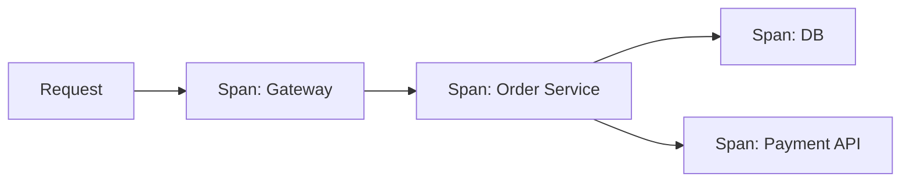
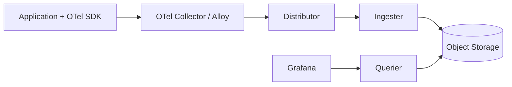

* TOC
{:toc}

# Tempo 정리

## 1) Tempo는 무엇인가

Tempo는 분산 트레이스를 저장/조회하는 백엔드다.
요청 1건이 여러 서비스/DB/외부 API를 거치는 경로를 추적한다.

핵심 질문:

- 어디서 느려졌는가?
- 어떤 호출이 실패를 전파했는가?
- 병목 span이 내부/외부 어디인가?

---

## 2) Trace와 Span

- **Trace**: 하나의 end-to-end 요청 흐름
- **Span**: 흐름 내부의 개별 작업

예:

- Span A: API Gateway
- Span B: Order Service
- Span C: DB Query
- Span D: Payment API

---

## 3) Tempo 아키텍처 개요

일반적으로 Tempo는 object storage(S3/GCS 등)를 장기 저장소로 사용한다.

---

## 4) 트레이싱 도입 핵심

### 4-1. trace context 전파

서비스 간 호출에서 trace context가 유지되어야 전체 흐름이 연결된다.

- HTTP: `traceparent` 헤더
- gRPC: metadata 전파

### 4-2. 로그와 연결

로그에 `trace_id`를 남겨야
Grafana에서 로그→트레이스 점프가 가능하다.

### 4-3. 필수 속성

span/trace에 최소한 아래 속성은 남긴다.

- `service.name`
- `http.method`
- `http.route`
- `http.status_code`
- `db.system`, `db.statement`(주의해서)

---

## 5) 샘플링 전략

트레이스를 100% 저장하면 비용이 빠르게 증가한다.
샘플링 전략이 필요하다.

### 5-1. Head Sampling

요청 시작 시 샘플 여부 결정.

장점: 구현 단순
단점: 장애 트레이스를 놓칠 수 있음

### 5-2. Tail Sampling

요청 종료 후 조건 기반 샘플링.

- 에러는 100%
- 지연 임계치 초과는 100%
- 정상은 일부 비율

실무에선 Tail sampling이 진단 품질이 높다.

---

## 6) Grafana에서 활용 패턴

1. 메트릭에서 p95 상승 감지
2. Tempo에서 느린 trace 조회
3. span waterfall로 병목 구간 확인
4. 해당 trace_id 로그 확인

이 흐름이 정착되면 RCA 시간이 크게 줄어든다.

---

## 7) 자주 하는 실수

1. context 전파 누락
- 트레이스가 조각나서 의미 상실

2. span 과다 생성
- 오버헤드 증가, 분석 난이도 상승

3. 샘플링 정책 없음
- 비용 폭증 또는 진단 불가

4. 서비스명/라우트명 표준 없음
- 검색/집계가 불안정해짐

---

## 8) 도입 체크리스트

- [ ] OpenTelemetry SDK 적용
- [ ] trace context 전파 검증
- [ ] 로그에 trace_id 포함
- [ ] Tail sampling 정책 정의
- [ ] 느린 span 임계치 기준 합의

---

## 9) 참고 레퍼런스

- Tempo Docs: <https://grafana.com/docs/tempo/latest/>
- OpenTelemetry Docs: <https://opentelemetry.io/docs/>
- OTel Semantic Conventions: <https://opentelemetry.io/docs/specs/semconv/>

---

## 10) 정리

Tempo의 가치는 "추적 데이터 저장" 자체가 아니라,
장애 원인을 빠르게 좁히는 데 있다.

핵심은 도구보다 전파/샘플링/로그연결 규칙이다.
