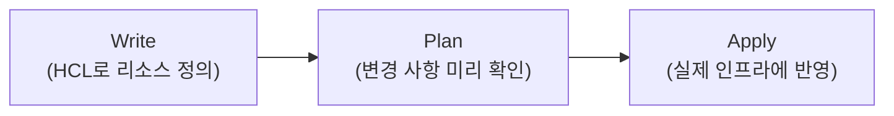
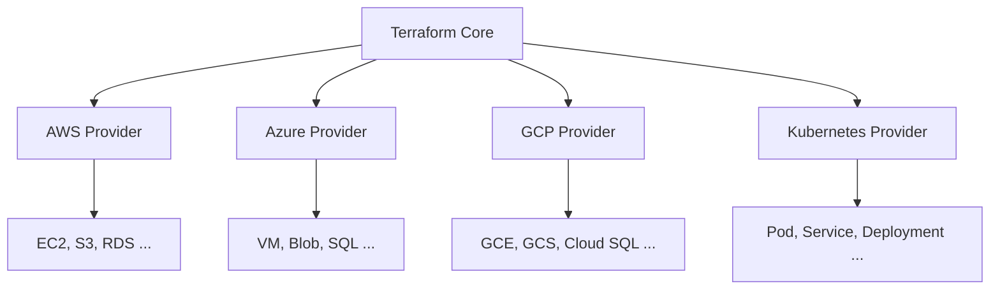
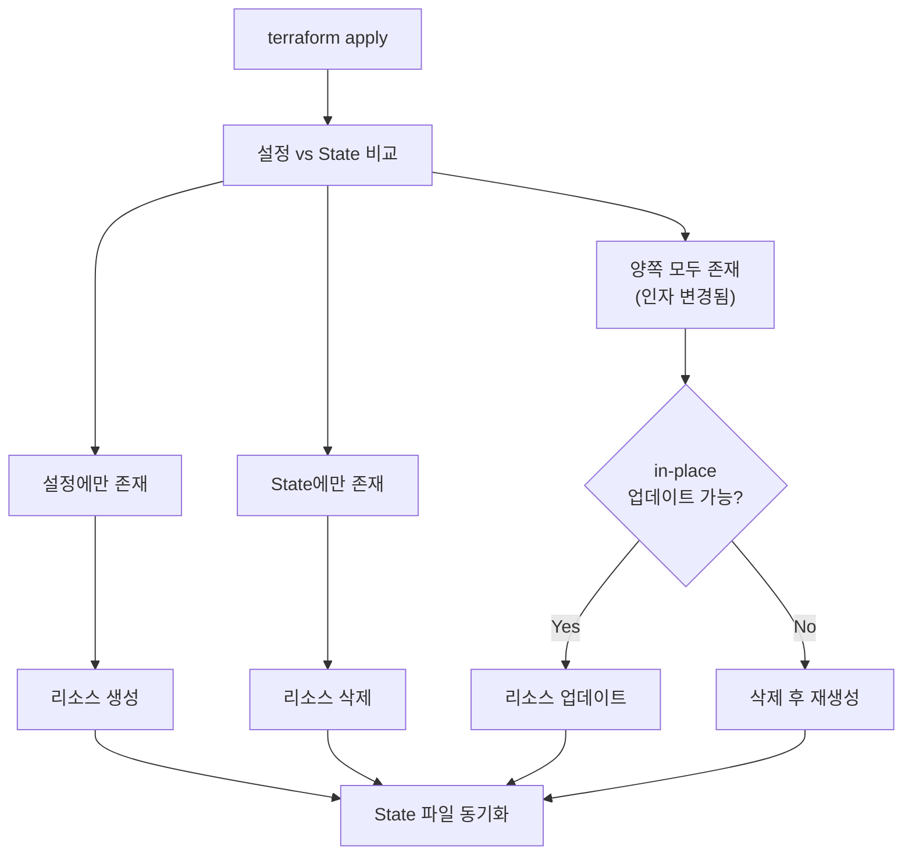
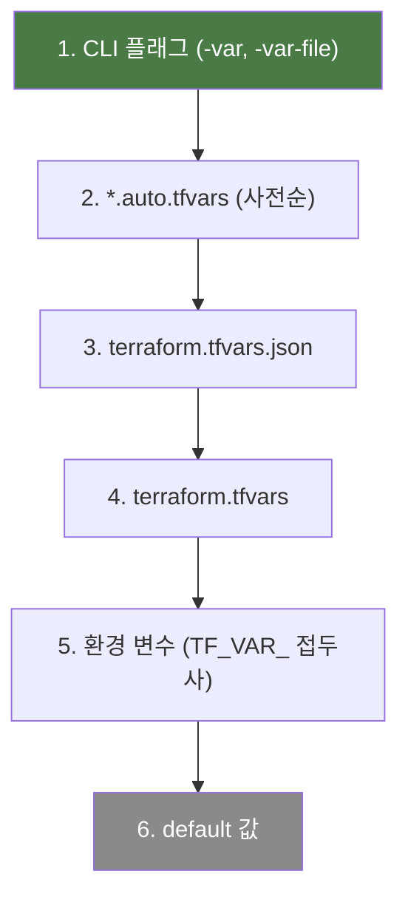
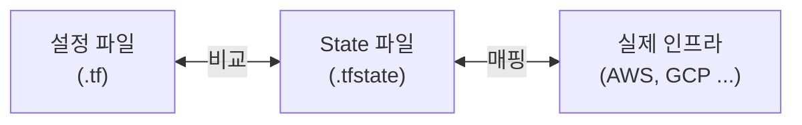
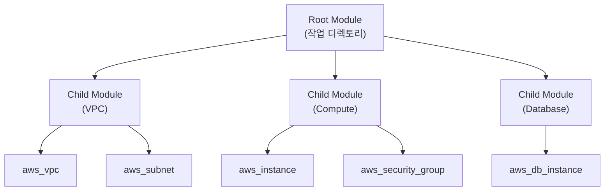
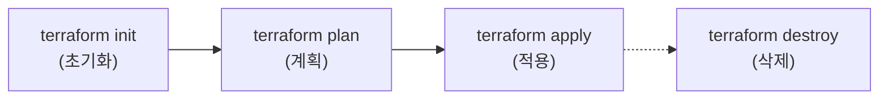
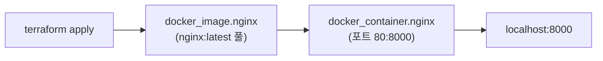
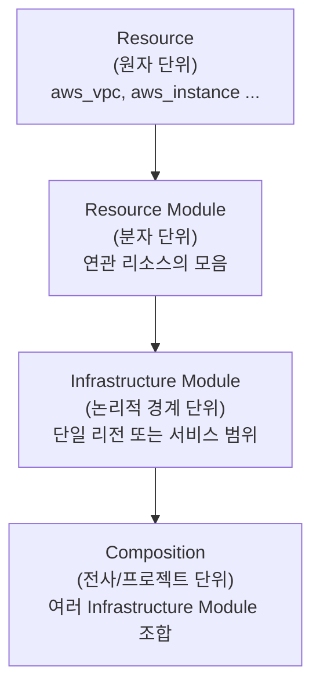
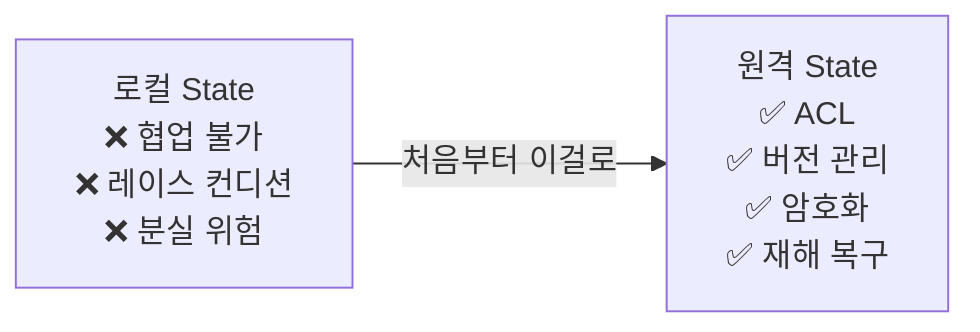

* TOC
{:toc}

# Terraform

이 문서는 HashiCorp Terraform의 핵심 개념부터 실습 튜토리얼까지 한 곳에 정리한 문서다.
공식 문서([Docs](https://developer.hashicorp.com/terraform/docs ), [Tutorials](https://developer.hashicorp.com/terraform/tutorials ))를 기반으로 작성했다.

---

## 1) Terraform이란

Terraform은 인프라를 코드로 정의하고, 버전 관리하며, 안전하게 프로비저닝하는 도구다.

수동으로 클라우드 콘솔을 클릭하는 대신, 선언형 설정 파일로 원하는 상태를 기술하면 Terraform이 실제 인프라를 그 상태에 맞춘다.

### Infrastructure as Code

- 인프라를 소프트웨어처럼 다룬다 - 버전 관리, 코드 리뷰, 재사용
- 수동 프로비저닝 제거로 휴먼 에러 감소
- 팀 간 표준화된 구성 공유 가능

### 핵심 워크플로우



| 단계 | 설명 |
|------|------|
| **Write** | HCL로 리소스를 정의한다 |
| **Plan** | 변경 사항을 미리 확인한다 (`terraform plan`) |
| **Apply** | 승인 후 실제 인프라에 반영한다 (`terraform apply`) |

### 왜 Terraform인가

- **선언형** - 원하는 최종 상태를 기술하면, Terraform이 도달 방법을 알아서 계산한다
- **Provider 생태계** - AWS, Azure, GCP, Kubernetes, GitHub, Datadog 등 수천 개의 Provider 지원
- **State 기반** - 현재 인프라 상태를 추적하여 변경 사항만 정확히 적용
- **모듈화** - 재사용 가능한 모듈로 인프라를 표준화
- **병렬 처리** - 의존성 없는 리소스를 동시에 프로비저닝

---

## 2) HCL (HashiCorp Configuration Language)

Terraform 설정 파일의 언어다. 블록, 인자, 표현식으로 구성된다.

### 기본 문법

```hcl
<BLOCK TYPE> "<BLOCK LABEL>" "<BLOCK LABEL>" {
  <IDENTIFIER> = <EXPRESSION>
}
```

실제 예시:

```hcl
resource "aws_vpc" "main" {
  cidr_block = var.base_cidr_block
}
```

- **블록(Block)** - 설정 객체의 컨테이너. 블록 타입, 레이블, 본문으로 구성
- **인자(Argument)** - 블록 안에서 이름에 값을 할당
- **표현식(Expression)** - 값을 직접 쓰거나 다른 값을 참조/조합

### 핵심 특성

- 선언형이므로 블록/파일의 순서가 중요하지 않다
- Terraform이 리소스 간 암시적/명시적 관계를 파악하여 실행 순서를 결정한다
- 하나의 설정은 여러 파일과 디렉토리로 구성할 수 있다

---

## 3) Provider

Provider는 Terraform이 클라우드/SaaS/API와 통신하기 위한 플러그인이다.
Provider 없이는 어떤 인프라도 관리할 수 없다.



### Provider 설정

```hcl
terraform {
  required_providers {
    aws = {
      source  = "hashicorp/aws"
      version = "~> 5.92"
    }
  }
}

provider "aws" {
  region = "us-west-2"
}
```

- `required_providers` 블록에서 사용할 Provider를 선언한다
- `provider` 블록에서 리전, 인증 등 세부 설정을 한다
- `terraform init` 실행 시 자동으로 다운로드 및 설치된다

### Provider 티어

| 티어 | 설명 |
|------|------|
| **Official** | HashiCorp이 직접 관리 |
| **Partner** | 서드파티 기업이 자체 API에 맞게 작성/검증 |
| **Community** | 개인/그룹 메인테이너가 배포 |

### Dependency Lock File

`terraform init` 시 `.terraform.lock.hcl` 파일이 생성된다.
Provider 버전을 고정하여 팀 전체가 동일한 버전을 사용하도록 보장한다. 반드시 버전 관리에 커밋해야 한다.

---

## 4) Resource

Resource는 Terraform에서 가장 중요한 요소다. 실제로 생성하고 관리할 인프라 객체를 나타낸다.

```hcl
resource "aws_instance" "app_server" {
  ami           = data.aws_ami.ubuntu.id
  instance_type = "t2.micro"

  tags = {
    Name = "learn-terraform"
  }
}
```

### Resource 동작 방식

`terraform apply` 실행 시 Terraform은 다음을 수행한다:



### Resource 주소

`<RESOURCE TYPE>.<NAME>` 형식으로 참조한다.

```hcl
aws_instance.app_server.id
aws_instance.app_server.private_dns
```

---

## 5) Data Source

Data Source는 외부 데이터를 읽어오는 읽기 전용 작업이다. 리소스를 생성하지 않는다.

```hcl
data "aws_ami" "ubuntu" {
  most_recent = true

  filter {
    name   = "name"
    values = ["ubuntu/images/hvm-ssd-gp3/ubuntu-noble-24.04-amd64-server-*"]
  }

  owners = ["099720109477"]  # Canonical
}
```

### 참조 방법

`data.<TYPE>.<LABEL>.<ATTRIBUTE>` 형식으로 참조한다.

```hcl
resource "aws_instance" "app_server" {
  ami = data.aws_ami.ubuntu.id
}
```

### 동작 시점

- Plan 단계에서 쿼리를 시도한다
- 인자가 아직 생성되지 않은 리소스에 의존하면 Apply 단계로 지연된다

---

## 6) Variable (입력 변수)

설정을 파라미터화하여 재사용성을 높인다.

### 선언

```hcl
variable "instance_name" {
  description = "EC2 인스턴스의 Name 태그 값"
  type        = string
  default     = "learn-terraform"
}

variable "instance_type" {
  description = "EC2 인스턴스 타입"
  type        = string
  default     = "t2.micro"
}
```

### 사용

`var.<NAME>` 으로 참조한다.

```hcl
resource "aws_instance" "app_server" {
  instance_type = var.instance_type

  tags = {
    Name = var.instance_name
  }
}
```

### 주요 속성

| 속성 | 설명 |
|------|------|
| `type` | 변수 타입 (string, number, bool, list, map, object 등) |
| `description` | 변수 설명 |
| `default` | 기본값 |
| `sensitive` | `true`면 CLI 출력에서 마스킹 |
| `validation` | 커스텀 유효성 검사 규칙 |

### 값 할당 우선순위 (높은 순)



1. CLI 플래그 (`-var`, `-var-file`)
2. `*.auto.tfvars` 파일 (사전순)
3. `terraform.tfvars.json`
4. `terraform.tfvars`
5. 환경 변수 (`TF_VAR_` 접두사)
6. `default` 값

---

## 7) Output (출력 값)

인프라의 속성을 외부로 노출한다.

```hcl
output "instance_hostname" {
  description = "EC2 인스턴스의 Private DNS"
  value       = aws_instance.app_server.private_dns
}
```

### 용도

- CLI에서 `terraform output` 으로 확인
- 자식 모듈의 속성을 부모 모듈에 노출
- 다른 Terraform 설정에서 `terraform_remote_state` 데이터 소스로 참조
- 외부 자동화 도구에 정보 전달

### 자식 모듈 출력 참조

```hcl
module.<CHILD_MODULE_NAME>.<OUTPUT_NAME>
```

---

## 8) State

Terraform은 관리 중인 인프라의 상태를 State 파일에 저장한다.
설정 파일의 리소스와 실제 인프라 객체 간의 매핑을 추적한다.



### 핵심 역할

- 설정의 리소스 인스턴스와 실제 원격 객체 간 **바인딩** 저장
- 메타데이터 추적 (의존성 정보 등)
- 대규모 인프라에서 **성능 최적화** (캐싱)

### 저장 위치

- 기본값: 로컬 파일 `terraform.tfstate`
- 팀 환경에서는 HCP Terraform 등 원격 백엔드를 사용하여 버전 관리, 암호화, 공유

### State 관리 명령어

| 명령어 | 설명 |
|--------|------|
| `terraform state list` | 관리 중인 리소스 목록 |
| `terraform state show <addr>` | 특정 리소스의 상세 상태 |
| `terraform state rm <addr>` | State에서 리소스 제거 (실제 인프라는 유지) |
| `terraform import <addr> <id>` | 기존 인프라를 State에 추가 |

> State 파일은 JSON 형식이지만 직접 편집하지 말 것. 반드시 CLI 명령어를 사용한다.

---

## 9) Module

Module은 함께 관리되는 리소스들의 모음이다. 인프라를 표준화하고 재사용할 수 있게 한다.

### Root Module vs Child Module



- **Root Module** - 작업 디렉토리의 `.tf` 파일들. 모든 Terraform 워크스페이스가 가진다.
- **Child Module** - `module` 블록으로 호출되는 외부 모듈

### Module 사용

```hcl
module "vpc" {
  source  = "terraform-aws-modules/vpc/aws"
  version = "5.19.0"

  name = "my-vpc"
  cidr = "10.0.0.0/16"

  azs             = ["us-west-2a", "us-west-2b"]
  private_subnets = ["10.0.1.0/24", "10.0.2.0/24"]
  public_subnets  = ["10.0.101.0/24", "10.0.102.0/24"]
}
```

### Module 소스

| 소스 | 예시 |
|------|------|
| Terraform Registry | `"terraform-aws-modules/vpc/aws"` |
| 로컬 경로 | `"./modules/vpc"` |
| GitHub | `"github.com/hashicorp/example"` |
| S3 | `"s3::https://s3.amazonaws.com/bucket/module.zip"` |

### Module 워크플로우

1. **Develop** - 리소스를 모듈 구조로 설계
2. **Distribute** - Registry에 배포하거나 VCS로 공유
3. **Provision** - `module` 블록으로 호출하여 사용

---

## 10) CLI 주요 명령어



### terraform init

작업 디렉토리를 초기화한다. **새 설정을 작성하거나 클론한 후 가장 먼저 실행해야 하는 명령어.**

수행하는 작업:
1. **백엔드 초기화** - State 저장소 설정
2. **모듈 설치** - `module` 블록의 소스 코드 다운로드
3. **Provider 설치** - 필요한 Provider 플러그인 다운로드, Lock 파일 생성

```bash
terraform init
terraform init -upgrade    # 모듈/Provider를 최신 버전으로 업그레이드
```

### terraform plan

실행 계획을 생성한다. **실제 변경을 수행하지 않는다.**

```bash
terraform plan                 # 기본 - 변경 사항 미리보기
terraform plan -destroy        # 삭제 계획 미리보기
terraform plan -out=tfplan     # 계획을 파일로 저장 (자동화 시 권장)
terraform plan -var 'key=val'  # 변수를 지정하며 계획
```

**계획 모드:**

| 모드 | 설명 |
|------|------|
| Normal (기본) | 설정에 맞게 인프라 변경 |
| Destroy (`-destroy`) | 모든 리소스 삭제 계획 |
| Refresh-only (`-refresh-only`) | State만 실제 인프라에 동기화 |

### terraform apply

Plan의 변경 사항을 실제로 적용한다.

```bash
terraform apply              # 계획 생성 -> 승인 -> 적용
terraform apply tfplan       # 저장된 계획 파일로 적용 (승인 없이)
terraform apply -auto-approve  # 승인 없이 바로 적용 (주의)
```

### terraform destroy

관리 중인 모든 리소스를 삭제한다. `terraform apply -destroy`의 단축 명령.

```bash
terraform destroy                          # 전체 삭제
terraform destroy -target aws_instance.app # 특정 리소스만 삭제
```

### 기타 유용한 명령어

```bash
terraform fmt        # 설정 파일 포맷팅
terraform validate   # 문법 검증
terraform output     # 출력 값 확인
terraform show       # 현재 State 상세 출력
```

---

## 11) 튜토리얼: AWS 인프라 구축

공식 AWS Get Started 튜토리얼을 기반으로 정리한다.

### Step 1 - Terraform 설치

**macOS (Homebrew):**

```bash
brew tap hashicorp/tap
brew install hashicorp/tap/terraform
```

**Ubuntu/Debian:**

```bash
wget -O- https://apt.releases.hashicorp.com/gpg | sudo gpg --dearmor -o /usr/share/keyrings/hashicorp-archive-keyring.gpg
echo "deb [signed-by=/usr/share/keyrings/hashicorp-archive-keyring.gpg] https://apt.releases.hashicorp.com $(lsb_release -cs) main" | sudo tee /etc/apt/sources.list.d/hashicorp.list
sudo apt update && sudo apt install terraform
```

설치 확인:

```bash
terraform -help
terraform -install-autocomplete  # 탭 자동완성 설정
```

### Step 2 - 프로젝트 구성

```bash
mkdir learn-terraform-aws && cd learn-terraform-aws
```

**terraform.tf** - Terraform과 Provider 버전을 선언한다:

```hcl
terraform {
  required_providers {
    aws = {
      source  = "hashicorp/aws"
      version = "~> 5.92"
    }
  }
  required_version = ">= 1.2"
}
```

**main.tf** - Provider 설정과 리소스를 정의한다:

```hcl
provider "aws" {
  region = "us-west-2"
}

data "aws_ami" "ubuntu" {
  most_recent = true

  filter {
    name   = "name"
    values = ["ubuntu/images/hvm-ssd-gp3/ubuntu-noble-24.04-amd64-server-*"]
  }

  owners = ["099720109477"]  # Canonical
}

resource "aws_instance" "app_server" {
  ami           = data.aws_ami.ubuntu.id
  instance_type = var.instance_type

  tags = {
    Name = var.instance_name
  }
}
```

**variables.tf** - 입력 변수를 분리한다:

```hcl
variable "instance_name" {
  description = "EC2 인스턴스의 Name 태그 값"
  type        = string
  default     = "learn-terraform"
}

variable "instance_type" {
  description = "EC2 인스턴스 타입"
  type        = string
  default     = "t2.micro"
}
```

**outputs.tf** - 출력 값을 정의한다:

```hcl
output "instance_hostname" {
  description = "EC2 인스턴스의 Private DNS"
  value       = aws_instance.app_server.private_dns
}
```

### Step 3 - 인프라 생성

```bash
# AWS 인증 설정
export AWS_ACCESS_KEY_ID="YOUR_ACCESS_KEY"
export AWS_SECRET_ACCESS_KEY="YOUR_SECRET_KEY"

# 초기화 - Provider 다운로드
terraform init

# 포맷팅 및 검증
terraform fmt
terraform validate

# 실행 계획 확인
terraform plan

# 인프라 생성 (yes 입력으로 승인)
terraform apply
```

Apply 실행 시 `+` 기호로 생성될 리소스를 보여준다:

```
  # aws_instance.app_server will be created
  + resource "aws_instance" "app_server" {
      + ami           = "ami-0c55b159cbfafe1f0"
      + instance_type = "t2.micro"
      + tags          = {
          + "Name" = "learn-terraform"
        }
      ...
    }

Plan: 1 to add, 0 to change, 0 to destroy.
```

### Step 4 - 인프라 변경

변수를 통해 인스턴스 타입을 변경할 수 있다:

```bash
terraform plan -var instance_type=t2.large
```

또는 `variables.tf`의 `default` 값을 수정한 뒤:

```bash
terraform apply
```

Terraform은 변경 가능한 속성은 in-place 업데이트하고, 불가능한 속성(예: AMI 변경)은 삭제 후 재생성한다.

### Step 5 - 상태 확인

```bash
terraform state list    # 관리 중인 리소스 목록
terraform state show aws_instance.app_server  # 상세 정보
terraform output        # 출력 값 확인
terraform show          # 전체 State 출력
```

### Step 6 - 인프라 삭제

**특정 리소스만 삭제** - 설정 파일에서 해당 리소스 블록을 제거한 뒤:

```bash
terraform apply
```

**전체 삭제:**

```bash
terraform destroy
```

리소스는 의존성의 역순으로 삭제된다.

---

## 12) 모듈 활용 튜토리얼

### Registry 모듈 사용

공개 Registry의 VPC 모듈로 네트워크를 구성하는 예시:

```hcl
module "vpc" {
  source  = "terraform-aws-modules/vpc/aws"
  version = "5.19.0"

  name = "my-vpc"
  cidr = "10.0.0.0/16"

  azs             = ["us-west-2a", "us-west-2b"]
  private_subnets = ["10.0.1.0/24", "10.0.2.0/24"]
  public_subnets  = ["10.0.101.0/24", "10.0.102.0/24"]

  enable_nat_gateway = true
}
```

모듈 추가 후 반드시 `terraform init` 을 다시 실행해야 한다.

### 로컬 모듈 작성

디렉토리 구조:

```
.
├── main.tf
├── modules/
│   └── s3-static-website/
│       ├── main.tf
│       ├── variables.tf
│       └── outputs.tf
```

로컬 모듈 호출:

```hcl
module "website" {
  source = "./modules/s3-static-website"

  bucket_name = "my-static-site"
}
```

### 모듈 리팩토링

기존 리소스를 모듈로 이동할 때 `moved` 블록을 사용하면 삭제/재생성 없이 State를 업데이트할 수 있다:

```hcl
moved {
  from = aws_instance.app_server
  to   = module.compute.aws_instance.app_server
}
```

---

## 13) 튜토리얼: Docker 컨테이너 관리

AWS 계정 없이 로컬에서 바로 실습할 수 있는 Docker 튜토리얼이다.
공식 [Docker Get Started](https://developer.hashicorp.com/terraform/tutorials/docker-get-started ) 튜토리얼을 기반으로 정리한다.

### 사전 준비

- Terraform CLI (0.15+)
- Docker 설치 및 실행 중

### Step 1 - 프로젝트 생성

```bash
mkdir learn-terraform-docker-container
cd learn-terraform-docker-container
```

### Step 2 - 설정 파일 작성

**main.tf:**

```hcl
terraform {
  required_providers {
    docker = {
      source  = "kreuzwerker/docker"
      version = "~> 3.0.1"
    }
  }
}

provider "docker" {}

resource "docker_image" "nginx" {
  name         = "nginx:latest"
  keep_locally = false
}

resource "docker_container" "nginx" {
  image = docker_image.nginx.image_id
  name  = var.container_name

  ports {
    internal = 80
    external = 8000
  }
}
```

> Windows의 경우 provider 블록에 `host = "npipe:////.//pipe//docker_engine"` 을 추가한다.

**variables.tf:**

```hcl
variable "container_name" {
  description = "Docker 컨테이너 이름"
  type        = string
  default     = "tutorial"
}
```

**outputs.tf:**

```hcl
output "container_id" {
  description = "Docker 컨테이너 ID"
  value       = docker_container.nginx.id
}

output "image_id" {
  description = "Docker 이미지 ID"
  value       = docker_image.nginx.id
}
```

### Step 3 - 컨테이너 생성

```bash
terraform init
terraform fmt
terraform validate
terraform apply
```

완료 후 `localhost:8000` 으로 접속하면 Nginx 기본 페이지가 보인다.



### Step 4 - 상태 확인

```bash
terraform state list
# docker_container.nginx
# docker_image.nginx

terraform show           # 전체 State 상세 출력
terraform output         # 출력 값 확인
```

### Step 5 - 인프라 변경

포트를 8000에서 8080으로 변경한다. `main.tf`에서:

```hcl
ports {
  internal = 80
  external = 8080
}
```

```bash
terraform apply
```

Docker는 실행 중인 컨테이너의 포트를 변경할 수 없으므로, Terraform은 기존 컨테이너를 **삭제 후 재생성**한다.
실행 계획에서 `-/+` 접두사와 `# forces replacement` 표시로 확인할 수 있다.

변수로도 변경할 수 있다:

```bash
terraform apply -var "container_name=my-nginx"
```

### Step 6 - 인프라 삭제

```bash
terraform destroy
```

Terraform이 의존성 순서대로 리소스를 삭제한다:

```
docker_container.nginx: Destroying...
docker_container.nginx: Destruction complete after 2s
docker_image.nginx: Destroying...
docker_image.nginx: Destruction complete after 0s

Destroy complete! Resources: 2 destroyed.
```

### Docker 튜토리얼 최종 파일 구조

```
learn-terraform-docker-container/
├── main.tf          # Provider + docker_image + docker_container
├── variables.tf     # container_name 변수
└── outputs.tf       # container_id, image_id 출력
```

---

## 14) 파일 구조 권장 패턴

```
project/
├── versions.tf       # Terraform 및 Provider 버전 요구사항
├── main.tf           # 리소스, 모듈, 데이터 소스 호출
├── variables.tf      # 입력 변수 선언
├── outputs.tf        # 출력 값
├── terraform.tfvars  # 변수 값 (gitignore 권장)
└── modules/          # 로컬 모듈
    └── <module>/
        ├── main.tf
        ├── variables.tf
        └── outputs.tf
```

- `versions.tf` 에 `required_providers`, `required_version`, `backend` 설정을 분리한다
- `main.tf` 는 리소스를 직접 정의하기보다 모듈과 데이터 소스를 **호출하는** 역할에 집중한다

---

## 15) 인프라 계층 구조

인프라를 설계할 때 다음 4개 계층으로 사고하면 모듈 경계가 명확해진다.



| 계층 | 설명 | 예시 |
|------|------|------|
| **Resource** | 개별 클라우드 오브젝트 | `aws_vpc`, `aws_db_instance` |
| **Resource Module** | 공동 목적을 달성하는 리소스 묶음 | VPC + Subnet + NAT Gateway |
| **Infrastructure Module** | 논리적 경계 안의 Resource Module 집합 | 특정 서비스의 전체 인프라 |
| **Composition** | 여러 경계에 걸친 Infrastructure Module 조합 | 전사 인프라, 멀티 리전 |

> **핵심**: Resource를 원자로, Resource Module을 분자로 보는 사고방식. Module은 버전이 붙은 재사용 단위가 된다.

---

## 16) 네이밍 컨벤션

일관된 이름 규칙은 코드를 읽을 때 인지 부담을 줄인다.

### 기본 규칙

- 모든 Terraform 식별자에는 **언더스코어(`_`)** 를 사용한다 — 대시(`-`)는 DNS나 태그처럼 외부에 노출되는 값에 예약
- 소문자와 숫자만 사용한다
- 리소스 이름에 **리소스 타입을 반복하지 않는다**
- 모듈 안에 해당 타입의 리소스가 하나뿐이고 적절한 이름이 없을 때만 `this` 를 사용한다
- 긍정형 이름을 사용한다: `encryption_disabled` 대신 `encryption_enabled`

```hcl
# 나쁜 예
resource "aws_security_group" "aws_security_group_web" { ... }  # 타입 반복
resource "aws_vpc" "main-vpc" { ... }                           # 대시 사용

# 좋은 예
resource "aws_security_group" "web" { ... }
resource "aws_vpc" "main" { ... }
```

### 인자 순서

블록 안에서 인자를 아래 순서로 작성한다:

```hcl
resource "aws_instance" "app" {
  count = 2                     # 1. count / for_each

  ami           = "ami-xxx"     # 2. 핵심 인자
  instance_type = "t3.micro"

  tags = { Name = "app" }      # 3. tags

  depends_on = [...]            # 4. depends_on (빈 줄 구분)

  lifecycle {                   # 5. lifecycle (빈 줄 구분)
    ignore_changes = [tags]
  }
}
```

### 변수 네이밍

```hcl
variable "vpc_cidr_blocks" {   # list/map 타입은 복수형
  description = "VPC CIDR 블록 목록"
  type        = list(string)
  default     = []
  nullable    = false           # null을 허용하지 않을 때 명시
}
```

- `description`, `type`, `default`, `validation` 순서로 작성한다
- `nullable = false` 를 통해 null 허용 여부를 명시한다
- 복잡한 객체 타입보다 단순 타입을 선호한다

### 출력 네이밍

패턴: `{name}_{type}_{attribute}`

```hcl
output "security_group_id" {       # aws_security_group 의 id
  description = "웹 보안 그룹 ID"
  value       = aws_security_group.web.id
}

output "db_instance_address" {     # aws_db_instance 의 address
  description = "RDS 인스턴스 엔드포인트"
  value       = try(aws_db_instance.main.address, "")  # try()로 안전하게 접근
}
```

- 항상 `description` 을 포함한다
- 리소스가 하나일 때 `this` 는 출력 이름에서 생략한다
- `try()` 함수로 아직 존재하지 않는 속성에 안전하게 접근한다
- 리스트를 반환할 때는 복수형을 쓴다

---

## 17) 코드 스타일

### 포맷팅

```bash
terraform fmt          # 코드 자동 포맷팅
terraform fmt -check   # CI에서 포맷 검사 (수정 없이 검증만)
```

Terraform 공식 스타일은 `terraform fmt` 가 강제한다. 설정 불가. PR 전에 반드시 실행.

### .editorconfig

루트에 `.editorconfig` 를 추가해 에디터 간 일관성을 유지한다:

```ini
root = true

[*]
indent_style = space
indent_size = 2
trim_trailing_whitespace = true
end_of_line = lf
charset = utf-8
insert_final_newline = true

[Makefile]
indent_style = tab
```

### 주석

```hcl
# 이 방식만 사용한다
# // 이나 /* */ 는 쓰지 않는다

# ──────────────────────────────────────────
# 섹션 구분선으로 큰 모듈을 시각적으로 나눌 수 있다
# ──────────────────────────────────────────
```

- `#` 만 사용한다
- 주석은 "무엇"이 아닌 **"왜"** 를 설명한다

### terraform-docs

모듈의 변수/출력을 자동으로 README 문서로 생성한다:

```bash
terraform-docs markdown . > README.md
```

pre-commit 훅과 연동해 코드 변경 시 문서를 자동 동기화할 수 있다.

---

## 18) State 관리 모범 사례

State에 관한 가장 중요한 규칙들이다.



- `terraform.tfstate` 는 **절대 Git에 커밋하지 않는다**
- 원격 백엔드(HCP Terraform, S3+DynamoDB 등)를 **처음부터** 사용한다
- 여러 개발자가 동시에 `terraform apply` 를 실행하면 State 충돌이 생긴다 — 원격 백엔드의 State locking이 이를 방지한다
- `terraform_remote_state` 데이터 소스로 다른 State의 output을 읽어올 수 있다

### .gitignore 필수 항목

```gitignore
.terraform/
terraform.tfstate
terraform.tfstate.backup
*.tfvars          # 민감한 변수 값
.terraform.lock.hcl  # 선택 (팀 공유 시에는 커밋)
```

---

## 19) 추천 도구

| 도구 | 용도 |
|------|------|
| **[tflint](https://github.com/terraform-linters/tflint)** | Terraform 린터. 에러, 사용 중단 문법, 모범 사례 검사 |
| **[pre-commit-terraform](https://github.com/antonbabenko/pre-commit-terraform)** | Git pre-commit 훅 모음. `fmt`, `validate`, `tflint`, `docs` 자동화 |
| **[Atlantis](https://www.runatlantis.io/)** | PR 기반 Terraform 워크플로우. PR에 `terraform plan` 결과를 댓글로 |
| **[Infracost](https://www.infracost.io/)** | PR마다 인프라 비용 변화 예측 |
| **[Terragrunt](https://terragrunt.gruntwork.io/)** | Terraform 래퍼. DRY 설정, 원격 State 관리, 다중 모듈 orchestration |
| **[tfenv](https://github.com/tfutils/tfenv)** | Terraform 버전 관리 |

### pre-commit 예시

```yaml
# .pre-commit-config.yaml
repos:
  - repo: https://github.com/antonbabenko/pre-commit-terraform
    rev: v1.96.1
    hooks:
      - id: terraform_fmt
      - id: terraform_validate
      - id: terraform_tflint
      - id: terraform_docs
```

---

## 참고

- [Terraform Documentation](https://developer.hashicorp.com/terraform/docs )
- [Terraform Tutorials](https://developer.hashicorp.com/terraform/tutorials )
- [Terraform Registry](https://registry.terraform.io/ )
- [AWS Provider Documentation](https://registry.terraform.io/providers/hashicorp/aws/latest/docs )
- [Docker Get Started Tutorial](https://developer.hashicorp.com/terraform/tutorials/docker-get-started )
