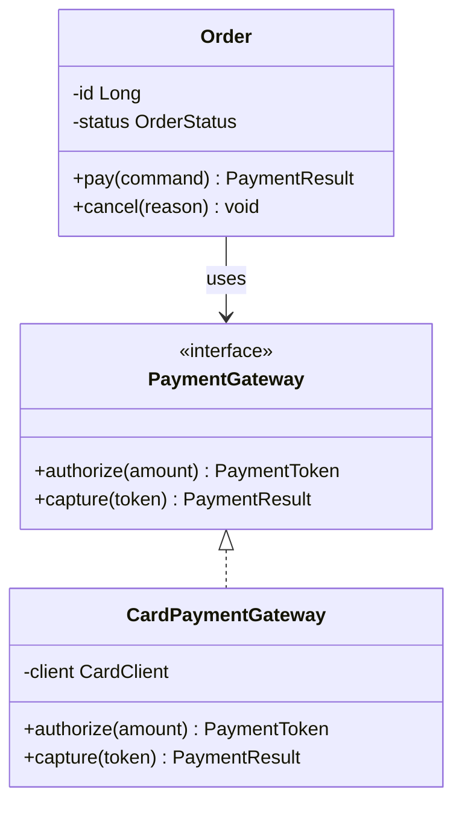
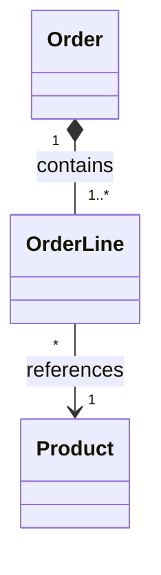
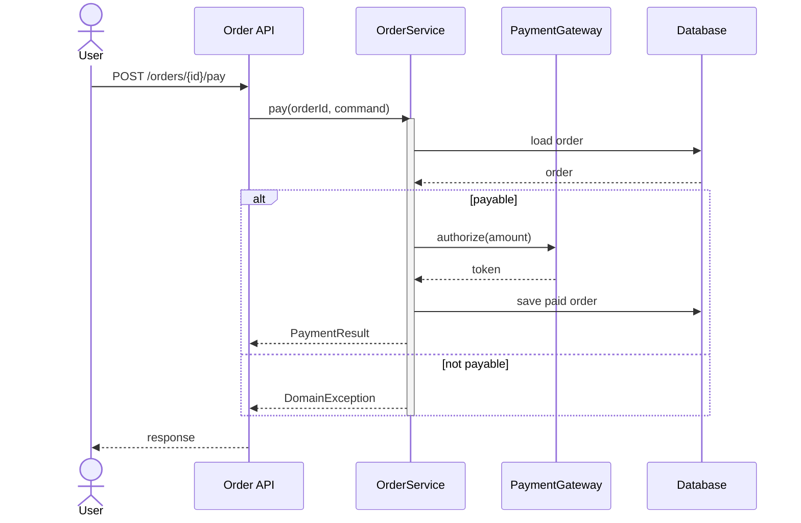
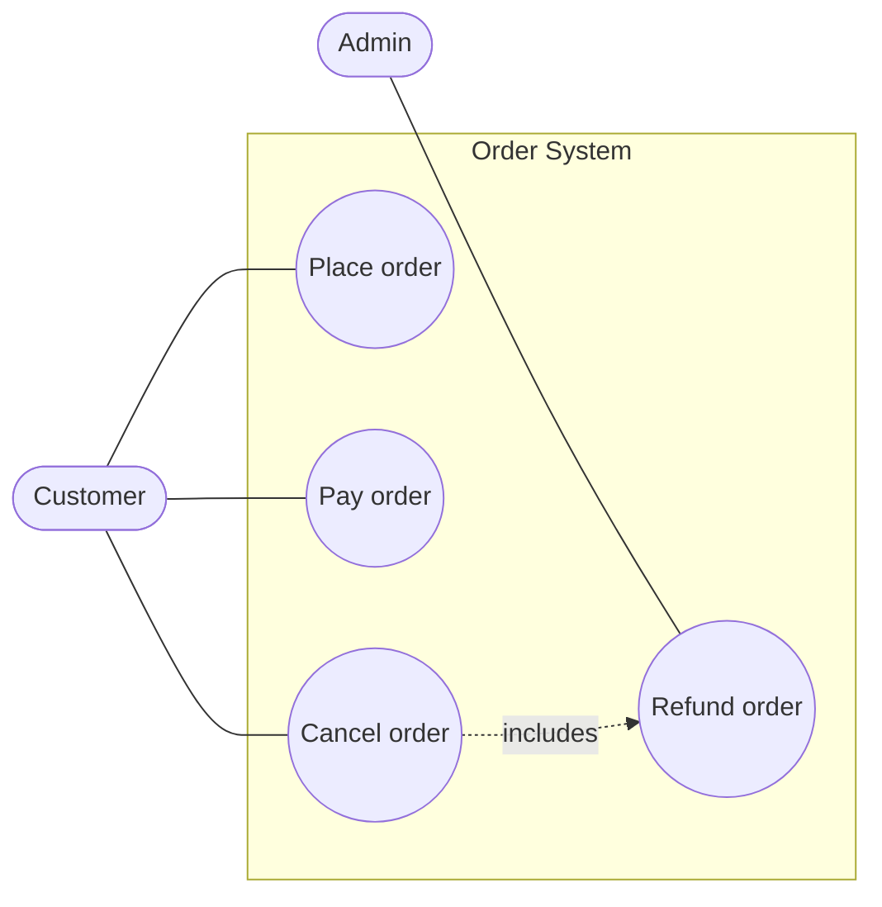
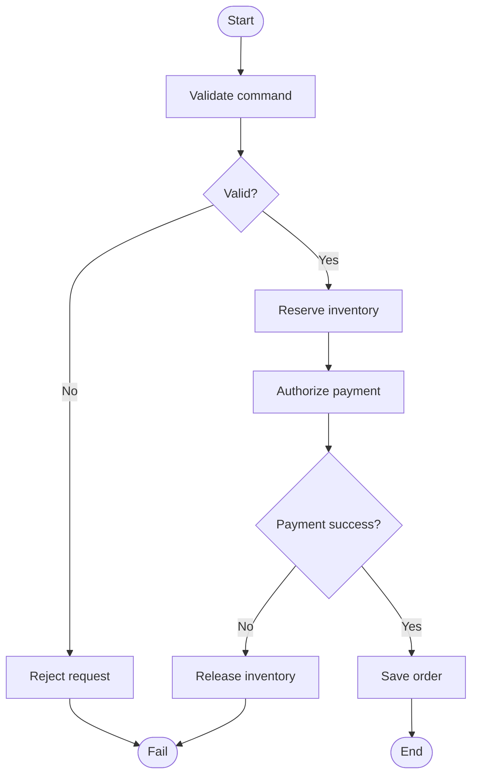
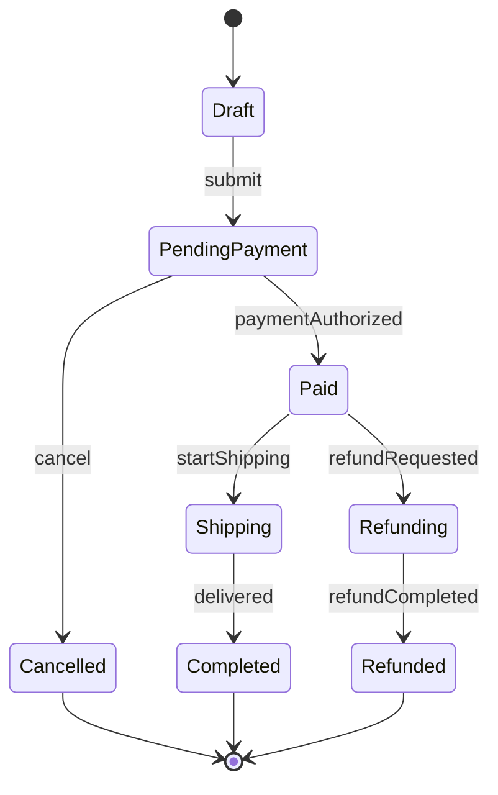
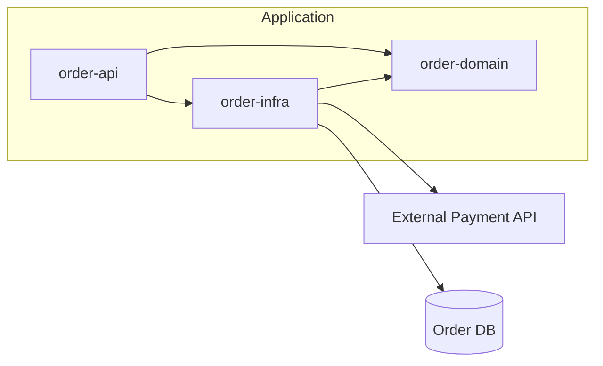
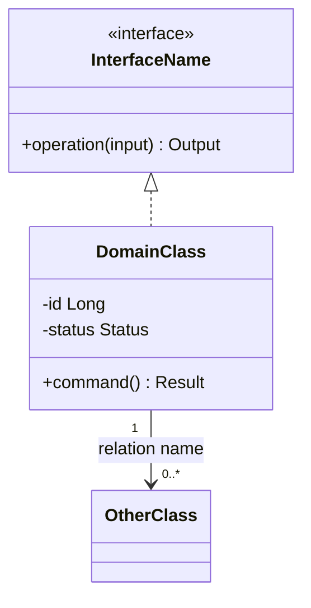
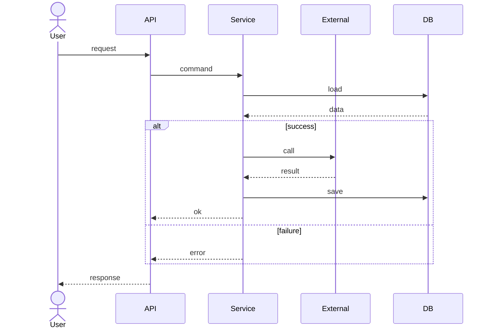

* TOC
{:toc}

# UML 다이어그램(Unified Modeling Language Diagram)

UML(Unified Modeling Language)은 소프트웨어 구조와 동작을 시각적으로 표현하기 위한 표준 모델링 언어다. 코드를 대체하는 문서가 아니라, 구현 전에 비용을 낮게 들여 설계를 검토하고 이해관계자와 같은 그림을 보기 위한 도구다.

다이어그램을 그릴 때는 모든 클래스를 넣는 것보다 **전달하려는 질문 하나**를 먼저 정한다.

- 이 객체들이 어떤 정적 관계를 갖는가?
- 이 요청은 어떤 순서로 흘러가는가?
- 사용자는 시스템과 어떤 목표 단위로 상호작용하는가?
- 특정 상태는 어떤 이벤트로 전이되는가?
- 배포 단위와 의존성은 어디서 끊기는가?

## 다이어그램 선택 기준

| 질문 | 우선 다이어그램 | 언제 쓰는가 |
|---|---|---|
| 도메인 객체, 인터페이스, 상속·구현·소유 관계를 보고 싶은가? | 클래스 다이어그램 | 설계 리뷰, 리팩터링 전 구조 파악, 핵심 도메인 모델 설명 |
| 런타임에 메시지가 어떤 순서로 오가는가? | 시퀀스 다이어그램 | API 요청 흐름, 트랜잭션 경계, 외부 시스템 연동, 예외 흐름 설명 |
| 사용자가 시스템으로 달성하는 목표가 무엇인가? | 유스케이스 다이어그램 | 요구사항 범위, actor와 시스템 경계 합의 |
| 한 프로세스가 조건·분기·병렬 흐름을 갖는가? | 액티비티 다이어그램 | 업무 흐름, 배치/승인 플로우, 알고리즘 절차 설명 |
| 객체나 주문 같은 엔티티가 상태를 바꾸는가? | 상태 다이어그램 | 주문, 결제, 계정, 배포 같은 lifecycle 모델링 |
| 모듈·서비스·패키지 간 의존성을 보고 싶은가? | 컴포넌트/패키지 다이어그램 | 아키텍처 경계, 모듈 분리, 배포 전 의존성 검토 |
| DB 테이블과 관계가 핵심인가? | [[ERD]] | 데이터 모델링, cardinality, key 관계 설명 |

## 공통 원칙

### 메시지 하나만 남긴다

UML은 실제 시스템 전체를 복사하는 그림이 아니다. 너무 많은 노드와 선이 들어가면 정확해 보여도 읽히지 않는다. 다이어그램 제목이 곧 의도여야 한다.

좋은 제목은 `주문 생성 시 재고 예약 흐름`, `결제 수단 도메인 모델`, `알림 모듈 의존성`처럼 질문을 좁힌다. 나쁜 제목은 `전체 시스템 구조`, `서비스 클래스 다이어그램`처럼 범위가 크고 검증할 수 없다.

### 표기보다 의미를 우선한다

UML 표기법은 정확할수록 좋지만, 팀이 읽지 못하면 실패한 그림이다. 공식 표기와 Mermaid/PlantUML 문법이 조금 다를 수 있으므로 공개 위키나 설계 문서에서는 범례를 함께 둔다.

### 구현 상세는 필요할 때만 노출한다

클래스 다이어그램에 모든 필드와 메서드를 넣으면 코드 목록이 된다. 설계 의도를 전달하는 데 필요한 책임, 주요 속성, public operation, 관계만 남긴다. private helper나 단순 getter/setter는 보통 생략한다.

## 클래스 다이어그램

클래스 다이어그램은 시스템의 정적 구조를 보여준다. [[oop]]{객체 지향 설계}에서 클래스, 인터페이스, 추상 클래스, enum, 관계를 한 장으로 설명할 때 가장 자주 쓴다.

### 클래스 표기

클래스는 보통 세 영역으로 나뉜다.

| 영역 | 내용 | 예시 |
|---|---|---|
| 이름 | 클래스/인터페이스/enum 이름, stereotype | `Order`, `<<interface>> PaymentGateway` |
| 속성 | 필드, 주요 상태 | `-status OrderStatus` |
| 오퍼레이션 | public method, 핵심 책임 | `+pay(command) PaymentResult` |

접근 제어자는 다음 기호를 사용한다.

| 기호 | 의미 |
|---|---|
| `+` | public |
| `-` | private |
| `#` | protected |
| `~` | package/internal |

Mermaid에서는 메서드 끝에 `*`를 붙여 abstract, `$`를 붙여 static을 표현할 수 있다.

### 클래스 관계 표기

| 관계 | 의미 | UML/Mermaid 표기 | 판단 기준 |
|---|---|---|---|
| 일반화(Generalization) | 상속, `is-a` | `&lt;&#124;--` | 하위 타입이 상위 타입으로 대체 가능한가? |
| 실체화(Realization) | 인터페이스 구현 | `&lt;&#124;..` | 클래스가 interface contract를 구현하는가? |
| 연관(Association) | 지속적인 참조 관계 | `-->` 또는 `--` | 필드로 들고 있거나 장기적으로 협력하는가? |
| 의존(Dependency) | 일시적 사용 | `..>` | 파라미터, 지역 변수, static call처럼 잠깐 쓰는가? |
| 집합(Aggregation) | 약한 전체-부분 | `o--` | 전체가 없어도 부분이 독립적으로 존재하는가? |
| 합성(Composition) | 강한 전체-부분 | `*--` | 전체가 사라지면 부분 lifecycle도 끝나는가? |

합성과 집합은 남용하기 쉽다. 도메인에서 lifecycle 소유권을 말할 수 있을 때만 쓴다. 단순히 필드에 컬렉션이 있다는 이유만으로 `*--`를 쓰지 않는다.

### Multiplicity

관계 양 끝에는 개수를 붙일 수 있다.

| 표기 | 의미 |
|---|---|
| `1` | 정확히 하나 |
| `0..1` | 없거나 하나 |
| `*` | 여러 개 |
| `1..*` | 하나 이상 |
| `0..*` | 없거나 여러 개 |

### 클래스 다이어그램 체크리스트

- 핵심 도메인 개념이 이름으로 드러나는가?
- 상속은 `is-a`, 합성은 lifecycle 소유권이 있을 때만 사용했는가?
- 관계 이름이 없으면 오해가 생기는 선에 label을 붙였는가?
- cardinality가 중요한 관계에는 `1`, `0..1`, `1..*`를 표시했는가?
- getter/setter, private helper, 단순 DTO 필드를 과하게 노출하지 않았는가?

## 시퀀스 다이어그램

시퀀스 다이어그램은 시간 순서에 따른 메시지 교환을 보여준다. 구조보다 **순서, 호출 방향, 책임 분배, 트랜잭션 경계**를 설명할 때 사용한다.

### 기본 구성

| 요소 | 의미 |
|---|---|
| participant/actor | 흐름에 참여하는 사람, 객체, 서비스, DB |
| lifeline | participant의 시간축 |
| activation | 해당 participant가 작업 중인 구간 |
| message | 동기/비동기 호출, 응답, self-call |
| combined fragment | `alt`, `opt`, `loop`, `par` 같은 조건·반복·병렬 구간 |

### 화살표 기준

| 표기 | 의미 | 사용 기준 |
|---|---|---|
| `->>` | 동기 호출 | 호출자가 응답을 기다리는 일반 API/method call |
| `-->>` | 응답 | return, callback 결과 |
| `-)` | 비동기 메시지 | 이벤트 발행, queue 전송처럼 즉시 응답을 기다리지 않음 |
| `->>+` / `-->>-` | activation 시작/종료 | 긴 처리 구간을 강조할 때 |

### 시퀀스 다이어그램 체크리스트

- participant 순서가 왼쪽에서 오른쪽으로 자연스럽게 읽히는가?
- controller/service/repository를 모두 넣어야 하는지, 아니면 책임자만 남겨도 되는지 판단했는가?
- 성공 흐름만 있으면 오해가 생기는 지점에 `alt`로 실패 흐름을 넣었는가?
- DB나 외부 API 호출처럼 비용·장애 가능성이 있는 지점을 드러냈는가?
- 응답 화살표가 너무 많아 노이즈가 되면 중요한 응답만 남겼는가?

## 유스케이스 다이어그램

유스케이스 다이어그램은 actor가 시스템으로 달성하려는 목표를 보여준다. 내부 클래스나 API 이름을 쓰기보다 사용자 관점의 기능 범위를 잡는 데 적합하다.

Mermaid에는 정식 UML use case 전용 문법이 없으므로 flowchart로 대체할 수 있다. 중요한 것은 actor, system boundary, use case 이름이다.

## 액티비티 다이어그램

액티비티 다이어그램은 프로세스의 흐름을 보여준다. 조건 분기, 반복, 병렬 처리, 승인 단계가 있을 때 유용하다.

## 상태 다이어그램

상태 다이어그램은 하나의 객체가 이벤트에 따라 어떤 상태로 전이되는지 보여준다. 주문, 결제, 계정, 배포처럼 lifecycle이 중요한 모델에 적합하다.

상태 이름은 형용사/명사형으로, 전이 label은 이벤트 이름으로 쓰면 읽기 쉽다.

## 컴포넌트/패키지 다이어그램

컴포넌트 다이어그램은 모듈, 서비스, 패키지, 외부 시스템 사이의 의존성을 표현한다. 클래스보다 큰 단위의 경계를 설명한다.

의존성 방향은 가능한 한 실제 import/call 방향과 맞춘다. 계층형 아키텍처를 설명한다면 안쪽 도메인이 바깥 인프라를 참조하지 않는지 검토하는 용도로도 사용할 수 있다.

## Mermaid로 그릴 때의 실무 규칙

이 위키는 Mermaid fenced code block을 렌더링할 수 있으므로, 설계 문서에는 가능한 한 텍스트 기반 다이어그램을 남긴다. 텍스트 기반 다이어그램은 diff가 가능하고 리뷰에서 변경 이유를 추적하기 쉽다.

### 클래스 다이어그램 템플릿

### 시퀀스 다이어그램 템플릿

## 자주 틀리는 부분

### 합성과 집합을 필드 유무로 결정한다

`Order`가 `List<OrderLine>`을 가진다고 항상 합성은 아니다. `OrderLine`이 `Order` 없이 의미 없고 함께 생성·삭제된다면 합성이다. 독립 lifecycle을 갖는 `Product`는 `OrderLine`이 참조하더라도 합성이 아니라 연관이다.

### 시퀀스 다이어그램에 모든 레이어를 넣는다

Controller, Facade, Service, Repository, Mapper, Entity를 전부 넣으면 흐름보다 호출 스택이 된다. 장애 가능성이 있거나 책임 경계를 설명하는 participant만 남긴다.

### 유스케이스 이름을 CRUD로 쓴다

`Create Order`, `Update Order`보다 `Place order`, `Cancel order`, `Refund order`가 낫다. 유스케이스는 DB 작업이 아니라 actor의 목표를 표현한다.

### 다이어그램을 코드와 동기화하려 한다

UML은 코드 전체의 거울이 아니다. 자주 바뀌는 구현 상세보다 오래 유지되는 구조, 정책, lifecycle, 외부 연동을 남긴다.

## 그리기 전 질문

1. 이 그림을 보고 독자가 답해야 하는 질문은 무엇인가?
2. 정적 구조가 핵심인가, 시간 순서가 핵심인가, 상태 전이가 핵심인가?
3. 노드와 선을 절반으로 줄여도 메시지가 유지되는가?
4. 관계 종류와 cardinality가 실제 도메인 규칙을 반영하는가?
5. 그림만 보고 오해할 수 있는 지점에 label이나 note가 있는가?

## Reference

- [UML 클래스 다이어그램(Class Diagram) - Junhyunny’s Devlogs](https://junhyunny.github.io/information/class-diagram-in-uml/)
- [PlantUML Class Diagram](https://plantuml.com/class-diagram)
- [PlantUML Sequence Diagram](https://plantuml.com/sequence-diagram)
- [Mermaid Class Diagram](https://mermaid.js.org/syntax/classDiagram.html)
- [Mermaid Sequence Diagram](https://mermaid.js.org/syntax/sequenceDiagram.html)
- [UML Diagrams - Class Diagrams Reference](https://www.uml-diagrams.org/class-reference.html)
- [UML Diagrams - Sequence Diagrams](https://www.uml-diagrams.org/sequence-diagrams.html)
