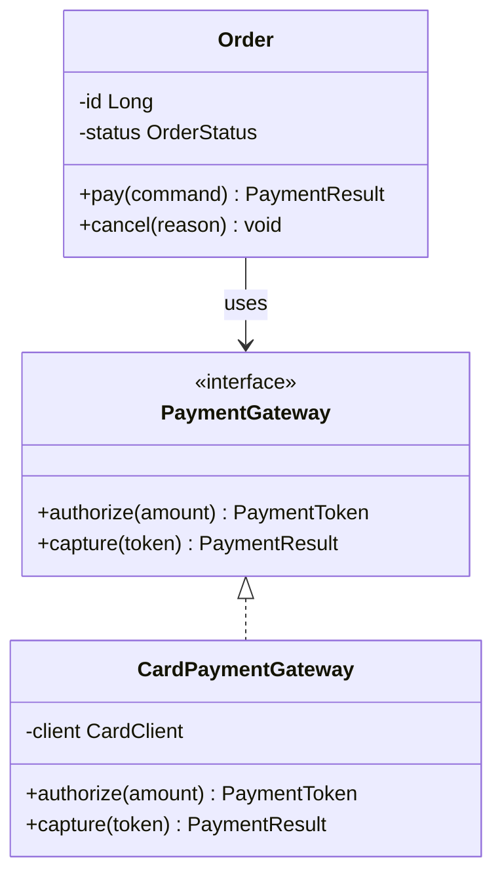
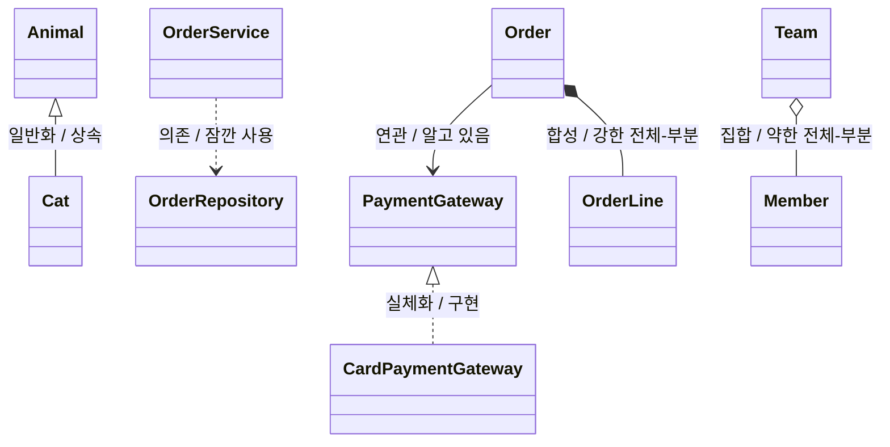
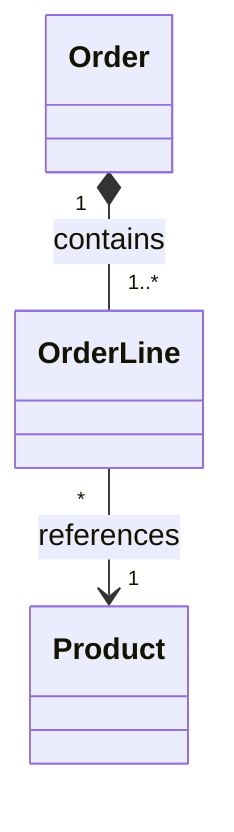
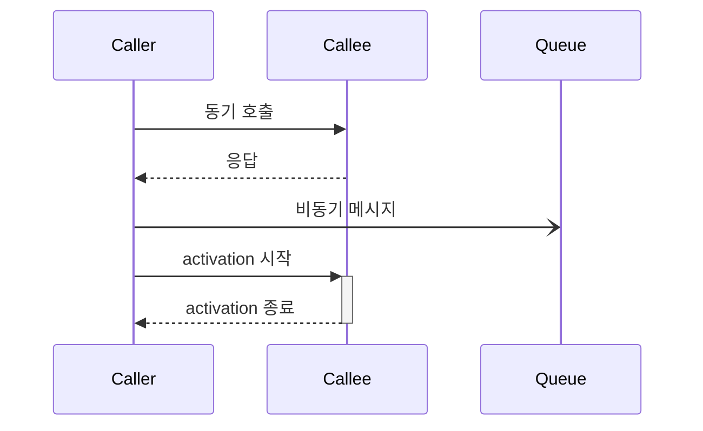
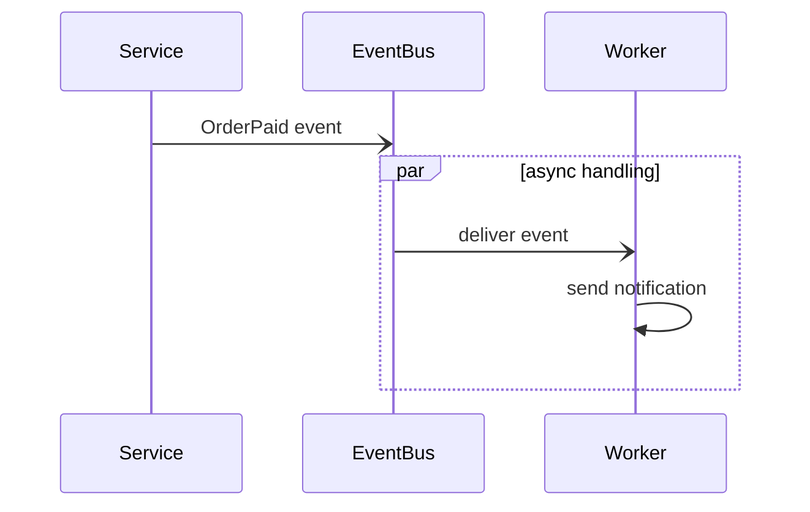
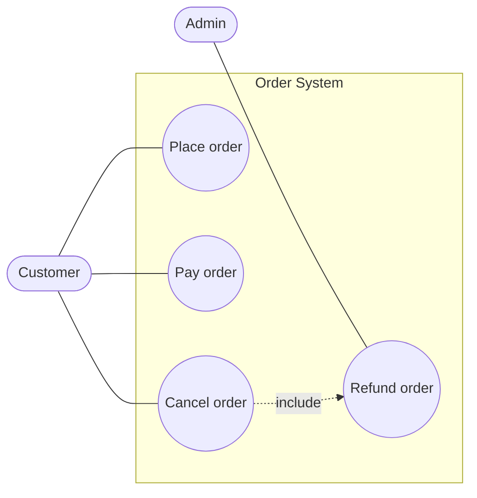
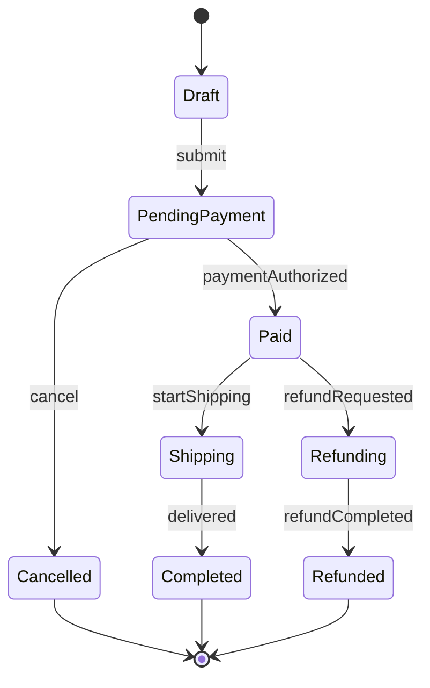
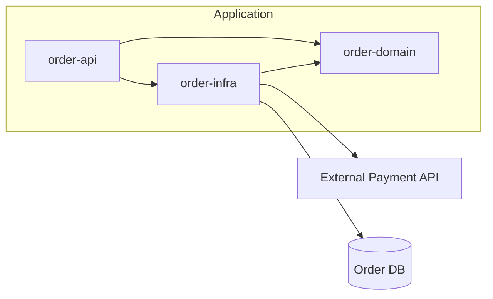
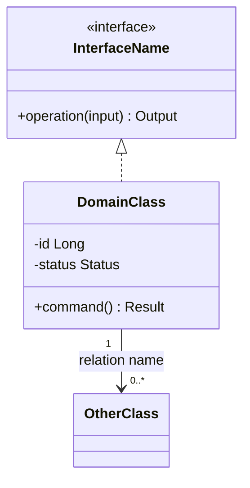

* TOC
{:toc}

# UML 다이어그램(Unified Modeling Language Diagram)

UML(Unified Modeling Language)은 소프트웨어 구조와 동작을 시각적으로 표현하기 위한 표준 모델링 언어다. 이 문서는 UML을 그릴 때 빠르게 확인할 수 있는 **규칙, 선 표기, 예시, 의미**만 남긴 레퍼런스다.

## 언제 어떤 다이어그램을 쓰는가

| 상황 | 다이어그램 | 의미 |
|---|---|---|
| 클래스, 인터페이스, 상속, 소유 관계를 설명한다 | 클래스 다이어그램 | 정적 구조 |
| 요청 처리 순서와 객체 간 메시지를 설명한다 | 시퀀스 다이어그램 | 시간 순서 |
| 사용자가 시스템으로 달성하는 목표를 설명한다 | 유스케이스 다이어그램 | 기능 범위 |
| 조건, 반복, 승인 같은 업무 흐름을 설명한다 | 액티비티 다이어그램 | 절차 흐름 |
| 주문·결제·계정처럼 상태가 바뀌는 대상을 설명한다 | 상태 다이어그램 | lifecycle |
| 모듈, 서비스, 패키지 의존성을 설명한다 | 컴포넌트/패키지 다이어그램 | 아키텍처 경계 |
| 테이블과 cardinality가 핵심이다 | [[ERD]] | 데이터 관계 |

## 공통 규칙

| 규칙 | 의미 |
|---|---|
| 제목은 질문처럼 좁힌다 | `전체 구조`보다 `주문 결제 시 재고 예약 흐름`이 낫다 |
| 모든 것을 넣지 않는다 | UML은 코드 전체 복사가 아니라 의사소통용 모델이다 |
| 선에는 의미가 있다 | 실선/점선/삼각형/다이아몬드/화살표를 구분한다 |
| 관계가 헷갈리면 label을 붙인다 | `uses`, `contains`, `creates`, `publishes`처럼 동사를 쓴다 |
| 개수가 중요하면 multiplicity를 표시한다 | `1`, `0..1`, `1..*`, `0..*` |
| 구현 상세는 줄인다 | getter/setter, private helper, 단순 DTO 필드는 보통 생략한다 |

## 클래스 다이어그램

클래스 다이어그램은 시스템의 **정적 구조**를 보여준다. [[oop]]{객체 지향 설계}에서 클래스, 인터페이스, enum, 상속, 구현, 소유 관계를 설명할 때 사용한다.

### 클래스 표기 규칙

| 표기 | 의미 | 예시 |
|---|---|---|
| 클래스 이름 | 타입 이름 | `Order` |
| `<<interface>>` | 인터페이스 | `<<interface>> PaymentGateway` |
| `<<enumeration>>` | enum | `<<enumeration>> OrderStatus` |
| 속성 | 주요 상태 | `-status OrderStatus` |
| 오퍼레이션 | 주요 책임 | `+pay(command) PaymentResult` |
| `+` | public | `+pay()` |
| `-` | private | `-status` |
| `#` | protected | `#validate()` |
| `~` | package/internal | `~calculate()` |
| `*` | abstract | `+calculate()*` |
| `$` | static | `+of()$` |



### 클래스 선 규칙

선 모양은 아래 그림을 먼저 본다. 표의 Mermaid 입력값은 그림을 만들기 위한 문법이다.



| 실제 선 모양 | 관계 | 의미 | Mermaid 입력 | 판단 기준 |
|---|---|---|---|---|
| 빈 삼각형 + 실선 | 일반화(Generalization) | 상속, `is-a` | `&lt;&#124;--` | `Cat`은 `Animal`이다 |
| 빈 삼각형 + 점선 | 실체화(Realization) | 인터페이스 구현 | `&lt;&#124;..` | `CardGateway`가 `PaymentGateway`를 구현한다 |
| 일반 화살표 + 실선 | 연관(Association) | 지속적으로 알고 있음 | `--&gt;` | 필드로 참조한다 |
| 일반 화살표 + 점선 | 의존(Dependency) | 일시적으로 사용함 | `..&gt;` | 파라미터, 지역 변수, static call로만 쓴다 |
| 빈 다이아몬드 + 실선 | 집합(Aggregation) | 약한 전체-부분 | `o--` | 전체가 없어도 부분은 독립적으로 산다 |
| 채운 다이아몬드 + 실선 | 합성(Composition) | 강한 전체-부분 | `*--` | 전체가 사라지면 부분 lifecycle도 끝난다 |

### Multiplicity 규칙

| 표기 | 의미 |
|---|---|
| `1` | 정확히 하나 |
| `0..1` | 없거나 하나 |
| `*` | 여러 개 |
| `1..*` | 하나 이상 |
| `0..*` | 없거나 여러 개 |



### 클래스 다이어그램 판단 규칙

| 헷갈리는 지점 | 판단 |
|---|---|
| 상속 vs 구현 | class 상속은 빈 삼각형 실선, interface 구현은 빈 삼각형 점선 |
| 연관 vs 의존 | 오래 들고 있으면 실선 화살표, 잠깐 쓰면 점선 화살표 |
| 집합 vs 합성 | lifecycle을 함께하면 채운 다이아몬드, 독립 생존하면 빈 다이아몬드 |
| 필드가 많다 | 설계 의도와 관계없는 필드는 생략한다 |
| 선이 많다 | 핵심 메시지와 관계없는 의존은 지운다 |

## 시퀀스 다이어그램

시퀀스 다이어그램은 런타임의 **시간 순서**를 보여준다. API 요청, 트랜잭션, 외부 시스템 호출, 실패 흐름을 설명할 때 사용한다.

### 시퀀스 선 규칙

선 모양은 아래 그림처럼 읽는다. 실선은 호출, 점선은 응답, 열린 화살표는 비동기 메시지로 본다.



| 실제 선 모양 | 의미 | Mermaid 입력 | 사용 예시 |
|---|---|---|---|
| 실선 화살표 | 동기 호출 | `-&gt;&gt;` | API call, method call |
| 점선 화살표 | 응답 | `--&gt;&gt;` | return, response |
| 열린 화살표 | 비동기 메시지 | `-)` | event publish, queue send |
| 실선 화살표 + activation 시작 | 호출과 처리 구간 시작 | `-&gt;&gt;+` | 긴 처리 시작 강조 |
| 점선 화살표 + activation 종료 | 응답과 처리 구간 종료 | `--&gt;&gt;-` | 긴 처리 종료 강조 |

```mermaid
sequenceDiagram
    actor User
    participant API as Order API
    participant Service as OrderService
    participant PG as PaymentGateway
    participant DB as Database

    User->>API: POST /orders/{id}/pay
    API->>+Service: pay(orderId, command)
    Service->>DB: load order
    DB-->>Service: order

    alt payable
        Service->>PG: authorize(amount)
        PG-->>Service: token
        Service->>DB: save paid order
        Service-->>-API: PaymentResult
    else not payable
        Service-->>-API: DomainException
    end

    API-->>User: response
```

### 시퀀스 구조 규칙

| 표기 | 의미 |
|---|---|
| `actor` | 사용자 또는 외부 행위자 |
| `participant` | 객체, 서비스, DB, 외부 시스템 |
| `activate` / `deactivate` | 처리 중인 구간 |
| `alt` / `else` | 조건 분기 |
| `opt` | 선택 흐름 |
| `loop` | 반복 |
| `par` | 병렬 흐름 |



### 시퀀스 다이어그램 판단 규칙

| 헷갈리는 지점 | 판단 |
|---|---|
| 모든 레이어를 넣을까? | 책임 경계, 장애 가능성, 외부 연동만 남긴다 |
| 응답 화살표를 다 그릴까? | 의미 있는 응답만 남긴다 |
| 실패 흐름을 넣을까? | 설계 판단이 달라지는 실패는 `alt`로 넣는다 |
| DB를 넣을까? | 트랜잭션/성능/장애 포인트면 넣는다 |

## 유스케이스 다이어그램

유스케이스 다이어그램은 actor가 시스템으로 달성하려는 **목표**를 보여준다. 내부 API나 CRUD보다 사용자 목적을 이름으로 둔다.

| 표기 | 의미 |
|---|---|
| actor | 시스템 밖 행위자 |
| system boundary | 시스템 범위 |
| use case | actor가 달성하려는 목표 |
| include | 항상 포함되는 하위 기능 |
| extend | 조건부로 확장되는 기능 |



## 액티비티 다이어그램

액티비티 다이어그램은 업무나 알고리즘의 **절차 흐름**을 보여준다.

| 표기 | 의미 |
|---|---|
| 시작/끝 노드 | 프로세스 시작과 종료 |
| 액션 | 수행할 작업 |
| 다이아몬드 | 조건 분기 |
| 화살표 | 다음 단계 |
| 병렬 분기 | 동시에 수행되는 작업 |


## 상태 다이어그램

상태 다이어그램은 하나의 대상이 이벤트에 따라 어떤 **상태**로 전이되는지 보여준다.

| 표기 | 의미 |
|---|---|
| 상태 | 현재 머무는 값/단계 |
| 전이 | 이벤트로 상태가 바뀜 |
| `[*]` | 시작 또는 종료 |
| `A --> B: event` | event가 발생하면 A에서 B로 이동 |



상태 이름은 `Paid`, `Cancelled`처럼 명사/형용사형으로 쓰고, 전이 label은 `submit`, `cancel`, `delivered`처럼 이벤트 이름으로 쓴다.

## 컴포넌트/패키지 다이어그램

컴포넌트/패키지 다이어그램은 모듈, 서비스, 패키지, 외부 시스템 사이의 **의존성 방향**을 보여준다.

| 선 | 의미 |
|---|---|
| `A --> B` | A가 B를 사용한다 |
| `A -.-> B` | 약한 의존, optional dependency |
| subgraph | 경계 또는 패키지 |
| DB 모양 | 저장소 |



의존성 방향은 실제 import/call 방향과 맞춘다. 계층형 설계에서는 도메인이 인프라를 직접 참조하지 않는지 확인하는 용도로 쓴다.

## 빠른 템플릿

### 클래스 다이어그램



### 시퀀스 다이어그램

```mermaid
sequenceDiagram
    actor User
    participant API
    participant Service
    participant External
    participant DB

    User->>API: request
    API->>+Service: command
    Service->>DB: load
    DB-->>Service: data

    alt success
        Service->>External: call
        External-->>Service: result
        Service->>DB: save
        Service-->>-API: ok
    else failure
        Service-->>-API: error
    end

    API-->>User: response
```

## 자주 틀리는 부분

| 실수 | 수정 기준 |
|---|---|
| 클래스 다이어그램에 모든 필드와 메서드를 넣는다 | 설계 의도에 필요한 것만 남긴다 |
| 합성을 단순 필드 보유로 판단한다 | lifecycle 소유권이 있을 때만 `*--`를 쓴다 |
| 시퀀스 다이어그램이 호출 스택이 된다 | 책임 경계와 외부 연동만 남긴다 |
| 유스케이스를 CRUD로 쓴다 | `Create Order`보다 `Place order`처럼 actor 목표로 쓴다 |
| 선 label이 없다 | 관계 의미가 헷갈리면 label을 붙인다 |

## Reference

- [UML 클래스 다이어그램(Class Diagram) - Junhyunny’s Devlogs](https://junhyunny.github.io/information/class-diagram-in-uml/)
- [PlantUML Class Diagram](https://plantuml.com/class-diagram)
- [PlantUML Sequence Diagram](https://plantuml.com/sequence-diagram)
- [Mermaid Class Diagram](https://mermaid.js.org/syntax/classDiagram.html)
- [Mermaid Sequence Diagram](https://mermaid.js.org/syntax/sequenceDiagram.html)
- [UML Diagrams - Class Diagrams Reference](https://www.uml-diagrams.org/class-reference.html)
- [UML Diagrams - Sequence Diagrams](https://www.uml-diagrams.org/sequence-diagrams.html)
